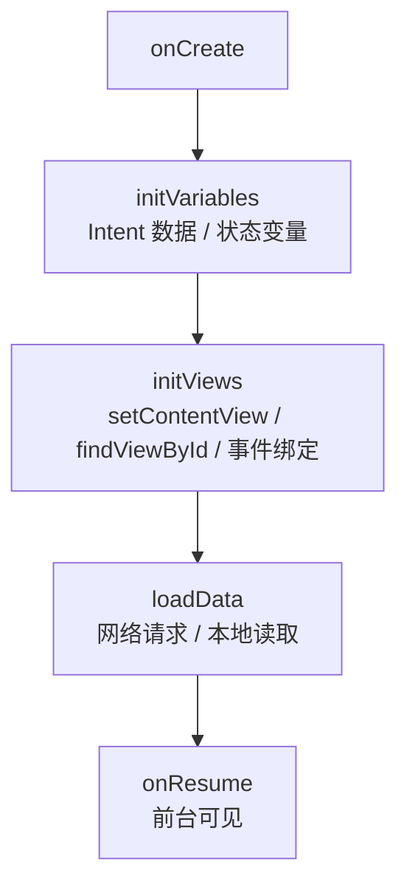

# 项目结构与工程规范

> 中型以上 App 的代码质量首先取决于**结构**：包怎么分、Activity 怎么写、数据怎么传。本文从经典分层结构出发，给出可落地的项目组织规范与实体化编程实践。

## 一、包结构设计

### 经典分层（by-layer）

将公共能力抽离为**基础类库**，主项目按职责分包：

| 类库包 | 职责 |
|--------|------|
| `activity` | 与业务无关的 Activity 基类 |
| `net` | 网络底层封装（请求/响应/错误处理） |
| `cache` | 图片缓存与图片处理 |
| `ui` | 通用自定义控件 |
| `utils` | 通用工具方法 |

| 主项目包 | 职责 |
|----------|------|
| `activity` | 按模块划分的业务 Activity |
| `adapter` | 所有列表适配器 |
| `entity` | 数据实体（网络响应 / 本地表） |
| `db` | SQLite 封装 |
| `engine` | 业务逻辑类 |
| `ui` | 业务自定义控件 |
| `utils` | 公用方法 |
| `interfaces` | 接口（`I` 前缀命名） |
| `listener` | 回调监听（`On` 前缀命名） |

### 按功能分包（by-feature）的演进

```text
// 现代项目更推荐按功能聚合（feature-first），每模块内自含 UI/数据/逻辑
features/
├── login/
│   ├── LoginActivity.kt
│   ├── LoginViewModel.kt
│   └── LoginRepository.kt
├── home/
└── profile/
```

| 维度 | by-layer（分层） | by-feature（按功能） |
|------|------------------|----------------------|
| 定位文件 | 需要跨包联想 | 同一功能就近聚合 |
| 模块解耦 | 依赖层级清晰 | 天然按功能隔离 |
| 团队协作 | 易冲突（同层多人改） | 各功能互不干扰 |
| 适合规模 | 中小项目 | 中大型项目（配合模块化） |

::: tip
**命名规范**：私有成员 `m` 前缀、静态成员 `s` 前缀、常量全大写；接口用 `I` 开头、监听器用 `On` 开头，团队统一可大幅降低阅读成本。
:::

## 二、为 Activity 定义统一生命周期

把 `onCreate` 拆分为三个语义清晰的子方法，让所有页面结构一致：

```kotlin
abstract class BaseActivity : AppCompatActivity() {

    override fun onCreate(savedInstanceState: Bundle?) {
        super.onCreate(savedInstanceState)
        initVariables() // 1. 初始化变量（Intent 数据、页面内状态）
        initViews()     // 2. 加载布局、初始化控件、挂事件
        loadData()      // 3. 调用接口获取数据
    }

    protected abstract fun initVariables()
    protected abstract fun initViews()
    protected abstract fun loadData()
}
```



**收益**：新人接手任何页面都知道三件事在哪儿写；基类可统一做埋点、错误提示、进度条管理。

## 三、统一事件编程模型

- 团队内**约定唯一的事件写法**：`setOnClickListener` 还是 `OnXxxListener` 接口，二选一并固化
- 回调命名统一 `on` 前缀，参数语义化（`onSuccess(result)` 而非 `onResult(true)`）
- 回调线程约定：**网络回调切回主线程再触发 UI 更新**，基类统一封装

## 四、实体化编程

### 网络请求直接解析为实体

用 Gson/kotlinx.serialization 将 JSON 直接解析为强类型实体，取代手工 `JSONObject` 取值：

```kotlin
// 统一响应包装
data class ApiResponse<T>(
    val isError: Boolean,
    val errorType: Int,
    val errorMessage: String,
    val result: T?,
)

// 直接反序列化为实体（不再手工解析）
val response = gson.fromJson(json, ApiResponse::class.java)
val entity = response.result as? WeatherEntity
```

### 页面间传实体：Intent 而非全局变量

| 方式 | 风险 |
|------|------|
| 全局变量传实体 | App 切后台被回收后**全局变量丢失**，恢复前台直接崩溃；若必须用，需序列化到本地以便恢复 |
| Intent 传实体 | 安全可靠，要求实体实现 `Serializable` 或 `Parcelable` |

```kotlin
// 推荐：Intent 传实体（实体实现 Parcelable）
val intent = Intent(this, DetailActivity::class.java)
intent.putExtra("entity", entity) // entity: Parcelable
startActivity(intent)

// 接收方
val entity = intent.getParcelableExtra<WeatherEntity>("entity")
```

::: warning
超过 **1MB** 的实体不建议走 Intent（Binder 事务上限），大数据走本地持久化（文件 / Room / DataStore）+ 传 ID。
:::

## 五、高频面试题

### Q1：按功能分包（by-feature）相比按层分包（by-layer）的优势？

::: details 查看答案
按功能分包把同一功能的 UI、ViewModel、Repository 就近聚合，定位代码无需跨包联想；模块之间天然隔离、团队并行开发不易冲突；配合 Gradle 多模块还能独立编译、按需集成，更适合中大型项目。按层分包在中小项目中结构清晰、依赖直观，但项目变大后同层文件膨胀、职责模糊。
:::

### Q2：为什么 onCreate 里要拆分 initVariables / initViews / loadData？

::: details 查看答案
一是**可读性**：三个步骤语义清晰，新人接手能快速定位变量初始化、视图绑定、数据加载分别在哪里；二是**一致性**：全团队统一模板后，代码 review 和排障成本大幅下降；三是**可复用**：基类可以在三个方法之间插入统一逻辑（埋点、进度条、错误处理）。
:::

### Q3：页面间传对象为什么不用全局变量？

::: details 查看答案
全局变量保存在进程内存中，App 切后台被系统回收后内存被清空，恢复前台时全局变量已丢失，读取会得到 null 或崩溃；且全局变量无法跨进程、无法在组件间显式表达依赖关系。正确做法是用 Intent 传 Parcelable/Serializable，或传 ID 后用本地存储恢复。
:::

### Q4：Intent 传实体的限制？

::: details 查看答案
实体需实现 Parcelable（推荐）或 Serializable；受 Binder 事务大小限制（约 1MB），超大对象会抛 `TransactionTooLargeException`；跨进程传递时实体类在两端都需存在且序列化 ID 一致。大数据应传 ID + 本地存储。
:::

### Q5：团队如何保证代码风格统一？

::: details 查看答案
① 约定命名规范（m/s 前缀、常量大写、接口 I 前缀）；② 统一 Activity/Fragment 模板（initVariables/initViews/loadData）；③ 统一事件编程模型（回调命名、线程约定）；④ 引入 lint/ktlint 静态检查 + 代码 review 流程；⑤ 实体化编程（禁止手工解析 JSON）。
:::

## 小结

- 结构先行：公共能力下沉类库，业务按层或按功能分包，命名规范统一
- Activity 模板化：`initVariables → initViews → loadData` 三方法约定
- 实体化编程：JSON 解析为强类型实体、页面传参走 Intent、杜绝全局变量

> 进阶阅读：[MVC → MVP → MVVM → MVI 演进](architecture-evolution.md) | [Clean Architecture 实践](clean-architecture.md) | [数据层设计：Repository 模式](repository-pattern.md)
