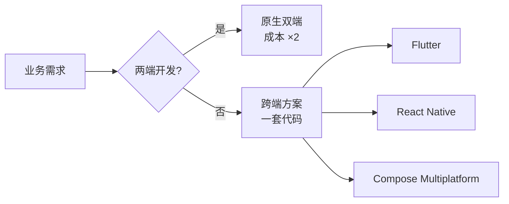
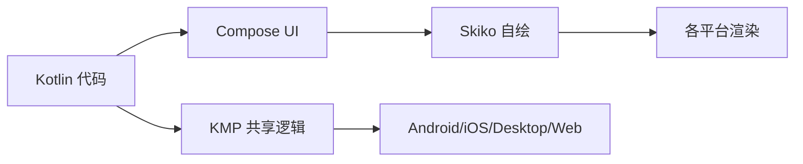
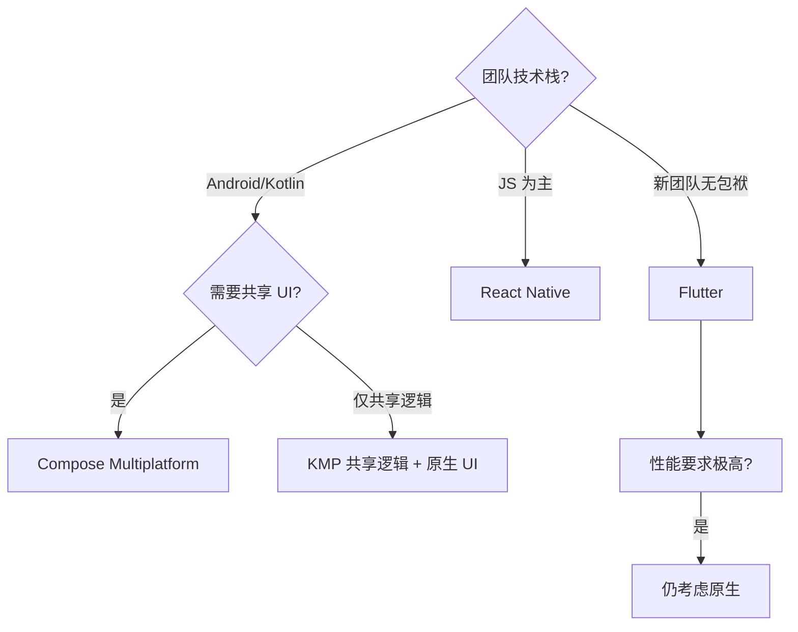

# 跨端开发方案全景

> 跨端开发的目标:**一套业务逻辑、多端运行**。Flutter、React Native、Compose Multiplatform 是当前三大主流方案,本文从渲染原理、性能、生态、选型多维度剖析。

## 一、为什么要跨端



| 痛点 | 跨端收益 |
|------|---------|
| 双端人力成本高 | 一套代码双端运行 |
| 双端逻辑不一致 | 共享业务逻辑 |
| 迭代节奏不同步 | 同步发版 |
| 维护成本翻倍 | 单代码库维护 |

## 二、三大方案核心原理

### 2.1 Flutter:自绘引擎


| 特点 | 说明 |
|------|------|
| 渲染 | 自绘:不依赖原生组件,直接 GPU 绘制 |
| 语言 | Dart(单线程 + Isolate) |
| 性能 | 高:渲染完全可控,接近原生 |
| 与原生通信 | Platform Channel(异步消息) |

### 2.2 React Native:原生桥接


| 特点 | 说明 |
|------|------|
| 渲染 | 原生组件:JS 控制,原生渲染 |
| 语言 | JavaScript/TypeScript |
| 性能 | 中:JS-Bridge 通信有开销 |
| 生态 | 强:React 生态 + npm |

### 2.3 Compose Multiplatform:Kotlin 共享



| 特点 | 说明 |
|------|------|
| 渲染 | 自绘:Skiko(Skia for Kotlin) |
| 语言 | Kotlin(与 Android 无缝) |
| 性能 | 高:声明式 UI,接近原生 |
| 优势 | Android 团队零学习成本,KMP 共享逻辑 |

## 三、方案对比

| 维度 | Flutter | React Native | Compose Multiplatform |
|------|---------|--------------|----------------------|
| 渲染方式 | 自绘引擎 | 原生组件 | 自绘引擎 |
| 语言 | Dart | JS/TS | Kotlin |
| 性能 | 高 | 中 | 高 |
| 生态成熟度 | 高 | 高 | 中 |
| 热更新 | 支持(需配置) | 支持 | 一般 |
| 原生交互 | Platform Channel | Bridge/JSI | expect/actual |
| Android 团队上手 | 需学 Dart | 需学 JS | 零门槛 |
| 适用场景 | 重 UI 应用 | 已有 JS 团队 | Android 团队跨端 |

## 四、KMP 逻辑共享(趋势)

::: code-tabs

@tab:active Java

```java
// KMP:共享业务逻辑,各端只写 UI 壳
// expect/actual 是 Kotlin 多平台专有能力,Java 中可用接口 + 平台实现表达

// 共享层:定义抽象(相当于 expect)
public interface PlatformNameProvider {
    String platformName();
}

// Android 实现(相当于 actual)
public class AndroidPlatformNameProvider implements PlatformNameProvider {
    @Override
    public String platformName() {
        return "Android";
    }
}

// iOS 实现(相当于 actual)
public class IosPlatformNameProvider implements PlatformNameProvider {
    @Override
    public String platformName() {
        return "iOS";
    }
}
```

@tab Kotlin

```kotlin
// KMP:共享业务逻辑,各端只写 UI 壳
// commonMain 共享代码
// expect/actual 处理平台差异

// commonMain/Network.kt
expect fun platformName(): String

// androidMain/Network.kt
actual fun platformName(): String = "Android"

// iosMain/Network.kt
actual fun platformName(): String = "iOS"
```

:::

| KMP 共享层 | 内容 |
|-----------|------|
| 网络层 | Ktor Client / 序列化 |
| 数据层 | SQLDelight / Room KMP |
| 业务逻辑 | ViewModel / UseCase |
| 状态管理 | StateFlow / Compose 状态 |

> **趋势判断**:Kotlin Multiplatform 是 JetBrains/Google 共同推动的方向,Android 团队可以"先用 KMP 共享逻辑,再上 Compose Multiplatform 共享 UI",渐进式跨端。

## 五、选型决策框架



| 决策因素 | 权重 |
|---------|------|
| 团队技术栈 | 最高(学习成本) |
| 性能要求 | 高(游戏/重渲染→原生) |
| 生态依赖 | 高(原生 SDK 依赖) |
| 交付节奏 | 中(跨端省人力) |
| 长期维护 | 中(框架升级风险) |

## 六、跨端常见问题

| 问题 | 说明 |
|------|------|
| 原生能力缺失 | 需写平台插件(Bridge/Channel) |
| 性能瓶颈 | 复杂动画/列表需优化 |
| 版本碎片化 | 框架升级兼容性 |
| 调试复杂 | 双端环境 + 框架层 |
| 包体积增大 | 引擎体积(Flutter ~5MB+) |
| 与原生混编 | 跨端嵌入原生模块 |

## 七、高频面试题

### Q1：Flutter 为什么性能接近原生?和 RN 的区别?
::: details 查看答案
Flutter 自绘引擎:UI 直接由 Skia/Impeller 绘制到 GPU,不经过原生组件系统,渲染路径完全可控、每帧重绘可预期,所以性能接近原生(60/120fps 稳定)。RN 通过 JS Bridge 把组件映射到原生组件,通信有序列化开销,复杂场景易卡顿(新版 JSI 有改善)。本质区别:Flutter 是"自绘",RN 是"原生组件 + 桥接"。Flutter 渲染一致(双端 UI 完全一致),RN 更贴近原生体验但双端细节有差异。
:::

### Q2：Compose Multiplatform 和 Flutter 怎么选?
::: details 查看答案
团队因素优先:Android/Kotlin 团队选 Compose Multiplatform——语法与 Jetpack Compose 一致,零学习成本,KMP 可先共享逻辑;重 UI、跨端一致性要求高选 Flutter——生态成熟、性能稳定、社区大。技术因素:Flutter 单引擎跨平台(包括 Web/桌面)更成熟;CMP 目前 iOS 支持较好、桌面 Web 成熟度不一。实践:很多公司采用组合——KMP 共享业务逻辑,UI 各端原生或 Compose。
:::

### Q3：跨端方案如何调用原生能力?
::: details 查看答案
Flutter:Platform Channel——Dart 通过 MethodChannel 发消息,原生端(MainActivity/AppDelegate)注册 MethodCallHandler 处理,支持方法调用与事件流(EventChannel)。RN:原生模块导出方法给 JS 调用(JSI 时代性能提升)。CMP:expect/actual 声明平台 API,KMP 编译器生成各平台实现。注意:频繁跨端通信是性能瓶颈,批量传输、减少调用次数;复杂原生能力(相机、推送、地图)一般走三方插件或自研插件。
:::

### Q4：跨端开发会取代原生吗?
::: details 查看答案
不会完全取代。跨端解决"通用业务"的开发效率问题,但:① 极致性能场景(游戏、视频编辑、AR)仍需原生;② 系统新特性/复杂原生交互(灵动岛、复杂手势)跨端滞后;③ 跨端框架本身用原生实现(Flutter 引擎、RN 桥),原生永远存在。趋势是**融合**:KMP 共享逻辑 + 原生 UI、跨端嵌入原生模块、Flutter 中调用原生视图。架构师要做的是按业务场景混合选型。
:::

### Q5：跨端项目如何保证质量和性能?
::: details 查看答案
质量:① 共享层单元测试(逻辑在 KMP/共享代码中,一套测试双端受益);② 双端 UI 自动化测试(Flutter 集成测试/RN Detox);③ 分层架构:UI 薄、逻辑厚,逻辑可测。性能:① 列表优化(懒加载/复用);② 减少桥接通信;③ 动画用引擎能力(Flutter 的 GPU 渲染);④ 包体积治理(按需引入、动态加载);⑤ 性能监控(帧率、内存)接入 APM。关键:跨端不是银弹,架构纪律与原生一致。
:::

## 小结

- 三大方案:Flutter(自绘)、RN(原生桥接)、CMP(Kotlin 自绘)
- 选型核心:团队技术栈 > 性能要求 > 生态
- KMP 共享逻辑是趋势,渐进式跨端
- 原生能力通过 Channel/Bridge/expect-actual 调用
- 跨端不取代原生,按场景混合选型
- 质量保障:共享层测试 + 分层架构 + APM 监控

> 进阶阅读：[Jetpack Compose 布局系统](/jetpack/compose/compose-layout.md) | [架构设计演进](/advanced/architecture/architecture-evolution.md) | [Kotlin 协程原理](/network/coroutine/coroutine-principle.md)
