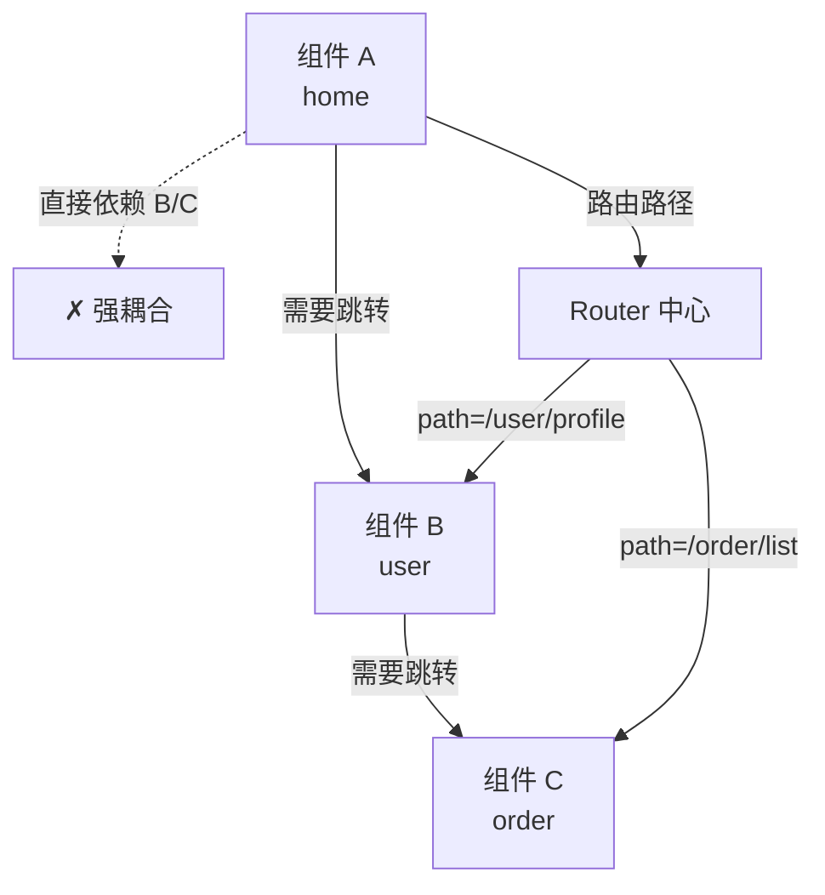
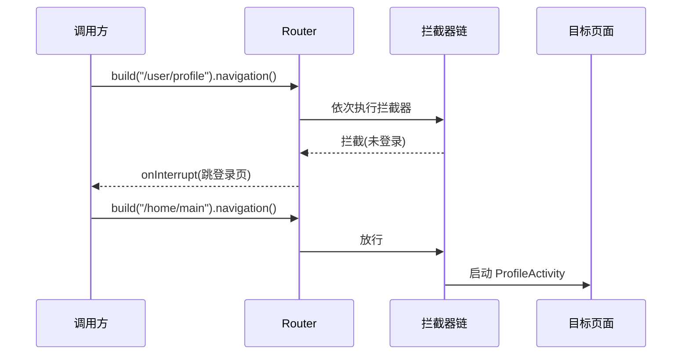
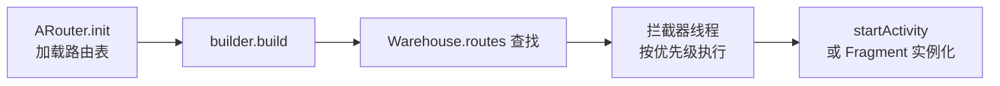

# 路由框架设计

> 组件化之后,页面跳转不能再硬编码 `Intent`,而是通过**路由框架**解耦:统一管理路径、参数、拦截器与降级。本文剖析路由框架的核心设计与 ARouter 原理。

## 一、为什么需要路由



| 痛点 | 路由方案 |
|------|---------|
| 组件间直接依赖 | 通过路径跳转,无编译期依赖 |
| 页面参数传递繁琐 | 自动解析参数并注入 |
| 跳转失败无处理 | 统一降级回调 |
| 无全局拦截 | 登录校验、埋点统一拦截 |
| 跨模块调用服务 | 服务暴露与发现(SPI) |

## 二、路由框架核心组成

### 2.1 架构

```mermaid
flowchart LR
    A[注解<br>@Route @Autowired] --> B[APT 注解处理器]
    B --> C[生成路由表<br>RouteTable.java]
    C --> D[Router 初始化<br>加载路由表]
    D --> E[Router.getInstance().build(path).navigation()]
    E --> F[拦截器链<br>Interceptor]
    F --> G[Intent 跳转 / Fragment 切换]
```

### 2.2 核心类

::: code-tabs

@tab:active Java

```java
// ① 路由表:path → 目标类
public class RouteTable {
    public static final Map<String, RouteMeta> ROUTES = new HashMap<>();
    static {
        ROUTES.put("/home/main", new RouteMeta(HomeActivity.class, 0));
        ROUTES.put("/user/profile", new RouteMeta(ProfileActivity.class, 1));
        ROUTES.put("/order/detail", new RouteMeta(OrderDetailActivity.class, 2));
    }
}

// ② 路由元信息
public class RouteMeta {
    public Class<?> target;   // 目标 Activity / Fragment
    public int flags;          // 标志:是否需要登录等
    public RouteMeta(Class<?> target, int flags) {
        this.target = target;
        this.flags = flags;
    }
}

// ③ 跳转请求
public class Postcard {
    public String path;         // 路由路径
    public Bundle extras;       // 参数
    public int requestCode;     // 请求码
    public Bundle options;      // 转场动画等
}
```

@tab Kotlin

```kotlin
// ① 路由表:path → 目标类
object RouteTable {
    val ROUTES: MutableMap<String, RouteMeta> = HashMap()
    init {
        ROUTES["/home/main"] = RouteMeta(HomeActivity::class.java, 0)
        ROUTES["/user/profile"] = RouteMeta(ProfileActivity::class.java, 1)
        ROUTES["/order/detail"] = RouteMeta(OrderDetailActivity::class.java, 2)
    }
}

// ② 路由元信息
class RouteMeta(
    var target: Class<*>,   // 目标 Activity / Fragment
    var flags: Int          // 标志:是否需要登录等
)

// ③ 跳转请求
class Postcard {
    var path: String = ""      // 路由路径
    var extras: Bundle? = null // 参数
    var requestCode: Int = 0   // 请求码
    var options: Bundle? = null // 转场动画等
}
```

:::

## 三、注解处理器(APT)生成路由表

::: code-tabs

@tab:active Java

```java
// 注解定义
@Target(ElementType.TYPE)
@Retention(RetentionPolicy.CLASS)
public @interface Route {
    String path();          // 路由路径,如 /user/profile
    int flags() default 0;  // 标志位
}

// 处理器:编译期收集注解 → 生成路由表
@AutoService(Processor.class)
public class RouteProcessor extends AbstractProcessor {
    @Override
    public boolean process(Set<? extends TypeElement> annotations, RoundEnvironment roundEnv) {
        // 1. 扫描所有 @Route 注解的类
        for (Element element : roundEnv.getElementsAnnotatedWith(Route.class)) {
            Route route = element.getAnnotation(Route.class);
            TypeElement type = (TypeElement) element;
            // 2. 收集 path → 类名
            routeMap.put(route.path(), type.getQualifiedName().toString());
        }
        // 3. 生成 RouteTable.java
        generateRouteTable(routeMap);
        return true;
    }
}
```

@tab Kotlin

```kotlin
// 注解定义
@Target(AnnotationTarget.CLASS)
@Retention(AnnotationRetention.BINARY)
annotation class Route(
    val path: String,        // 路由路径,如 /user/profile
    val flags: Int = 0       // 标志位
)

// 处理器:编译期收集注解 → 生成路由表
@AutoService(Processor::class)
class RouteProcessor : AbstractProcessor() {
    override fun process(
        annotations: Set<TypeElement>,
        roundEnv: RoundEnvironment
    ): Boolean {
        // 1. 扫描所有 @Route 注解的类
        for (element in roundEnv.getElementsAnnotatedWith(Route::class.java)) {
            val route = element.getAnnotation(Route::class.java)
            val type = element as TypeElement
            // 2. 收集 path → 类名
            routeMap[route.path] = type.qualifiedName.toString()
        }
        // 3. 生成 RouteTable.java
        generateRouteTable(routeMap)
        return true
    }
}
```

:::

| APT 工具 | 说明 |
|---------|------|
| javapoet | 生成 Java 代码 |
| kotlinpoet | 生成 Kotlin 代码 |
| AutoService | 注册 Processor |
| kapt / ksp | Kotlin 注解处理 |

## 四、拦截器与降级

::: code-tabs

@tab:active Java

```java
// 拦截器:登录校验 / 埋点 / 权限
interface RouterInterceptor {
    void process(Postcard postcard, InterceptorCallback callback);
}

class LoginInterceptor implements RouterInterceptor {
    @Override
    public void process(Postcard postcard, InterceptorCallback callback) {
        if ((postcard.flags & FLAG_NEED_LOGIN) != 0 && !UserManager.isLogin()) {
            // 未登录:拦截并跳转登录页
            callback.onInterrupt(new RouterException("需要登录"));
        } else {
            callback.onContinue(postcard);   // 放行
        }
    }
}

// 降级:路由不存在时兜底
class DegradeService implements IDegradeService {
    @Override
    public void onLost(Context context, Postcard postcard) {
        // 404 页面 / 提示
    }
}
```

@tab Kotlin

```kotlin
// 拦截器:登录校验 / 埋点 / 权限
interface RouterInterceptor {
    fun process(postcard: Postcard, callback: InterceptorCallback)
}

class LoginInterceptor : RouterInterceptor {
    override fun process(postcard: Postcard, callback: InterceptorCallback) {
        if (postcard.flags and FLAG_NEED_LOGIN != 0 && !UserManager.isLogin()) {
            // 未登录:拦截并跳转登录页
            callback.onInterrupt(RouterException("需要登录"))
        } else {
            callback.onContinue(postcard)   // 放行
        }
    }
}

// 降级:路由不存在时兜底
class DegradeService : IDegradeService {
    override fun onLost(context: Context, postcard: Postcard) {
        // 404 页面 / 提示
    }
}
```

:::



## 五、服务暴露与发现(SPI)

::: code-tabs

@tab:active Java

```java
// 组件提供能力:如 UserService
public interface UserService {
    boolean isLogin();
    String getUserName();
}

// 实现类注册
@Service
public class UserServiceImpl implements UserService {
    @Override
    public boolean isLogin() {
        return UserManager.isLogin();
    }
    @Override
    public String getUserName() {
        return UserManager.userName();
    }
}

// 调用方使用:跨组件调用服务,无需直接依赖
UserService userService = Router.getService(UserService.class);
if (userService.isLogin()) {
    showName(userService.getUserName());
}
```

@tab Kotlin

```kotlin
// 组件提供能力:如 UserService
interface UserService {
    fun isLogin(): Boolean
    fun getUserName(): String
}

// 实现类注册
@Service
class UserServiceImpl : UserService {
    override fun isLogin() = UserManager.isLogin()
    override fun getUserName() = UserManager.userName()
}

// 调用方使用:跨组件调用服务,无需直接依赖
val userService = Router.getService(UserService::class.java)
if (userService.isLogin()) {
    showName(userService.getUserName())
}
```

:::

| 能力 | 说明 |
|------|------|
| 页面跳转 | 路由路径 → Activity/Fragment |
| 服务调用 | 接口 → 实现(SPI) |
| 参数注入 | @Autowired 自动注入 |
| 事件通信 | 跨组件事件总线 |
| 拦截降级 | 登录 / 埋点 / 404 |

## 六、ARouter 核心流程



| 模块 | 职责 |
|------|------|
| LogisticsCenter | 路由表加载与索引 |
| Warehouse | 路由/拦截器/服务的仓库 |
| _ARouter | 核心跳转逻辑 |
| InterceptorService | 拦截器异步调度 |

## 七、高频面试题

### Q1：组件化中为什么需要路由?直接 Intent 不行吗?
::: details 查看答案
组件化后模块间不应有编译期依赖(否则退化回单体)。直接 Intent 需要 import 目标 Activity 类,产生强耦合;路由通过"路径字符串"跳转,运行时由路由框架解析,模块间完全解耦。此外路由统一管理:参数自动注入、拦截器(登录/埋点)、降级处理、跨模块服务调用,这些都是 Intent 做不到的。
:::

### Q2：路由框架是如何生成路由表的?性能如何?
::: details 查看答案
编译期用 APT(kapt/ksp)扫描 @Route 注解,通过 javapoet/kotlinpoet 生成路由表类(如 ARouter 的 ARouter$$Root$$app)。启动时 Router.init() 加载路由表到内存(分组按需加载),查找是 HashMap O(1) 查询,性能开销极小。对比运行时反射扫描:APT 无反射、无运行时扫描,性能更好。
:::

### Q3：路由拦截器是怎么实现的?和 AOP 有什么区别?
::: details 查看答案
路由拦截器是责任链模式:跳转时收集所有实现了 RouterInterceptor 的实例,按优先级排序后逐个执行,每个拦截器可放行(onContinue)或中断(onInterrupt),典型场景登录校验、页面埋点、权限申请。与 AOP 的区别:拦截器是路由框架内部的链路,只作用于路由跳转;AOP(如 AspectJ)可织入任意方法调用。路由拦截器更轻量、易调试。
:::

### Q4：路由跳转如何传递与接收参数?
::: details 查看答案
调用方:build(path).withString("id", "1001").withSerializable("user", user).navigation();接收方:用 @Autowired 注解字段(如 @Autowired(name = "id") String id),路由框架在目标 Activity onCreate 后自动注入。原理:通过 Intent 的 Bundle 传递,路由框架反射给字段赋值(或生成注入代码)。支持基本类型、Serializable、Parcelable、Bundle 等,自定义类型需注册类型转换器。
:::

### Q5：如果路由不存在(404)怎么处理?如何做降级?
::: details 查看答案
三种方案:① 降级服务:注册 IDegradeService 实现,onLost 回调里跳转统一 404 页面或提示;② 默认降级:框架内置默认跳转失败处理;③ 运行时检查:跳转前用 Router.verify() 校验路径是否存在,不存在则直接走备选逻辑。生产实践:配合埋点上报"路由缺失",灰度期暴露问题;开发期可在 debug 模式开启路由表 dump 方便排查。
:::

## 小结

- 路由解耦:路径跳转替代 Intent 硬编码依赖
- 核心组成:路由表、Postcard、拦截器、降级服务、SPI
- APT 编译期生成路由表,无反射性能损耗
- 拦截器责任链:登录/埋点/权限统一处理
- ARouter 是事实标准,可参考其设计自研轻量路由
- 服务暴露(SPI)让跨模块能力调用同样解耦

> 进阶阅读：[组件化架构实践](/advanced/modular/modularization-practice.md) | [架构设计演进](/advanced/architecture/architecture-evolution.md) | [Hook 技术详解](/advanced/plugin/hook-tech.md)
