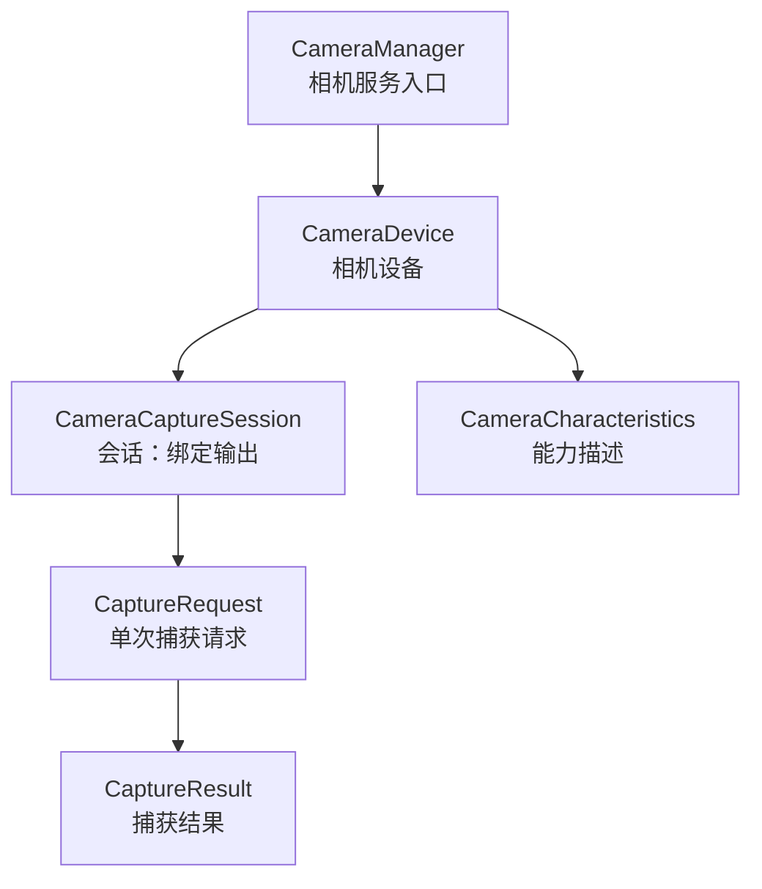
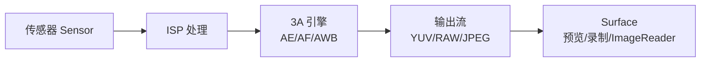
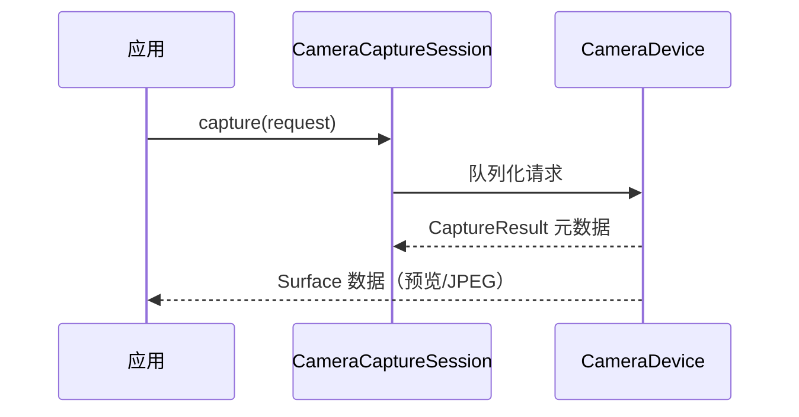

# Camera2 拍照流程与原理

> 面试高频指数：中 — "Camera2 和 Camera1 有什么区别？拍照的完整流程？预览回调怎么实现？"是多媒体方向的高频考点。

## 一、Camera2 架构总览

### 1.1 从 Camera1 到 Camera2

| 对比项 | Camera1 | Camera2 |
|--------|---------|---------|
| 模型 | 单一大对象 Camera | 面向对象的管线 |
| 控制 | 全局参数 | 会话 + 请求 |
| 并发 | 单路预览 | 多路（预览+拍照+录像） |
| 扩展 | 固定 API | 支持厂商扩展（Samsung/华为） |
| 缓冲 | 阻塞回调 | Surface 流式消费 |

### 1.2 核心组件



| 组件 | 职责 |
|------|------|
| CameraManager | 枚举相机、打开相机 |
| CameraCharacteristics | 静态能力：分辨率、焦距、能力级别 |
| CameraDevice | 代表物理相机，创建会话 |
| CameraCaptureSession | 绑定输出 Surface 的会话 |
| CaptureRequest | 曝光、对焦、3A 参数 |
| CaptureResult | 每帧的元数据结果 |

## 二、拍照流水线

### 2.1 数据流



### 2.2 三种关键输出流

| 输出流 | 用途 | 处理方 |
|--------|------|--------|
| SurfaceView/TextureView | 实时预览 | 显示系统 |
| MediaRecorder/MediaCodec | 录像 | 编码器 |
| ImageReader | 拍照取帧/YUV 分析 | 应用回调 |

## 三、拍照完整流程

### 3.1 打开相机

```kotlin
// 1. 获取 CameraManager
val manager = context.getSystemService(Context.CAMERA_SERVICE) as CameraManager

// 2. 选择相机（后置）
val cameraId = manager.cameraIdList.firstOrNull {
    val chars = manager.getCameraCharacteristics(it)
    chars.get(CameraCharacteristics.LENS_FACING) ==
        CameraCharacteristics.LENS_FACING_BACK
}

// 3. 申请权限后打开
if (ContextCompat.checkSelfPermission(
        context, Manifest.permission.CAMERA
    ) == PackageManager.PERMISSION_GRANTED
) {
    manager.openCamera(cameraId, object : CameraDevice.StateCallback() {
        override fun onOpened(camera: CameraDevice) {
            cameraDevice = camera
            createSession()   // 打开成功 → 创建会话
        }

        override fun onDisconnected(camera: CameraDevice) {
            camera.close()
        }

        override fun onError(camera: CameraDevice, error: Int) {
            camera.close()
        }
    }, backgroundHandler)
}
```

### 3.2 创建会话（预览 + 拍照）

```kotlin
// 4. 准备输出 Surface：预览 + 拍照取帧
val previewSurface = previewTexture.surfaceTexture?.let {
    it.setDefaultBufferSize(previewSize.width, previewSize.height)
    Surface(it)
}
val imageReader = ImageReader.newInstance(
    captureSize.width, captureSize.height,
    ImageFormat.JPEG,  // 或 YUV_420_888 / RAW_SENSOR
    2                   // 缓冲数量
)

// 5. 创建会话
cameraDevice.createCaptureSession(
    listOf(previewSurface, imageReader.surface),
    object : CameraCaptureSession.StateCallback() {
        override fun onConfigured(session: CameraCaptureSession) {
            captureSession = session
            startPreview()  // 会话就绪 → 发起预览请求
        }

        override fun onConfigureFailed(session: CameraCaptureSession) {
            // 会话配置失败：分辨率不支持等
        }
    },
    backgroundHandler
)
```

### 3.3 预览请求

```kotlin
// 6. 构建预览请求（连续自动对焦 + 自动曝光）
fun startPreview() {
    val request = cameraDevice.createCaptureRequest(
        CameraDevice.TEMPLATE_PREVIEW
    ).apply {
        addTarget(previewSurface)
        set(CaptureRequest.CONTROL_AF_MODE,
            CaptureRequest.CONTROL_AF_MODE_CONTINUOUS_PICTURE)
        set(CaptureRequest.CONTROL_AE_MODE,
            CaptureRequest.CONTROL_AE_MODE_ON)
    }
    captureSession.setRepeatingRequest(request.build(), null, null)
}
```

### 3.4 拍照请求

```kotlin
// 7. 拍摄：单次请求输出到 ImageReader
fun takePicture() {
    val request = cameraDevice.createCaptureRequest(
        CameraDevice.TEMPLATE_STILL_CAPTURE
    ).apply {
        addTarget(imageReader.surface)   // 输出到拍照缓冲
        set(CaptureRequest.CONTROL_AF_MODE,
            CaptureRequest.CONTROL_AF_MODE_CONTINUOUS_PICTURE)
        set(CaptureRequest.JPEG_ORIENTATION, 90)  // 旋转
    }

    // 先锁定对焦再拍照（可选优化）
    captureSession.capture(request.build(),
        object : CameraCaptureSession.CaptureCallback() {
            override fun onCaptureCompleted(
                session: CameraCaptureSession,
                request: CaptureRequest,
                result: TotalCaptureResult
            ) {
                // 拍照完成（JPEG 在 ImageReader 回调里取）
            }
        }, null)
}
```

### 3.5 取帧与保存

```kotlin
// 8. ImageReader 回调中取 JPEG 数据
imageReader.setOnImageAvailableListener({ reader ->
    val image = reader.acquireLatestImage()
    val buffer = image.planes[0].buffer
    val bytes = ByteArray(buffer.remaining())
    buffer.get(bytes)
    image.close()   // 必须 close，否则阻塞管线

    // 写文件（注意方向与旋转）
    withContext(Dispatchers.IO) {
        FileOutputStream(file).use { it.write(bytes) }
    }
}, backgroundHandler)
```

## 四、关键机制

### 4.1 请求-结果模型



| 特点 | 说明 |
|------|------|
| 异步 | 请求排队，按序处理 |
| 每帧回调 | 可统计帧率/曝光 |
| 多请求叠加 | 可组合 3A 策略 |

### 4.2 3A 引擎

| 模块 | 全称 | 作用 |
|------|------|------|
| AE | Auto Exposure | 自动曝光（ISO/快门） |
| AF | Auto Focus | 自动对焦（连续/触摸） |
| AWB | Auto White Balance | 自动白平衡 |

### 4.3 能力级别

```text
LEGACY < LIMITED < FULL < LEVEL_3
```

| 级别 | 特性 |
|------|------|
| LEGACY | 兼容 Camera1 的基本能力 |
| LIMITED | 基础 + 部分高级特性 |
| FULL | 全分辨率 RAW、手动控制 |
| LEVEL_3 | 多路输出、YUV 实时处理 |

## 五、常见问题与优化

| 问题 | 原因 | 方案 |
|------|------|------|
| 黑屏 | 权限/会话失败 | 检查权限与回调 |
| 拍照模糊 | 对焦未完成 | 先 AF 锁定再拍 |
| 方向错误 | EXIF 旋转 | 设置 JPEG_ORIENTATION |
| 预览卡顿 | 分辨率不匹配 | 按能力表选合适尺寸 |
| 内存暴涨 | Image 未关闭 | acquireLatestImage + close |
| 生命泄漏 | 相机未关闭 | onPause close + 释放会话 |

## 六、高频面试题

### Q1：Camera2 和 Camera1 的核心区别是什么？
::: details 查看答案
① 模型：Camera1 是单一大对象、全局参数，Camera2 是"设备-会话-请求"三层管线模型，面向对象；② 并发：Camera1 预览/拍照/录像互斥，Camera2 同一会话可同时绑定多路输出（预览+拍照+录制）；③ 控制粒度：Camera2 每个 CaptureRequest 独立控制 3A（AE/AF/AWB），支持触摸对焦、手动曝光等；④ 扩展性：Camera2 支持厂商扩展能力和多相机（广角/长焦）；⑤ 缓冲：Camera2 的 Surface 流式消费 + 帧级 CaptureResult 回调，适合做实时处理。新项目优先 Camera2（或 CameraX 封装）。
:::

### Q2：描述 Camera2 拍照的完整流程。
::: details 查看答案
① 权限与能力查询：申请 CAMERA 权限，通过 CameraManager 获取 cameraId 列表和 CameraCharacteristics（分辨率、能力级别）；② 打开相机：manager.openCamera 异步回调 onOpened 拿到 CameraDevice；③ 创建会话：为预览 SurfaceView/TextureView 和拍照 ImageReader 创建输出 Surface，调 createCaptureSession，onConfigured 后拿到 CameraCaptureSession；④ 预览：createCaptureRequest(TEMPLATE_PREVIEW) 设置连续对焦/自动曝光，addTarget 预览 Surface，setRepeatingRequest 循环输出；⑤ 拍照：createCaptureRequest(TEMPLATE_STILL_CAPTURE) addTarget ImageReader，session.capture 单次请求；⑥ 取帧：ImageReader.setOnImageAvailableListener 回调中 acquireLatestImage 读取 JPEG 字节并 close，写文件或上传。注意拍照前可先锁定对焦（AF 回调完成后再 capture）避免模糊。
:::

### Q3：ImageReader 是什么？为什么取完帧后必须 close？
::: details 查看答案
ImageReader 是 Camera2 的"应用侧取帧"输出端：应用把它作为 Surface 加进 CaptureRequest，相机每帧输出数据会填充到它的内部缓冲区，应用通过 OnImageAvailableListener 回调拿到 Image 读取像素数据（JPEG/YUV/RAW）。必须 close 的原因：Image 持有的是相机内部缓冲区的引用，缓冲区数量有限（newInstance 时指定，如 2 张），不 close 会导致缓冲区耗尽，相机管线阻塞、预览卡死，严重时 ANR。规范：使用 acquireLatestImage（丢弃旧帧拿最新）或 acquireNextImage，用完立即 close，并处理异常（IOException 时自动释放）。
:::

### Q4：拍照方向不对（旋转 90 度）是什么原因？怎么解决？
::: details 查看答案
原因：传感器默认方向与屏幕方向不一致。手机横屏安装的传感器，竖屏拍照时预览和 JPEG 需要旋转；不同厂商传感器方向各异，必须查询设备能力而非写死。解决：① 通过 CameraCharacteristics.SENSOR_ORIENTATION 获取传感器方向角（通常 90）；② 根据相机前后置和当前屏幕旋转计算 JPEG_ORIENTATION：后置 = (SENSOR_ORIENTATION - 设备旋转角 + 360) % 360，前置需再镜像处理；③ 写入 EXIF 或直接旋转像素数据。预览方向则通过 Surface 的 transform 或 TextureView 的 setTransform 处理。
:::

### Q5：预览和拍照为什么要用同一个会话？不同分辨率的 Surface 能一起输出吗？
::: details 查看答案
一个 CameraDevice 同时只能有一个活跃会话（createCaptureSession 会替换旧会话），所以预览和拍照必须共用会话——这也是 Camera2 相比 Camera1 的优势：同一会话可绑定多个不同用途的 Surface 同时输出。分辨率：不同 Surface 可以有不同的分辨率，但必须满足相机能力约束（LEGACY 级别有 StreamConfigurationMap 的输出组合限制，如某些组合不支持），且尺寸比例最好一致。如果拍照分辨率和预览不同，创建会话前先查询支持组合，选择兼容的输出配置，否则 onConfigureFailed。
:::

## 七、小结

Camera2 拍照要点：

1. 三层模型：CameraDevice → CameraCaptureSession → CaptureRequest
2. 四步流程：打开 → 建会话 → 预览 → 拍照取帧
3. ImageReader 取帧必须 close，防止缓冲耗尽
4. 3A（AE/AF/AWB）通过 CaptureRequest 逐帧控制
5. 方向问题查 SENSOR_ORIENTATION，不写死

相关阅读：[多媒体基础与采样](/advanced/multimedia/multimedia-basics.md)、[MediaCodec 与 FFmpeg 编解码](/advanced/multimedia/mediacodec-ffmpeg.md)、[ExoPlayer 播放器深度解析](/advanced/multimedia/exoplayer-deep.md)、[SurfaceView 与 TextureView](/ui/render/surfaceview-textureview.md)。
