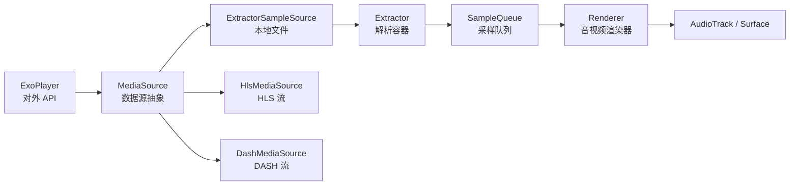
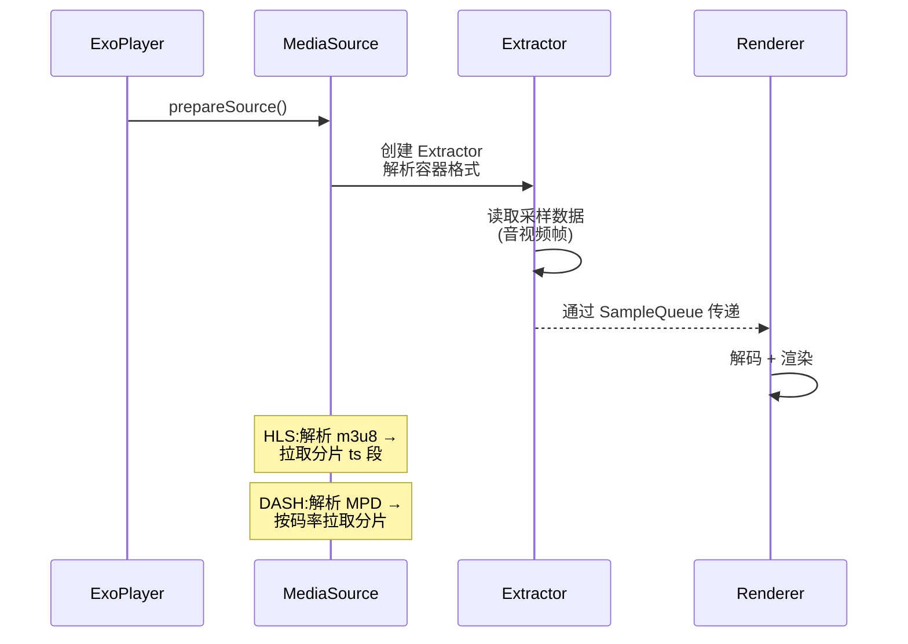
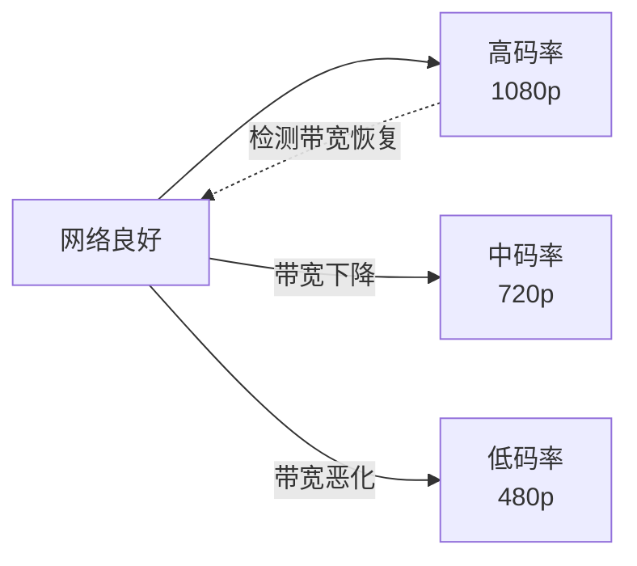

# 🎬 Media3 ExoPlayer 播放器深入

> ExoPlayer 是 Android 官方(Media3)的媒体播放器,灵活可扩展,支持 HLS/DASH/SS 自适应流、DRM、自定义渲染。理解它的架构是音视频进阶的关键。

## 一、ExoPlayer 架构总览



| 组件 | 职责 |
|------|------|
| ExoPlayer | 统一入口,状态管理 |
| MediaSource | 数据源(本地/网络/自适应流) |
| Extractor | 容器解析(MP4/TS/FLV) |
| SampleQueue | 采样队列,缓冲管理 |
| Renderer | 解码与渲染(音/视频/字幕) |
| TrackSelector | 轨道选择(清晰度/语言) |
| LoadControl | 缓冲策略控制 |

## 二、PlayerView 与基本使用

```kotlin
// 基本用法
class PlayerActivity : AppCompatActivity() {
    private lateinit var player: ExoPlayer
    private lateinit var playerView: PlayerView

    override fun onCreate(savedInstanceState: Bundle?) {
        super.onCreate(savedInstanceState)
        setContentView(R.layout.activity_player)

        // 1. 创建播放器
        player = ExoPlayer.Builder(this)
            .setMediaSourceFactory(DefaultMediaSourceFactory(this))
            .build()

        // 2. 绑定视图
        playerView = findViewById(R.id.player_view)
        playerView.player = player

        // 3. 设置媒体与播放
        val mediaItem = MediaItem.fromUri("https://example.com/video.mp4")
        player.setMediaItem(mediaItem)
        player.prepare()
        player.playWhenReady = true
    }

    override fun onStop() {
        super.onStop()
        player.pause()          // 暂停而非释放
    }
    override fun onDestroy() {
        super.onDestroy()
        player.release()        // 释放资源
        playerView.player = null
    }
}
```

## 三、MediaSource 数据管线



| 数据源 | 容器 | 场景 |
|--------|------|------|
| ProgressiveMediaSource | MP4/WebM | 点播文件 |
| HlsMediaSource | HLS(ts 分片) | 直播/点播 |
| DashMediaSource | DASH(MPD) | 自适应码率 |
| SsMediaSource | Smooth Streaming | 微软方案 |
| RtspMediaSource | RTSP | 低延迟 |

## 四、自适应码率(ABR)



| 策略 | 说明 |
|------|------|
| 带宽估算 | 基于下载速度估算可用带宽 |
| 缓冲水平 | 缓冲低→降码率,缓冲高→升码率 |
| DefaultTrackSelector | 默认:平衡画质与流畅 |
| 手动指定 | 用户可选固定清晰度 |

```kotlin
// 限制最大清晰度:节省流量
val trackSelector = DefaultTrackSelector(this).apply {
    setParameters(buildUponParameters()
        .setMaxVideoSize(1920, 1080)      // 最大 1080p
        .build())
}
val player = ExoPlayer.Builder(this)
    .setTrackSelector(trackSelector)
    .build()
```

## 五、渲染器与自定义

```kotlin
// 渲染器:音/视频/字幕各司其职
// MediaCodecVideoRenderer  — 视频硬解码 + 渲染到 Surface
// MediaCodecAudioRenderer  — 音频硬解码 + 输出到 AudioTrack
// TextRenderer             — 字幕渲染

// 自定义渲染器:继承 BaseRenderer 实现特定需求
class CustomRenderer : BaseRenderer(C.TRACK_TYPE_VIDEO) {
    override fun render(positionUs: Long, elapsedRealtimeUs: Long) {
        // 从 SampleQueue 取帧 → 处理 → 输出
    }
    // 适合:自定义滤镜、水印、特殊格式
}

// 音视频同步
// 以音频时钟为基准(音频连续),视频追时钟渲染
// 偏移过大 → 丢帧/重复帧
```

## 六、DRM 与加密播放

```kotlin
// DRM:数字版权保护(Widevine L3/L1)
val drmConfiguration = MediaItem.DrmConfiguration.Builder(
    UUID.fromString("edef8ba9-79d6-4ace-a3c8-27dcd51d21ed")  // Widevine
)
    .setLicenseUri("https://license.example.com/widevine")
    .build()

val mediaItem = MediaItem.Builder()
    .setUri("https://example.com/encrypted.mpd")
    .setDrmConfiguration(drmConfiguration)
    .build()

// 流程:播放 → 请求 License Server 获取密钥 → 解密播放
// L1:安全硬件解密(可输出到 HDMI)
// L3:软件解密(画质受限)
```

## 七、播放器最佳实践

| 实践 | 说明 |
|------|------|
| 生命周期管理 | onStop 暂停,onDestroy release |
| 预加载 | 提前 prepare,首帧秒开 |
| 列表场景 | RecyclerView 中复用播放器,滑出停止 |
| 清晰度切换 | 保存用户偏好 + 当前播放位置 |
| 播放进度 | 进度持久化,断点续播 |
| 弱网降级 | 限制码率 + 超时控制 |
| 埋点 | 播放成功率、卡顿率、平均码率 |

```kotlin
// 播放器池:列表页复用单个播放器
class PlayerPool {
    private var player: ExoPlayer? = null

    fun get(): ExoPlayer {
        if (player == null) {
            player = ExoPlayer.Builder(context).build()
        }
        return player!!
    }
    // 播放新视频前:清除旧媒体
    fun play(url: String) {
        player?.setMediaItem(MediaItem.fromUri(url))
        player?.prepare()
        player?.playWhenReady = true
    }
}
```

## 八、高频面试题

### Q1：ExoPlayer 和 MediaPlayer 有什么区别?
::: details 查看答案
MediaPlayer 是系统封装的黑盒播放器:支持格式有限、内部实现不可控、扩展难、需要自己处理生命周期与状态机。ExoPlayer 是 Google 开源(Media3)的播放器:① 组件化架构(MediaSource/Extractor/Renderer 可替换);② 格式支持丰富(MP4/HLS/DASH/SS 等,基于 FFmpeg 扩展更多);③ 自适应码率(ABR);④ DRM 支持;⑤ 高度可定制(自定义渲染器/数据源);⑥ 活跃维护。现代项目首选 ExoPlayer。
:::

### Q2：ExoPlayer 的播放流程是怎样的?
::: details 查看答案
流程:① 设置 MediaItem(uri + 配置);② prepare() 创建 MediaSource;③ MediaSource 创建 Extractor 解析容器,读取采样数据(音视频帧)放入 SampleQueue;④ TrackSelector 选择轨道;⑤ Renderer 从队列取帧,MediaCodec 硬解码,视频渲染到 Surface、音频输出到 AudioTrack;⑥ 音视频同步(音频时钟为基准);⑦ LoadControl 控制缓冲,ABR 动态调整码率。整个过程由 PlaybackThread 循环驱动。
:::

### Q3：什么是自适应码率(ABR)?ExoPlayer 怎么实现的?
::: details 查看答案
ABR(Adaptive Bitrate):根据网络带宽动态切换视频码率,保证流畅度。ExoPlayer 实现:① HLS/DASH 源把视频切为多码率分片;② TrackSelector 中 DefaultTrackSelector 根据估算带宽(下载速率)+ 缓冲水平(过低降码率)选择合适轨道;③ 无缝切换:分片级别切换,播放不中断;④ 带宽估算算法(移动平均等)影响切换灵敏度。开发者可限制最大码率(节省流量)或固定清晰度。
:::

### Q4：播放卡顿如何排查?
::: details 查看答案
排查维度:① 网络:带宽是否足够,弱网导致缓冲不足——看卡顿率与网络质量关系;② 服务器:首屏时间、分片下载速度;③ 码率:设置的码率是否高于实际带宽,ABR 是否生效;④ 解码性能:低端机软解/硬解性能不足(看 CPU 占用);⑤ 缓冲策略:LoadControl 参数(缓冲时长)是否合理;⑥ 渲染:Surface 异常/丢帧。工具:ExoPlayer 自带 analytics 事件(缓冲时长/丢帧数),埋点统计卡顿率、平均缓冲时长、码率分布。
:::

### Q5：列表页如何高效使用播放器?
::: details 查看答案
核心:复用,避免每个 item 创建播放器。方案:① 播放器池:全局维护 1-2 个播放器实例,切换视频时 setMediaItem 重新加载;② 单个 PlayerView:列表滑动时把 PlayerView 绑定到当前播放项(如抖音式);③ 预加载:滑动到即将可见的位置提前 prepare;④ 生命周期:滑出屏幕暂停/释放,回来自动恢复;⑤ 首帧优化:预加载+seekTo 关键帧,减少黑屏。注意:多个 PlayerView 不能共用同一 ExoPlayer 实例,需要解绑/重绑。
:::

## 小结

- ExoPlayer 组件化架构:MediaSource → Extractor → SampleQueue → Renderer
- 支持 HLS/DASH 自适应流,ABR 动态调码率
- 渲染器可自定义:滤镜、水印、特殊格式
- DRM:Widevine L1/L3 保护加密内容
- 最佳实践:生命周期管理、播放器池、预加载、埋点
- 卡顿排查:网络 → 服务器 → 码率 → 解码 → 缓冲

> 📖 进阶阅读：[音视频开发入门](/advanced/multimedia/multimedia-basics.md) | [MediaCodec 与 FFmpeg 深入](/advanced/multimedia/mediacodec-ffmpeg.md) | [网络优化实战](/advanced/performance/network-optimization.md)
