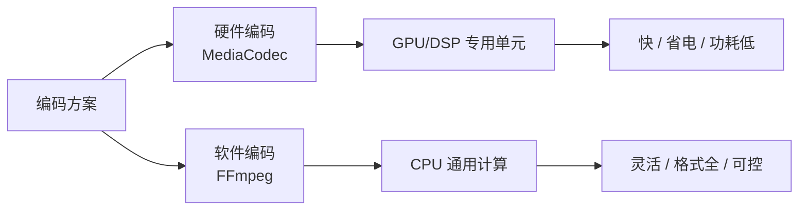
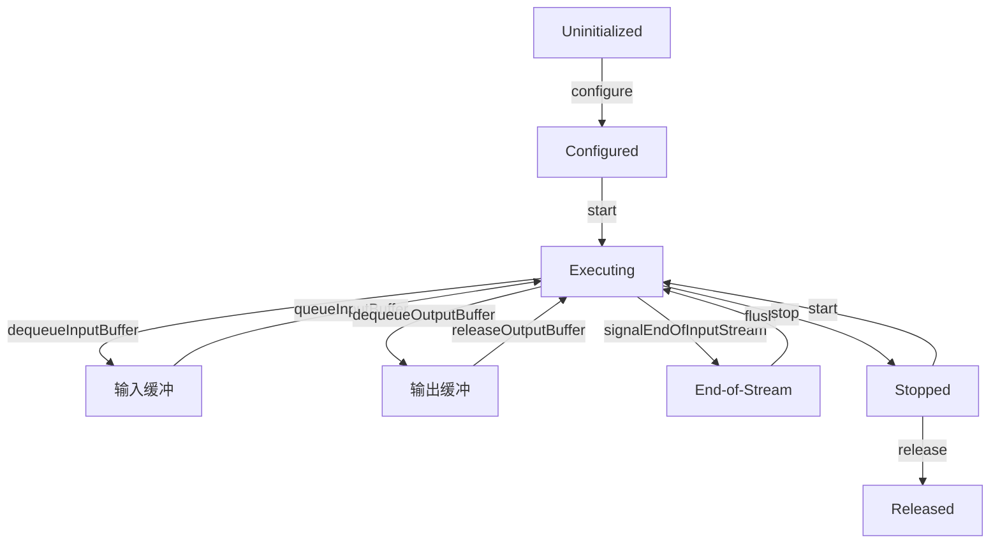
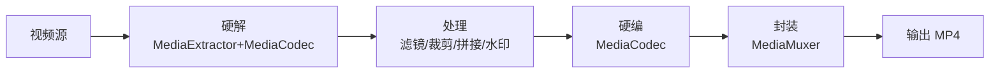

# MediaCodec 与 FFmpeg 音视频处理

> 音视频编辑、转码、滤镜都离不开解码-处理-编码管线。本文深入 MediaCodec 硬编硬解原理与 FFmpeg 软编方案,掌握音视频处理的完整链路。

## 一、硬编与软编

硬编与软编的方案选择如下：



硬编与软编的对比说明如下：

| 对比 | 硬件编码(MediaCodec) | 软件编码(FFmpeg) |
|------|---------------------|-----------------|
| 速度 | 快(专用硬件) | 慢(CPU) |
| 功耗 | 低 | 高 |
| 格式 | 设备相关 | 全面(H.264/H.265/AV1...) |
| 画质 | 一般 | 可精细控制 |
| 适用 | 录制、播放、实时转码 | 离线转码、特殊格式 |

> 实践结论:**实时场景(录制/直播)用硬编**,离线场景(导入转码)优先硬编、FFmpeg 兜底。

## 二、MediaCodec 状态机

MediaCodec 状态机的完整流转如下：



各状态的说明如下：

| 状态 | 操作 |
|------|------|
| Uninitialized | `createEncoderByType` 创建 |
| Configured | `configure` 设置参数 |
| Executing | `start` 后循环收发缓冲 |
| End-of-Stream | 输入结束信号 |
| Released | `release` 释放资源 |

## 三、硬编解码完整流程

硬编解码的基础实现如下：

::: code-tabs

@tab:active Java

```java
// 解码:MediaExtractor + MediaCodec → Surface 播放
MediaCodec createDecoder(String mimeType, Surface surface) {
    MediaFormat format = MediaFormat.createVideoFormat(mimeType, width, height);
    MediaCodec codec = MediaCodec.createDecoderByType(mimeType);
    codec.configure(format, surface, null, 0);   // 输出到 Surface
    codec.start();
    return codec;
}

// 编码:H.264 硬编码参数
MediaFormat format = MediaFormat.createVideoFormat(
        MediaFormat.MIMETYPE_VIDEO_AVC, 1280, 720);
format.setInteger(MediaFormat.KEY_COLOR_FORMAT,
        MediaCodecInfo.CodecCapabilities.COLOR_FormatSurface);
format.setInteger(MediaFormat.KEY_BIT_RATE, 2_000_000);          // 2Mbps
format.setInteger(MediaFormat.KEY_FRAME_RATE, 30);               // 30fps
format.setInteger(MediaFormat.KEY_I_FRAME_INTERVAL, 2);          // 关键帧间隔 2s
format.setInteger(MediaFormat.KEY_BITRATE_MODE,
        MediaCodecInfo.EncoderCapabilities.BITRATE_MODE_VBR); // 可变码率
```

@tab Kotlin

```kotlin
// 解码:MediaExtractor + MediaCodec → Surface 播放
fun createDecoder(mimeType: String, surface: Surface): MediaCodec {
    val format = MediaFormat.createVideoFormat(mimeType, width, height)
    return MediaCodec.createDecoderByType(mimeType).apply {
        configure(format, surface, null, 0)   // 输出到 Surface
        start()
    }
}

// 编码:H.264 硬编码参数
val format = MediaFormat.createVideoFormat(MediaFormat.MIMETYPE_VIDEO_AVC, 1280, 720).apply {
    setInteger(MediaFormat.KEY_COLOR_FORMAT, MediaCodecInfo.CodecCapabilities.COLOR_FormatSurface)
    setInteger(MediaFormat.KEY_BIT_RATE, 2_000_000)          // 2Mbps
    setInteger(MediaFormat.KEY_FRAME_RATE, 30)               // 30fps
    setInteger(MediaFormat.KEY_I_FRAME_INTERVAL, 2)          // 关键帧间隔 2s
    setInteger(MediaFormat.KEY_BITRATE_MODE,
        MediaCodecInfo.EncoderCapabilities.BITRATE_MODE_VBR) // 可变码率
}
```

:::

编解码循环的核心实现如下：

::: code-tabs

@tab:active Java

```java
// 编解码循环(核心):异步回调模式(API 21+)
public class CodecPipeline {
    private final MediaCodec codec;

    public CodecPipeline(MediaCodec codec) {
        this.codec = codec;
    }

    // 使用 setCallback 异步模式,避免手写循环
    public void start() {
        codec.setCallback(new MediaCodec.Callback() {
            @Override
            public void onInputBufferAvailable(MediaCodec codec, int index) {
                // ① 拿到输入缓冲 → 写入待编码数据
                ByteBuffer buffer = codec.getInputBuffer(index);
                byte[] data = readNextFrame();
                if (buffer != null) buffer.put(data);
                codec.queueInputBuffer(index, 0, data.length, ptsUs, 0);
            }
            @Override
            public void onOutputBufferAvailable(MediaCodec codec, int index, MediaCodec.BufferInfo info) {
                // ② 拿到输出缓冲 → 写入输出文件/渲染
                writeOutput(codec.getOutputBuffer(index), info);
                codec.releaseOutputBuffer(index, false);
            }
            @Override
            public void onError(MediaCodec codec, MediaCodec.CodecException e) { handleError(e); }
            @Override
            public void onOutputFormatChanged(MediaCodec codec, MediaFormat format) {
                // ③ 编码器输出格式变化(如 SPS/PPS)
                writeFormat(format);
            }
        });
        codec.start();
    }
}
```

@tab Kotlin

```kotlin
// 编解码循环(核心):异步回调模式(API 21+)
class CodecPipeline(private val codec: MediaCodec) {
    // 使用 setCallback 异步模式,避免手写循环
    fun start() {
        codec.setCallback(object : MediaCodec.Callback() {
            override fun onInputBufferAvailable(codec: MediaCodec, index: Int) {
                // ① 拿到输入缓冲 → 写入待编码数据
                val buffer = codec.getInputBuffer(index)
                val data = readNextFrame()
                buffer?.put(data)
                codec.queueInputBuffer(index, 0, data.size, ptsUs, 0)
            }
            override fun onOutputBufferAvailable(codec: MediaCodec, index: Int, info: MediaCodec.BufferInfo) {
                // ② 拿到输出缓冲 → 写入输出文件/渲染
                writeOutput(codec.getOutputBuffer(index), info)
                codec.releaseOutputBuffer(index, false)
            }
            override fun onError(codec: MediaCodec, e: MediaCodec.CodecException) { handleError(e) }
            override fun onOutputFormatChanged(codec: MediaCodec, format: MediaFormat) {
                // ③ 编码器输出格式变化(如 SPS/PPS)
                writeFormat(format)
            }
        })
        codec.start()
    }
}
```

:::

## 四、音视频编辑管线

音视频编辑管线的整体流程如下：



### 4.1 核心流程

各步骤的组件说明如下：

| 步骤 | 组件 | 说明 |
|------|------|------|
| 解封装 | MediaExtractor | 提取音视频轨道 |
| 解码 | MediaCodec | 压缩帧 → 原始帧 |
| 处理 | OpenGL ES / 算法 | 滤镜、旋转、拼接 |
| 编码 | MediaCodec | 原始帧 → 压缩帧 |
| 封装 | MediaMuxer | 合成 MP4 |

### 4.2 音视频同步

音视频同步的关键点说明如下：

::: code-tabs

@tab:active Java

```java
// 时间戳同步是编辑的难点
// 关键点:
// 1. 解码后保留原始 PTS(呈现时间戳)
// 2. 处理(滤镜)不改变 PTS
// 3. 编码时把处理后的帧 PTS 传给编码器
// 4. Muxer 按 PTS 写入音视频轨道
// 5. 基准对齐:首帧时间戳归零

// 常见问题:
// - 音画不同步 → PTS 被修改/偏移
// - 视频加速/变慢 → PTS 间距不对
// - 掉帧 → 缓冲不足,需要背压控制
```

@tab Kotlin

```kotlin
// 时间戳同步是编辑的难点
// 关键点:
// 1. 解码后保留原始 PTS(呈现时间戳)
// 2. 处理(滤镜)不改变 PTS
// 3. 编码时把处理后的帧 PTS 传给编码器
// 4. Muxer 按 PTS 写入音视频轨道
// 5. 基准对齐:首帧时间戳归零

// 常见问题:
// - 音画不同步 → PTS 被修改/偏移
// - 视频加速/变慢 → PTS 间距不对
// - 掉帧 → 缓冲不足,需要背压控制
```

:::

## 五、FFmpeg 集成

### 5.1 两种集成方式

两种集成方式的对比说明如下：

| 方式 | 说明 | 特点 |
|------|------|------|
| 命令行方式 | 调用 ffmpeg 可执行文件 | 简单,性能差 |
| 库方式(API) | 链接 libav* 库 | 性能好,复杂 |
| 混合方案 | 硬编 + FFmpeg 解封装 | 大厂主流 |

```bash
# 命令行示例
ffmpeg -i input.mp4 -vf "scale=1280:720" -c:v libx264 -crf 23 output.mp4
ffmpeg -i input.mp4 -ss 00:01:00 -t 30 -c copy cut.mp4        # 截取
ffmpeg -i a.mp4 -i b.mp4 -filter_complex "[0:v][1:v]concat" out.mp4  # 拼接
```

### 5.2 大厂混合方案

```text
解封装:FFmpeg(格式支持全:FLV/TS/MKV/MOV...)
解码:  硬件 MediaCodec(快、省电)
处理:  OpenGL ES 滤镜 / 自定义算法
编码:  硬件 MediaCodec
封装:  MediaMuxer / FFmpeg
```

> 这套"FFmpeg 解封装 + 硬编解码 + GPU 处理"是抖音/B站等主流播放器的标准架构。

## 六、性能优化要点

各优化点的处理手段如下：

| 优化点 | 手段 |
|--------|------|
| 缓冲复用 | 复用 BufferInfo/ByteBuffer,避免频繁分配 |
| 异步回调 | 用 setCallback 异步模式 |
| 线程模型 | 编解码循环放子线程 |
| 背压控制 | 输入过快会内存暴涨,按输出节奏喂入 |
| 关键帧间隔 | 编辑后重编码设置合理 I 帧间隔 |
| GPU 处理 | 滤镜用 OpenGL ES 而非 CPU |
| 分辨率 | 按目标输出,避免无谓的大分辨率 |

## 七、高频面试题

### Q1：MediaCodec 硬编码和 FFmpeg 软编码怎么选?
::: details 查看答案
实时场景(录制、直播、实时通话)用硬件编码:速度快、功耗低、延迟小;但格式/参数受设备能力限制。离线场景(导入转码、特效处理)优先硬编(快),FFmpeg 软编作为补充:格式全(H.264/H.265/AV1)、参数可精细控制、质量稳定;但慢、耗 CPU、发热。大厂实践:混合方案——FFmpeg 负责解封装(格式兼容),MediaCodec 负责编解码,GPU 做特效处理。
:::

### Q2：MediaCodec 的工作流程是什么?状态机有哪些状态?
::: details 查看答案
流程:创建(createEncoderByType)→ configure(设置格式/输出 Surface)→ start → 循环:dequeueInputBuffer 拿输入缓冲 → 写入数据 queueInputBuffer → 解码/编码 → dequeueOutputBuffer 拿输出 → 处理(渲染/写文件)releaseOutputBuffer → 输入结束 signalEndOfInputStream → stop/release。状态:Uninitialized → Configured → Executing(核心收发循环)→ End-of-Stream → Stopped → Released。API 21+ 推荐 setCallback 异步模式替代手写循环。
:::

### Q3：如何保证音视频同步?为什么会出现音画不同步?
::: details 查看答案
原理:时间戳(PTS)对齐。采集时每帧打时间戳(系统时钟),播放/合成时按 PTS 呈现。编辑管线中:解码保留原始 PTS → 处理不改 PTS → 编码传 PTS → Muxer 按 PTS 写入。音画不同步常见原因:① 处理耗时改变了帧节奏;② PTS 偏移/被覆盖;③ 首帧时间戳未归零;④ 音频重采样引入偏移;⑤ 丢帧/重复帧未修正 PTS。解决方案:全程统一时钟基准,编辑后做偏移校正,播放端以音频时钟为准。
:::

### Q4：如何实现视频拼接/裁剪/滤镜?
::: details 查看答案
拼接:解码各段 → 处理(可选)→ 按顺序编码到同一输出 → 时间戳连续累加;注意分辨率/帧率/编码参数需一致。裁剪:MediaExtractor 设置 seekTo 起点,读取到终点,只编码目标区间;时间戳重映射(起点归零)。滤镜:解码后帧送 OpenGL ES 做特效(颜色矩阵/模糊/水印)再编码;或用 GPUImage/Shader 库。通用管线:解封装 → 解码 → 处理 → 编码 → 封装,各步骤解耦可组合。
:::

### Q5：编解码时内存和性能怎么优化?
::: details 查看答案
① 复用缓冲:ByteBuffer/BufferInfo 对象复用,避免 GC;② 异步回调模式(setCallback),避免手写循环的空转;③ 背压控制:输出节奏慢时暂停喂入,防止输入缓冲堆积内存暴涨;④ Surface 输入:视频编码用 COLOR_FormatSurface + GPU 渲染,避免 CPU 拷贝;⑤ 线程:编解码放独立线程,避免阻塞 UI;⑥ 分辨率与码率按需设置,避免浪费;⑦ 滤镜用 GPU 不用 CPU;⑧ 大数据块避免频繁内存拷贝。
:::

## 小结

- 硬编(MediaCodec):快省电,实时场景;软编(FFmpeg):格式全,离线兜底
- MediaCodec 状态机:Configured → Executing → 收发缓冲循环
- 编辑管线:解封装 → 解码 → 处理 → 编码 → 封装
- 时间戳(PTS)是音视频同步的关键
- 大厂方案:FFmpeg 解封装 + 硬编解码 + GPU 特效
- 优化:缓冲复用、异步回调、背压控制、Surface 输入

> 进阶阅读：[Media3 ExoPlayer 播放器深入](/advanced/multimedia/exoplayer-deep.md) | [音视频开发入门](/advanced/multimedia/multimedia-basics.md) | [OpenGL ES 渲染](/ui/render/render-principle.md)
