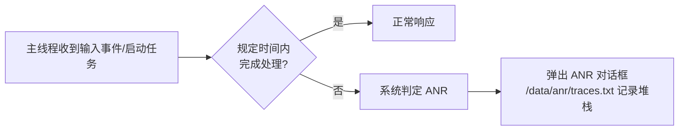
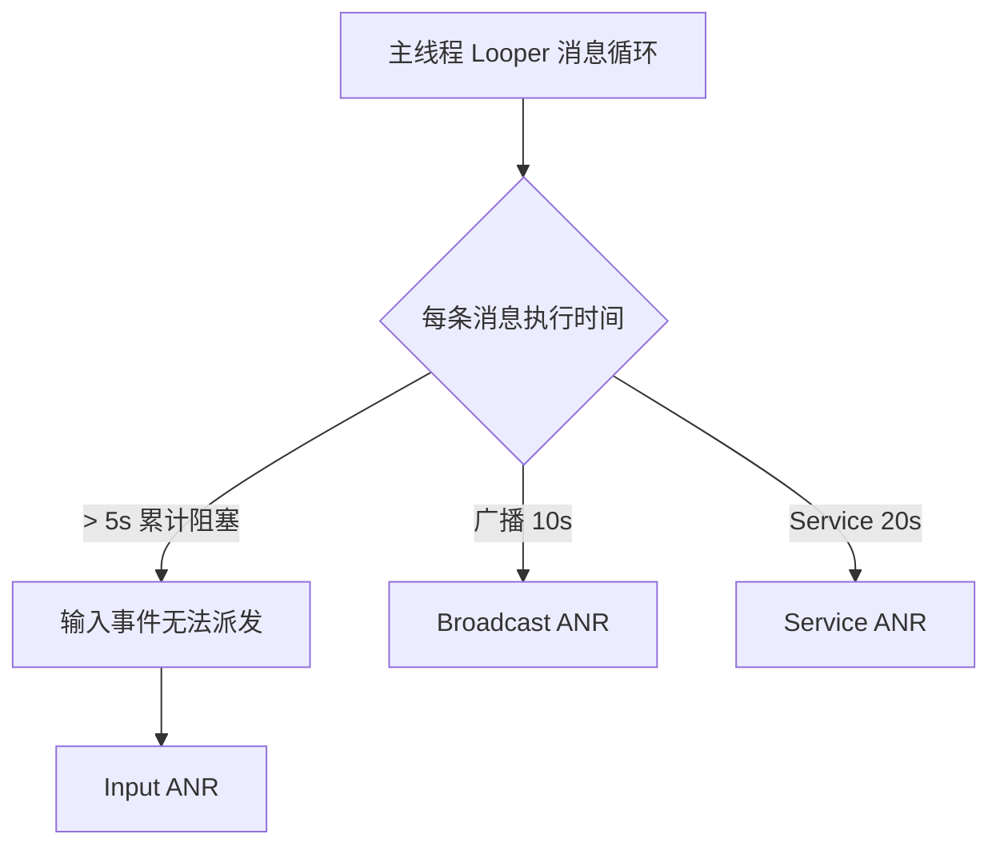

# ANR 机制与优化

> ANR（Application Not Responding）是 Android 性能优化的核心指标之一。本文从系统判定机制出发，覆盖四大 ANR 阈值、常见成因、定位工具链与系统化预防方案。

## 一、什么是 ANR

**ANR（Application Not Responding，应用无响应）**：应用主线程在规定时间内未完成响应，系统弹出 ANR 对话框。



## 二、四大 ANR 阈值

| 组件 | 场景 | 阈值 |
|------|------|------|
| Activity | 5 秒未响应触摸/键盘输入 | 5s |
| BroadcastReceiver | 前台 10s / 后台 60s 未执行完 `onReceive` | 10s / 60s |
| Service | 前台 20s / 后台 200s 未执行完 `onStartCommand` | 20s / 200s |
| Input | InputDispatcher 派发输入事件 5s 未消费 | 5s |

::: tip
输入事件相关 ANR（Input ANR）是最常见的类型，本质是**主线程消息循环被长时间阻塞**，输入事件无法在 5s 内被处理。
:::

## 三、ANR 产生原因

| 原因 | 说明 |
|------|------|
| 主线程耗时操作 | IO（网络/磁盘/数据库）、大量计算、JSON 解析大对象 |
| 锁竞争 | 主线程等待子线程持有的锁 |
| Binder 调用阻塞 | 主线程同步调用慢的 Binder 服务（如频繁跨进程读写） |
| 广播处理耗时 | `onReceive` 中直接做耗时操作 |
| 低内存（LMK） | 内存紧张时频繁 GC 或被杀，间接拖慢主线程 |



## 四、定位 ANR

### 1. traces.txt（系统堆栈）

ANR 发生时系统生成 `/data/anr/traces.txt`：

```bash
adb pull /data/anr/traces.txt
# 查找主线程堆栈（"main" 线程），定位阻塞点
```

```text
"main" prio=5 tid=1 Native
  at android.os.MessageQueue.nativePollOnce(Native Method)
  at android.os.MessageQueue.next(MessageQueue.java:332)
  ...
  at com.example.MainActivity.onCreate(MainActivity.java:45)  // 阻塞点
```

### 2. Logcat 关键字

```bash
# ANR 关键字：ANR in / Input dispatching timed out / Broadcast of Intent
adb logcat -b events | grep -i anr
```

### 3. 主动监控：Choreographer 帧回调

::: code-tabs

@tab:active Java

```java
Choreographer.getInstance().postFrameCallback(new Choreographer.FrameCallback() {
    private long lastFrameTimeNanos = 0L;
    @Override
    public void doFrame(long frameTimeNanos) {
        long diff = (frameTimeNanos - lastFrameTimeNanos) / 1_000_000;
        if (lastFrameTimeNanos != 0L && diff > 1000) {
            // 主线程卡顿超过 1s，记录堆栈（上线前可在 debug 环境弹出提示）
            Log.w("JankMonitor", "Frame blocked " + diff + " ms");
        }
        lastFrameTimeNanos = frameTimeNanos;
        Choreographer.getInstance().postFrameCallback(this);
    }
});
```

@tab Kotlin

```kotlin
Choreographer.getInstance().postFrameCallback(object : Choreographer.FrameCallback {
    var lastFrameTimeNanos = 0L
    override fun doFrame(frameTimeNanos: Long) {
        val diff = (frameTimeNanos - lastFrameTimeNanos) / 1_000_000
        if (lastFrameTimeNanos != 0L && diff > 1000) {
            // 主线程卡顿超过 1s，记录堆栈（上线前可在 debug 环境弹出提示）
            Log.w("JankMonitor", "Frame blocked $diff ms")
        }
        lastFrameTimeNanos = frameTimeNanos
        Choreographer.getInstance().postFrameCallback(this)
    }
})
```

:::

### 4. StrictMode 开发期拦截

::: code-tabs

@tab:active Java

```java
if (BuildConfig.DEBUG) {
    StrictMode.setThreadPolicy(
        new StrictMode.ThreadPolicy.Builder()
                .detectDiskReads()
                .detectDiskWrites()
                .detectNetwork()   // 主线程网络访问直接警告
                .penaltyLog()
                .build()
    );
}
```

@tab Kotlin

```kotlin
if (BuildConfig.DEBUG) {
    StrictMode.setThreadPolicy(
        StrictMode.ThreadPolicy.Builder()
            .detectDiskReads()
            .detectDiskWrites()
            .detectNetwork()   // 主线程网络访问直接警告
            .penaltyLog()
            .build()
    )
}
```

:::

### 5. 线上监控

- **ANR-WatchDog**：子线程定期 post 消息，超时判定主线程卡死并上报堆栈
- 利用 `ApplicationExitInfo`（API 30+）读取系统记录的 ANR 原因与堆栈
- 监控上报到 APM 平台（崩溃/卡顿/ANR 统一聚合）

## 五、预防手段

| 维度 | 手段 |
|------|------|
| 异步化 | IO/网络/DB 全部丢线程池或协程，主线程只做 UI |
| 线程池 | 复用线程、控制并发，避免频繁创建销毁与资源抢占 |
| 启动优化 | 冷启动异步初始化、启动器框架分级加载 |
| 布局优化 | 减少层级（ConstraintLayout/merge）、懒加载（ViewStub） |
| 内存优化 | 减少主线程 GC：避免 onDraw 创建对象、使用 SparseArray |
| 锁策略 | 主线程不持锁等待；跨线程用有界队列而非无界锁等待 |
| 广播治理 | `onReceive` 只做收尾，耗时逻辑移入 `goAsync()` + 线程池 |
| Binder 优化 | 高频跨进程读写批量合并，避免逐条同步调用 |

::: code-tabs

@tab:active Java

```java
// 广播耗时处理：goAsync + 线程池
public class MyReceiver extends BroadcastReceiver {
    @Override
    public void onReceive(Context context, Intent intent) {
        final PendingResult pendingResult = goAsync(); // 告知系统稍后结束
        new Thread(() -> {
            try {
                // 耗时逻辑（子线程）
            } finally {
                pendingResult.finish(); // 必须调用
            }
        }).start();
    }
}
```

@tab Kotlin

```kotlin
// 广播耗时处理：goAsync + 线程池
class MyReceiver : BroadcastReceiver() {
    override fun onReceive(context: Context, intent: Intent) {
        val pendingResult = goAsync() // 告知系统稍后结束
        Thread {
            try {
                // 耗时逻辑（子线程）
            } finally {
                pendingResult.finish() // 必须调用
            }
        }.start()
    }
}
```

:::

## 六、高频面试题

### Q1：ANR 的触发条件（四大阈值）？

::: details 查看答案
输入事件 5 秒未处理（Input ANR，最常见）；前台广播 10 秒、后台广播 60 秒未执行完；前台服务 20 秒、后台服务 200 秒未执行完。本质都是主线程消息循环被长时间阻塞。
:::

### Q2：如何定位 ANR？

::: details 查看答案
① 查看 `/data/anr/traces.txt` 中 main 线程堆栈，定位阻塞点；② Logcat 搜索 `ANR in`、`Input dispatching timed out` 等关键字；③ 开发期用 StrictMode 拦截主线程 IO/网络；④ 线上用 ANR-WatchDog 或 `ApplicationExitInfo`（API 30+）监控上报；⑤ 配合卡顿监控（Choreographer 帧回调）提前发现隐患。
:::

### Q3：为什么主线程网络访问容易 ANR？

::: details 查看答案
网络请求耗时不可控（几百 ms 到几十秒），主线程同步等待期间消息循环被阻塞，输入事件无法在 5 秒内消费触发 Input ANR。因此网络请求必须放子线程/协程，配合超时与重试策略。
:::

### Q4：广播里做耗时操作怎么避免 ANR？

::: details 查看答案
`onReceive` 中调用 `goAsync()` 获取 PendingResult，把耗时逻辑放到线程池/协程执行，完成后必须调用 `pendingResult.finish()`；或者干脆不用广播，改用其他通信机制（协程通道、LocalBroadcast 替代方案）。
:::

### Q5：ANR 与崩溃（Crash）的区别？

::: details 查看答案
崩溃是异常未被捕获导致进程被终止（有崩溃堆栈）；ANR 是主线程超时无响应，系统弹框，用户可选择"等待"或"关闭"，进程不一定会被杀。ANR 的 traces.txt 记录的是**各线程当前堆栈**而非异常栈，定位难度更高，更依赖运行时卡顿监控。
:::

## 小结

- 阈值记忆：**输入 5s、广播 10s、服务 20s**（前台），本质是主线程被阻塞
- 定位链路：traces.txt → Logcat → StrictMode（开发）→ Choreographer / WatchDog / ApplicationExitInfo（线上）
- 预防核心：**主线程只做 UI**，IO/网络/DB 全部异步化，配合布局、内存、锁策略优化

> 进阶阅读：[卡顿优化与掉帧分析](jank-optimization.md) | [内存优化与泄漏排查](memory-optimization.md) | [同步屏障与异步消息](/network/handler/sync-barrier.md) | [APM 监控体系](/advanced/stability/apm-monitoring.md)
