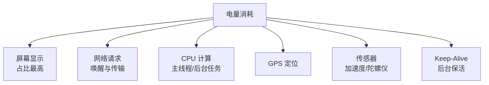
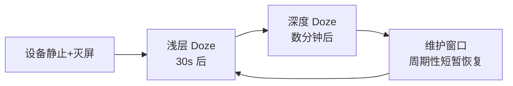

# 电量优化实战

> 手机续航是用户核心体验之一。电量优化不是"少用功能",而是**让耗电变得可解释、可控、可调度**:分析耗电组件、适配 Doze、合理使用 WakeLock 与 WorkManager。

## 一、Android 耗电分析

### 1.1 耗电大户



| 耗电项 | 典型场景 | 优化方向 |
|--------|---------|---------|
| 屏幕 | 高亮度、常亮 | 亮度自适应、超时关闭 |
| 网络 | 频繁小请求、长连接 | 合并请求、批量同步 |
| CPU | 无意义轮询、死循环 | WorkManager 调度 |
| GPS | 高精度持续定位 | 按需定位、降精度 |
| 传感器 | 常开传感器 | 事件驱动、及时注销 |
| WakeLock | 未释放/滥用 | 超时持有、必须释放 |

### 1.2 分析工具

| 工具 | 用途 |
|------|------|
| Battery Historian | 历史耗电曲线,定位耗电事件 |
| Battery Profiler(AS) | 实时电量/温度/电压 |
| `adb shell dumpsys batterystats` | 详细耗电统计 |
| Energy Profiler | 网络/CPU 能耗 |

```bash
# 采集耗电数据
adb shell dumpsys batterystats --reset   # 重置统计
# ... 操作 App 一段时间 ...
adb shell dumpsys batterystats com.example.app > battery.txt
# 或用 Battery Historian 可视化分析
```

## 二、Doze 模式与 App Standby

### 2.1 Doze 是什么

> Android 6.0 引入 Doze:设备静止且灭屏一段时间后,系统限制 App 的 CPU、网络与闹钟,批量处理任务,大幅省电。



| 限制 | 说明 |
|------|------|
| 网络 | 禁止访问网络 |
| WakeLock | 忽略 |
| AlarmManager | 延迟到维护窗口(除 setAlarmClock) |
| JobScheduler | 延迟执行 |
| GPS/WiFi 扫描 | 频率降低 |

### 2.2 适配策略

```kotlin
// ① 用 WorkManager 替代自建任务:系统自动适配 Doze
val work = OneTimeWorkRequestBuilder<SyncWorker>()
    .setConstraints(Constraints.Builder()
        .setRequiresBatteryNotLow(true)
        .setRequiresCharging(true)     // 充电时才同步
        .build())
    .setBackoffCriteria(BackoffPolicy.EXPONENTIAL, 30, TimeUnit.SECONDS)
    .build()
WorkManager.getInstance(context).enqueue(work)

// ② 真需要立即唤醒(如闹钟):setAlarmClock(唯一不受 Doze 限制)
val alarmManager = context.getSystemService(AlarmManager::class.java)
alarmManager.setAlarmClock(
    AlarmManager.AlarmClockInfo(triggerAt, null),
    PendingIntent.getActivity(...)
)

// ③ 请求忽略电池优化(需谨慎,滥用会被下架)
// adb shell dumpsys deviceidle whitelist +包名
```

## 三、WakeLock 正确用法

```kotlin
// 获取 WakeLock(必须带超时 + finally 释放)
val powerManager = context.getSystemService(PowerManager::class.java)
val wakeLock = powerManager.newWakeLock(
    PowerManager.PARTIAL_WAKE_LOCK, "app:download"
)

try {
    wakeLock.acquire(60_000)   // 超时自动释放,防泄漏
    doLongTask()
} finally {
    if (wakeLock.isHeld) wakeLock.release()   // 必须释放!
}
```

| 错误用法 | 后果 |
|---------|------|
| 不释放 WakeLock | 手机无法休眠,电量狂掉 |
| 持有过久 | 高功耗 |
| 后台频繁获取 | 系统判定耗电应用 |
| 用 CPU 锁做网络任务 | 应改用网络锁 |

>  **最佳实践**:能用 WorkManager/JobScheduler 就不要自己拿 WakeLock;拿锁必须 try-finally 释放并带超时。

## 四、定位与传感器优化

```kotlin
// 定位:按需 + 降精度
val locationManager = context.getSystemService(LocationManager::class.java)

// 策略:业务场景决定精度
// ① 前台导航 → 高精度(GPS),页面销毁必须 removeUpdates
// ② 位置上报 → 省电模式(网络定位),低频(如 5 分钟)
locationManager.requestLocationUpdates(
    LocationManager.NETWORK_PROVIDER,   // 省电定位源
    5 * 60_000L,                        // 5 分钟
    100f,                               // 100 米
    listener
)
// 用完必须注销!
onDestroy() { locationManager.removeUpdates(listener) }

// 传感器:事件驱动 + 及时注销
sensorManager.registerListener(listener, accelerometer, SensorManager.SENSOR_DELAY_NORMAL)
onDestroy() { sensorManager.unregisterListener(listener) }
```

## 五、网络与数据同步省电

| 做法 | 说明 |
|------|------|
| 批量同步 | 积累数据一次同步,而非逐个 |
| 智能时机 | 充电 + WiFi 时同步(WorkManager) |
| 长连接保活 | 用系统级推送(FCM),避免自建长连接 |
| 心跳合并 | 多条消息合并心跳 |
| 避免频繁唤醒 | 轮询改事件驱动 |

```kotlin
// 充电 + WiFi 才同步的 WorkRequest
val constraints = Constraints.Builder()
    .setRequiresCharging(true)
    .setRequiredNetworkType(NetworkType.UNMETERED)   // 仅 WiFi
    .build()

val syncWork = PeriodicWorkRequestBuilder<SyncWorker>(6, TimeUnit.HOURS)
    .setConstraints(constraints)
    .build()
```

## 六、电量优化检查清单

- [ ] 无未释放的 WakeLock(带超时 + finally)
- [ ] 定位:按需注册,页面销毁 removeUpdates
- [ ] 传感器:用完注销,合理采样频率
- [ ] 后台任务全部走 WorkManager
- [ ] 轮询改为事件驱动/长连接推送
- [ ] 定时任务适配 Doze(AlarmClock 除外会延迟)
- [ ] 批量网络请求,避免频繁唤醒
- [ ] 用 Battery Historian 验证优化效果
- [ ] 检查无死循环 / 无意义高频任务

## 七、高频面试题

### Q1：Doze 模式下 App 会受什么限制?如何适配?
::: details 查看答案
Doze(设备静止+灭屏)限制:① 网络访问被禁止;② WakeLock 被忽略;③ AlarmManager 闹钟延迟到维护窗口(除 setAlarmClock);④ JobScheduler 延迟;⑤ GPS/WiFi 扫描频率降低。适配:① 后台任务用 WorkManager,系统自动适配 Doze;② 真需立即执行用 setAlarmClock;③ 测试用 adb shell dumpsys deviceidle force-idle;④ 不要请求"忽略电池优化"白名单(滥用会被下架)。
:::

### Q2：WakeLock 是什么?怎么用才不会耗电?
::: details 查看答案
WakeLock 是 PowerManager 提供的"保持唤醒"锁,可防止 CPU/屏幕休眠。正确用法:① 尽量不用,能用 WorkManager/JobScheduler 替代就不用锁;② 必须用时 acquire(timeout) 带超时;③ finally 中 isHeld 检查后 release();④ 网络任务用 PARTIAL_WAKE_LOCK。错误用法:不释放(手机无法休眠)、滥用(后台常驻)、持有过久——都会导致电量异常消耗。
:::

### Q3：如何分析一个 App 的电量消耗?
::: details 查看答案
流程:① 采集:dumpsys batterystats --reset 后操作 App,再 dump 数据;② 工具:Battery Historian 可视化耗电曲线,或 AS Battery Profiler 实时看;③ 定位:按耗电排行(WakeLock 时长、网络流量、GPS 时长、CPU 时间)找异常项;④ 归因:关联具体代码路径(如某个网络请求、某个定位);⑤ 优化+验证:改后重测对比,确认曲线下降。重点排查:WakeLock 泄漏、频繁网络、高频传感器、后台无意义任务。
:::

### Q4：WorkManager 如何帮助省电?
::: details 查看答案
WorkManager 基于 JobScheduler(API 23+),系统统一调度:① 自动适配 Doze 与 App Standby,任务延迟到维护窗口批量执行;② 支持约束(Constraints):充电时、WiFi 下、电量不低时执行;③ 周期任务(PeriodicWorkRequest)由系统合并批量唤醒;④ 指数退避重试;⑤ 任务持久化(进程被杀不丢失)。相比自建线程+定时器,WorkManager 让系统统一安排唤醒时间,大量 App 任务聚合到同一窗口,整体省电。
:::

### Q5：定位和传感器如何优化耗电?
::: details 查看答案
定位:① 按需定位——进入页面才注册,离开注销(removeUpdates);② 降精度——实时导航用 GPS,位置上报用网络定位;③ 降频率——根据业务需求拉长间隔(5 分钟 vs 1 秒);④ 批量上报——收集多次结果一次上传。传感器:① 用最低满足需求的采样率(SENSOR_DELAY_NORMAL);② 事件驱动而非轮询;③ 页面不可见时注销监听。核心思想:**按需、低频、及时释放**。
:::

## 小结

- 耗电大户:屏幕 > 网络 > CPU > 定位 > 传感器 > WakeLock
- 分析工具:Battery Historian / Battery Profiler / dumpsys
- Doze:系统休眠策略,后台任务交给 WorkManager
- WakeLock:带超时 + finally 释放,能不用就不用
- 定位传感器:按需注册、及时注销、降精度降频率
- 网络同步:批量 + 充电/WiFi 时机 + 系统推送
- 验证闭环:改前改后 Battery Historian 对比

> 进阶阅读：[WorkManager / Hilt 深入](/jetpack/workmanager-hilt/) | [网络优化实战](/advanced/performance/network-optimization.md) | [后台任务与进程](/android/process/)
