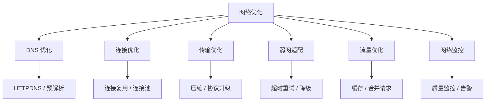
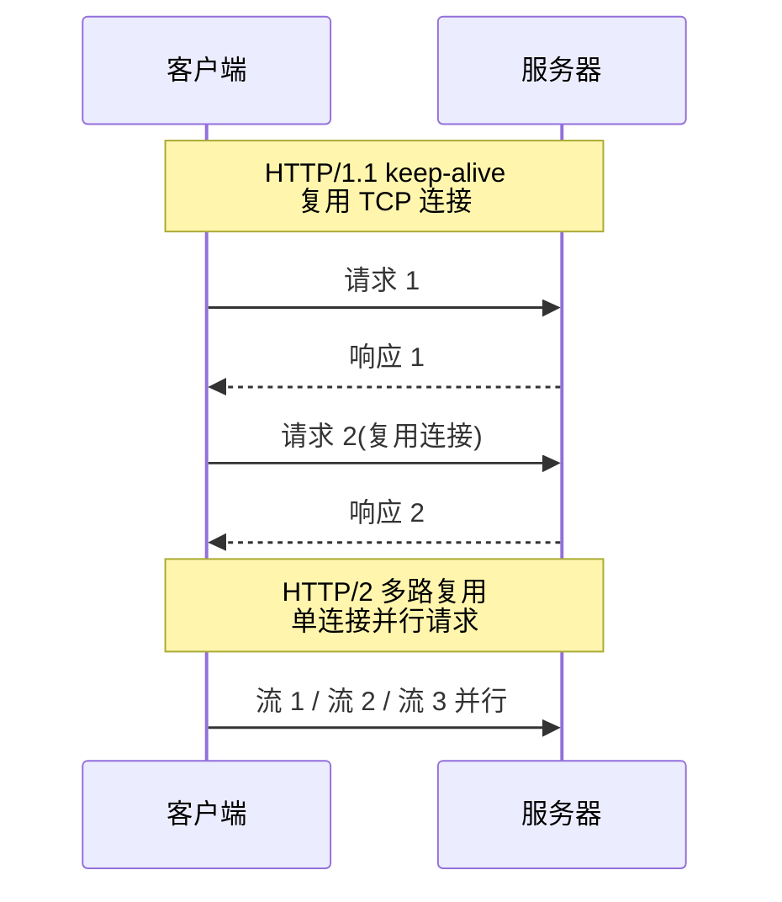
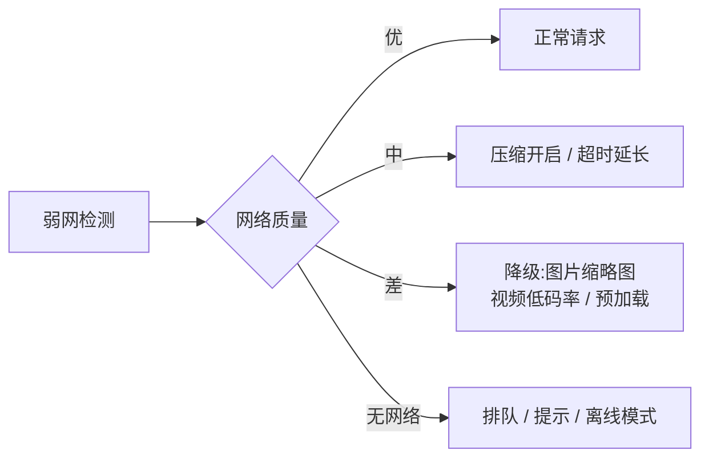

# 网络优化实战

> 网络是移动应用体验的关键短板:弱网、高延迟、流量消耗直接影响用户留存。本文覆盖网络优化的完整链路——DNS、连接、传输、弱网、流量与监控。

## 一、网络优化全景

网络优化的整体流程如下：



各维度的优化手段与收益对比说明如下：

| 维度 | 手段 | 收益 |
|------|------|------|
| DNS | HTTPDNS、预解析 | 减少 DNS 延迟与劫持 |
| 连接 | 连接池、多路复用 | 减少握手耗时 |
| 传输 | Gzip/Brotli、HTTP/2 | 减小体积、并行请求 |
| 弱网 | 超时分级、重试策略 | 提升成功率 |
| 流量 | 缓存、压缩、增量 | 降低流量成本 |
| 监控 | 耗时/成功率埋点 | 发现与定位问题 |

## 二、DNS 优化

### 2.1 传统 DNS 的问题

传统 DNS 的主要问题如下：

| 问题 | 说明 |
|------|------|
| 解析慢 | 递归查询多级,平均 30-100ms |
| 缓存污染 | 本地 DNS 缓存被篡改 |
| 运营商劫持 | 返回错误 IP / 插入广告 |
| 无感知 | 域名失效无自动切换 |

### 2.2 HTTPDNS 方案

对应的核心实现如下：

::: code-tabs

@tab:active Java

```java
// ① 使用 HTTPDNS:直接向 DNS 服务器发 HTTP 请求
// 请求: https://10.0.0.1/d?dn=api.example.com
// 返回: {"ips":["1.2.3.4","5.6.7.8"],"ttl":300}

// ② 结合 OkHttp:自定义 DNS 实现
public class HttpDns implements Dns {
    @Override
    public List<InetAddress> lookup(String hostname) {
        // 优先查本地缓存(内存 + 本地存储)
        if (cache.containsKey(hostname)) {
            return cache.get(hostname);
        }
        // 未命中 → HTTPDNS 解析
        List<InetAddress> ips = httpDnsProvider.resolve(hostname);
        cache.put(hostname, ips);
        return ips;
    }
}

// ③ 注入 OkHttp
OkHttpClient client = new OkHttpClient.Builder()
        .dns(new HttpDns())          // 替换系统 DNS
        .connectTimeout(10, TimeUnit.SECONDS)
        .build();
```

@tab Kotlin

```kotlin
// ① 使用 HTTPDNS:直接向 DNS 服务器发 HTTP 请求
// 请求: https://10.0.0.1/d?dn=api.example.com
// 返回: {"ips":["1.2.3.4","5.6.7.8"],"ttl":300}

// ② 结合 OkHttp:自定义 DNS 实现
class HttpDns : Dns {
    override fun lookup(hostname: String): List<InetAddress> {
        // 优先查本地缓存(内存 + 本地存储)
        cache[hostname]?.let { return it }
        // 未命中 → HTTPDNS 解析
        val ips = httpDnsProvider.resolve(hostname)
        cache[hostname] = ips
        return ips
    }
}

// ③ 注入 OkHttp
val client = OkHttpClient.Builder()
    .dns(HttpDns())          // 替换系统 DNS
    .connectTimeout(10, TimeUnit.SECONDS)
    .build()
```

:::

> 大厂实践:自建 HTTPDNS(腾讯、阿里、字节都有 SDK),配合 IP 直连 + 失败回退,能显著降低解析耗时与劫持风险。

## 三、连接优化

### 3.1 连接复用

连接复用的完整链路如下：



各连接复用方案的说明如下：

| 方案 | 说明 |
|------|------|
| keep-alive | HTTP/1.1 默认复用 TCP |
| HTTP/2 多路复用 | 单连接并发多请求,消除队头阻塞 |
| HTTP/3 (QUIC) | UDP + 0-RTT,弱网更强 |
| 连接池预建 | 启动时预热连接 |

### 3.2 超时与重试策略

对应的核心实现如下：

::: code-tabs

@tab:active Java

```java
// 超时分级:根据网络质量动态调整
public class TimeoutPolicy {
    // 4G/5G:连接 5s,读 10s
    // 3G:连接 10s,读 20s
    // 弱网(信号差):连接 15s,读 30s
    Pair<Integer, Integer> timeoutsFor(NetworkType networkType) {
        switch (networkType) {
            case WIFI:
            case CELLULAR_4G:
                return new Pair<>(5_000, 10_000);
            case CELLULAR_3G:
                return new Pair<>(10_000, 20_000);
            default:
                return new Pair<>(15_000, 30_000);
        }
    }
}

// 重试策略:指数退避 + 抖动
long retryDelay(int attempt) {
    long base = 1_000L << attempt;      // 1s, 2s, 4s, 8s
    long jitter = ThreadLocalRandom.current().nextLong(0, 300);
    return base + jitter;
}
// 幂等请求(GET)可重试;非幂等(POST)慎重重试
```

@tab Kotlin

```kotlin
// 超时分级:根据网络质量动态调整
class TimeoutPolicy {
    // 4G/5G:连接 5s,读 10s
    // 3G:连接 10s,读 20s
    // 弱网(信号差):连接 15s,读 30s
    fun timeoutsFor(networkType: NetworkType): Pair<Int, Int> = when (networkType) {
        NetworkType.WIFI, NetworkType.CELLULAR_4G -> 5_000 to 10_000
        NetworkType.CELLULAR_3G -> 10_000 to 20_000
        else -> 15_000 to 30_000
    }
}

// 重试策略:指数退避 + 抖动
fun retryDelay(attempt: Int): Long {
    val base = 1_000L shl attempt      // 1s, 2s, 4s, 8s
    val jitter = Random.nextLong(0, 300)
    return base + jitter
}
// 幂等请求(GET)可重试;非幂等(POST)慎重重试
```

:::

## 四、弱网适配

弱网适配的决策流程如下：



常用弱网策略的实现说明如下：

| 弱网策略 | 实现 |
|---------|------|
| 图片分级 | 不同网络加载不同清晰度(WebP 缩略图) |
| 请求合并 | 弱网下合并多个小请求 |
| 离线优先 | 本地缓存优先,后台同步 |
| 主动降级 | 视频切低码率、关闭预加载 |
| 请求调度 | 弱网下延迟非关键请求 |
| 网络切换监听 | ConnectivityManager 监听,恢复后补发 |

## 五、流量优化

### 5.1 数据压缩

各压缩手段的说明与效果如下：

| 手段 | 说明 | 效果 |
|------|------|------|
| Gzip / Brotli | 文本压缩 | 60%-80% |
| WebP 图片 | 有损/无损压缩 | 比 JPEG 小 25%-34% |
| 协议二进制化 | Protobuf 替代 JSON | 体积小 50%+ |
| 增量更新 | 只传变更数据 | 按场景 |
| 合并请求 | 接口聚合(BFF) | 减少请求次数 |

对应的核心实现如下：

::: code-tabs

@tab:active Java

```java
// OkHttp 自动解压(Brotli 需要额外支持)
OkHttpClient client = new OkHttpClient.Builder()
        .addInterceptor(chain -> {
            Request request = chain.request().newBuilder()
                    .header("Accept-Encoding", "gzip, br")
                    .build();
            return chain.proceed(request);
        })
        .build();

// 图片:根据网络加载不同规格
String imageUrl(String url, int width) {
    return url + "?imageView2/2/w/" + width;   // CDN 裁剪
}
```

@tab Kotlin

```kotlin
// OkHttp 自动解压(Brotli 需要额外支持)
val client = OkHttpClient.Builder()
    .addInterceptor { chain ->
        val request = chain.request().newBuilder()
            .header("Accept-Encoding", "gzip, br")
            .build()
        chain.proceed(request)
    }
    .build()

// 图片:根据网络加载不同规格
fun imageUrl(url: String, width: Int): String =
    "$url?imageView2/2/w/$width"   // CDN 裁剪
```

:::

### 5.2 缓存策略

```text
策略                适用              配置
内存缓存(LruCache)  频繁读取的小图      LRU 淘汰
磁盘缓存(OkHttp)    GET 响应           Cache-Control
数据库缓存          列表/详情数据       TTL + 版本号
增量同步            消息/聊天           时间戳 + 分页
```

## 六、网络监控

对应的核心实现如下：

::: code-tabs

@tab:active Java

```java
// ① 全局拦截器采集指标
public class NetworkMonitorInterceptor implements Interceptor {
    @Override
    public Response intercept(Chain chain) throws IOException {
        long start = SystemClock.elapsedRealtime();
        Request request = chain.request();
        try {
            Response response = chain.proceed(request);
            report(new Event(
                    request.url().toString(),
                    dnsMs,
                    connectMs,
                    response.sentRequestAtMillis() - ...,
                    response.code(),
                    response.body() != null ? response.body().contentLength() : 0
            ));
            return response;
        } catch (IOException e) {
            reportError(request, e);   // 错误上报:超时/断连/解析失败
            throw e;
        }
    }
}
```

@tab Kotlin

```kotlin
// ① 全局拦截器采集指标
class NetworkMonitorInterceptor : Interceptor {
    override fun intercept(chain: Interceptor.Chain): Response {
        val start = SystemClock.elapsedRealtime()
        val request = chain.request()
        try {
            val response = chain.proceed(request)
            report(Event(
                url = request.url.toString(),
                dnsMs = ...,
                connectMs = ...,
                ttfbs = response.sentRequestAtMillis - ...,
                code = response.code,
                size = response.body()?.contentLength() ?: 0
            ))
            return response
        } catch (e: IOException) {
            reportError(request, e)   // 错误上报:超时/断连/解析失败
            throw e
        }
    }
}
```

:::

各监控指标的含义如下：

| 监控指标 | 含义 |
|---------|------|
| DNS 耗时 | 解析耗时 |
| 连接耗时 | TCP + TLS 握手 |
| TTFB | 首字节时间(服务端耗时) |
| 下载耗时 | 响应体传输 |
| 成功率 | 请求成功占比 |
| 错误分布 | 超时/断连/404/5xx |

## 七、高频面试题

### Q1：为什么移动端要用 HTTPDNS?和系统 DNS 有什么区别?
::: details 查看答案
系统 DNS 走 UDP 53 端口,由运营商递归解析:慢(多次递归)、易被劫持(返回错误 IP/插广告)、缓存污染无感知。HTTPDNS 用 HTTP 请求直接访问自建 DNS 集群,返回 IP 列表:① 快(直达权威);② 安全(防劫持);③ 可管理(精确调度、故障切换);④ 可观测。通常配合 IP 直连、失败回退系统 DNS、本地缓存 TTL 管理。
:::

### Q2：HTTP/2 多路复用解决了什么问题?为什么还需要 HTTP/3?
::: details 查看答案
HTTP/1.1 队头阻塞:一个连接同时只能一个请求,或需要多个连接;HTTP/2 在单 TCP 连接上多路复用多个流,解决了 HTTP 层的队头阻塞。但 HTTP/2 仍有 **TCP 层的队头阻塞**:一个 TCP 包丢失,后续所有流都要等重传。HTTP/3 改用 UDP + QUIC:0-RTT 建连、独立流(丢包只影响自己的流)、连接迁移(切网不断连),弱网表现更好。
:::

### Q3：弱网下如何设计请求策略?
::: details 查看答案
① 检测网络质量:信号强度、RTT、丢包率分级;② 超时分级:弱网放宽连接/读超时;③ 重试:指数退避+抖动,幂等请求才重试;④ 降级:图片缩略图、视频低码率、非关键请求延迟;⑤ 合并与压缩:弱网合并请求、加强压缩;⑥ 离线优先:本地缓存 + 恢复后同步。核心原则:**弱网下保证核心链路可用,非核心让路**。
:::

### Q4：如何做网络流量优化?
::: details 查看答案
① 压缩:Gzip/Brotli 文本压缩、WebP 图片、Protobuf 二进制协议;② 缓存:内存(LruCache)+磁盘(OkHttp Cache-Control)+数据库(数据缓存),命中率提升;③ 合并请求:BFF 接口聚合,减少请求次数;④ 增量同步:只传变更;⑤ 分页与懒加载:列表按需加载;⑥ CDN:静态资源就近加速。衡量指标:单用户日流量、缓存命中率、请求次数。
:::

### Q5：如何设计一套网络监控体系?
::: details 查看答案
① 采集:OkHttp 拦截器全局埋点,记录 DNS/连接/TTFB/下载耗时、状态码、错误类型、流量;② 聚合:按接口/地区/网络类型/版本维度聚合,计算成功率、耗时分位(P50/P95/P99);③ 告警:成功率跌阈值、P95 突变自动告警;④ 定位:错误详情(超时/断连/解析失败)+ 抓包对比 + 弱网复现;⑤ 验证:灰度验证修复效果。注意采样率控制(全量会带来额外流量,一般 1%-10% 采样)。
:::

## 小结

- DNS:HTTPDNS + 预解析,防劫持降延迟
- 连接:连接池 + HTTP/2/3,减少握手与队头阻塞
- 弱网:超时分级 + 指数退避 + 主动降级
- 流量:压缩 + 缓存 + 合并 + 增量
- 监控:全链路埋点,成功率与耗时分位告警
- 大厂经验:网络优化是持续迭代的过程,先建监控再优化

> 进阶阅读：[OkHttp 源码解析](/network/http/okhttp-source.md) | [HTTP 协议详解](/network/http/http-protocol.md) | [TCP 与 UDP 详解](/network/tcp-udp.md)
