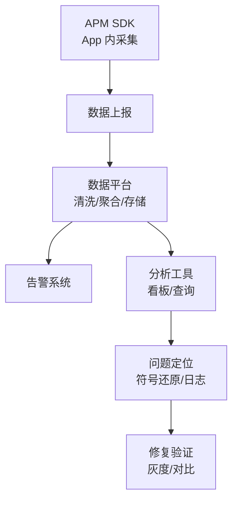
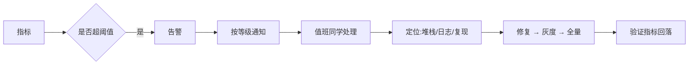

# 📊 APM 监控体系建设

> APM(Application Performance Monitoring)是 App 线上质量的"眼睛":崩溃、卡顿、ANR、网络、页面性能全部可观测、可告警、可定位。本文从零设计一套 APM 体系。

## 一、APM 全景架构



| 层级 | 内容 |
|------|------|
| 采集层 | Crash / ANR / 卡顿 / 网络 / 页面 / 自定义事件 |
| 上报层 | 批量压缩上报、采样控制 |
| 存储层 | 时序数据库、日志存储 |
| 分析层 | 聚合统计、趋势、分位 |
| 告警层 | 阈值告警、异常检测 |
| 定位层 | 堆栈还原、日志回捞、设备信息 |

## 二、核心监控模块

### 2.1 崩溃监控

| 类型 | 采集方式 | 还原手段 |
|------|---------|---------|
| Java 崩溃 | Thread.UncaughtExceptionHandler | 堆栈 + 版本聚合 |
| Native 崩溃 | 信号处理器 + Breakpad | 符号表还原 |
| 逻辑错误 | 自定义异常捕获 | 现场信息回捞 |

```kotlin
// Java 崩溃捕获
class CrashHandler : Thread.UncaughtExceptionHandler {
    override fun uncaughtException(t: Thread, e: Throwable) {
        // 1. 记录崩溃现场(堆栈/机型/版本/页面/时间)
        val crashInfo = CrashInfo(
            threadName = t.name,
            stackTrace = Log.getStackTraceString(e),
            device = DeviceInfo.get(),
            appVersion = BuildConfig.VERSION_NAME,
            page = PageTracker.currentPage()
        )
        // 2. 异步写入本地文件(进程即将结束,同步兜底)
        CrashStore.save(crashInfo)
        // 3. 交给默认处理器(系统闪退)或自行重启
        defaultHandler?.uncaughtException(t, e)
    }
}
```

### 2.2 卡顿监控

```kotlin
// 方案一:Choreographer 帧回调(FrameCallback)
class JankMonitor {
    private val frameCallback = object : Choreographer.FrameCallback {
        override fun doFrame(frameTimeNanos: Long) {
            if (lastFrameTime != 0L) {
                val frameMs = (frameTimeNanos - lastFrameTime) / 1_000_000
                if (frameMs > 100) reportJank(frameMs)   // 超过 100ms 记为卡顿
            }
            lastFrameTime = frameTimeNanos
            Choreographer.getInstance().postFrameCallback(this)
        }
    }
    fun start() { Choreographer.getInstance().postFrameCallback(frameCallback) }
}

// 方案二:主线程消息耗时(Looper.getMainLooper().setMessageLogging)
// 方案三:监控线程定期采样主线程堆栈(Sampler 方案,定位卡在哪个方法)
```

| 方案 | 优点 | 缺点 |
|------|------|------|
| FrameCallback | 准确反映掉帧 | 只能知道"卡了" |
| Looper 日志 | 拦截耗时消息 | 只能知道消息整体耗时 |
| 堆栈采样 | 精确定位卡顿方法 | 采样间隔有误差 |
| 组合方案 | 采样 + 帧率结合 | 实现复杂 |

### 2.3 ANR 监控

```kotlin
// ANR 捕获思路:主线程消息超时 + 兜底 dump
// ① 主线程 Handler 发心跳消息,5s 内未回来说明主线程卡死
// ② 触发时抓取主线程堆栈(可用 ANR-WatchDog 思路)

// 系统 ANR 后 /data/anr/traces.txt 不可靠(可能被覆盖)
// 兜底:主线程 MessageQueue 超时检测
class ANRMonitor {
    private val mainHandler = Handler(Looper.getMainLooper())
    private val watchdogRunnable = Runnable {
        // 心跳没被重置 → 主线程可能卡死
        dumpMainThreadStack()
    }
    // 每条消息执行前 post 延迟任务,消息执行后 removeCallbacks 重置
}
```

## 三、网络与页面监控

```kotlin
// 网络监控(OkHttp 拦截器):见《网络优化实战》网络监控章节
// 页面监控:ActivityLifecycleCallbacks 统计页面耗时
class PageMonitor : ActivityLifecycleCallbacks {
    override fun onActivityCreated(activity: Activity, b: Bundle?) {
        startTime = SystemClock.elapsedRealtime()
    }
    override fun onActivityResumed(activity: Activity) {
        val cost = SystemClock.elapsedRealtime() - startTime
        report(PageMetric(activity.javaClass.name, cost))   // 页面启动耗时
    }
}
```

| 监控类型 | 指标 | 采集点 |
|---------|------|--------|
| 页面 | 启动耗时 / 渲染完成 / 停留时长 | LifecycleCallbacks |
| 网络 | 成功率 / 耗时 / 错误类型 | OkHttp 拦截器 |
| 内存 | 峰值 / 泄漏 / OOM | Profiler / LeakCanary |
| 流量 | 单用户日流量 | 拦截器统计 |
| 自定义 | 业务关键事件 | 埋点 SDK |

## 四、数据上报与采样

```kotlin
// ① 批量上报:攒一批一次上报,压缩传输
class ReportManager {
    fun report(event: Event) {
        buffer.add(event)
        if (buffer.size >= 20) flush()      // 攒 20 条
        // 或定时(如 30s)上报
    }
    fun flush() {
        // Gzip 压缩 + 批量 POST
        client.post("https://metric.example.com/batch", gzip(buffer))
        buffer.clear()
    }
}

// ② 采样控制:全量采集浪费流量,一般策略
// 崩溃/ANR:全量上报(重要)
// 页面/卡顿:5%-10% 采样
// 网络:1%-5% 采样(或按接口重要性)
// 用户分级:核心用户全量,普通用户采样
```

## 五、告警与定位



| 告警类型 | 阈值示例 | 通知 |
|---------|---------|------|
| 崩溃率突增 | 环比 > 50% | 立即(电话/IM) |
| ANR 率超标 | > 0.5% | 立即 |
| 接口成功率下降 | < 95% | 立即 |
| 页面耗时劣化 | P95 > 2s | 告警 |
| 新增崩溃类型 | 新堆栈出现 | 告警 |

## 六、高频面试题

### Q1：什么是 APM?包含哪些模块?
::: details 查看答案
APM(应用性能监控)是对 App 线上运行质量的全方位观测体系。模块:① 崩溃监控(Java/Native/逻辑);② ANR 监控;③ 卡顿监控(帧率/主线程);④ 网络监控(成功率/耗时);⑤ 页面监控(启动耗时);⑥ 内存监控;⑦ 自定义埋点。架构:SDK 采集 → 批量上报 → 平台聚合 → 告警 → 定位(符号还原/日志回捞)→ 修复验证。核心价值:让线上问题**可发现、可定位、可验证**。
:::

### Q2：如何实现卡顿监控?有哪些方案及优缺点?
::: details 查看答案
四种方案:① Choreographer.FrameCallback:回调间隔 > 100ms 记为卡顿,准确反映掉帧,但只能知道"卡了";② Looper setMessageLogging:打印每条消息耗时,能定位耗时消息,但无法定位消息内部;③ 监控线程采样:定期 dump 主线程堆栈(如 50ms 间隔),精确定位卡在哪个方法(如 draw/measure),有采样误差;④ 组合:堆栈采样 + 帧率监控结合。生产实践:线上用堆栈采样(轻量),出问题回捞堆栈分析。
:::

### Q3：Native 崩溃如何采集与还原?
::: details 查看答案
采集:① 注册信号处理器(SIGSEGV/SIGABRT 等),捕获崩溃信号;② 使用 Breakpad/Crashpad 生成 minidump(内存快照+寄存器);③ 记录崩溃线程堆栈地址。还原:① 发布时保存符号表(so 的 debug symbols,需与版本对应);② 用 addr2line/ndk-stack 把地址还原成函数名+行号;③ 按崩溃地址聚合去重。难点:不同 ABI 不同符号表、混淆/裁剪 so 会影响还原、需要版本-符号表映射管理。
:::

### Q4：监控数据如何上报?为什么需要采样?
::: details 查看答案
上报:① 本地批量缓存(磁盘队列),攒够或定时上报;② Gzip 压缩;③ 批量 POST(减少请求次数);④ 失败重试 + 过期清理;⑤ 尽量在 WiFi/充电时上报,避免影响用户流量与电量。采样原因:全量采集会产生大量数据(流量、存储、服务器成本),且高额数据价值有限;策略:崩溃/ANR 全量(最重要),卡顿/页面 5-10%,网络 1-5%,核心用户全量。同时支持**动态开关**:问题期临时提升采样率。
:::

### Q5：线上出现崩溃率突增,如何快速定位?
::: details 查看答案
定位流程:① 确认范围:崩溃率、影响版本、机型、系统、地区、时间线(版本发布时间/活动时间);② 看新增崩溃堆栈:新出现的崩溃类型优先(多为新代码引入);③ 版本对比:回滚对比前版本是否正常,二分定位引入版本;④ 关联上下文:崩溃前的页面/操作/网络状态(需要现场信息埋点);⑤ 日志回捞:对有问题的设备下发指令抓取详细日志;⑥ 验证:修复后灰度,确认崩溃率回落再全量。关键:采集端就要记录足够上下文(版本/机型/页面/时间),否则事后无法定位。
:::

## 小结

- APM = 采集 → 上报 → 聚合 → 告警 → 定位 → 验证 的闭环
- 崩溃监控:Java UncaughtExceptionHandler + Native 信号 + 符号还原
- 卡顿监控:帧回调 + 堆栈采样组合
- ANR 监控:主线程心跳 + 堆栈兜底
- 网络/页面监控:拦截器 + LifecycleCallbacks
- 上报:批量 + 压缩 + 采样控制 + 动态开关
- 告警:分级通知,问题先于用户发现

> 📖 进阶阅读：[崩溃监控方案](/advanced/stability/crash-monitoring.md) | [ANR 治理指南](/advanced/stability/anr-guide.md) | [网络优化实战](/advanced/performance/network-optimization.md)
