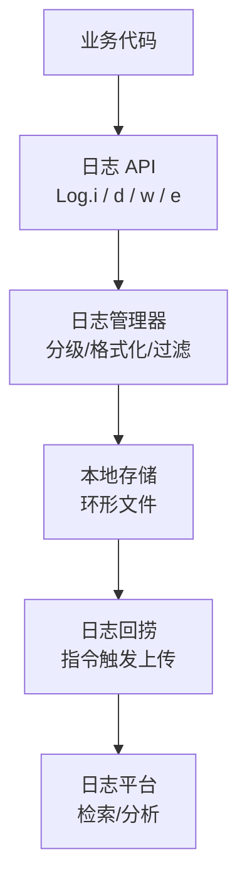

# 日志系统与线上问题排查

> 线上问题无法像本地一样随意断点调试,唯一的武器就是**日志**。一套好的日志系统:采集全面、分级清晰、可回捞、可分析,是稳定性保障的地基。

## 一、日志系统架构



| 组件 | 职责 |
|------|------|
| 日志 API | 统一入口,业务无感 |
| 分级过滤 | debug/info/warn/error,按级别裁剪 |
| 本地存储 | 环形缓冲区,控制体积 |
| 上下文采集 | 版本/机型/页面/网络/时间戳 |
| 回捞机制 | 按设备/用户指令上传 |
| 分析平台 | 检索、聚合、关联 |

## 二、日志分级设计

```kotlin
// 分级:控制采样与存储,error 必存,debug 线上不存
enum class LogLevel(val priority: Int) {
    DEBUG(1), INFO(2), WARN(3), ERROR(4), FATAL(5)
}

object AppLog {
    // 线上级别:WARN(重要信息全保留,debug 丢弃)
    // 开发级别:DEBUG
    @Volatile
    var minLevel = if (BuildConfig.DEBUG) LogLevel.DEBUG else LogLevel.WARN

    fun log(level: LogLevel, tag: String, msg: String, throwable: Throwable? = null) {
        if (level.priority < minLevel.priority) return   // 过滤
        val entry = LogEntry(
            time = System.currentTimeMillis(),
            level = level,
            tag = tag,
            msg = msg,
            thread = Thread.currentThread().name,
            page = PageTracker.currentPage(),   // 当前页面
            throwable = throwable
        )
        // 写本地文件(异步队列,避免阻塞主线程)
        LogWriter.enqueue(entry)
        // 同时输出到 Logcat(debug 环境)
        if (BuildConfig.DEBUG) android.util.Log.println(level.priority, tag, msg)
    }
}
```

## 三、本地存储:环形文件

```kotlin
// 环形缓冲区:固定大小,写满覆盖最旧
// 典型配置:error 日志 5MB 全保留 + 普通日志 20MB 环形
class LogWriter {
    // 文件策略:
    // logs/error.log        — 只存 error,追加不覆盖
    // logs/debug.0.log      — 环形文件,写满轮转 debug.1.log...
    // 每次启动新开一个文件,方便按会话检索
}
```

| 策略 | 说明 |
|------|------|
| 环形覆盖 | 固定体积,写满覆盖最旧,防撑爆存储 |
| 分级存储 | error 单独保留(最重要) |
| 按会话分片 | 每次启动一个文件,便于关联 |
| 压缩归档 | 旧日志 gzip 压缩 |
| 容量控制 | 总体积上限(如 30MB),超限清理 |

## 四、日志回捞

```kotlin
// 回捞场景:某个用户报问题 → 拉取他的本地日志
// 实现方式:推送指令 → App 上传日志

// ① 客户端监听回捞指令(推送通道)
pushManager.onCommand("collect_log") {
    val files = LogStorage.allFiles()
    // 打包上传(带设备/版本/时间范围)
    uploadService.upload(LogPackage(
        deviceId = DeviceInfo.id,
        appVersion = BuildConfig.VERSION_NAME,
        logs = files
    ))
}

// ② 也可支持:崩溃时自动附带最近日志
class CrashHandler : Thread.UncaughtExceptionHandler {
    override fun uncaughtException(t: Thread, e: Throwable) {
        // 崩溃前:把最近 200 条日志打进崩溃上报
        val recent = LogStorage.recent(200)
        CrashReporter.report(t, e, recentLogs = recent)
    }
}
```

> **最佳实践**:崩溃上报自动附带日志上下文,命中率远高于事后回捞;回捞用于疑难杂症(偶现问题、环境问题)。

## 五、日志分析定位

### 5.1 分析维度

| 维度 | 作用 |
|------|------|
| 时间线 | 崩溃/ANR 前发生了什么 |
| 线程 | 主线程卡在哪,子线程在做什么 |
| 页面栈 | 用户操作路径 |
| 网络 | 请求是否失败、超时 |
| 版本/机型 | 是否特定版本/机型问题 |

### 5.2 排查方法论

```text
线上问题排查流程:
1. 复现条件收集:版本 / 机型 / 系统 / 操作路径 / 时间
2. 日志定位:检索 error / fatal 级别日志,定位异常点
3. 时间线还原:异常点前后各 30s 的日志串联
4. 假设验证:根据日志提出假设 → 本地复现 → 验证
5. 修复验证:灰度 → 观察指标 → 全量
```

### 5.3 日志内容规范

```kotlin
// 好日志:有上下文,能独立定位
Log.w("OrderDetail", "加载订单失败, orderId=$orderId, code=${resp.code}, msg=${resp.msg}")

// 坏日志:无信息量
Log.e("TAG", "error!!!")
Log.d("TAG", "load failed")   // 没说是哪个接口、什么参数
```

| 日志要素 | 说明 |
|---------|------|
| 业务标识 | orderId / userId / 请求 ID |
| 上下文 | 页面、参数、网络状态 |
| 关键数据 | 响应码、耗时、重试次数 |
| 时间 | 时间戳 |
| 级别 | 与严重程度匹配 |

## 六、常见问题与排查技巧

| 问题 | 排查手段 |
|------|---------|
| 偶现崩溃 | 崩溃日志 + 日志上下文回捞 |
| 用户反馈卡顿 | 卡顿堆栈采样 + 页面耗时 |
| 数据不同步 | 同步链路日志 + 请求参数对比 |
| 特定机型问题 | 机型维度聚合 + 差异对比 |
| 服务端问题 | 客户端日志 + 服务端日志关联(请求 ID) |

```kotlin
// 分布式追踪:请求 ID 贯穿客户端/服务端
class RequestIdInterceptor : Interceptor {
    override fun intercept(chain: Interceptor.Chain): Response {
        val requestId = UUID.randomUUID().toString()
        Log.i("Net", "请求发起: $requestId ${chain.request().url}")
        val response = chain.proceed(
            chain.request().newBuilder()
                .header("X-Request-Id", requestId)   // 传给服务端
                .build()
        )
        Log.i("Net", "请求完成: $requestId code=${response.code}")
        return response
    }
}
```

## 七、高频面试题

### Q1：线上日志系统如何设计?和 Logcat 有什么区别?
::: details 查看答案
设计:① 统一 API(封装 Log);② 分级过滤(debug 线上不存,error 必存);③ 本地环形文件存储(固定体积,防撑爆);④ 上下文采集(版本/机型/页面/线程/时间);⑤ 回捞机制(推送指令触发上传);⑥ 崩溃自动附日志;⑦ 分析平台。与 Logcat 区别:Logcat 是本地开发工具,线上不可见、无持久化、无采样;自建日志系统是线上可观测的基础,持久化+可回捞+可分析。
:::

### Q2：日志如何做到不撑爆存储、不影响性能?
::: details 查看答案
存储:① 环形缓冲,写满覆盖最旧;② 分级存储(error 单独保留);③ 总容量上限 + 启动清理;④ 压缩归档。性能:① 异步写入(单线程队列,不阻塞主线程);② 分级过滤提前裁剪(debug 线上直接丢弃,减少 IO);③ 批量刷盘(攒批写,减少磁盘 IO);④ 控制单条体积(截断超长日志);⑤ 采样(高频日志按比例记录)。注意:日志 API 本身要轻量(避免字符串拼接耗时),耗时的格式化放异步。
:::

### Q3：用户反馈"我的数据不见了",你如何用日志排查?
::: details 查看答案
排查流程:① 确认上下文:版本、机型、操作路径(在哪个页面、做了什么操作)、时间;② 检索该用户/设备的日志:定位"数据加载/同步/删除"相关日志;③ 时间线还原:异常前后各 30 秒日志,看是否有删除/清空/同步失败操作;④ 网络与请求:请求参数(orderId 等)是否正确、服务端返回是否为空;⑤ 本地存储:Room 操作日志、文件删除日志;⑥ 假设验证:根据日志提出假设,本地复现验证;⑦ 区分"用户误操作"与"代码 bug",用日志证据说话。
:::

### Q4：崩溃上报如何自动附带日志上下文?
::: details 查看答案
实现:① 崩溃时(UncaughtExceptionHandler)同步读取内存中的最近日志(如最近 200 条,内存环形队列,不依赖磁盘 IO);② 与崩溃堆栈、设备信息、页面栈一起打包;③ 异步上传;④ 由于进程即将死亡,可先写本地文件,下次启动补传(更可靠)。内存环形队列:固定容量(如 500 条),新日志覆盖最旧,保证崩溃时能拿到"现场"。收益:崩溃命中率大幅提升,无需回捞即可还原问题现场。
:::

### Q5：如何实现"用户报问题 → 一键拉取日志"?
::: details 查看答案
方案:① 推送通道下发指令(如"collect_log"),带上设备标识/用户标识;② App 收到指令后,从本地日志存储中打包相关日志(按时间范围过滤);③ 上传到日志平台(带设备、版本、时间戳);④ 平台侧与用户反馈关联,展示时间线。进阶:支持**定向回捞**(只捞特定崩溃堆栈相关日志)、**日志级别配置下发**(出问题临时提升采样率,恢复后降低)。安全注意:日志可能含敏感信息,需要脱敏与权限控制。
:::

## 小结

- 日志系统 = 采集 → 分级 → 存储 → 回捞 → 分析 的闭环
- 分级过滤:error 全存,debug 线上丢弃
- 环形文件:固定体积防撑爆,按会话分片
- 崩溃自动附日志上下文,命中率翻倍
- 回捞机制:指令触发,定向拉取
- 好日志有上下文(业务 ID + 参数 + 结果)
- 排查方法论:收集现场 → 时间线还原 → 假设验证

> 进阶阅读：[APM 监控体系建设](/advanced/stability/apm-monitoring.md) | [崩溃监控方案](/advanced/stability/crash-monitoring.md) | [ANR 治理指南](/advanced/stability/anr-guide.md)
