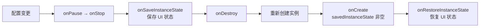
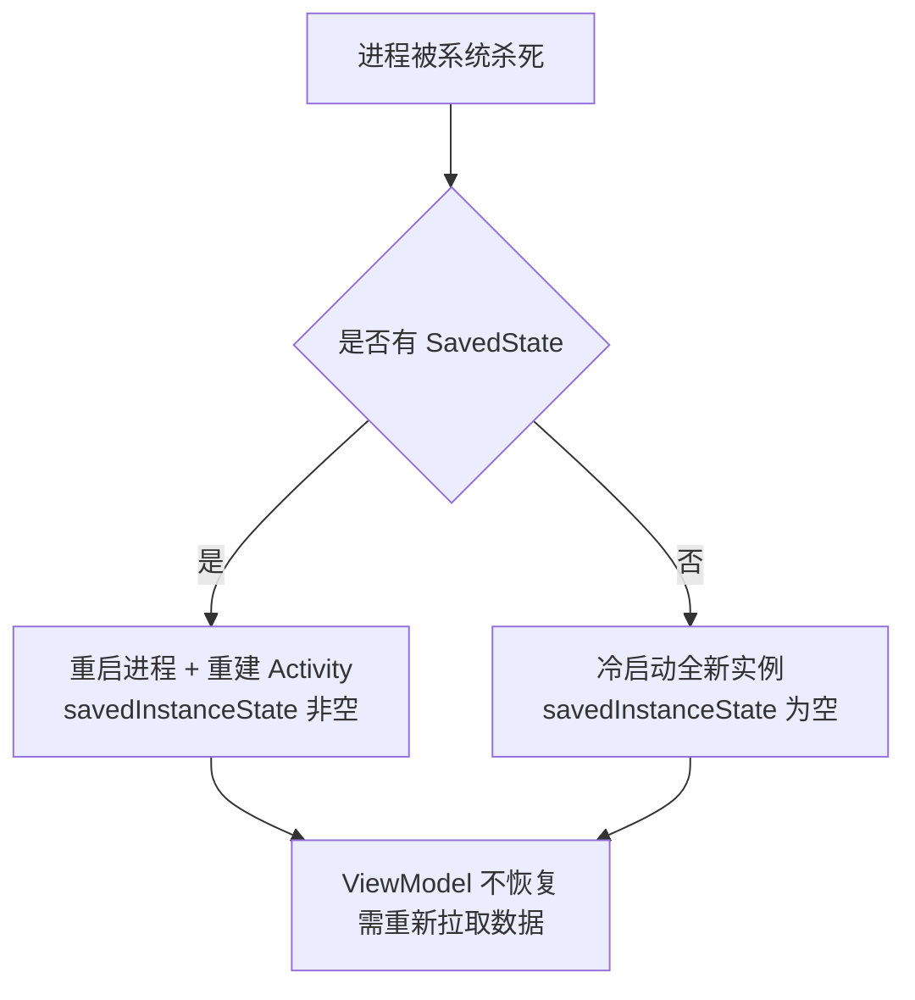

# 配置变更与状态保存详解

> 面试高频指数：高 — 旋转屏幕数据为何丢失、`onSaveInstanceState` 与 `ViewModel` 的分工、`android:configChanges` 的坑，是源码面与实战面的必考点。

## 一、什么是配置变更

**配置变更（Configuration Change）** 指设备运行中发生的、可能导致应用资源重新匹配的系统变化，常见类型：

| 变更类型 | 触发场景 | 对应值 |
|----------|----------|--------|
| 屏幕方向 | 旋转屏幕 | `orientation` |
| 屏幕尺寸 | 分屏/折叠屏 | `screenSize` / `smallestScreenSize` |
| 语言 | 切换系统语言 | `locale` |
| 深色模式 | 切换深浅色 | `uiMode` |
| 键盘 | 外接键盘插拔 | `keyboard` / `keyboardHidden` |
| 字体大小 | 系统字号调整 | `fontScale` |
| 密度 | 屏幕密度变化 | `density` |

### 默认行为：销毁重建

未做任何处理时，配置变更会导致 Activity **销毁并重建**：



这种设计让应用**自动匹配新配置的资源**（横屏布局、深色主题等），代价是重建开销。

## 二、状态保存三件套

### 2.1 onSaveInstanceState

系统在 Activity 可能被销毁前调用，用于保存**轻量 UI 状态**：

```kotlin
override fun onSaveInstanceState(outState: Bundle) {
    super.onSaveInstanceState(outState)
    outState.putString("query", searchInput.text.toString())
    outState.putInt("position", listScrollPosition)
}
```

特点：

- 调用时机：`onStop` 之前（API 28+），**不保证**在 `onDestroy` 前一定调用
- 自动保存：有 id 的 View 的状态（EditText 文本、RecyclerView 滚动位置）由框架自动保存
- 约束：只能存 `Bundle` 支持的类型（基本类型、Serializable、Parcelable、String 等）
- 大数据：不要存大对象（Bitmap、长列表），会触发 `TransactionTooLargeException`

### 2.2 恢复状态

```kotlin
override fun onCreate(savedInstanceState: Bundle?) {
    super.onCreate(savedInstanceState)
    if (savedInstanceState != null) {
        searchInput.setText(savedInstanceState.getString("query"))
    }
}

// 或使用 onRestoreInstanceState（在 onStart 之后调用）
override fun onRestoreInstanceState(savedInstanceState: Bundle) {
    super.onRestoreInstanceState(savedInstanceState)
    listScrollTo(savedInstanceState.getInt("position"))
}
```

### 2.3 View 状态的自动保存

框架会为**带 id 且状态有意义**的 View 自动保存状态，依赖 `View.onSaveInstanceState()` / `View.onRestoreInstanceState()`：

| View | 自动保存内容 |
|------|--------------|
| EditText | 文本内容、光标位置 |
| CheckBox / Switch | 选中状态 |
| RecyclerView | 滚动位置、Adapter 数据 |
| 自定义 View | 需要重写 `onSaveInstanceState` 手动保存 |

> 关键点：View 必须有 **id** 才会参与状态保存（`saveEnabled` 默认 true，`saveFromParentEnabled` 控制父容器是否介入）。

## 三、ViewModel：配置变更下的数据留存

`onSaveInstanceState` 适合存轻量状态，但重量级数据（列表数据、网络结果）应该在 **ViewModel** 中：

```kotlin
class ProfileViewModel : ViewModel() {
    // 配置变更时不会销毁，重建后同一个实例
    val userData = MutableStateFlow<User?>(null)

    fun loadUser(id: String) {
        viewModelScope.launch {
            userData.value = api.fetchUser(id)
        }
    }
}

class ProfileActivity : ComponentActivity() {
    private val viewModel: ProfileViewModel by viewModels()

    override fun onCreate(savedInstanceState: Bundle?) {
        super.onCreate(savedInstanceState)
        // 配置变更后 onCreate 再次调用，但 viewModel 仍是同一个实例
        if (viewModel.userData.value == null) {
            viewModel.loadUser(intent.getStringExtra("user_id") ?: return)
        }
    }
}
```

### 三者的分工对比

| 维度 | onSaveInstanceState | ViewModel | 持久化存储 |
|------|---------------------|-----------|-----------|
| 生命周期 | Activity 销毁前 | Activity 最终销毁前（onCleared） | 独立于生命周期 |
| 存储内容 | 轻量 UI 状态 | 数据 + UI 状态 | 重要数据 |
| 进程被杀 | 可恢复 | **不恢复**（进程死亡丢失） | 可恢复 |
| 体积限制 | Bundle 有限（约 1MB） | 内存中无硬限制 | 磁盘 |
| 典型用途 | 输入框、滚动位置 | 网络数据、复杂状态 | 数据库、SP |

> 完整覆盖策略：**ViewModel 存数据 + onSaveInstanceState 存少量不可推导状态 + 必要时持久化兜底**。进程被系统杀死后，只有后两者能恢复。

## 四、configChanges：跳过重建

通过 `android:configChanges` 声明自己处理某些配置变更，可**跳过销毁重建**：

```xml
<activity
    android:name=".PlayerActivity"
    android:configChanges="orientation|screenSize|uiMode|locale" />
```

此时系统调用 `onConfigurationChanged(newConfig)` 而非销毁：

```kotlin
override fun onConfigurationChanged(newConfig: Configuration) {
    super.onConfigurationChanged(newConfig)
    if (newConfig.orientation == Configuration.ORIENTATION_LANDSCAPE) {
        // 手动调整布局
    }
}
```

### configChanges 的坑

| 坑点 | 说明 |
|------|------|
| 资源不自动切换 | 不会自动加载 `layout-land` 等限定符资源，需手工处理 |
| 新 API 无对应值 | 部分新变更类型没有 configChanges 值，仍会重建 |
| 不解决全部问题 | Fragment 也会重建，但状态保存逻辑需要手工兜底 |
| 滥用风险 | 横竖屏差异大时手工适配成本高、易出 bug |

> 适用场景：视频播放器、游戏、相机预览等**重建代价高**且**横竖屏布局差异不大**的场景；一般页面建议交给系统默认重建 + ViewModel 恢复。

## 五、Fragment 的状态保存

### 5.1 Fragment 的保存机制

Fragment 状态由 FragmentManager 统一管理：

- `onSaveInstanceState`：Fragment 自身轻量状态
- `FragmentManager.saveFragmentInstanceState`：整个 Fragment 的实例状态（含 view state）
- 重建后 `onCreate` 收到 `savedInstanceState`，`getArguments()` 保留构造参数

```kotlin
class DetailFragment : Fragment() {
    private var itemId: Long = -1L

    override fun onCreate(savedInstanceState: Bundle?) {
        super.onCreate(savedInstanceState)
        itemId = savedInstanceState?.getLong("item_id")
            ?: requireArguments().getLong("item_id")
    }

    override fun onSaveInstanceState(outState: Bundle) {
        super.onSaveInstanceState(outState)
        outState.putLong("item_id", itemId)
    }
}
```

### 5.2 重建时序要点

- Fragment 重建顺序：`onAttach → onCreate → onCreateView → onViewCreated → onViewStateRestored → onStart`
- `onViewStateRestored` 是恢复 View 状态的时机，此时子 View 状态已恢复完成
- 嵌套 Fragment 由子 FragmentManager 保存，宿主 Fragment 需调用 `childFragmentManager.saveAllState()`（框架自动处理）

## 六、Process Death 与终极恢复

配置变更只是重建，**进程被杀死**（内存不足、用户划掉后台）是更彻底的场景：



- 系统在杀死进程前保存所有 Activity 的 instance state（`onSaveInstanceState`）
- 从"最近任务"恢复时，`onCreate` 的 `savedInstanceState` 携带之前保存的数据
- ViewModel 不参与进程级恢复（除非用 SavedStateHandle）

### SavedStateHandle：进程死亡也能恢复的 ViewModel

```kotlin
class CartViewModel(
    private val savedStateHandle: SavedStateHandle
) : ViewModel() {
    val cartCount = savedStateHandle.getStateFlow("cart_count", 0)

    fun addItem() {
        savedStateHandle["cart_count"] = (cartCount.value ?: 0) + 1
    }
}
```

> `SavedStateHandle` 将 ViewModel 数据与 SavedStateRegistry 绑定，**进程被杀死也能恢复**，是当前官方推荐的状态保存方式（详见 [SavedStateHandle 详解](/jetpack/lifecycle-viewmodel/savedstate.md)）。

## 七、高频面试题

### Q1：旋转屏幕后 Activity 的生命周期是怎样的？数据如何不丢失？
::: details 查看答案
默认流程：onPause → onSaveInstanceState → onStop → onDestroy → 重建实例 → onCreate(savedInstanceState 非空) → onStart → onRestoreInstanceState → onResume。数据恢复三种手段：① UI 轻量状态用 onSaveInstanceState/onRestoreInstanceState；② 数据用 ViewModel（配置变更不销毁，同一个实例）；③ 需要进程级恢复时用 SavedStateHandle 或持久化存储。
:::

### Q2：onSaveInstanceState 一定能被调用吗？
::: details 查看答案
不保证。系统只在"Activity 可能被销毁且之后可能恢复"时调用，如旋转屏幕、进程被杀死前、按 Home 后系统可能回收。用户主动按返回键退出、调用 finish() 时不会调用，此时保存的状态没有意义。API 28 起调用时机在 onStop 之前，更早版本在 onPause 与 onStop 之间。
:::

### Q3：onSaveInstanceState 和 ViewModel 的职责如何划分？
::: details 查看答案
onSaveInstanceState 存轻量、可序列化、用于恢复 UI 结构的瞬时状态（输入框、滚动位置、当前页签），有体积限制且不适合存对象；ViewModel 存重量级业务数据（列表、网络结果），配置变更时不销毁，但进程被杀死时丢失。职责划分：能推导出的不存，重量级放 ViewModel，进程级恢复依赖 SavedStateHandle。
:::

### Q4：android:configChanges 声明后有哪些副作用？
::: details 查看答案
声明后配置变更不再销毁重建，而是回调 onConfigurationChanged 手动处理，副作用：① 不会自动切换限定符资源（layout-land、values-zh 等），需要手动读取新配置调整；② 不是所有变更类型都有对应值，未声明类型仍会重建；③ 需要自己管理 View 布局适配，代码复杂度上升。适合播放器/游戏等重建代价高的场景，常规页面不建议滥用。
:::

### Q5：为什么 EditText 的内容旋转后不会丢，而自定义 View 的状态会丢？
::: details 查看答案
EditText 是有 id 的 View，框架通过 View.onSaveInstanceState 自动保存文本与光标位置，恢复时通过 id 找到 View 回填。自定义 View 如果不重写 onSaveInstanceState/onRestoreInstanceState 或没有唯一 id，框架无从保存其自定义状态。因此自定义 View 需要：① 分配唯一 id；② 重写状态保存方法；③ 如需保存自定义对象，把对象放入 Bundle（实现 Parcelable/Serializable）。
:::

## 八、小结

配置变更与状态保存是 Android 状态管理的基石：

1. 默认配置变更 = 销毁重建，保证资源正确匹配
2. `onSaveInstanceState` 存轻量 UI 状态，有体积与类型限制
3. `ViewModel` 存数据，配置变更安全，进程死亡需 `SavedStateHandle` 兜底
4. `android:configChanges` 跳过重建但有资源不自动切换的代价，谨慎使用
5. 终极兜底是持久化存储（Room/DataStore/文件）

相关阅读：[Activity 生命周期与启动模式](/android/activity/activity-lifecycle.md)、[ViewModel 源码解析](/jetpack/lifecycle-viewmodel/viewmodel-source.md)、[SavedStateHandle 详解](/jetpack/lifecycle-viewmodel/savedstate.md)、[Activity Result API 详解](/android/activity/activity-result-api.md)。
