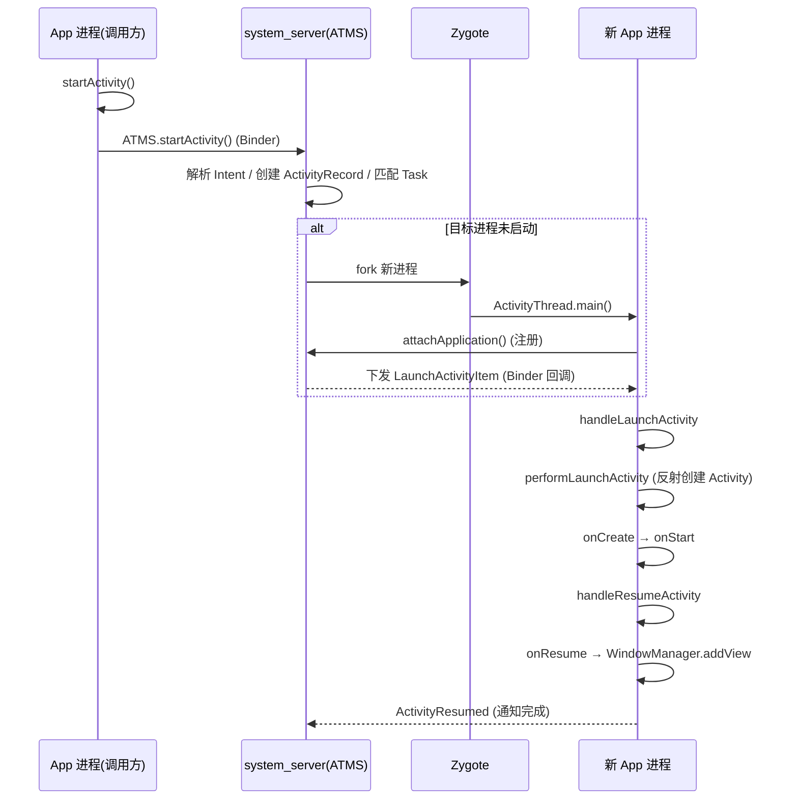

# 🔍 Activity 启动流程源码分析

> 面试高频指数：⭐⭐⭐⭐⭐（大厂必问）
> 本篇文章基于 Android 13（API 33）分析 `startActivity` 到 `onResume` 的完整链路。

## 1. 总体架构

Activity 启动涉及 **App 进程** 与 **系统进程**（system_server）的协作：

```text
调用方进程                           system_server 进程
┌───────────────────┐  Binder IPC   ┌──────────────────────────┐
│ MainActivity      │ ─────────────► │ ActivityTaskManagerService│
│   └─ startActivity│               │   └─ ActivityTaskSupervisor│
│        └─ Instrumentation        │        └─ ActivityRecord    │
│             └─ AMS               │             └─ Task/Stack    │
└───────────────────┘               └──────────────────────────┘
        ▲                                      │ Binder IPC
        │        LauncherThread (新进程)        ▼
┌───────┴───────────────────┐   ┌──────────────────────────┐
│ ActivityThread (App)      │◄──┤ ProcessRecord             │
│   └─ handleLaunchActivity  │   │   └─ Zygote fork          │
│        └─ performLaunch     │   └──────────────────────────┘
└───────────────────────────┘
```

## 2. 启动入口（App 进程内）

### 2.1 startActivity → Instrumentation

```java
// Activity.java
@Override
public void startActivity(Intent intent) {
    startActivityForResult(intent, -1);
}

public void startActivityForResult(Intent intent, int requestCode, Bundle options) {
    // 关键：通过 mInstrumentation 转发
    Instrumentation.ActivityResult ar =
        mInstrumentation.execStartActivity(
            this, mMainThread.getApplicationThread(), mToken, this,
            intent, requestCode, options);
}
```

`Instrumentation.execStartActivity` 内部：

```java
// Instrumentation.java
public ActivityResult execStartActivity(...) {
    try {
        intent.migrateExtraStreamToClipData();
        // 检查是否允许启动（如后台启动限制）
        int result = ActivityTaskManager.getService().startActivity(
            whoThread, who.getOpPackageName(), who.getAttributionTag(),
            intent, ...);
        // 检查启动结果，若失败抛 ActivityNotFoundException 等异常
        checkStartActivityResult(result, intent);
    } catch (RemoteException e) { throw new RuntimeException(...); }
    return null;
}
```

**关键点**：`ActivityTaskManager.getService()` 拿到的是 **ATMS（ActivityTaskManagerService）** 的 Binder 代理，跨进程调用由此开始。

> Android 10（Q）之前是 `ActivityManager.getService()` → **AMS**；之后拆分为 **AMS + ATMS**，
> Activity 启动的职责由 ATMS 接管。面试说"AMS 启动 Activity"依然被接受，但要能指出新架构。

## 3. system_server 侧（ATMS）

### 3.1 startActivity 主链

```java
// ActivityTaskManagerService.java
@Override
public final int startActivity(...) {
    return startActivityAsUser(...);
}

int startActivityAsUser(...) {
    // 权限检查、UID 转换等
    return mActivityTaskSupervisor.startActivityMayWait(...);
}
```

`ActivityTaskSupervisor` 是 **Activity 启动的决策核心**：

```java
// ActivityTaskSupervisor.java
int startActivityMayWait(...) {
    // 1. 解析 Intent（resolveActivity）
    // 2. 校验 ActivityInfo / 权限
    // 3. 交给 startActivity 系列方法
    return startActivity(...);
}
```

核心链路：

1. **解析 Intent** → 找到目标 `ActivityInfo`（通过 `PackageManager.resolveActivity`）
2. **创建 ActivityRecord** → 记录目标 Activity 的元信息
3. **寻找/创建 Task** → 根据 `launchMode` / `taskAffinity` / Flags 决定放入哪个 Task
4. **与栈顶比较** → 若为 `standard` 且栈顶相同，先调用 `onPause`（Android 12+ 改为 **延迟 onPause**）
5. **启动进程** → 若目标进程未启动，走 `ProcessRecord` → `ZygoteProcess.start` fork 新进程
6. **调度 resume** → `mTaskSupervisor.resumeFocusedStackTopActivityLocked()`

### 3.2 进程启动（Zygote）

```java
// Process.java → ZygoteProcess.java
public final Process.ProcessStartResult start(...) {
    return startViaZygote(...);
}
```

Zygote fork 后新进程的入口是 `ActivityThread.main()`：

```java
// ActivityThread.java
public static void main(String[] args) {
    Looper.prepareMainLooper();
    ActivityThread thread = new ActivityThread();
    thread.attach(false, startSeq);   // 关键：向 system_server 注册
    Looper.loop();                     // 进入消息循环
}
```

`attach` 中通过 Binder 向 system_server 的 `ActivityManagerService.attachApplication` 注册自己，
**注册完成后系统才会继续下发 Activity 启动指令**（保证先有 Looper，再执行生命周期）。

## 4. 回到 App 进程（ActivityThread）

### 4.1 handleLaunchActivity

system_server 通过 `ApplicationThread`（App 进程的 Binder 服务端）回调：

```java
// ActivityThread.java
@Override
public void handleLaunchActivity(ActivityClientRecord r, PendingTransactionActions pendingActions, Intent customIntent) {
    // 1. 初始化 Application（首次启动进程时）
    if (!ThreadedRenderer.sRendererEnabled) { ... }
    handleConfigurationChanged(...);

    // 2. 真正创建 Activity
    final Activity a = performLaunchActivity(r, customIntent);
    if (a != null) {
        // 3. 创建窗口并回调 onResume
        handleResumeActivity(r.token, false, r.isForward, !r.activity.mFinished);
    }
}
```

### 4.2 performLaunchActivity（核心方法）

```java
// ActivityThread.java
private Activity performLaunchActivity(ActivityClientRecord r, Intent customIntent) {
    // 1. 创建 ContextImpl（资源、主题、ClassLoader）
    ContextImpl appContext = createBaseContextForActivity(r);
    // 2. 实例化 Activity（反射）
    Activity activity = mInstrumentation.newActivity(cl, component.getClassName(), r.intent);
    // 3. 创建 Application（首次）
    Application app = r.packageInfo.makeApplication(false, mInstrumentation);
    // 4. 绑定 Context，调用 attach
    activity.attach(appContext, this, getInstrumentation(), r.token, ...);
    // 5. 回调 onCreate / onStart / onRestoreInstanceState
    if (r.isPersistable()) {
        mInstrumentation.callActivityOnCreate(activity, r.state, r.persistentState);
    } else {
        mInstrumentation.callActivityOnCreate(activity, r.state);
    }
    // ...
    r.activity = activity;
    return activity;
}
```

**生命周期回调的幕后**：`Instrumentation.callActivityOnCreate` 最终调用 `activity.performCreate` → `activity.onCreate`。
从这里能看到：**Activity 实例是反射创建的**，`attach` 完成 Context 注入，`onCreate` 由 Instrumentation 触发。

### 4.3 handleResumeActivity

```java
public void handleResumeActivity(ActivityClientRecord r, ...) {
    // 1. 回调 onResume（performResumeActivity → activity.onResume）
    // 2. 创建 PhoneWindow 并添加 DecorView 到 WindowManager
    if (r.window == null && !a.mFinished && willBeVisible) {
        r.window = r.activity.getWindow();
        View decor = r.window.getDecorView();
        ViewManager wm = a.getWindowManager();
        wm.addView(decor, r.window.getAttributes());  // 此时界面才可见
        a.onWindowAttributesChanged(l);
    }
    // 3. 通知 AMS：onResume 完成
    Looper.myQueue().addIdleHandler(new Idler());
}
```

**关键点**：`onResume` 回调发生在 `WindowManager.addView` **之前**，所以 `onResume` 时视图已创建但尚未真正绘制到屏幕。

## 5. 完整时序图



## 6. 高频面试题

**Q1：startActivity 的完整链路？**
A：`startActivity → Instrumentation.execStartActivity → ATMS.startActivity（Binder）→
ActivityTaskSupervisor 解析/决策 → 进程启动（Zygote fork + ActivityThread.main + attachApplication）→
system_server 回调 handleLaunchActivity → performLaunchActivity（反射 + attach + onCreate）→
handleResumeActivity（onResume + WindowManager.addView）。全程两次跨进程、一次跨进程创建。

**Q2：为什么进程要先 attach 再启动 Activity？**
A：`attachApplication` 让 system_server 持有 App 进程的 `ApplicationThread` Binder 引用，
同时确保主线程 Looper 已就绪；只有注册完成后，系统才会通过 Binder 回调下发
`LaunchActivityItem`，否则消息无法投递。

**Q3：onCreate 里能拿到 View 的宽高吗？为什么？**
A：不能直接拿到。`onResume` 之前 `DecorView` 尚未 `addView` 到 WindowManager，没有经过
`measure/layout/draw`，所以宽高为 0。需要宽高应使用 `View.post{}`、`ViewTreeObserver` 或 `onWindowFocusChanged`。

**Q4：AMS 和 ATMS 什么关系？**
A：Android 10 起 Activity 相关职责从 AMS 拆分到 **ActivityTaskManagerService**（ATMS）。
AMS 负责进程/服务/内存等，ATMS 负责 Activity/Task/Stack 管理。`ActivityTaskManager.getService()`
返回 ATMS 的 Binder 代理。

**Q5：冷启动过程中哪些阶段耗时最大？**
A：① 进程创建（Zygote fork + Application init）；② `Application.onCreate`（业务初始化）；
③ `Activity.onCreate/onStart/onResume`（布局 inflate + 首帧绘制）。性能优化通常从这四段入手。

## 7. 小结

- 启动链路 = **App 进程 → ATMS（跨进程）→ 进程启动 → 回调 App 进程** 的两次跨进程闭环。
- 决策在 system_server（ATMS/Supervisor），执行在 App 进程（ActivityThread/Instrumentation）。
- 高频考点：时序、反射创建、attach 时机、onResume 与首帧的关系、AMS/ATMS 拆分。
