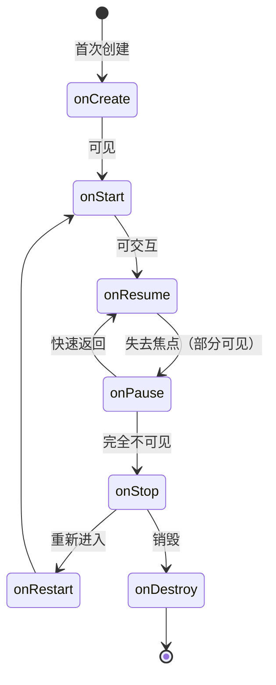
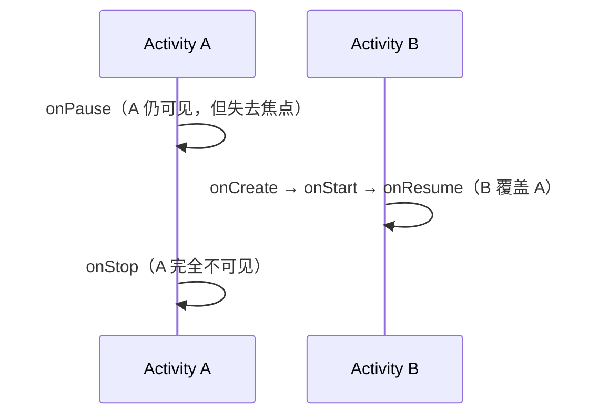
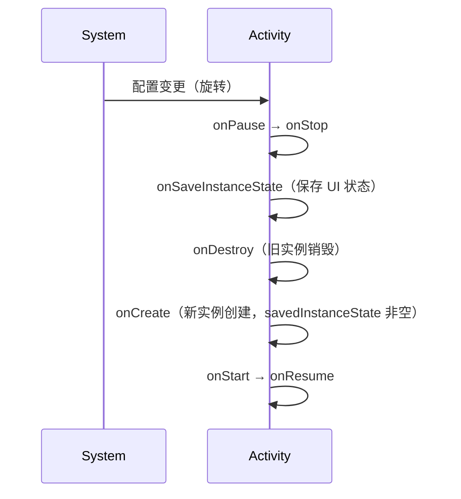
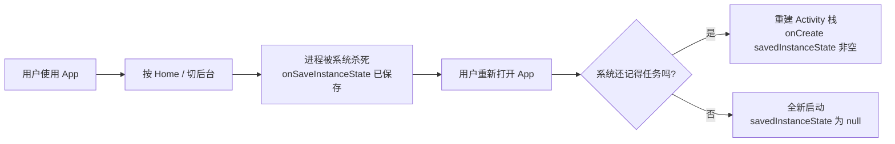
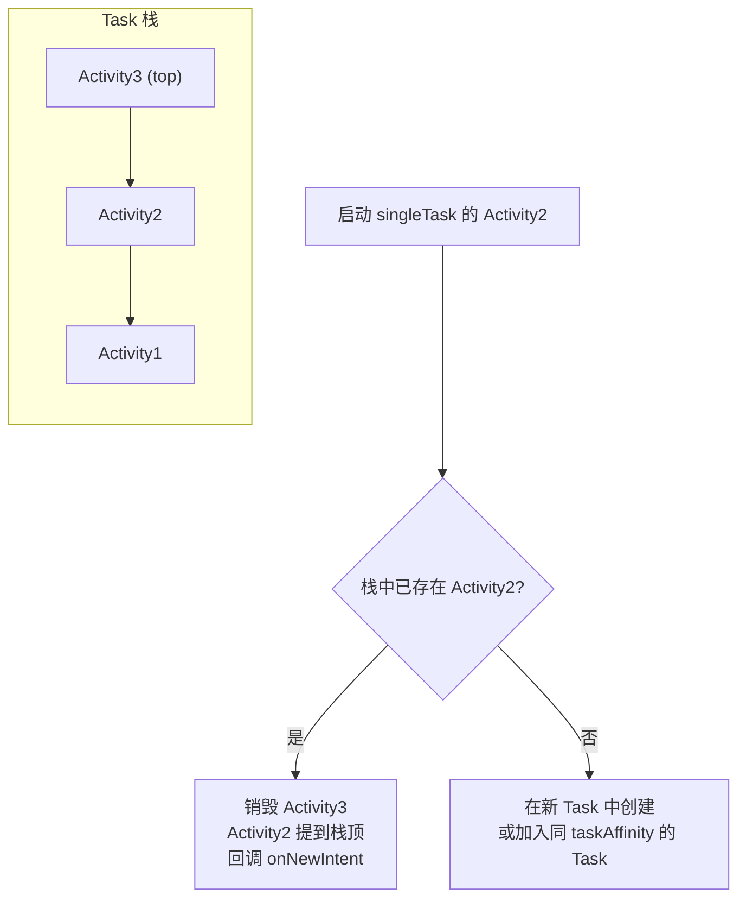

# Activity 生命周期与启动模式

> Activity 是 Android 四大组件之首，承载用户交互界面。理解生命周期回调的**时机与顺序**、**状态保存机制**以及**启动模式对任务栈的影响**，是 Android 开发的基本功，也是面试中最高频的考点之一。

## 一、生命周期全景图



生命周期回调可以划分为三个"阶段"来记忆：

| 阶段 | 回调 | 含义 |
|------|------|------|
| **创建** | `onCreate` → `onStart` → `onResume` | Activity 从无到有，直到可交互 |
| **运行** | `onResume` ↔ `onPause` ↔ `onStop` | 前台/部分可见/完全不可见之间切换 |
| **销毁** | `onStop` → `onDestroy` | 资源释放，Activity 生命周期结束 |

## 二、七个核心回调逐一详解

| 回调 | 触发时机 | 典型操作 | 注意事项 |
|------|----------|----------|----------|
| `onCreate` | 首次创建，**整个生命周期只调用一次** | `setContentView`、初始化 ViewModel、绑定点击事件、初始化数据 | 不要在这里做耗时操作；`savedInstanceState` 可能为 null（首次启动） |
| `onStart` | 即将对用户可见 | 注册广播/观察者、初始化相机等独占资源 | Activity 可见但还未在前台，无法交互 |
| `onResume` | 进入前台，可交互 | 开始动画、恢复传感器监听、开始轮询 | 用户按下 Home 再返回会再次回调；**生命周期中最重要的前台标志** |
| `onPause` | 部分可见/失去焦点（如弹窗、来电话） | 暂停动画、暂停视频播放、释放独占资源 | **不能做耗时操作**——系统保证 `onPause` 执行完后新 Activity 才显示；此时仍可见 |
| `onStop` | 完全不可见 | 停止后台任务、保存草稿数据、注销广播 | 进程可能在此阶段被系统杀死，适合做持久化 |
| `onRestart` | 从 `onStop` 回到前台之前 | 恢复被暂停的资源状态 | 只在"停止后重新可见"时调用，位于 `onStart` 之前 |
| `onDestroy` | Activity 销毁（用户返回或系统回收） | 释放全部资源、解绑 Service、注销动态 Receiver | 区分"正常销毁"（`isFinishing`）与"非正常销毁"（配置变更/内存回收） |

### 关键认知：onPause 与 onStop 的本质区别



- `onPause` 时 Activity **依然可见**（例如被透明 Activity、Dialog 部分遮挡），只是不能交互。
- `onStop` 时 Activity **完全不可见**。
- **`onPause` 必须轻量**：系统会等待 `onPause` 返回后才让新 Activity 绘制，耗时操作会拖慢页面切换。

## 三、典型场景回调顺序速查表

| 场景 | 回调顺序 |
|------|----------|
| 首次启动 | `onCreate → onStart → onResume` |
| 打开新 Activity（A → B） | `A.onPause → B.onCreate → B.onStart → B.onResume → A.onStop` |
| 从 B 返回 A | `B.onPause → A.onRestart → A.onStart → A.onResume → B.onStop → B.onDestroy` |
| 按返回键退出 | `onPause → onStop → onDestroy` |
| 按 Home 键 | `onPause → onStop`（**不销毁**，进程保留） |
| 从最近任务回来 | `onRestart → onStart → onResume` |
| 屏幕旋转（配置变更） | `onPause → onStop → onDestroy → onCreate → onStart → onResume` |
| 来电（电话应用全屏） | `onPause → onStop`；挂断后 `onRestart → onStart → onResume` |
| 弹 Dialog（非全屏） | 仅 `onPause`（Dialog 不是 Activity，Activity 仍可见） |
| 内存不足被系统回收 | `onPause → onStop → onSaveInstanceState`（随后进程被杀，**无 onDestroy**） |

::: warning 注意
被系统回收时 **不会回调 `onDestroy`**，只会回调 `onSaveInstanceState` 让你保存状态。把"释放资源"写在 `onDestroy` 里并不可靠——关键资源应在 `onStop` 处理。
:::

## 四、配置变更与状态保存

### 4.1 屏幕旋转时发生了什么



默认行为：配置变更（旋转、语言切换、字体大小、深色模式）会导致 Activity **销毁重建**，这是设计使然——让 Activity 以新配置重新布局。

### 4.2 onSaveInstanceState 的时机

`onSaveInstanceState` 在**可能被销毁前**调用，用于保存 UI 状态。触发时机：

1. 用户按 Home 键（进程可能被回收）
2. 按返回键退到桌面后进入最近任务列表
3. 屏幕旋转等配置变更
4. 内存不足杀进程前

::: code-tabs

@tab:active Java

```java
@Override
protected void onSaveInstanceState(Bundle outState) {
    super.onSaveInstanceState(outState);
    // 保存轻量 UI 状态
    outState.putString("input", binding.editInput.getText().toString());
    outState.putInt("scroll_position", binding.recyclerView.computeVerticalScrollOffset());
}

@Override
protected void onRestoreInstanceState(Bundle savedInstanceState) {
    super.onRestoreInstanceState(savedInstanceState);
    // onStart 之后调用，此时视图已可用
    binding.editInput.setText(savedInstanceState.getString("input"));
}
```

@tab Kotlin

```kotlin
override fun onSaveInstanceState(outState: Bundle) {
    super.onSaveInstanceState(outState)
    // 保存轻量 UI 状态
    outState.putString("input", binding.editInput.text.toString())
    outState.putInt("scroll_position", binding.recyclerView.computeVerticalScrollOffset())
}

override fun onRestoreInstanceState(savedInstanceState: Bundle) {
    super.onRestoreInstanceState(savedInstanceState)
    // onStart 之后调用，此时视图已可用
    binding.editInput.setText(savedInstanceState.getString("input"))
}
```

:::

::: tip 常见误区
- **`onSaveInstanceState` 不一定在 `onPause` 之后调用**（Android 12 起在 `onStop` 之后、`onStart` 之前调用）；切勿依赖调用顺序，只需保证在 `onStop` 前完成状态保存。
- **不要在 `onSaveInstanceState` 中保存大量数据**——Bundle 跨进程传输有 1MB 左右的 Binder 事务上限（Android 8.0 前约 500KB），超限抛 `TransactionTooLargeException`。大数据用 `ViewModel` 或本地持久化。
- `onRestoreInstanceState` 在 `onStart` 之后、`onResume` 之前回调，**此时视图已创建完成**，可直接操作 UI。
:::

### 4.3 用 ViewModel 跨配置保留数据（推荐）

`onSaveInstanceState` 适合保存"轻量 UI 状态"，但业务数据应放 `ViewModel`——它**跨配置变更存活**（旋转不销毁），且不受 Binder 大小限制：

::: code-tabs

@tab:active Java

```java
class ProfileViewModel extends ViewModel {
    private final MutableStateFlow<User> _user = new MutableStateFlow<>(null);
    private final StateFlow<User> user = _user.asStateFlow();

    void loadUser(String id) {
        viewModelScope.launch(() -> _user.setValue(repository.fetchUser(id)));
    }
}

class ProfileActivity extends AppCompatActivity {
    private final ProfileViewModel viewModel =
            new ViewModelProvider(this).get(ProfileViewModel.class);

    @Override
    protected void onCreate(Bundle savedInstanceState) {
        super.onCreate(savedInstanceState);
        if (savedInstanceState == null) {
            viewModel.loadUser(getIntent().getStringExtra("id"));
        }
        // 旋转后 viewModel.user 仍在，无需重新加载
        lifecycleScope.launch(() -> {
            repeatOnLifecycle(Lifecycle.State.STARTED, () -> {
                viewModel.user.collect(user -> renderUser(user));
            });
        });
    }
}
```

@tab Kotlin

```kotlin
class ProfileViewModel : ViewModel() {
    private val _user = MutableStateFlow<User?>(null)
    val user: StateFlow<User?> = _user.asStateFlow()

    fun loadUser(id: String) {
        viewModelScope.launch {
            _user.value = repository.fetchUser(id)
        }
    }
}

class ProfileActivity : AppCompatActivity() {
    private val viewModel: ProfileViewModel by viewModels()

    override fun onCreate(savedInstanceState: Bundle?) {
        super.onCreate(savedInstanceState)
        if (savedInstanceState == null) {
            viewModel.loadUser(intent.getStringExtra("id")!!)
        }
        // 旋转后 viewModel.user 仍在，无需重新加载
        lifecycleScope.launch {
            repeatOnLifecycle(Lifecycle.State.STARTED) {
                viewModel.user.collect { renderUser(it) }
            }
        }
    }
}
```

:::

### 4.4 SavedStateHandle：两者结合的官方方案

`SavedStateHandle` 由 `ViewModel` 构造器注入，既能跨配置存活，又能在**进程被系统杀死**后通过 `onSaveInstanceState` 机制恢复：

::: code-tabs

@tab:active Java

```java
class ProfileViewModel extends ViewModel {
    private final SavedStateHandle savedStateHandle;
    // 读取：进程被杀重建后自动恢复
    private final String userId;

    ProfileViewModel(SavedStateHandle savedStateHandle) {
        this.savedStateHandle = savedStateHandle;
        Object saved = savedStateHandle.get("userId");
        this.userId = saved != null ? (String) saved : "default";
    }

    void saveUserId(String id) {
        savedStateHandle.set("userId", id);   // 自动触发保存
    }
}

class ProfileActivity extends AppCompatActivity {
    private final ProfileViewModel viewModel =
            new ViewModelProvider(this).get(ProfileViewModel.class);
    // 无需手动调用 onSaveInstanceState，SavedStateHandle 自动工作
}
```

@tab Kotlin

```kotlin
class ProfileViewModel(private val savedStateHandle: SavedStateHandle) : ViewModel() {
    // 读取：进程被杀重建后自动恢复
    val userId: String = savedStateHandle["userId"] ?: "default"

    fun saveUserId(id: String) {
        savedStateHandle["userId"] = id   // 自动触发保存
    }
}

class ProfileActivity : AppCompatActivity() {
    private val viewModel: ProfileViewModel by viewModels()
    // 无需手动调用 onSaveInstanceState，SavedStateHandle 自动工作
}
```

:::

> 依赖注入：`ViewModelProvider.Factory` 通过 `SavedStateViewModelFactory` 自动注入 `SavedStateHandle`，用 `by viewModels()` 即可，无需手动创建。

## 五、进程被杀死后的恢复



- 系统会在 `ActivityManager` 侧**记住任务栈**（Recents 列表），进程被杀后重新进入会按"栈底 → 栈顶"重建所有 Activity。
- `onCreate` 的 `savedInstanceState != null` 即代表"从死亡状态恢复"，可用于区分首次启动。

## 六、四种启动模式（Launch Mode）

启动模式决定：**① 是否创建新实例；② 进入哪个任务栈（Task）**。在 Manifest 中声明：

```xml
<activity
    android:name=".MainActivity"
    android:launchMode="singleTask"
    android:taskAffinity="com.example.main" />
```

### 6.1 standard（默认）

- 每次启动都创建**新实例**，压入发起者的 Task。
- 同一个 Activity 可同时存在多个实例（如 Activity A → A → A）。

### 6.2 singleTop

- **栈顶已是该实例** → 复用并回调 `onNewIntent`；
- 不在栈顶 → 行为同 `standard`（创建新实例）。

::: code-tabs

@tab:active Java

```java
class NotificationDetailActivity extends AppCompatActivity {
    @Override
    protected void onNewIntent(Intent intent) {
        super.onNewIntent(intent);
        setIntent(intent);              // 更新 intent，后续 getIntent() 返回新值
        refreshContent(intent.getStringExtra("id"));
    }
}
```

@tab Kotlin

```kotlin
class NotificationDetailActivity : AppCompatActivity() {
    override fun onNewIntent(intent: Intent) {
        super.onNewIntent(intent)
        setIntent(intent)              // 更新 intent，后续 getIntent() 返回新值
        refreshContent(intent.getStringExtra("id"))
    }
}
```

:::

**典型场景**：通知栏连续点击跳转、搜索页重复提交——避免栈中堆积大量相同页面。

### 6.3 singleTask（最重要）



- 目标 Task 中**已存在实例** → 销毁其上方所有 Activity，把该实例提到栈顶并回调 `onNewIntent`（**不会走 onCreate**）。
- 不存在 → 在**新 Task**（或指定 `taskAffinity` 的 Task）中创建。
- 栈内**唯一实例**。

**典型场景**：App 主界面、底部 Tab 容器（微信主界面）、从通知栏拉起 App 主页。

### 6.4 singleInstance

- Activity 所在 Task **只能有它一个实例**，后续启动的其他 Activity 进入另一个 Task。
- 该 Task 始终只有这一个 Activity，不共享栈。

**典型场景**：来电界面、闹钟响铃（全局唯一、独立窗口，不被其他页面覆盖）。

### 6.5 启动模式对比表

| 模式 | 是否新实例 | 所在 Task | `onNewIntent` 触发条件 |
|------|-----------|-----------|------------------------|
| standard | 总是 | 发起者 Task | 永不 |
| singleTop | 栈顶复用 | 发起者 Task | 已在栈顶 |
| singleTask | 复用已有实例 | 新 Task 或指定 Task | 已存在于目标 Task |
| singleInstance | 全局唯一 | 独占 Task | 已存在 |

### 6.6 onNewIntent 完整调用顺序

```text
复用已存在实例时：onNewIntent → onRestart → onStart → onResume
（不会重新执行 onCreate / onStart 前的流程）
```

## 七、Intent Flags：动态指定启动模式

Flags 在运行时动态指定，**优先级高于 Manifest 配置**：

::: code-tabs

@tab:active Java

```java
Intent intent = new Intent(this, DetailActivity.class);
intent.setFlags(Intent.FLAG_ACTIVITY_NEW_TASK |
        Intent.FLAG_ACTIVITY_CLEAR_TOP |
        Intent.FLAG_ACTIVITY_SINGLE_TOP);
startActivity(intent);
```

@tab Kotlin

```kotlin
val intent = Intent(this, DetailActivity::class.java).apply {
    flags = Intent.FLAG_ACTIVITY_NEW_TASK or
        Intent.FLAG_ACTIVITY_CLEAR_TOP or
        Intent.FLAG_ACTIVITY_SINGLE_TOP
}
startActivity(intent)
```

:::

| Flag | 作用 | 等价关系 |
|------|------|----------|
| `FLAG_ACTIVITY_NEW_TASK` | 在新 Task 中启动 | 类似 singleTask |
| `FLAG_ACTIVITY_CLEAR_TOP` | 销毁目标上方所有 Activity，把目标提到栈顶 | 配合 SINGLE_TOP 走 onNewIntent |
| `FLAG_ACTIVITY_SINGLE_TOP` | 栈顶复用 | 等价 singleTop |
| `FLAG_ACTIVITY_CLEAR_TASK` | 启动前清空目标 Task（须配合 NEW_TASK） | 退出登录回到登录页 |
| `FLAG_ACTIVITY_EXCLUDE_FROM_RECENTS` | 不出现在最近任务 | 中转页、分享页 |

::: danger 高频错误
**从非 Activity 上下文（ApplicationContext / Service）启动 Activity 时，必须加 `FLAG_ACTIVITY_NEW_TASK`**，否则抛 `android.util.AndroidRuntimeException`。因为 Activity 需要 Task 环境，而非 Activity 上下文没有 Task 归属。
:::

**经典组合：退出登录清空栈**

::: code-tabs

@tab:active Java

```java
Intent intent = new Intent(this, LoginActivity.class);
intent.setFlags(Intent.FLAG_ACTIVITY_NEW_TASK | Intent.FLAG_ACTIVITY_CLEAR_TASK);
startActivity(intent);
// 旧栈全部销毁，登录页成为新栈根，按返回键直接退出 App
```

@tab Kotlin

```kotlin
val intent = Intent(this, LoginActivity::class.java).apply {
    flags = Intent.FLAG_ACTIVITY_NEW_TASK or Intent.FLAG_ACTIVITY_CLEAR_TASK
}
startActivity(intent)
// 旧栈全部销毁，登录页成为新栈根，按返回键直接退出 App
```

:::

## 八、现代生命周期实践：Lifecycle 组件

从 AndroidX 开始，官方推荐用 **Lifecycle 感知组件**替代手工管理生命周期，避免 `onResume/onPause` 中遗漏注册/注销：

::: code-tabs

@tab:active Java

```java
// 1. 生命周期感知的观察者
class MyObserver implements DefaultLifecycleObserver {
    private final Runnable callback;

    MyObserver(Runnable callback) {
        this.callback = callback;
    }

    @Override
    public void onStart(LifecycleOwner owner) {
        super.onStart(owner);
        callback.run();  // 注册资源
    }

    @Override
    public void onStop(LifecycleOwner owner) {
        super.onStop(owner);
        // 注销资源
    }
}
lifecycle.addObserver(new MyObserver(() -> startSensor()));

// 2. lifecycleScope + repeatOnLifecycle：UI 状态收集的官方推荐写法
lifecycleScope.launch(() -> {
    repeatOnLifecycle(Lifecycle.State.STARTED, () -> {
        viewModel.uiState.collect(state -> render(state));   // 只在 STARTED 之后收集，自动停止
    });
});
```

@tab Kotlin

```kotlin
// 1. 生命周期感知的观察者
class MyObserver(private val callback: () -> Unit) : DefaultLifecycleObserver {
    override fun onStart(owner: LifecycleOwner) {
        super.onStart(owner)
        callback()  // 注册资源
    }
    override fun onStop(owner: LifecycleOwner) {
        super.onStop(owner)
        // 注销资源
    }
}
lifecycle.addObserver(MyObserver { startSensor() })

// 2. lifecycleScope + repeatOnLifecycle：UI 状态收集的官方推荐写法
lifecycleScope.launch {
    repeatOnLifecycle(Lifecycle.State.STARTED) {
        viewModel.uiState.collect { render(it) }   // 只在 STARTED 之后收集，自动停止
    }
}
```

:::

| 写法 | 行为 |
|------|------|
| `lifecycleScope.launch` | Activity 销毁时自动取消协程 |
| `repeatOnLifecycle(STARTED)` | 离开 STARTED 停止收集，回到 STARTED 重新开始 |
| `viewLifecycleOwner` | Fragment 专用，View 销毁即取消 |

## 九、常见坑点清单

1. **在 `onCreate` 中测量 View 宽高为 0**：此时 DecorView 尚未 addView 到 WindowManager。用 `view.post {}`、`ViewTreeObserver.OnGlobalLayoutListener` 或 `onWindowFocusChanged`。
2. **`onPause` 中做耗时操作**：拖慢页面切换（系统等待其返回才绘制新页面）。耗时操作移到 `onStop` 或协程。
3. **单例/静态变量持有 Activity**：内存泄漏经典场景。长生命周期对象用 `applicationContext`。
4. **`getIntent()` 返回旧数据**：复用实例时（onNewIntent）忘了 `setIntent(intent)`。
5. **Activity 被回收后恢复逻辑重复执行**：用 `savedInstanceState == null` 区分首次创建与重建。
6. **忘记注销广播/观察者**：在 `onStop`/`onDestroy` 中成对注销。

## 十、面试高频追问（带详解）

**Q1：`onPause` 与 `onStop` 的区别？**
A：`onPause` 时 Activity 仍部分可见（被遮挡或失焦），`onStop` 时完全不可见。`onPause` 必须轻量——系统要等它返回后才显示新页面；`onStop` 可以做持久化等较重操作（但进程可能随后被杀）。

**Q2：`singleTask` 复用实例时 `onNewIntent` 与生命周期回调的顺序？**
A：`onNewIntent → onRestart → onStart → onResume`，不会重新走 `onCreate`。栈内目标实例上方的 Activity 会被销毁。

**Q3：进程被系统杀死会回调哪些方法？**
A：`onPause → onStop → onSaveInstanceState`（可能不完整），**不会回调 `onDestroy`**。恢复时通过 `savedInstanceState` 重建。

**Q4：为什么 `onSaveInstanceState` 之后不能再 `commit` Fragment 事务？**
A：状态保存完成后系统不再记录 UI 变更，此时提交事务会导致恢复时状态不一致，直接抛 `IllegalStateException`。提交前判断 `isStateSaved`。

**Q5：`onCreate` 里能拿到 View 宽高吗？为什么？**
A：不能。`onResume` 之前 View 尚未测量绘制，宽高为 0。需在布局完成后（`View.post` / 监听布局回调 / `onWindowFocusChanged`）获取。

**Q6：启动模式如何选择？**
A：页面可重复进入（列表详情）用 `standard`；通知/推送跳转用 `singleTop` 防堆叠；App 主界面/首页用 `singleTask`；系统级全局窗口（来电）用 `singleInstance`。

**Q7：ViewModel 与 onSaveInstanceState 如何选？**
A：业务数据用 `ViewModel`（跨配置变更、无 Binder 大小限制）；轻量 UI 状态（输入框文本、滚动位置）用 `onSaveInstanceState`；两者都想要用 `SavedStateHandle`。

**Q8：配置变更一定会销毁重建吗？如何避免？**
A：默认是。可通过 `android:configChanges="orientation|screenSize"` 让 Activity 自行处理（不销毁，回调 `onConfigurationChanged`），但**不推荐**——它会绕过系统资源重载逻辑，应优先用 ViewModel + 正确处理重建。

## 十一、小结

- 生命周期 = 创建/运行/销毁三阶段，核心是理解 **onPause 轻量**、**onStop 持久化**、**onDestroy 不一定执行**。
- 状态保存三件套：`onSaveInstanceState`（轻量 UI）+ `ViewModel`（业务数据）+ `SavedStateHandle`（两者兼得）。
- 启动模式四兄弟，重点掌握 `singleTask` 的"清栈 + onNewIntent"行为与 Flags 的优先级。
- 现代开发用 Lifecycle 组件替代手工生命周期管理。

> 进阶阅读：[Activity 任务栈与返回栈](task-stack.md) | [Activity 启动流程源码分析](activity-launch-process.md) | [Fragment 生命周期与通信](/android/fragment/fragment-basics.md)
