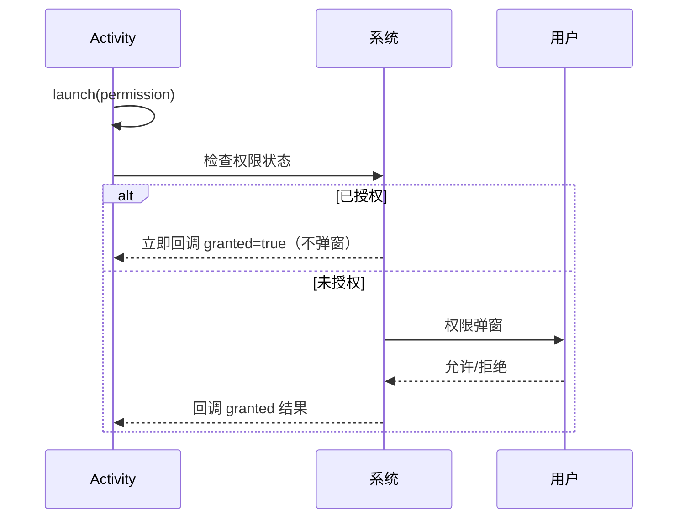
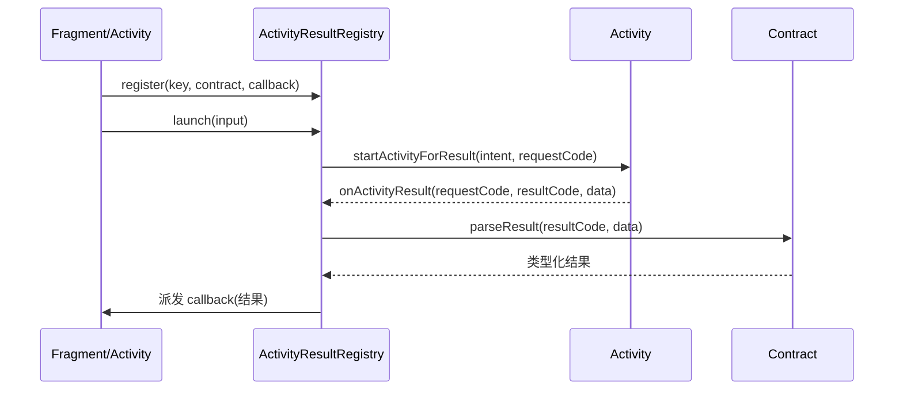

# Activity Result API 详解

> 面试高频指数：高 — 从 `startActivityForResult` 的演进史到 `registerForActivityResult` 的源码实现，覆盖权限申请、拍照选图、文件选择等全部回调场景。

## 一、为什么要引入 Activity Result API

### 1.1 旧方案的问题

早期 Android 使用 `startActivityForResult()` + `onActivityResult()` 处理跨页面回调，存在明显缺陷：

| 问题 | 说明 |
|------|------|
| 回调与请求解耦 | 所有请求的结果都堆在同一个 `onActivityResult`，多请求时靠 `requestCode` 手工分发 |
| requestCode 冲突 | 请求码超过 65536 会崩溃（`IllegalArgumentException`） |
| 无法感知生命周期 | 回调可能发生在 Fragment/Activity 已经不可见之后 |
| 嵌套 Fragment 分发 | 每个层级都要手工转发结果 |
| 类型不安全 | `data` 需要手工强转，判空逻辑散落各处 |

### 1.2 新 API 的设计目标

`registerForActivityResult()` 是 AndroidX Activity 1.2.0+ 提供的官方替代方案，核心设计：

- **回调与请求绑定**：注册时即指定回调，发起请求时无需再关心结果分发
- **契约（Contract）驱动**：输入参数、输出类型都通过 `ActivityResultContract` 类型化约束
- **生命周期安全**：回调在 `LifecycleOwner` 处于 `STARTED` 之后才派发
- **无需 requestCode**：系统自动管理请求编号

::: code-tabs

@tab:active Java

```java
// 旧写法
startActivityForResult(intent, REQUEST_CODE);
@Override
protected void onActivityResult(int requestCode, int resultCode, Intent data) {
    if (requestCode == REQUEST_CODE && resultCode == RESULT_OK) {
        Uri uri = data != null ? data.getData() : null;  // 手工解析
    }
}

// 新写法
private final ActivityResultLauncher<String> launcher = registerForActivityResult(
        new ActivityResultContracts.GetContent(),
        uri -> {
            // 类型安全：直接拿到 Uri
            if (uri != null) loadImage(uri);
        }
);
```

@tab Kotlin

```kotlin
// 旧写法
startActivityForResult(intent, REQUEST_CODE)
override fun onActivityResult(requestCode: Int, resultCode: Int, data: Intent?) {
    if (requestCode == REQUEST_CODE && resultCode == RESULT_OK) {
        val uri = data?.data  // 手工解析
    }
}

// 新写法
private val launcher = registerForActivityResult(
    ActivityResultContracts.GetContent()
) { uri: Uri? ->
    // 类型安全：直接拿到 Uri
    if (uri != null) loadImage(uri)
}
```

:::

## 二、核心 API 与注册时机

### 2.1 registerForActivityResult

::: code-tabs

@tab:active Java

```java
class MainActivity extends ComponentActivity {
    // 属性初始化阶段注册（推荐）
    private final ActivityResultLauncher<String[]> openDocument = registerForActivityResult(
            new ActivityResultContracts.OpenDocument(),
            uri -> handleDocument(uri)
    );

    @Override
    protected void onCreate(Bundle savedInstanceState) {
        super.onCreate(savedInstanceState);
        btn.setOnClickListener(v -> openDocument.launch(new String[]{"text/*"}));
    }
}
```

@tab Kotlin

```kotlin
class MainActivity : ComponentActivity() {
    // 属性初始化阶段注册（推荐）
    private val openDocument = registerForActivityResult(
        ActivityResultContracts.OpenDocument()
    ) { uri: Uri? -> handleDocument(uri) }

    override fun onCreate(savedInstanceState: Bundle?) {
        super.onCreate(savedInstanceState)
        btn.setOnClickListener { openDocument.launch(arrayOf("text/*")) }
    }
}
```

:::

### 2.2 为什么必须在 onCreate 之前注册

`registerForActivityResult` 的注册状态在 **Fragment/Activity 重建时会自动恢复**（由 ActivityResultRegistry 保存），所以：

- 必须**在 Activity 的 `onCreate` 之前**（属性初始化阶段）完成注册
- 若在 `onCreate` 之后（如按钮点击时才注册），**重建后回调会丢失**，启动的 Activity 结果无法分发
- Fragment 中同理，应在 `onAttach` / 字段初始化阶段注册

::: code-tabs

@tab:active Java

```java
// 错误示例：点击时才注册，旋转屏幕后回调丢失
btn.setOnClickListener(v -> {
    ActivityResultLauncher<?> launcher = registerForActivityResult(...);  // 不推荐
    launcher.launch(...);
});
```

@tab Kotlin

```kotlin
// 错误示例：点击时才注册，旋转屏幕后回调丢失
btn.setOnClickListener {
    val launcher = registerForActivityResult(...)  // 不推荐
    launcher.launch(...)
}
```

:::

> 底层实现：`ActivityResultRegistry` 用 `savedInstanceState` 保存注册状态，`onLaunch` 时通过生成的随机 requestCode 分发，重建后按注册顺序恢复——因此注册必须稳定可恢复。

## 三、内置契约 ActivityResultContracts

### 3.1 契约总览

| 契约 | 输入类型 | 返回类型 | 场景 |
|------|----------|----------|------|
| `StartActivityForResult` | `Intent` | `ActivityResult` | 通用启动，返回 resultCode + data |
| `StartIntentSenderForResult` | `IntentSenderRequest` | `ActivityResult` | 启动 IntentSender（如 Google Sign-In） |
| `RequestPermission` | `String` | `Boolean` | 单个运行时权限 |
| `RequestMultiplePermissions` | `Array<String>` | `Map<String, Boolean>` | 多个运行时权限 |
| `TakePicture` | `Uri`（输出路径） | `Boolean` | 调用系统相机拍照 |
| `TakePicturePreview` | 无 | `Bitmap?` | 小尺寸预览图 |
| `TakeVideo` | `Uri`（输出路径） | `Boolean` | 录制视频 |
| `GetContent` | `String`（MIME） | `Uri?` | 系统文件选择器（仅返回内容 URI） |
| `GetMultipleContents` | `String`（MIME） | `List<Uri>` | 多选文件 |
| `OpenDocument` | `Array<String>`（MIME） | `Uri?` | 文档选择器（可持久授权） |
| `OpenMultipleDocuments` | `Array<String>` | `List<Uri>` | 多选文档 |
| `OpenDocumentTree` | `Uri?` | `Uri?` | 目录选择（SAF） |
| `CreateDocument` | `String`（MIME） | `Uri?` | 创建文档 |
| `PickContact` | 无 | `Uri?` | 联系人选择 |

### 3.2 拍照与选图实战

::: code-tabs

@tab:active Java

```java
// 拍照：先创建输出文件，再传给 TakePicture
private final ActivityResultLauncher<Uri> takePicture = registerForActivityResult(
        new ActivityResultContracts.TakePicture(),
        success -> {
            if (success) imageView.setImageURI(currentPhotoUri);
            else showToast("拍照取消");
        }
);

private Uri currentPhotoUri;

void openCamera() {
    File file = new File(getCacheDir(), "photo_" + System.currentTimeMillis() + ".jpg");
    currentPhotoUri = FileProvider.getUriForFile(this, getPackageName() + ".fileprovider", file);
    takePicture.launch(currentPhotoUri);
}

// 选图：GetContent 内部封装了系统文件选择器
private final ActivityResultLauncher<String> pickImage = registerForActivityResult(
        new ActivityResultContracts.GetContent(),
        uri -> { if (uri != null) imageView.setImageURI(uri); }
);

void openGallery() {
    pickImage.launch("image/*");
}
```

@tab Kotlin

```kotlin
// 拍照：先创建输出文件，再传给 TakePicture
private val takePicture = registerForActivityResult(
    ActivityResultContracts.TakePicture()
) { success: Boolean ->
    if (success) imageView.setImageURI(currentPhotoUri) else showToast("拍照取消")
}

private var currentPhotoUri: Uri? = null

fun openCamera() {
    val file = File(cacheDir, "photo_${System.currentTimeMillis()}.jpg")
    currentPhotoUri = FileProvider.getUriForFile(this, "$packageName.fileprovider", file)
    takePicture.launch(currentPhotoUri)
}

// 选图：GetContent 内部封装了系统文件选择器
private val pickImage = registerForActivityResult(
    ActivityResultContracts.GetContent()
) { uri: Uri? ->
    uri?.let { imageView.setImageURI(it) }
}

fun openGallery() {
    pickImage.launch("image/*")
}
```

:::

## 四、权限申请的新姿势

### 4.1 单权限

::: code-tabs

@tab:active Java

```java
private final ActivityResultLauncher<String> requestPermission = registerForActivityResult(
        new ActivityResultContracts.RequestPermission(),
        granted -> { if (granted) startLocation(); else showRationale(); }
);

void requestLocation() {
    requestPermission.launch(Manifest.permission.ACCESS_FINE_LOCATION);
}
```

@tab Kotlin

```kotlin
private val requestPermission = registerForActivityResult(
    ActivityResultContracts.RequestPermission()
) { granted: Boolean ->
    if (granted) startLocation() else showRationale()
}

fun requestLocation() {
    requestPermission.launch(Manifest.permission.ACCESS_FINE_LOCATION)
}
```

:::

### 4.2 多权限批量

::: code-tabs

@tab:active Java

```java
private final ActivityResultLauncher<String[]> requestMultiple = registerForActivityResult(
        new ActivityResultContracts.RequestMultiplePermissions(),
        result -> {
            Set<String> denied = new HashSet<>();
            for (Map.Entry<String, Boolean> entry : result.entrySet()) {
                if (!entry.getValue()) denied.add(entry.getKey());
            }
            if (denied.isEmpty()) startCamera();
            else showDialog("缺少权限：" + TextUtils.join(", ", denied));
        }
);

void requestCameraAndStorage() {
    requestMultiple.launch(
            new String[]{
                    Manifest.permission.CAMERA,
                    Manifest.permission.RECORD_AUDIO
            }
    );
}
```

@tab Kotlin

```kotlin
private val requestMultiple = registerForActivityResult(
    ActivityResultContracts.RequestMultiplePermissions()
) { result: Map<String, Boolean> ->
    val denied = result.filterValues { !it }.keys
    if (denied.isEmpty()) startCamera()
    else showDialog("缺少权限：${denied.joinToString()}")
}

fun requestCameraAndStorage() {
    requestMultiple.launch(
        arrayOf(
            Manifest.permission.CAMERA,
            Manifest.permission.RECORD_AUDIO
        )
    )
}
```

:::

### 4.3 权限回调时序



> 注意：系统权限对话框在 API 33（Android 13）引入**按需申请**模型，与 POST_NOTIFICATIONS 等新权限配合良好；已拒绝两次后系统不再弹窗，需引导用户去设置页。

## 五、自定义契约

当内置契约不满足需求时，可继承 `ActivityResultContract<I, O>`：

::: code-tabs

@tab:active Java

```java
// 自定义契约：裁剪图片并返回 Uri
class CropImageContract extends ActivityResultContract<Uri, Uri> {
    @Override
    public Intent createIntent(Context context, Uri input) {
        Intent intent = new Intent("com.android.camera.action.CROP");
        intent.setDataAndType(input, "image/*");
        intent.putExtra("crop", "true");
        intent.putExtra("aspectX", 1);
        intent.putExtra("aspectY", 1);
        intent.putExtra("outputX", 300);
        intent.putExtra("outputY", 300);
        return intent;
    }

    @Override
    public Uri parseResult(int resultCode, Intent intent) {
        return (resultCode == Activity.RESULT_OK) ? intent.getData() : null;
    }
}

// 使用
private final ActivityResultLauncher<Uri> crop = registerForActivityResult(
        new CropImageContract(),
        uri -> { if (uri != null) avatarView.setImageURI(uri); }
);
```

@tab Kotlin

```kotlin
// 自定义契约：裁剪图片并返回 Uri
class CropImageContract : ActivityResultContract<Uri, Uri?>() {
    override fun createIntent(context: Context, input: Uri): Intent {
        return Intent("com.android.camera.action.CROP").apply {
            setDataAndType(input, "image/*")
            putExtra("crop", "true")
            putExtra("aspectX", 1)
            putExtra("aspectY", 1)
            putExtra("outputX", 300)
            putExtra("outputY", 300)
        }
    }

    override fun parseResult(resultCode: Int, intent: Intent?): Uri? {
        return if (resultCode == Activity.RESULT_OK) intent?.data else null
    }
}

// 使用
private val crop = registerForActivityResult(CropImageContract()) { uri ->
    uri?.let { avatarView.setImageURI(it) }
}
```

:::

### 自定义契约要点

| 方法 | 职责 |
|------|------|
| `createIntent` | 根据输入参数构建启动 Intent |
| `parseResult` | 把 resultCode + data 解析为类型化输出 |
| `getSynchronousResult`（可选） | 无 UI 交互时同步返回结果 |
| `getSynchronousResult`（可选） | 输入为 null 时的默认行为 |

## 六、底层原理

### 6.1 回调分发链路



### 6.2 状态保存与恢复

- 注册信息通过 `ActivityResultRegistry.saveInstanceState()` 持久化到 Bundle
- 重建后 Activity/Fragment 重新执行 `registerForActivityResult`，从 Bundle 恢复待处理请求
- 分发时机：`Activity.onResume` 后通过生命周期回调派发，避免在不可见状态收到结果

### 6.3 回调线程

- 回调默认在 **UI 线程**执行
- 若设置了 `ComponentActivity.onActivityResult` 的 `android:launchMode` 相关配置，仍保证主线程派发

## 七、高频面试题

### Q1：Activity Result API 相比 startActivityForResult 解决了哪些问题？
::: details 查看答案
① 回调与请求解耦，无需手工 requestCode 分发，杜绝 65536 请求码溢出崩溃；② 契约化类型安全，输入输出都有明确类型约束；③ 生命周期安全，回调只在 STARTED 之后派发；④ 自动处理 Fragment 嵌套分发和状态恢复；⑤ 内置了权限、拍照、文件选择等常用契约，样板代码大幅减少。
:::

### Q2：registerForActivityResult 为什么必须在 onCreate 之前注册？
::: details 查看答案
因为注册状态由 ActivityResultRegistry 保存到 Bundle 中，用于 Activity/Fragment 重建后恢复待处理请求。如果注册发生在 onCreate 之后（如点击时动态注册），重建后注册信息丢失，已启动的 Activity 返回时结果无人接收，回调永远不会执行。因此注册必须放在字段初始化或 onCreate 之前的稳定阶段。
:::

### Q3：RequestPermission 和 RequestMultiplePermissions 的区别？
::: details 查看答案
RequestPermission 输入单个权限字符串，返回 Boolean 表示是否授权；RequestMultiplePermissions 输入权限数组，返回 `Map<String, Boolean>` 逐权限结果。二者底层都会先检查是否已授权，已授权则立即同步回调而不弹窗；未授权则拉起系统权限对话框。批量申请建议用 RequestMultiplePermissions，避免逐个弹窗影响体验。
:::

### Q4：TakePicture 与 GetContent 在拍照场景下如何配合 FileProvider？
::: details 查看答案
TakePicture 需要传入一个输出 Uri（拍照结果写入的位置），由于 Android 7.0 起禁止在 Intent 中直接传递 file:// 路径（FileUriExposedException），必须通过 FileProvider 生成 content:// URI，并配置 exported=false 的 provider 及对应 file_paths。GetContent 则是系统文件选择器，返回的 Uri 直接可读，无需 FileProvider，但需要注意授予的临时读权限只在当前组件生命周期内有效。
:::

### Q5：如何实现自定义 ActivityResultContract？
::: details 查看答案
继承 `ActivityResultContract<I, O>`，重写 createIntent(context, input) 构建启动 Intent，重写 parseResult(resultCode, intent) 把系统回调解析为类型化输出。对于无需跳转即可同步返回结果的场景，可重写 getSynchronousResult 直接返回结果避免启动 Activity。输入输出类型在泛型中约束，使用方拿到的是类型安全的结果对象。
:::

## 八、小结

Activity Result API 是当前 Android 官方推荐的组件间回调方案：**注册与回调绑定、契约类型化、生命周期安全、自动恢复状态**。核心要点：

1. 注册必须在 `onCreate` 之前的稳定阶段
2. 优先使用内置 `ActivityResultContracts` 处理权限/拍照/选文件
3. 复杂场景通过自定义契约封装
4. 拍照输出路径依赖 FileProvider（见 [FileProvider 详解](/android/content-provider/fileprovider.md)）

相关阅读：[Activity 生命周期与启动模式](/android/activity/activity-lifecycle.md)、[权限机制与运行时权限详解](/android/permission/permission-basics.md)、[Fragment 生命周期与通信](/android/fragment/fragment-basics.md)。
