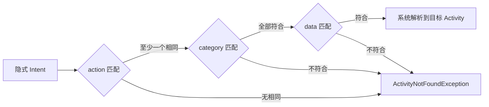
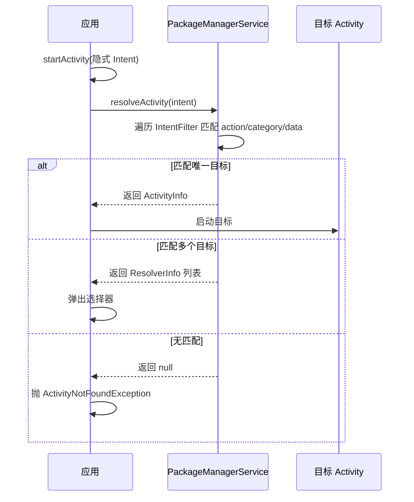

# Intent 与 IntentFilter 匹配规则

> Intent 是组件间通信的载体。显式 Intent 直接指定目标组件，而隐式 Intent 需要系统根据 **IntentFilter** 进行匹配才能找到目标。理解匹配规则，是读懂 `startActivity` 解析流程与跳转问题的前提。

## 一、显式 Intent 与隐式 Intent

| 类型 | 指定方式 | 特点 | 适用场景 |
|------|----------|------|----------|
| 显式 Intent | 指定 `ComponentName`（包名 + 类名） | 确定性高、无匹配开销 | 应用内跳转、服务绑定 |
| 隐式 Intent | 只声明 `action` / `category` / `data` | 由系统匹配解析，可跨应用 | 系统调用（拍照、拨号）、跨应用跳转 |

::: code-tabs

@tab:active Java

```java
// 显式：直接指定目标组件
Intent intent = new Intent(this, MainActivity.class);

// 隐式：只声明动作与数据，由系统解析
Intent intent = new Intent(Intent.ACTION_VIEW, Uri.parse("https://example.com"));
```

@tab Kotlin

```kotlin
// 显式：直接指定目标组件
val intent = Intent(this, MainActivity::class.java)

// 隐式：只声明动作与数据，由系统解析
val intent = Intent(Intent.ACTION_VIEW, Uri.parse("https://example.com"))
```

:::

::: tip
`startActivity` 解析隐式 Intent 时，若匹配到**多个**目标，会弹出"选择器"（Resolver）让用户选择；若匹配不到任何目标，则抛出 `ActivityNotFoundException`。
:::

## 二、IntentFilter 三大匹配规则



### 1. action 匹配规则

- Intent 中的 `action` **必须存在**，且与过滤规则中**至少一个**相同（字符串**区分大小写**）
- Intent 只能携带一个 action，IntentFilter 可声明多个 action，匹配其一即可

### 2. category 匹配规则

- **系统默认附加** `android.intent.category.DEFAULT`：任何隐式启动的 Intent 都会被系统自动加上该 category
- 因此**没有显式声明 category 的 IntentFilter 必须包含 DEFAULT**，否则无法被隐式匹配
- Intent 中的 category 可以省略（系统补 DEFAULT）；若显式携带，则必须全部与过滤规则匹配

### 3. data 匹配规则

`data` 由 **URI** 与 **mimeType** 两部分组成：

```text
URI 结构：scheme://host:port/path
例：content://com.example.provider/user/1
```

| 匹配维度 | 规则 |
|----------|------|
| `scheme` | 必须相同（`http`、`content`、`file` 等） |
| `host` | 声明了 host 就必须匹配，未声明则全部通过 |
| `port` | 声明了 port 就必须匹配 |
| `path` | 支持通配符 `*`，声明了就必须匹配 |
| `mimeType` | 可用通配符（`image/*`），声明了就必须匹配 |

::: warning
未显式指定 URI 的 Intent，系统默认支持 `content` 与 `file` 两种 scheme；`setData` 与 `setType` 会互相覆盖，需要同时设置时应使用 `setDataAndType`。
:::

## 三、匹配流程：resolveActivity



::: code-tabs

@tab:active Java

```java
// 手动解析：判断隐式 Intent 是否有目标可启动
ResolveInfo resolveInfo = getPackageManager().resolveActivity(intent, PackageManager.MATCH_DEFAULT_ONLY);
if (resolveInfo == null) {
    // 无目标：给出引导或降级处理
    Toast.makeText(this, "未找到可处理的应用", Toast.LENGTH_SHORT).show();
}
```

@tab Kotlin

```kotlin
// 手动解析：判断隐式 Intent 是否有目标可启动
val resolveInfo = packageManager.resolveActivity(intent, PackageManager.MATCH_DEFAULT_ONLY)
if (resolveInfo == null) {
    // 无目标：给出引导或降级处理
    Toast.makeText(this, "未找到可处理的应用", Toast.LENGTH_SHORT).show()
}
```

:::

## 四、实际应用：系统常见 Intent

| 场景 | Intent 写法 |
|------|-------------|
| 打开网页 | `Intent(Intent.ACTION_VIEW, Uri.parse("https://..."))` |
| 拨打电话 | `Intent(Intent.ACTION_DIAL, Uri.parse("tel:10086"))` |
| 发送短信 | `Intent(Intent.ACTION_SENDTO, Uri.parse("smsto:10086"))` |
| 系统相机 | `Intent(MediaStore.ACTION_IMAGE_CAPTURE)` |
| 打开设置 | `Intent(Settings.ACTION_APPLICATION_DETAILS_SETTINGS, Uri.fromParts("package", pkg, null))` |

::: tip
调用系统能力前**务必先判断目标是否存在**（`resolveActivity != null`），否则低版本机型可能直接崩溃。
:::

## 五、高频面试题

### Q1：显式 Intent 与隐式 Intent 的区别？

::: details 查看答案
显式 Intent 直接指定目标组件的 `ComponentName`，确定性强、无解析开销，用于应用内跳转；隐式 Intent 只声明 `action`/`category`/`data`，由系统通过 IntentFilter 匹配解析目标，支持跨应用跳转，但匹配不到会抛 `ActivityNotFoundException`。
:::

### Q2：为什么自定义 Activity 需要声明 `android.intent.category.DEFAULT`？

::: details 查看答案
系统在启动任何隐式 Intent 时都会自动附加 `DEFAULT` category。如果 Activity 的 IntentFilter 没有声明 DEFAULT，则该过滤规则不包含系统默认附加的 category，导致**永远无法被隐式 Intent 匹配**。因此凡是允许隐式启动的 Activity，其 IntentFilter 必须包含 DEFAULT。
:::

### Q3：Intent 中同时设置了 data 和 type 会怎样？

::: details 查看答案
`setData` 与 `setType` 会互相覆盖：`setData` 会清空 mimeType，`setType` 会清空 URI。需要同时设置 URI 与 mimeType 时必须使用 `setDataAndType(uri, type)`。
:::

### Q4：多个应用都能处理同一个隐式 Intent 时会发生什么？

::: details 查看答案
系统会弹出"选择器"（Resolver Activity）列出所有匹配的应用让用户选择；若用户勾选"始终"，则将该选择记录到系统，后续直接启动默认应用。这也解释了为什么图片分享等场景需要引导用户选择应用。
:::

### Q5：如何判断一个隐式 Intent 是否有可处理的目标？

::: details 查看答案
调用 `packageManager.resolveActivity(intent, PackageManager.MATCH_DEFAULT_ONLY)`，返回 `ResolveInfo` 为 null 表示无目标。注意匹配标志需传 `MATCH_DEFAULT_ONLY`，与系统隐式启动的解析规则一致，否则可能误判。
:::

## 小结

- 隐式 Intent 匹配三要素：**action 必须命中其一、category 全部符合（含系统补的 DEFAULT）、data 按 scheme/host/port/path/mimeType 逐级匹配**
- 解析入口是 `resolveActivity`，命中多个弹选择器、命中零个抛异常
- 跨应用调用系统能力前先判空，避免低版本崩溃

> 进阶阅读：[Activity 启动流程源码分析](activity-launch-process.md) | [Activity 任务栈与返回栈](task-stack.md)
