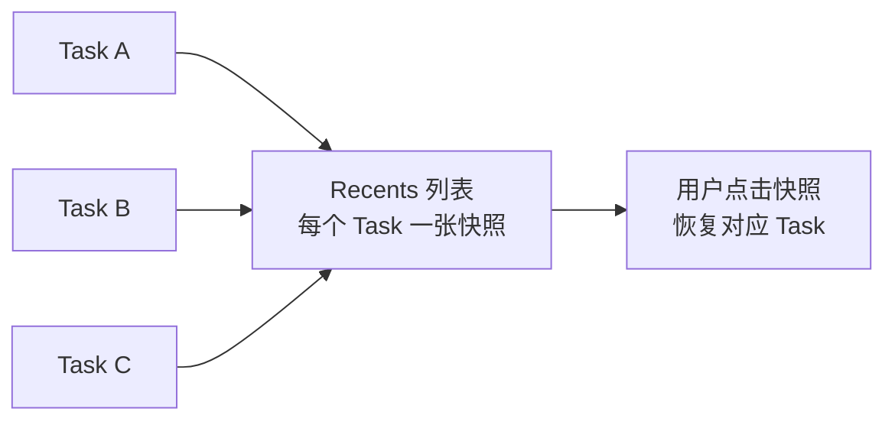
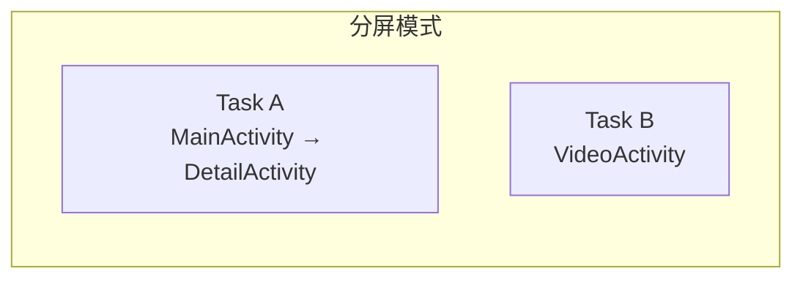

# Activity 任务栈与返回栈

> 面试高频指数：高
> 掌握任务栈是理解 `launchMode`、`onNewIntent`、`FLAG_ACTIVITY_*` 系列标志的前提。

## 1. 什么是 Task（任务）

**Task** 是用户在执行某条"业务主线"时与之交互的一组 Activity 的集合。系统通过 **Back Stack（返回栈）** 来组织这些 Activity。

```text
Task A（前景任务）                 Task B（后台任务）
┌──────────────────┐             ┌──────────────────┐
│ Activity3 (top)  │ ← 用户当前看到 │ Activity2        │
│ Activity2        │             │ Activity1        │
│ Activity1        │             └──────────────────┘
└──────────────────┘
```

要点：

- Task 是一个**逻辑概念**，不是进程，也不是任务栈本身；一个 Task 由多个 Activity 实例组成。
- 一个 App 可以拥有多个 Task；不同 App 的 Activity 也可以处于同一个 Task 中（通过隐式 Intent 跳转）。
- 返回栈遵循 **LIFO（后进先出）**：按返回键时，栈顶 Activity 出栈销毁。

### 1.1 Task 与进程、线程的关系（高频混淆点）

三者的对比说明如下：

| 概念 | 是什么 | 关系 |
|------|--------|------|
| 进程 | 资源分配单位（Linux 进程） | 一个 Task 的 Activity 可以**分布在多个进程**（通过 `android:process` 拆分） |
| 线程 | CPU 调度单位 | 进程内默认所有组件跑在主线程，与 Task 无直接关系 |
| Task | 用户"业务主线"的 Activity 集合 | 一个 App 可有多个 Task；一个 Task 可跨 App |

```text
Task A（用户正在浏览的"主线"）              Task B（另一个业务主线，后台）
┌──────────────────────────┐              ┌──────────────────────┐
│ ShareActivity (来自 App B)│ ← 跨 App 共存 │ PlayerActivity       │
│ DetailActivity            │              │ MainActivity         │
│ MainActivity (App A)      │              └──────────────────────┘
└──────────────────────────┘
```

> **核心认知**：Task 关心的是"用户操作序列"，与代码里的进程/线程模型完全正交。这也是为什么从通知栏拉起不同 App 的页面会互相"串栈"。

### 1.2 Task 与 Recents（最近任务）的关系

Task 与 Recents 的关系如下：



- **Recents（最近任务列表）= 当前存活的 Task 集合**，每个 Task 显示一张"顶部 Activity"的快照。
- 从 Recents 划掉一个任务 = 销毁该 Task 中**所有** Activity（`onDestroy`）。
- `excludeFromRecents="true"` 的 Activity 所在 Task 不会出现在 Recents。

## 2. Back Stack 的基本行为

Back Stack 各操作的行为如下：

| 操作 | 行为 |
| --- | --- |
| 启动新 Activity | `startActivity` → 新实例压入栈顶 |
| 按返回键 | 栈顶 Activity 出栈并 `finish()`，栈顶变为下一个 Activity |
| 返回键回桌面 | 栈顶被销毁，Task 回到栈底 Activity |
| 从桌面重新进入 | 恢复对应 Task（保留栈内所有实例） |

### 2.1 进程被回收后的恢复

当系统内存不足杀死后台进程时，Task 与返回栈会被系统**记住**（保存在 `ActivityManager` 侧），
用户重新进入 App 时按"栈底 → 栈顶"顺序重建 Activity，并通过 `onSaveInstanceState` 恢复状态。

## 3. 四种启动模式（launchMode）对栈的影响

在 `AndroidManifest.xml` 中配置：

```xml
<activity
    android:name=".MainActivity"
    android:launchMode="singleTask" />
```

### 3.1 standard（默认）

- 每次启动都创建**新实例**，压入发起者所在的 Task。
- 同一个 Activity 可以存在多个实例。

### 3.2 singleTop

- 若**栈顶已是该 Activity 实例**，不创建新实例，而是回调 `onNewIntent()`。
- 若不在栈顶，行为同 `standard`。

对应的核心实现如下：

::: code-tabs

@tab:active Java

```java
class SearchActivity extends AppCompatActivity {
    @Override
    protected void onNewIntent(Intent intent) {
        super.onNewIntent(intent);
        // 复用已有实例，更新搜索词
        setIntent(intent);
        refreshSearch(intent.getStringExtra("keyword"));
    }
}
```

@tab Kotlin

```kotlin
class SearchActivity : AppCompatActivity() {
    override fun onNewIntent(intent: Intent) {
        super.onNewIntent(intent)
        // 复用已有实例，更新搜索词
        setIntent(intent)
        refreshSearch(intent.getStringExtra("keyword"))
    }
}
```

:::

**典型场景**：通知栏点击跳转（避免连续点击创建多个详情页）。

### 3.3 singleTask

- 若 Task 中**已存在该 Activity 实例**，则销毁其上方所有 Activity，把它提到栈顶并回调 `onNewIntent`。
- 若不存在，则在**新 Task** 中创建（除非指定了 `taskAffinity`）。

```xml
<activity
    android:name=".HomeActivity"
    android:launchMode="singleTask"
    android:taskAffinity="com.example.home" />
```

**典型场景**：App 主界面、底部 Tab 容器（如微信主界面）。

### 3.4 singleInstance

- Activity 所在 Task **只能有它一个实例**。
- 之后启动的其他 Activity 会进入**另一个** Task。

**典型场景**：来电界面（全局唯一且不被打扰）。

### 3.5 启动模式对比表

各启动模式的对比说明如下：

| 模式 | 是否新实例 | 所在 Task | onNewIntent 触发条件 |
| --- | --- | --- | --- |
| standard | 总是 | 发起者 Task | 永不 |
| singleTop | 栈顶复用 | 发起者 Task | 已在栈顶 |
| singleTask | 复用已有 | 新 Task 或指定 Task | 已存在于目标 Task |
| singleInstance | 全局唯一 | 独占 Task | 已存在 |

## 4. Intent Flags（动态指定）

启动模式还可以通过 Flag 动态指定（优先级高于 Manifest）：

::: code-tabs

@tab:active Java

```java
Intent intent = new Intent(this, DetailActivity.class);
intent.setFlags(Intent.FLAG_ACTIVITY_NEW_TASK |
        Intent.FLAG_ACTIVITY_CLEAR_TOP |
        Intent.FLAG_ACTIVITY_SINGLE_TOP);
startActivity(intent);
```

@tab Kotlin

```kotlin
val intent = Intent(this, DetailActivity::class.java).apply {
    flags = Intent.FLAG_ACTIVITY_NEW_TASK or
        Intent.FLAG_ACTIVITY_CLEAR_TOP or
        Intent.FLAG_ACTIVITY_SINGLE_TOP
}
startActivity(intent)
```

:::

各 Flag 的作用说明如下：

| Flag | 作用 |
| --- | --- |
| `FLAG_ACTIVITY_NEW_TASK` | 在新 Task 中启动（等同 singleTask，从非 Activity 上下文启动必须加） |
| `FLAG_ACTIVITY_CLEAR_TOP` | 销毁目标上方所有 Activity（配合 SINGLE_TOP 会走 onNewIntent） |
| `FLAG_ACTIVITY_SINGLE_TOP` | 等同 singleTop |
| `FLAG_ACTIVITY_CLEAR_TASK` | 启动前清空目标 Task（需配合 NEW_TASK） |
| `FLAG_ACTIVITY_EXCLUDE_FROM_RECENTS` | 不出现在最近任务列表 |

> 注意：从 `ApplicationContext` 或非 Activity 上下文启动 Activity 时，**必须**加 `FLAG_ACTIVITY_NEW_TASK`，否则抛异常。

## 5. 常用栈操作 API

### 5.1 清空栈

::: code-tabs

@tab:active Java

```java
// 方式一：Intent 清栈（常用于"退出登录回到登录页"）
Intent intent = new Intent(this, LoginActivity.class);
intent.setFlags(Intent.FLAG_ACTIVITY_NEW_TASK | Intent.FLAG_ACTIVITY_CLEAR_TASK);
startActivity(intent);

// 方式二：TaskStackBuilder（保留指定栈）
TaskStackBuilder stackBuilder = TaskStackBuilder.create(this)
        .addNextIntentWithParentStack(new Intent(this, MainActivity.class));
stackBuilder.startActivities();
```

@tab Kotlin

```kotlin
// 方式一：Intent 清栈（常用于"退出登录回到登录页"）
val intent = Intent(this, LoginActivity::class.java).apply {
    flags = Intent.FLAG_ACTIVITY_NEW_TASK or Intent.FLAG_ACTIVITY_CLEAR_TASK
}
startActivity(intent)

// 方式二：TaskStackBuilder（保留指定栈）
val stackBuilder = TaskStackBuilder.create(this)
    .addNextIntentWithParentStack(Intent(this, MainActivity::class.java))
stackBuilder.startActivities()
```

:::

### 5.2 判断是否栈底

::: code-tabs

@tab:active Java

```java
// 栈中是否只有当前 Activity
boolean isTaskRoot = isTaskRoot();
```

@tab Kotlin

```kotlin
// 栈中是否只有当前 Activity
val isTaskRoot = isTaskRoot
```

:::

### 5.3 调整 Task 归属（taskAffinity）

`taskAffinity` 用于指定 Activity 倾向加入的 Task 名称：

```xml
<activity android:name=".ShareActivity"
    android:taskAffinity="com.example.share"
    android:excludeFromRecents="true" />
```

- 配合 `allowTaskReparenting="true"` 时，Activity 可在用户回到主 App 时"迁移"到其亲和 Task。
- `singleTask` + 不同 `taskAffinity` 可以实现"多 Task 共存"。

### 5.4 allowTaskReparenting：Activity 跨 Task 迁移

```xml
<activity
    android:name=".BrowserActivity"
    android:allowTaskReparenting="true" />
```

**行为**：当 Activity 所在 Task 退到后台、且存在一个 `taskAffinity` 相同的 Task 被拉到前台时，该 Activity 会**迁移**到那个 Task。

**典型场景**：浏览器 App 的页面——用户从自己的 App 跳转到浏览器浏览，返回桌面后从浏览器图标进入时，该页面"归属"回浏览器自己的 Task，而不是停留在启动它的 App 的 Task 中。

## 5.5 多窗口模式（分屏 / 画中画）对 Task 的影响

各多窗口模式与 Task 的关系如下：

| 模式 | 与 Task 的关系 |
|------|----------------|
| **分屏（Split Screen）** | 同一屏幕上两个 Task 同时处于"前台"，各自维护自己的栈；两个 Task 都可见、都持有一半屏幕 |
| **画中画（PIP）** | Activity 以窗口形式悬浮，其所在 Task 进入特殊状态；PIP 窗口不占用新 Task |
| **自由窗口（Freeform）** | 桌面式多窗口，每个窗口一个 Task（Android 7.0+ 大屏设备） |

分屏模式下 Task 的构成关系如下：



**开发注意**：分屏时两个 Activity 都会回调 `onResume`（都可见可交互）——`onResume` 不再等于"全屏独占"；`onPause` 也不再保证"完全不可见"。需要感知实际窗口尺寸变化时用 `onMultiWindowModeChanged` 或 `Configuration` 监听。

## 5.6 返回栈与 Fragment 的注意点

- Fragment 的事务回退栈（`addToBackStack`）与 Activity 返回栈是**两套独立机制**。
- 当 Activity 出栈销毁时，其 FragmentManager 中的所有 Fragment 一并销毁。
- `onBackPressedDispatcher` 优先处理 Fragment 的回退栈，再处理 Activity。

## 6. 高频面试题

**Q1：singleTask 启动时 onNewIntent 与 onStart/onResume 的调用顺序？**
A：当实例已存在被复用时会回调 `onNewIntent`，完整顺序为
`onNewIntent → onRestart → onStart → onResume`。此时**不会**重新走 `onCreate`。

**Q2：两个 App 的 Activity 能否共处一个 Task？**
A：能。通过隐式 Intent 从 App A 跳转到 App B 的 Activity 时，若未指定 NEW_TASK 且 taskAffinity 相同，
B 的 Activity 会压入 A 的 Task。

**Q3：为什么 singleTask 常配合 CLEAR_TOP 使用？**
A：`singleTask` 已具备"清除栈顶"能力（把目标提到栈顶时销毁其上方实例）；`CLEAR_TOP` 是给
`standard` 模式的 Activity 用的，二者效果类似但机制不同。

**Q4：如何实现"一键退出整个 App"？**
A：① 使用 `FLAG_ACTIVITY_NEW_TASK | FLAG_ACTIVITY_CLEAR_TASK` 跳转到一个"退出中转页"并 finish；
② 或记录栈中 Activity 逐一 finish；③ 现代做法：`ActivityResultLauncher` 由根 Activity 统一管理。

**Q5：Task 与进程是什么关系？**
A：无必然关系。一个 Task 的多个 Activity 可以分属不同进程（`android:process` 拆分），
不同 Task 的 Activity 也可以在同一进程。Task 是"用户操作序列"的逻辑容器，进程是资源单位。

**Q6：分屏模式下两个 App 的 Activity 会回调 onResume 吗？**
A：会。分屏时两个 Task 都处于前台，两侧 Activity 都会执行 `onResume`（都可交互）。
此时 `onResume` ≠ 全屏独占，需用 `onMultiWindowModeChanged` / Configuration 感知尺寸变化。

**Q7：Recents 里划掉应用会销毁什么？**
A：销毁该 Task 内的**全部 Activity**（依次 `onDestroy`）。若 App 有多个 Task，只在 Recents
中显示的那一个被销毁。`excludeFromRecents` 的任务不受影响。

**Q8：onNewIntent 里如何拿到最新 Intent 数据？**
A：回调参数 `intent` 就是新 Intent；同时必须调用 `setIntent(intent)`，否则后续
`getIntent()` 仍返回旧 Intent，导致"数据明明传了却不更新"的经典 bug。

## 7. 小结

- Task = 业务主线的 Activity 集合；Back Stack = 栈内顺序（LIFO）。
- 四种 `launchMode` 决定**是否复用实例**与**进入哪个 Task**。
- `Intent` Flags 可动态覆盖 Manifest 配置，优先级更高。
- Recents = 存活 Task 集合；分屏/PIP 让"前台"概念从单 Task 变成多 Task 并存。
- 面试考察重点：singleTask 的栈行为、onNewIntent 顺序、flags 组合效果、Task 与进程的关系。
