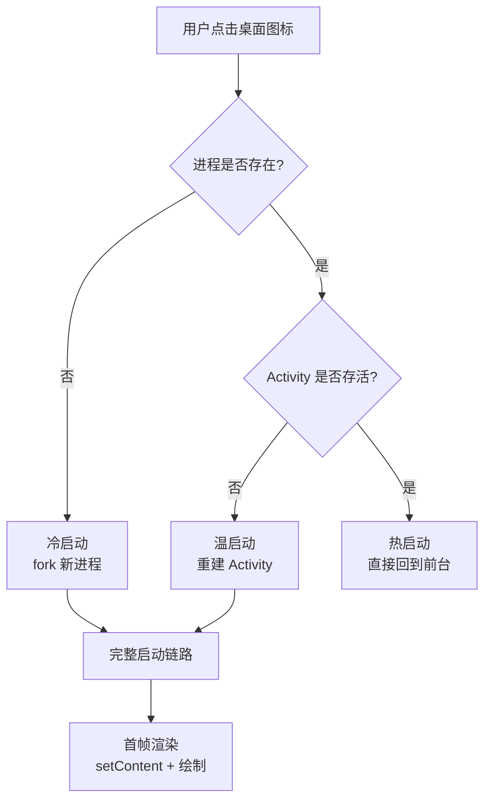
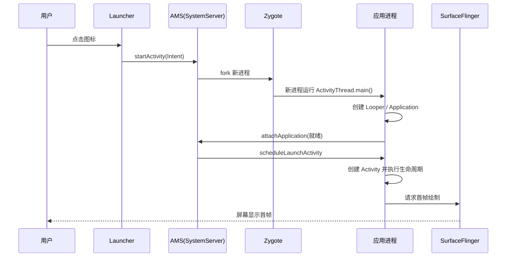

# App 启动流程：从点击图标到首帧

> 冷启动是用户体验的第一印象。从手指点击桌面图标到首帧画面出现，系统经历了 **Launcher → Zygote → AMS → ActivityThread → Activity → 首帧绘制** 的完整链路。本节拆解全流程，并给出可落地的启动优化方案。

## 一、冷启动 / 温启动 / 热启动

三种启动类型的触发条件与特点对比如下：

| 类型 | 触发条件 | 特点 |
|------|----------|------|
| **冷启动** | 进程不存在，从零创建 | 最慢（含进程创建 + Application + 首帧），是优化重点 |
| **温启动** | 进程存活，Activity 被销毁重建 | 跳过进程创建与 Application，只重建 Activity |
| **热启动** | 进程与 Activity 均在内存 | 仅 onStart/onResume，几乎瞬间完成 |

三种启动类型的判断流程如下：



## 二、冷启动完整链路（源码级）

```
① Launcher 进程
   └─ startActivity(intent)  ← 通过 Binder 通知系统
② SystemServer 进程（AMS）
   ├─ 解析 Intent，找到目标 Activity 及其进程
   ├─ 目标进程不存在 → 请求 Zygote fork
   └─ 记录启动状态，等待新进程就绪
③ Zygote 进程
   ├─ fork() 新应用进程（COW 内存，预加载类库）
   └─ 新进程入口: ActivityThread.main()
④ 新应用进程
   ├─ 创建主线程 Looper（prepareMainLooper）
   ├─ new Application → attach → onCreate
   ├─ 回调 AMS: attachApplication（通知就绪）
   └─ handleLaunchActivity:
        ├─ 创建 Activity（反射）
        ├─ attach / onCreate / onStart / onResume
        └─ ViewRootImpl.requestLayout → 首帧绘制
⑤ 首帧渲染
   ├─ Choreographer 调度 VSYNC
   ├─ measure → layout → draw
   └─ SurfaceFlinger 合成上屏
```

冷启动各进程间的交互时序如下：



## 三、各阶段耗时与优化点

### 阶段 1：进程创建（Zygote fork）

进程创建阶段的耗时点与优化手段如下：

| 耗时点 | 说明 | 优化手段 |
|--------|------|----------|
| fork 本身 | 内存页复制（COW） | 减少进程数；避免不必要多进程 |
| 类加载 | 首次加载 Dex 中的类 | 启动器预加载（`App Startup`）、减少启动路径类依赖 |
| 资源加载 | 读取 manifest 与资源 | 安装时已优化（AAPT2 预编译资源） |

### 阶段 2：Application 初始化

见 [Application 详解](/android/app/application-basics.md) 的初始化最佳实践：异步化、懒加载、进程判断。

### 阶段 3：Activity 创建与首帧

Activity 创建与首帧阶段的耗时点与优化手段如下：

| 耗时点 | 说明 | 优化手段 |
|--------|------|----------|
| Activity 构造 | 反射创建 + `setContent` | 布局扁平化、减少层级 |
| 首帧绘制 | measure/layout/draw | 用 `ViewStub` 延迟加载、`AsyncLayoutInflater` |
| 数据加载 | 首屏数据未就绪 | 骨架屏 / 本地缓存先渲染 |

## 四、启动耗时测量

启动耗时的测量实现如下：

::: code-tabs

@tab:active Java

```java
// 1. 系统日志（adb 命令）
// adb shell am start -W -n com.example/.MainActivity
// TotalTime: 1234ms（关键指标）

// 2. 代码埋点
public class WikiApplication extends Application {
    @Override
    public void onCreate() {
        super.onCreate();
        Log.i("Startup", "Application.onCreate 开始: " + SystemClock.elapsedRealtime());
    }
}

// 3. 首帧回调
public class MainActivity extends ComponentActivity {
    @Override
    protected void onCreate(Bundle savedInstanceState) {
        super.onCreate(savedInstanceState);
        setContent(...);   // Compose 内容
        // 报告完全绘制（首屏关键内容已展示）
        reportFullyDrawn();
    }
}
```

@tab Kotlin

```kotlin
// 1. 系统日志（adb 命令）
// adb shell am start -W -n com.example/.MainActivity
// TotalTime: 1234ms（关键指标）

// 2. 代码埋点
class WikiApplication : Application() {
    override fun onCreate() {
        super.onCreate()
        Log.i("Startup", "Application.onCreate 开始: ${SystemClock.elapsedRealtime()}")
    }
}

// 3. 首帧回调
class MainActivity : ComponentActivity() {
    override fun onCreate(savedInstanceState: Bundle?) {
        super.onCreate(savedInstanceState)
        setContent { ... }
        // 报告完全绘制（首屏关键内容已展示）
        reportFullyDrawn()
    }
}
```

:::

```bash
# 命令行测量冷启动
adb shell am start -W -n com.example.app/.MainActivity
# 输出示例：
# TotalTime: 923
# WaitTime: 942
```

## 五、启动优化实战清单

### 1. 主题优化：先展示背景再加载

```xml
<!-- styles.xml -->
<style name="AppTheme.Launch" parent="Theme.Material3.DayNight.NoActionBar">
    <item name="android:windowBackground">@drawable/launch_bg</item>
    <!-- 首帧前的窗口用启动背景，避免白屏/黑屏 -->
</style>
```

```xml
<activity
    android:name=".MainActivity"
    android:theme="@style/AppTheme.Launch">
    <intent-filter>...</intent-filter>
</activity>
<!-- 进入 MainActivity 后 setTheme 切回正式主题 -->
```

### 2. 布局优化

常用布局优化手段及作用如下：

| 手段 | 作用 |
|------|------|
| 扁平化布局 | 减少 measure/layout 时间（ConstraintLayout） |
| `ViewStub` | 首帧不加载的模块延迟加载 |
| `AsyncLayoutInflater` | 后台线程预解析布局 |
| 避免过度绘制 | `adb shell setprop debug.hwui.overdraw show` 检查 |

### 3. 初始化优化（App Startup）

App Startup 初始化器的实现如下：

::: code-tabs

@tab:active Java

```java
// 1. 依赖 appstartup 库，自动注册初始化器
public class DatabaseInitializer implements Initializer<Unit> {
    @NonNull
    @Override
    public Unit create(@NonNull Context context) {
        // 在后台线程初始化（库自动调度）
        AppDatabase.create(context);
        return Unit.INSTANCE;
    }

    @NonNull
    @Override
    public List<Class<? extends Initializer<?>>> dependencies() {
        return Collections.emptyList();
    }
}
```

@tab Kotlin

```kotlin
// 1. 依赖 appstartup 库，自动注册初始化器
class DatabaseInitializer : Initializer<Unit> {
    override fun create(context: Context) {
        // 在后台线程初始化（库自动调度）
        AppDatabase.create(context)
    }
    override fun dependencies(): List<Class<out Initializer<*>>> = emptyList()
}
```

:::

### 4. 数据预加载

首屏数据预加载的实现如下：

::: code-tabs

@tab:active Java

```java
// 首屏数据本地缓存优先，网络数据异步刷新
public class HomeRepository {
    private final Api api;
    private final Cache cache;

    public HomeRepository(Api api, Cache cache) {
        this.api = api;
        this.cache = cache;
    }

    // 回调式等价实现（对应 Kotlin 的 Flow）
    public void loadHomeData(Consumer<HomeUiState> onState) {
        onState.accept(cache.getHome());          // 先出缓存，秒开
        api.getHome(new Callback<HomeUiState>() { // 再拉网络
            @Override
            public void onSuccess(HomeUiState fresh) {
                cache.save(fresh);
                onState.accept(fresh);
            }
        });
    }
}
```

@tab Kotlin

```kotlin
// 首屏数据本地缓存优先，网络数据异步刷新
class HomeRepository(private val api: Api, private val cache: Cache) {
    fun loadHomeData(): Flow<HomeUiState> = flow {
        emit(cache.getHome())                    // 先出缓存，秒开
        val fresh = api.getHome()                 // 再拉网络
        cache.save(fresh)
        emit(fresh)
    }
}
```

:::

## 六、高频面试题精讲

**Q1：冷启动流程是怎样的？请从点击图标说起。**
A：① 桌面 Launcher 调用 `startActivity`，通过 Binder 到系统进程 AMS；② AMS 解析 Intent 定位目标 Activity，发现目标进程不存在，请求 Zygote fork 新进程；③ 新进程从 `ActivityThread.main()` 进入，创建主线程 Looper、Application（attach + onCreate）；④ 应用进程回调 AMS"已就绪"，AMS 发送 `scheduleLaunchActivity`；⑤ 反射创建 Activity，依次执行 onCreate/onStart/onResume，`setContent` 后经 Choreographer 驱动 measure/layout/draw，最终由 SurfaceFlinger 合成上屏——用户看到首帧。

**Q2：冷启动、温启动、热启动的区别？**
A：冷启动：进程不存在，需 fork 进程 + 初始化 Application + 创建 Activity，最慢（是优化重点）；温启动：进程存活但 Activity 被销毁（如内存回收、旋转屏幕），仅重建 Activity；热启动：进程与 Activity 均在内存，只走 onStart/onResume 回前台，最快。

**Q3：为什么说 Application.onCreate 不能做太多事？**
A：它处于冷启动关键路径上，位于首个 Activity 创建之前，所有同步操作都会直接延迟首帧。据统计首帧每延迟 100ms，用户流失率显著上升。因此应只做必要的同步初始化，其余异步化或懒加载，并用 `reportFullyDrawn()` 衡量真正的内容可交互时间。

**Q4：Zygote 预加载对启动有什么用？**
A：Zygote 是系统所有应用进程的"母进程"，在系统启动时就预加载了常用类（如 Activity、Application、常用系统类）和资源。应用进程由 Zygote `fork` 而来（写时复制），继承这些已加载的类，**避免了每个应用重复加载系统类的时间**，大幅缩短进程创建阶段耗时。

**Q5：如何定位启动耗时瓶颈？**
A：① `adb shell am start -W` 拿总耗时；② 系统自带的 `Displayed` 时间看首帧；③ 代码埋点分段（Application.onCreate / Activity.onCreate / onResume / 首帧回调）对比各阶段；④ 使用 `Method Tracing`（Profiler）或 `systrace` 分析主线程函数耗时；⑤ 关注 GC 与类加载（ClassLoader）是否在关键路径。

**Q6：冷启动时窗口背景的作用？**
A：点击图标后、首帧绘制完成前，系统展示的是主题的 `windowBackground`。默认白色/黑色会造成"白屏/黑屏"的视觉等待。用品牌启动图作为 `windowBackground` 并配合启动主题，可让用户感知"秒开"，这是成本最低、收益直接的启动优化手段（启动屏 SplashScreen 的底层原理）。

## 七、小结

- **启动链路**：Launcher → AMS → Zygote fork → Application → Activity → 首帧
- **三类启动**：冷（进程创建）/ 温（Activity 重建）/ 热（回前台）
- **优化三板斧**：启动主题遮白屏、Application 初始化精简异步、布局扁平化 + ViewStub
- **测量先行**：`am start -W` + 分段埋点 + `reportFullyDrawn` 量化改进
- **本质目标**：减少首帧前主线程的每毫秒工作量

> 进阶阅读：[Application 详解与全局初始化](/android/app/application-basics.md) | [Activity 启动流程源码分析](/android/activity/activity-launch-process.md) | [Android 进程模型](/android/process/process-lifecycle.md)
