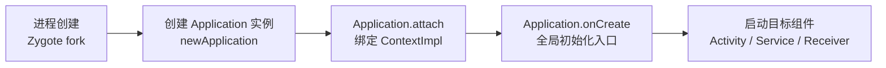

# Application 详解与全局初始化

> 每个 Android 应用都有一个 `Application` 实例——它由系统在**进程创建后、任何组件之前**实例化。`onCreate` 是全局初始化的传统位置，但"怎么初始化"直接决定启动速度与稳定性。本节讲透 Application 的机制与最佳实践。

## 一、Application 是什么



| 特性 | 说明 |
|------|------|
| 单例 | 每个**进程**仅一个实例 |
| 时机 | 进程启动、任何组件创建之前 |
| Context | 是 `Context` 子类（`ContextWrapper`），生命周期=进程 |
| 创建者 | 系统通过反射 `newApplication()` 创建 |
| 配置 | 在 Manifest `<application>` 标签中指定 `android:name` |

```xml
<application
    android:name=".WikiApplication"
    android:icon="@mipmap/ic_launcher"
    android:label="@string/app_name">
    ...
</application>
```

```kotlin
class WikiApplication : Application() {
    override fun onCreate() {
        super.onCreate()
        // 全局初始化
        initCrashHandler()
        initNetwork()
        initImageLoader()
    }
}
```

::: warning 注意
`Application` 的构造器与 `attachBaseContext()` 在 `onCreate` **之前**调用。尽量不要在构造器里做耗时操作——此时 ContentProvider 已初始化但组件尚未就绪。
:::

## 二、Application 的创建链路（源码视角）

```
1. Zygote fork 出应用进程，进入 ActivityThread.main()
2. ActivityThread 绑定 ApplicationThread（Binder 代理）
3. 系统端 AMS 通过 attachApplication 通知应用"启动完成"
4. ActivityThread.handleBindApplication():
   a. 创建 ContextImpl（应用级）
   b. 反射创建 Application 实例
   c. application.attach(context)   ← 绑定 Context
   d. application.onCreate()        ← 执行全局初始化
5. 接着启动目标 Activity
```

**关键顺序**（面试高频）：`Application.attachBaseContext()` → `Application.onCreate()` → 第一个 `Activity.onCreate()`。

## 三、onCreate 全局初始化的正确姿势

### ❌ 反面教材：全部同步初始化

```kotlin
override fun onCreate() {
    super.onCreate()
    initCrashHandler()      // 读文件，几 ms
    initNetworkOkHttp()     // 建连接池，耗时
    initImageLoader()       // 扫描磁盘缓存，几十 ms
    initPush()              // 连长连接
    initDatabase()          // 建库建表，上百 ms
    initAnalytics()         // 埋点
    // → 全部阻塞在启动关键路径上
}
```

### ✅ 最佳实践：按需 + 异步 + 启动器

```kotlin
class WikiApplication : Application() {

    override fun onCreate() {
        super.onCreate()
        // 1. 必须同步的：崩溃监控、日志（越早越好）
        initCrashHandler()
        // 2. 首帧前必须的：图片加载器预热、网络框架
        initImageLoader()
        // 3. 可异步的：数据库、埋点、推送（丢到后台线程）
        thread { initDatabase(); initAnalytics() }
        // 4. 真正懒加载的：等第一次使用时才初始化
    }
}
```

**关键原则**：

| 原则 | 说明 |
|------|------|
| 启动路径最小化 | 首帧前只做"必须现在做"的事 |
| 耗时任务异步 | 数据库/网络/IO 移出主线程 |
| 延迟初始化 | 组件内部 `object` / `by lazy` 按需创建 |
| 多进程防抖 | 子进程不重复执行重量级初始化 |

### 多进程陷阱

```xml
<!-- 指定了独立进程的组件 -->
<service
    android:name=".PushService"
    android:process=":push" />
```

```kotlin
override fun onCreate() {
    super.onCreate()
    // 每个进程都会执行！子进程(:push)不需要主进程的初始化
    if (ProcessUtils.isMainProcess()) {
        initMainOnly()
    }
}
```

::: warning 核心认知
**Application 是按进程创建的**。配置了 `android:process` 的组件运行在独立进程，该进程也会各自创建 Application 实例并执行 `onCreate`。不做进程判断，会导致子进程重复初始化、甚至崩溃。
:::

## 四、Application 与 Context 的关系

```
Context(抽象)
 ├── ContextWrapper
 │    ├── ContextThemeWrapper → Activity / Service 相关
 │    └── Application        ← 全局单例
 └── ContextImpl             ← 真正实现（每个 Context 都有一个）
```

| 对比 | Application Context | Activity Context |
|------|--------------------|------------------|
| 生命周期 | 进程存活期间 | Activity 销毁即失效 |
| 泄漏风险 | 无（本身是全局单例） | 持有会导致内存泄漏 |
| 启动 Activity | 需 `NEW_TASK` 标志 | 直接 |
| 显示 Dialog | 不支持（无窗口主题） | 支持 |
| 绑定 Service | 支持 | 支持 |
| 适用场景 | 单例、全局管理器、静态工具 | 界面相关操作 |

```kotlin
// 正确：单例传 Application 而非 Activity
class NetworkManager private constructor(app: Application) {
    init { /* 持有 app，安全不泄漏 */ }
    companion object {
        @Volatile private var instance: NetworkManager? = null
        fun get(app: Application) = instance ?: synchronized(this) {
            instance ?: NetworkManager(app).also { instance = it }
        }
    }
}
```

## 五、Application 相关高频考点

| 考点 | 答案要点 |
|------|----------|
| 如何获取 Context | 静态工具类持 Application 引用；或 `ContentProvider` 初始化时捕获（App Startup 原理） |
| onCreate 可以耗时多久 | 越短越好，超过 5s 会 ANR；首帧耗时影响启动速度 |
| Application 与 Activity 初始化顺序 | Application 先于 Activity，且每个进程仅一次 |
| 进程被杀后如何恢复 | 系统重启进程，Application 重新走完整创建流程 |
| 多个 ContentProvider 初始化 | Provider 的 `onCreate` 先于 Application 的 `onCreate` 执行（Android 启动顺序！） |

::: tip 冷知识
Android 启动顺序是：**Application 构造 → ContentProvider.onCreate → Application.onCreate**。很多库（如 Firebase、WorkManager）利用 ContentProvider 实现"无需手动初始化"，原理就是它的 onCreate 更早执行且自动触发。缺点：无手动控制，默认全部初始化。
:::

## 六、高频面试题精讲

**Q1：Application 的 onCreate 里适合做什么？不适合做什么？**
A：适合：崩溃监控（必须最早）、日志、图片加载器、网络框架等**首帧前必须就绪**且轻量的初始化。不适合：耗时 IO（数据库建库、大文件扫描）、网络请求、长连接建立——这些应异步化或延迟到首次使用时再做，否则拖慢冷启动甚至造成 ANR。

**Q2：Application 是单例吗？每个进程都会创建吗？**
A：每个**进程**只有一个 Application 实例，由系统反射创建。但配置了 `android:process` 的组件运行在独立进程，**每个进程都会各自创建一个 Application 实例并执行 onCreate**。因此多进程应用必须在 onCreate 中判断当前进程，避免子进程重复执行主进程的初始化逻辑。

**Q3：如何在任意位置（如静态方法）获取 Context？**
A：① 在 Application.onCreate 中保存 `this` 到静态变量（最常用）；② 通过 `ContentProvider` 自动注入（App Startup 库原理，Provider.onCreate 早于 Application.onCreate）；③ 已有 View/Activity 时用 `view.context`。注意：静态持有 Context 要用 Application 级别，避免内存泄漏。

**Q4：为什么 ContentProvider 的初始化早于 Application.onCreate？**
A：Android 的启动流程中，`handleBindApplication` 先按 Manifest 声明顺序创建并初始化 ContentProvider（`installContentProviders`），之后才执行 `application.onCreate()`。Google 基于此机制设计了 App Startup 库，让依赖库能在"最早时机"自动初始化。

**Q5：Application 里能 startActivity 吗？需要注意什么？**
A：可以，但 Application 不是 Activity Context，**必须添加 `FLAG_ACTIVITY_NEW_TASK`**，否则抛 `AndroidRuntimeException`。因为非 Activity Context 没有任务栈，系统需要明确新页面要放进哪个 Task。

**Q6：如何减少 Application.onCreate 对冷启动的影响？**
A：① 只保留必须同步的初始化；② 其余全部线程化或懒加载；③ 用 App Startup 库统一管理初始化顺序与线程；④ 监控启动耗时（`reportFullyDrawn` / StartupTiming）；⑤ 考虑部分库移到"真正使用前一刻"初始化。

## 七、小结

- **Application 是进程级单例**：先于一切组件创建，`onCreate` 是全局初始化入口
- **启动顺序**：Application 构造 → ContentProvider.onCreate → Application.onCreate → 首个 Activity.onCreate
- **多进程**：每个进程独立创建 Application，必须做进程判断
- **初始化策略**：同步最小集 + 异步批量 + 懒加载兜底，App Startup 统一管理
- **Context 使用**：全局单例持 Application，界面操作持 Activity，注意泄漏

> 📖 进阶阅读：[App 启动流程：从点击图标到首帧](/android/app/app-launch-process.md) | [Context 详解](/android/context/context-overview.md) | [进程与线程模型](/android/process/process-lifecycle.md)
