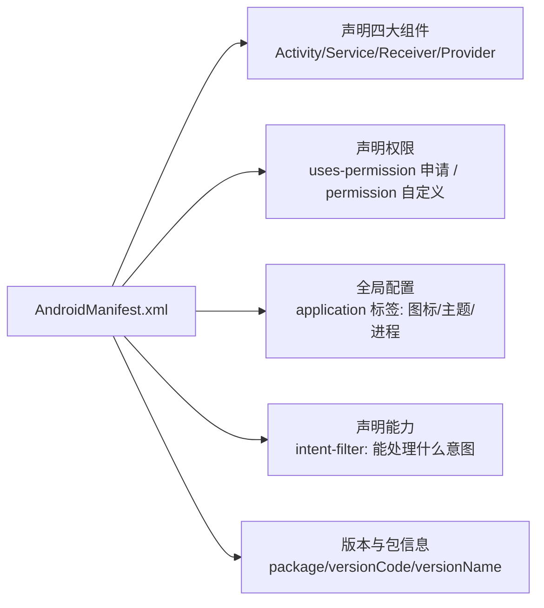

# Manifest 清单文件详解

> `AndroidManifest.xml` 是应用的"户口本"：所有组件、权限、全局配置都必须在这里向系统申报，否则系统不认识你的应用。清单文件的正确性是应用能否安装、组件能否被调用的前提。

## 一、Manifest 的作用

Manifest 的核心作用链路如下：



Manifest 各项作用说明如下：

| 作用 | 说明 |
|------|------|
| 组件注册 | 所有组件必须声明，否则运行时找不到（`ClassNotFoundException` 或组件未注册异常） |
| 权限声明 | 申请系统权限（`uses-permission`）与自定义权限 |
| 能力声明 | `intent-filter` 告诉系统"我能处理哪些隐式意图" |
| 全局属性 | 应用名、图标、主题、多进程、硬件特性要求等 |
| 元数据 | `<meta-data>` 给组件/应用附加键值对配置 |

## 二、整体结构

```xml
<?xml version="1.0" encoding="utf-8"?>
<manifest xmlns:android="http://schemas.android.com/apk/res/android">

    <!-- 1. 权限申请 -->
    <uses-permission android:name="android.permission.INTERNET" />
    <uses-permission android:name="android.permission.CAMERA" />

    <!-- 2. 应用声明 -->
    <application
        android:name=".WikiApplication"
        android:icon="@mipmap/ic_launcher"
        android:label="@string/app_name"
        android:theme="@style/Theme.Wiki"
        android:allowBackup="true">

        <!-- 3. 四大组件 -->
        <activity android:name=".MainActivity" android:exported="true">
            <intent-filter>
                <action android:name="android.intent.action.MAIN" />
                <category android:name="android.intent.category.LAUNCHER" />
            </intent-filter>
        </activity>

        <service android:name=".DownloadService" android:exported="false" />

        <receiver android:name=".BootReceiver" android:exported="false">
            <intent-filter>
                <action android:name="android.intent.action.BOOT_COMPLETED" />
            </intent-filter>
        </receiver>

        <provider
            android:name=".data.AppProvider"
            android:authorities="com.example.app.provider"
            android:exported="false" />
    </application>

</manifest>
```

## 三、application 标签常用属性

application 标签常用属性说明如下：

| 属性 | 作用 | 常见值 |
|------|------|--------|
| `android:name` | Application 实现类 | `.WikiApplication` |
| `android:label` | 应用/组件显示名 | `@string/app_name` |
| `android:icon` | 应用图标 | `@mipmap/ic_launcher` |
| `android:theme` | 全局主题 | `@style/Theme.Wiki` |
| `android:allowBackup` | 是否允许备份数据 | `false`（隐私合规推荐） |
| `android:supportsRtl` | 是否支持 RTL 布局 | `true` |
| `android:usesCleartextTraffic` | 是否允许明文 HTTP | `false`（默认关闭，需显式开启） |
| `android:hardwareAccelerated` | 是否硬件加速 | `true` |
| `android:requestLegacyExternalStorage` | 兼容旧存储路径 | Android 10 兼容用 |
| `android:networkSecurityConfig` | 网络安全配置（白名单） | `@xml/network_security_config` |

## 四、组件声明要点

### Activity

```xml
<activity
    android:name=".DetailActivity"
    android:exported="false"           <!-- Android 12+ 必须显式声明 -->
    android:launchMode="singleTop"      <!-- 启动模式 -->
    android:screenOrientation="portrait" <!-- 屏幕方向 -->
    android:configChanges="orientation|screenSize" <!-- 自行处理配置变更 -->
    android:theme="@style/Theme.Detail">
    <intent-filter>...</intent-filter>
    <meta-data android:name="param" android:value="val" />
</activity>
```

::: warning Android 12+ 强制规则
从 Android 12（API 31）起，任何声明了 `<intent-filter>` 的组件**必须显式设置 `android:exported`**，否则安装失败（`INSTALL_PARSE_FAILED_MANIFEST_MALFORMED`）。`exported="true"` 表示可被其他应用调用（如主入口、Deep Link 接收方）；仅应用内部使用的组件设为 `false`。
:::

### Service / Receiver / Provider

```xml
<!-- 前台服务必须声明 FOREGROUND_SERVICE 权限（Android 14+ 还需对应类型权限） -->
<service
    android:name=".MusicService"
    android:exported="false"
    android:foregroundServiceType="mediaPlayback" />

<!-- 静态注册广播：系统广播需注意隐式广播限制 -->
<receiver
    android:name=".BootReceiver"
    android:exported="false">
    <intent-filter>
        <action android:name="android.intent.action.BOOT_COMPLETED" />
    </intent-filter>
</receiver>

<!-- ContentProvider: authorities 是全局唯一标识 -->
<provider
    android:name=".data.AppProvider"
    android:authorities="com.example.app.provider"
    android:exported="false" />
```

四大组件声明的必配项与常见坑如下：

| 组件 | 必配项 | 常见坑 |
|------|--------|--------|
| Activity | `name` + `exported` | 有 filter 未声明 exported → 安装失败 |
| Service | `name` + 前台服务权限 | Android 14 起前台服务需声明 `foregroundServiceType` |
| Receiver | `name` + 系统广播权限 | Android 8+ 隐式广播大部分被限制 |
| Provider | `name` + `authorities` | authorities 冲突 → 安装失败 |

## 五、权限体系

### 权限申请

```xml
<!-- 普通权限：安装时自动授予 -->
<uses-permission android:name="android.permission.INTERNET" />

<!-- 危险权限：运行时动态申请 -->
<uses-permission android:name="android.permission.CAMERA" />
<uses-permission android:name="android.permission.ACCESS_FINE_LOCATION" />

<!-- 特殊权限：设置页手动授予 -->
<uses-permission android:name="android.permission.SYSTEM_ALERT_WINDOW" />
```

### 自定义权限

```xml
<!-- 定义：保护级别 normal / dangerous / signature -->
<permission
    android:name="com.example.app.permission.READ_DATA"
    android:protectionLevel="signature" />

<!-- 使用：组件被调用方需持有该权限 -->
<provider
    android:name=".SecretProvider"
    android:permission="com.example.app.permission.READ_DATA"
    android:exported="true" />
```

## 六、intent-filter 与能力声明

```xml
<!-- Deep Link：网页链接唤起 -->
<intent-filter>
    <action android:name="android.intent.action.VIEW" />
    <category android:name="android.intent.category.DEFAULT" />
    <category android:name="android.intent.category.BROWSABLE" />
    <data android:scheme="https"
          android:host="wikiandroid.com" />
</intent-filter>
```

**匹配规则细节**：[IntentFilter 匹配规则](/android/intent/intent-filter.md) 已详解。要点：`action` 必中其一、`category` 全包含、`data` 逐级匹配。

## 七、多进程配置

```xml
<application>
    <!-- 默认进程：包名 -->
    <activity android:name=".MainActivity" />

    <!-- :push 表示私有进程（进程名 = 包名:push） -->
    <service
        android:name=".PushService"
        android:process=":push" />

    <!-- 全限定名进程（全局可见，可跨应用共享） -->
    <provider
        android:name=".RemoteProvider"
        android:process="com.example.app.remote" />
</application>
```

三种进程写法的对比说明如下：

| 写法 | 进程名 | 特点 |
|------|--------|------|
| 不写 | 包名 | 默认主进程 |
| `:push` | `包名:push` | 私有进程，前缀冒号，仅本应用 |
| `com.example.xxx` | 全限定名 | 全局进程，可被其他应用（同 UID）复用 |

## 八、常见错误与排查

常见 Manifest 错误的排查对照如下：

| 错误信息 | 原因 | 解决方案 |
|----------|------|----------|
| `INSTALL_PARSE_FAILED_MANIFEST_MALFORMED` | 语法错误 / exported 未声明 | 检查 XML 语法；补全 exported |
| `ClassNotFoundException` | 组件名拼错或未声明 | 检查 `android:name` 全限定名与声明 |
| `Unable to instantiate activity` | 组件未在 Manifest 注册 | 在 Manifest 声明该组件 |
| `java.lang.SecurityException` | 缺少权限声明 | 添加 `uses-permission` |
| `INSTALL_FAILED_CONFLICTING_PROVIDER` | authorities 冲突 | 更换唯一 authorities |
| `ActivityNotFoundException` | 隐式 Intent 无匹配组件 | 检查 intent-filter 匹配规则 |

## 九、高频面试题精讲

**Q1：Manifest 的作用？哪些必须声明？**
A：Manifest 是应用的清单文件，向系统声明应用的所有信息：① 四大组件（Activity/Service/Receiver/Provider）——**所有组件必须声明**，否则运行时找不到组件；② 权限（申请与自定义）；③ 应用全局属性（名称/图标/主题）；④ 能力声明（intent-filter）。系统安装时解析它生成组件索引，运行时 AMS/PMS 依据它校验与调度组件。

**Q2：android:exported 的作用？为什么 Android 12 强制要求？**
A：`exported` 表示组件是否可被**其他应用**调用。`true`：允许跨应用调用（主入口、Deep Link 接收方、需要被外部调用的服务）；`false`：仅本应用内部使用，外部调用会抛 `SecurityException`。Android 12 起强制声明是为了安全——防止开发者遗漏导致组件意外暴露，引发任意调用、数据泄露等风险。**有 intent-filter 的组件尤其要谨慎设为 true**。

**Q3：uses-permission 与 permission 的区别？**
A：`uses-permission` 是**申请**使用系统或其他应用定义的权限；`<permission>` 是**定义**自己的自定义权限（含 `protectionLevel`：normal 自动授予 / dangerous 运行时确认 / signature 仅同签名应用）。自定义权限可挂在组件上（`android:permission`），实现"只有持权应用能调用我"的防护。

**Q4：Service 与 Provider 声明中最容易踩的坑？**
A：Service：前台服务必须在 Android 14+ 声明 `foregroundServiceType` 且申请对应类型权限；后台启动服务受限（`ContextCompat.startForegroundService`）。Provider：`authorities` 必须全局唯一，否则安装冲突；跨应用访问需考虑 `exported` 与权限。

**Q5：android:process 有什么用？如何选择进程划分？**
A：`android:process` 指定组件运行的独立进程。用途：① 长连接/推送服务放独立进程，主进程崩溃不影响（如微信 push 进程）；② 需要跨应用共享的组件用全局进程。注意：**Application 会在每个进程各初始化一次**，需判断进程做差异化初始化；进程间通信成本上升（Binder），不要滥用。

**Q6：如何通过 Manifest 实现"应用内只允许主进程访问 ContentProvider"？**
A：将 Provider 的 `android:exported="false"`（仅同应用进程可访问），或自定义 `signature` 级别权限并设置 `android:permission`。若只想限制某几个进程：利用 `android:process` 划分 + 在 Provider 内校验 `Binder.getCallingPid()` 所属进程。

## 十、小结

- **Manifest = 应用的户口本**：组件、权限、能力、全局配置全部在此申报
- **四大组件必须注册**：漏注册导致运行时找不到组件
- **exported 必须显式声明**（Android 12+），安全第一
- **intent-filter 声明能力**：Main/Launcher 入口、Deep Link、文件打开
- **多进程用 process 划分**：注意 Application 每个进程初始化一次
- **排查有据**：安装失败/运行异常优先查 Manifest 声明与权限

> 进阶阅读：[运行时权限机制详解](/android/permission/permission-basics.md) | [IntentFilter 匹配规则](/android/intent/intent-filter.md) | [Application 详解](/android/app/application-basics.md)
