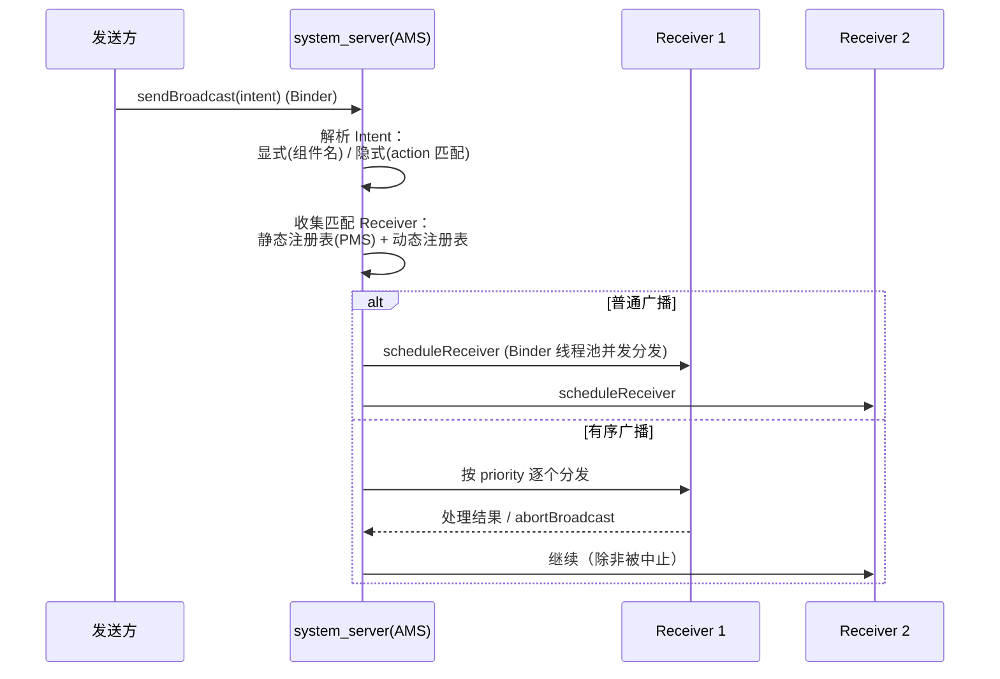

# 📡 BroadcastReceiver 详解

> 面试高频指数：⭐⭐⭐⭐
> 广播是四大组件中"最轻量"的一个，但版本限制最多、坑点最密集。

## 1. 什么是 BroadcastReceiver

**BroadcastReceiver** 是 Android 四大组件之一，用于**接收系统或应用发出的广播消息**。
它本身不包含 UI，通常作为"事件通知的接收端"存在。

工作流程：

```text
发送方（系统/应用）
    │ sendBroadcast(intent)
    ▼
AMS 匹配 Intent-Filter → 找到所有符合条件的 Receiver
    ▼
按规则分发（普通/有序/粘性）→ 回调 onReceive()
```

## 2. 两种注册方式

### 2.1 静态注册（Manifest）

```xml
<receiver
    android:name=".BootReceiver"
    android:exported="true">
    <intent-filter>
        <action android:name="android.intent.action.BOOT_COMPLETED" />
    </intent-filter>
</receiver>
```

```kotlin
class BootReceiver : BroadcastReceiver() {
    override fun onReceive(context: Context, intent: Intent) {
        if (intent.action == Intent.ACTION_BOOT_COMPLETED) {
            // 开机后自启动逻辑
        }
    }
}
```

- 系统在 **App 未启动时** 也能唤醒接收（包安装时注册）。
- **Android 8.0+ 限制**：大多数隐式广播（非显式指定包名）无法静态注册接收。

### 2.2 动态注册（代码）

```kotlin
class MainActivity : AppCompatActivity() {

    private val receiver = object : BroadcastReceiver() {
        override fun onReceive(context: Context, intent: Intent) {
            val level = intent.getIntExtra(BatteryManager.EXTRA_LEVEL, -1)
            batteryText.text = "电量: $level%"
        }
    }

    override fun onStart() {
        super.onStart()
        val filter = IntentFilter(Intent.ACTION_BATTERY_CHANGED)
        // Android 13+ 需要指定 RECEIVER_EXPORTED / RECEIVER_NOT_EXPORTED
        if (Build.VERSION.SDK_INT >= Build.VERSION_CODES.TIRAMISU) {
            registerReceiver(receiver, filter, Context.RECEIVER_EXPORTED)
        } else {
            registerReceiver(receiver, filter)
        }
    }

    override fun onStop() {
        super.onStop()
        unregisterReceiver(receiver)  // 必须注销，否则泄漏
    }
}
```

**动态注册特点**：跟随组件生命周期，`onStop/onDestroy` 时必须 `unregisterReceiver`，否则内存泄漏。

## 3. 广播类型

### 3.1 普通广播（无序广播）

```kotlin
val intent = Intent("com.example.MY_ACTION")
sendBroadcast(intent)
```

- 所有匹配的 Receiver **随机顺序**收到，互不影响。
- 接收方不能修改结果，也不能阻断传播。

### 3.2 有序广播

```kotlin
sendOrderedBroadcast(
    Intent("com.example.ORDERED_ACTION"),
    null,              // receiverPermission
    null, null,        // resultReceiver / scheduler
    Activity.RESULT_OK, null, null  // 初始结果
)
```

```kotlin
// 接收方 1：修改结果
override fun onReceive(context: Context, intent: Intent) {
    resultData = "被修改的数据"      // 修改结果
    abortBroadcast()                 // 终止后续接收
}
// 接收方 2（后面的 Receiver）：读取结果
override fun onReceive(context: Context, intent: Intent) {
    val data = resultData           // 拿到前面修改后的数据
}
```

- 按优先级（`android:priority`）依次分发。
- 接收方可以 `setResultData` 修改结果、`abortBroadcast` 终止传递。
- 典型场景：短信拦截、来电拦截。

### 3.3 粘性广播（已废弃）

```kotlin
// 已废弃，不要使用
sendStickyBroadcast(intent)
```

- `ACTION_BATTERY_CHANGED` 等系统粘性广播仍在使用（可通过 `registerReceiver(null, filter)` 获取当前值）。

## 3.4 广播发送的安全实践

```kotlin
// ① 跨应用发送指定包名（显式）：绕开 8.0 静态注册限制 + 更安全
val intent = Intent("com.example.ACTION_SYNC").apply {
    setPackage("com.example.target")
}
sendBroadcast(intent)

// ② 发送时声明权限：只有声明了该权限的应用才能收到
sendBroadcast(intent, "com.example.permission.READ_SYNC")

// ③ 接收方校验发送者 UID（防伪造）
override fun onReceive(context: Context, intent: Intent) {
    val uid = getSendingUid()
    if (uid != expectedUid) return   // 校验发送方身份
}
```

## 3.5 广播的底层分发流程（AMS 侧）



- **动态注册**的 Receiver 由 AMS 在应用进程的注册表中维护；**静态注册**的在 PMS 安装时登记。
- 广播最终通过 `ApplicationThread.scheduleReceiver` 回调到 App 进程，`onReceive` 执行在**主线程**。
- 系统进程崩溃（system_server 重启）后，动态注册的 Receiver **全部失效**，需重新注册。

## 4. Android 版本限制汇总

| 版本 | 限制 |
| --- | --- |
| Android 8.0 (26) | 隐式广播静态注册受限（仅保留少量系统豁免广播） |
| Android 9 (28) | 前台服务需要权限，网络相关广播（CONNECTIVITY_ACTION）不再支持静态注册 |
| Android 13 (33) | 动态注册必须指定 `RECEIVER_EXPORTED` / `RECEIVER_NOT_EXPORTED` |
| Android 14 (34) | 动态注册接收**非系统广播**时若未指定导出标志会抛异常 |

**仍可静态注册的系统广播豁免列表**（部分）：

- `ACTION_BOOT_COMPLETED`（开机完成）
- `ACTION_LOCALE_CHANGED`（语言切换）
- `ACTION_MY_PACKAGE_REPLACED`（应用升级）
- `ACTION_LOCKED_BOOT_COMPLETED`（解锁前启动）
- `ACTION_PACKAGE_*` 部分（需注意细节差异）

## 5. LocalBroadcastManager 已废弃，用什么替代

`LocalBroadcastManager`（androidx.localbroadcastmanager）**已废弃**，官方推荐：

- **同进程事件总线**：改用 **LiveData / Flow（SharedFlow）** 或第三方事件总线（如 Kotlin 协程 Channel）。
- **跨组件通信**：ViewModel 共享。
- **保留场景**：`sendOrderedBroadcast` 与系统广播仍用 BroadcastReceiver。

```kotlin
// 推荐替代：SharedFlow 作为轻量事件总线
class EventBus {
    private val _events = MutableSharedFlow<String>(extraBufferCapacity = 64)
    val events: SharedFlow<String> = _events

    suspend fun emit(event: String) = _events.emit(event)
}

// 接收
lifecycleScope.launch {
    repeatOnLifecycle(Lifecycle.State.STARTED) {
        eventBus.events.collect { event ->
            // 处理事件
        }
    }
}
```

## 6. onReceive 的限制

```kotlin
override fun onReceive(context: Context, intent: Intent) {
    // ⚠️ 超时限制：前台广播约 10 秒，后台广播更短
    // onReceive 执行在主线程，不能做耗时操作
    // 可以：goAsync() 延长处理，或启动 Service/WorkManager
}
```

**超时机制详解**：AMS 对每个广播设置超时（BroadcastQueue 中的 `BROADCAST_TIMEOUT`）：

| 场景 | 超时时间 | 超时后果 |
|------|----------|----------|
| 前台广播（`setPackage`/高优先级） | ~10 秒 | 超时后 AMS 强制结束该 Receiver 进程（ANR 弹窗） |
| 后台广播（`FLAG_RECEIVER_FOREGROUND` 未设置） | 60 秒（分派慢时可能更低） | 同上 |

> 广播的超时是**从发送到 Receiver 处理完毕**的整体时限。静态注册的 Receiver 若进程未启动，系统会先启动进程再投递，这段时间也计入超时——所以静态注册的 `onReceive` 里**绝不能做耗时操作**。

`goAsync()` 模式：

```kotlin
class MyReceiver : BroadcastReceiver() {
    override fun onReceive(context: Context, intent: Intent) {
        val pendingResult = goAsync()   // 声明异步处理（最多 10 秒宽限）
        GlobalScope.launch(Dispatchers.IO) {
            try {
                // 耗时操作（如写数据库）
            } finally {
                pendingResult.finish()   // 必须调用 finish()
            }
        }
    }
}
```

::: danger 注意
- `goAsync()` 只是把超时"记到你的账上"，不是无限期；不调用 `finish()` 依然会超时被杀。
- 更推荐的做法：`onReceive` 里只做"转发"——启动 WorkManager / 前台服务，立即返回。
- 静态注册的 Receiver 被拉起时进程处于**前台优先级**（`PROCESS_STATE_...`），`onReceive` 返回后进程降级，随时可能被回收。
:::

## 7. 高频面试题

**Q1：广播的 onReceive 能执行耗时操作吗？**
A：不能。`onReceive` 运行在主线程，且系统对广播执行有时间限制（前台约 10 秒，后台更短）。
耗时操作应使用 `goAsync()` 或交给 `WorkManager`/前台服务。

**Q2：静态注册与动态注册的优先级区别？**
A：静态注册在 App 未运行时也能被系统唤醒（由 AMS 维护注册表）；动态注册只在组件存活期间有效，
且优先级更高（有序广播中先收到）。

**Q3：LocalBroadcastManager 为什么废弃？**
A：它本质是"应用内 Handler 分发"，与系统广播无关，用 LiveData/Flow 能实现同样效果且更
符合响应式架构；同时官方希望减少混淆（很多人误以为它走了系统广播流程）。

**Q4：如何从后台接收网络状态变化？**
A：`CONNECTIVITY_ACTION` 从 Android 7.0 起不再支持静态注册。替代方案：`ConnectivityManager.registerDefaultNetworkCallback()`（推荐）或动态注册 + 前台服务。

## 8. 小结

- 广播 = 系统/应用的事件通知机制；两种注册方式各有取舍。
- 8.0+ 隐式广播静态注册受限，13/14 动态注册需导出标志。
- `LocalBroadcastManager` 已废弃 → 用 Flow/LiveData。
- `onReceive` 有超时限制，耗时操作需 `goAsync()` 或转交后台组件。
