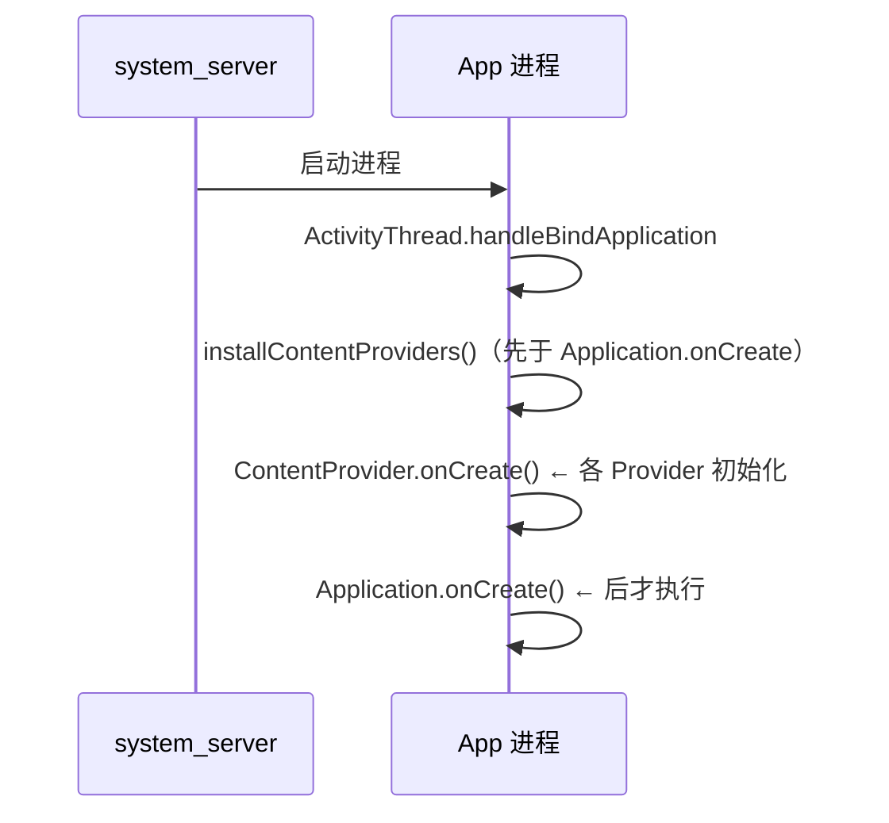

# ContentProvider 详解

> 面试高频指数：高
> 理解 ContentProvider 是理解"跨应用数据共享"和系统数据源（联系人、相册）的关键。

## 1. 什么是 ContentProvider

**ContentProvider** 是四大组件之一，用于**跨进程共享数据**。它将数据以"URI 资源"的形式
暴露给其他应用，底层基于 **Binder** 通信。

核心思想：

```text
客户端 App
  │ ContentResolver.query(uri)
  ▼
AMS 根据 authority 找到目标 Provider（跨进程）
  ▼
ContentProvider 实现类（服务端，可能在不同进程）
  │ 操作 SQLite / 文件 / 网络
  ▼
返回 Cursor 或数据
```

> **注意**：ContentProvider 的 `onCreate` 在 **Application.onCreate 之前** 执行（用于初始化）。

## 2. URI 结构

URI（Uniform Resource Identifier）用于定位 Provider 中的数据：

```text
content://com.example.provider/user/10
│        │                      │    │
协议      authority（唯一标识）   path   id（可选）
```

| 部分 | 示例 | 说明 |
| --- | --- | --- |
| scheme | `content://` | 固定前缀 |
| authority | `com.example.provider` | Provider 的唯一标识（Manifest 中声明） |
| path | `/user` | 数据表/集合 |
| id | `/10` | 具体某条数据（可选） |

### 2.1 UriMatcher 匹配

```kotlin
class UserProvider : ContentProvider() {

    companion object {
        private const val USERS = 1
        private const val USER_ID = 2
        private val uriMatcher = UriMatcher(UriMatcher.NO_MATCH).apply {
            addURI(AUTHORITY, "user", USERS)          // content://.../user
            addURI(AUTHORITY, "user/#", USER_ID)      // content://.../user/10
        }
    }

    override fun query(
        uri: Uri, projection: Array<out String>?, selection: String?,
        selectionArgs: Array<out String>?, sortOrder: String?
    ): Cursor? {
        return when (uriMatcher.match(uri)) {
            USERS -> db.query("user", projection, selection, selectionArgs, null, null, sortOrder)
            USER_ID -> {
                val id = uri.lastPathSegment
                db.query("user", projection, "$selection AND _id=?", 
                    selectionArgs + arrayOf(id), null, null, sortOrder)
            }
            else -> throw IllegalArgumentException("Unknown URI: $uri")
        }
    }

    override fun insert(uri: Uri, values: ContentValues?): Uri? {
        val id = db.insert("user", null, values)
        // 通知观察者数据变化
        contentResolver.notifyChange(Uri.parse("content://$AUTHORITY/user"), null)
        return ContentUris.withAppendedId(uri, id)
    }

    override fun update(uri: Uri, values: ContentValues?, selection: String?, selectionArgs: Array<out String>?): Int {
        val count = db.update("user", values, selection, selectionArgs)
        contentResolver.notifyChange(uri, null)
        return count
    }

    override fun delete(uri: Uri, selection: String?, selectionArgs: Array<out String>?): Int {
        val count = db.delete("user", selection, selectionArgs)
        contentResolver.notifyChange(uri, null)
        return count
    }

    override fun onCreate(): Boolean { /* 初始化数据库 */ return true }

    override fun getType(uri: Uri): String? {
        return when (uriMatcher.match(uri)) {
            USERS -> "vnd.android.cursor.dir/vnd.example.user"
            USER_ID -> "vnd.android.cursor.item/vnd.example.user"
            else -> null
        }
    }
}
```

### 2.2 Manifest 声明

```xml
<provider
    android:name=".UserProvider"
    android:authorities="com.example.provider"
    android:exported="true"
    android:multiprocess="true" />
```

## 3. 客户端访问（ContentResolver）

```kotlin
class MainActivity : AppCompatActivity() {

    private fun queryUsers() {
        val uri = Uri.parse("content://com.example.provider/user")
        // query 返回 Cursor（跨进程传输的数据游标）
        contentResolver.query(uri, null, null, null, null)?.use { cursor ->
            while (cursor.moveToNext()) {
                val name = cursor.getString(cursor.getColumnIndexOrThrow("name"))
                Log.d("ContentProvider", "name=$name")
            }
        }
    }

    private fun insertUser(name: String) {
        val uri = Uri.parse("content://com.example.provider/user")
        val values = ContentValues().apply { put("name", name) }
        val newUri = contentResolver.insert(uri, values)
    }
}
```

### 3.1 权限保护

```xml
<!-- 服务端：声明读/写权限 -->
<permission android:name="com.example.provider.READ" android:protectionLevel="normal" />
<permission android:name="com.example.provider.WRITE" android:protectionLevel="normal" />

<provider
    android:name=".UserProvider"
    android:authorities="com.example.provider"
    android:readPermission="com.example.provider.READ"
    android:writePermission="com.example.provider.WRITE" />
```

```xml
<!-- 客户端：声明使用权限 -->
<uses-permission android:name="com.example.provider.READ" />
<uses-permission android:name="com.example.provider.WRITE" />
```

## 4. ContentObserver 数据观察

```kotlin
// 客户端注册观察者
val uri = Uri.parse("content://com.example.provider/user")
contentResolver.registerContentObserver(uri, true, observer)

private val observer = object : ContentObserver(Handler(Looper.getMainLooper())) {
    override fun onChange(selfChange: Boolean) {
        // 数据变化回调（主线程）
        refreshList()
    }
}

override fun onDestroy() {
    super.onDestroy()
    contentResolver.unregisterContentObserver(observer)
}
```

> 服务端在 `insert/update/delete` 中调用 `notifyChange(uri, null)` 后，客户端观察者才会收到回调。

## 5. 典型应用场景

### 5.1 读取系统联系人

```kotlin
val cursor = contentResolver.query(
    ContactsContract.CommonDataKinds.Phone.CONTENT_URI,
    arrayOf(
        ContactsContract.CommonDataKinds.Phone.DISPLAY_NAME,
        ContactsContract.CommonDataKinds.Phone.NUMBER
    ),
    null, null, null
)
```

### 5.2 读取相册图片

```kotlin
val cursor = contentResolver.query(
    MediaStore.Images.Media.EXTERNAL_CONTENT_URI,
    arrayOf(MediaStore.Images.Media._ID, MediaStore.Images.Media.DATA),
    null, null, null
)
```

### 5.3 应用初始化钩子

利用 Provider `onCreate` 在 `Application.onCreate` 前执行的特性，可做自动初始化：

```kotlin
class InitProvider : ContentProvider() {
    override fun onCreate(): Boolean {
        // 在 Application.onCreate 之前执行初始化
        // 典型：WorkManager 初始化、LeakCanary 初始化
        return true
    }
    // 其他方法返回 null/0
}
```

### 5.4 批量操作（ContentProviderOperation）

```kotlin
// 一次性批量增删改（事务性，性能远高于逐条调用）
val operations = ArrayList<ContentProviderOperation>()
operations += ContentProviderOperation.newInsert(USER_URI)
    .withValue("name", "Alice")
    .build()
operations += ContentProviderOperation.newUpdate(USER_URI)
    .withSelection("_id=?", arrayOf("1"))
    .withValue("name", "Bob")
    .build()
operations += ContentProviderOperation.newDelete(USER_URI)
    .withSelection("_id=?", arrayOf("2"))
    .build()

contentResolver.applyBatch(AUTHORITY, operations)
```

> 注意：`applyBatch` 是否真正"事务"取决于 Provider 实现（需在 `ContentProvider` 子类中重写 `applyBatch` 开启 `SQLiteDatabase.beginTransaction`）。

## 5.5 Provider 启动时机与 Application 的关系（源码角度）



- `ActivityThread.handleBindApplication` 中：先 `installContentProviders`（创建 Provider 实例并回调 `onCreate`），再回调 `Application.onCreate`。
- 因此 **Provider 的 `onCreate` 一定先于 `Application.onCreate`**——这是 SDK 自动初始化（WorkManager、LeakCanary、Firebase）的底层保证。
- 副作用：Provider 过多且 `onCreate` 重会**拖慢冷启动**（每个 Provider 实例化都要耗时）。这是 `androidx.startup`（App Startup）库优化的问题——它把所有初始化器合并到一个 Provider。

## 6. ContentProvider vs 其他方案

| 方案 | 跨进程 | 类型安全 | 数据变化通知 | 适用场景 |
| --- | --- | --- | --- | --- |
| ContentProvider | ✓ | 一般（Cursor） | ✓（ContentObserver） | 跨应用数据共享 |
| AIDL/Service | ✓ | ✓ | 需自实现 | 跨进程方法调用 |
| 文件/SharedPreferences | 需自处理 | ✗ | ✗ | 简单数据 |
| Room（应用内） | ✗ | ✓ | ✓（Flow） | 应用内数据库 |

## 7. 高频面试题

**Q1：ContentProvider 底层原理？**
A：基于 Binder。客户端通过 `ContentResolver` 拿到 `IContentProvider` 的 Binder 代理，
跨进程调用服务端 Provider 的 query/insert 等方法，底层最终访问 SQLite/文件。

**Q2：ContentProvider 的 onCreate 与 Application.onCreate 谁先执行？**
A：Provider 的 `onCreate` 先于 `Application.onCreate`。因为 Provider 在 Application 实例化
阶段就需要注册完成（如 WorkManager 初始化依赖此顺序）。

**Q3：query 返回的 Cursor 如何跨进程传输？**
A：`Cursor` 本身不可序列化，系统使用 **BulkCursorToCursorAdaptor** 机制：Binder 传输
`IContentCursor`（跨进程游标接口），按需分批拉取数据（`onMove` 时按窗口获取数据行）。

**Q4：ContentObserver 回调在哪个线程？**
A：由注册时传入的 Handler 决定。传主线程 Handler 则在主线程回调；不传则在 Binder 线程回调。

**Q5：为什么说 ContentProvider 适合作为"初始化钩子"？**
A：它的 `onCreate` 在所有应用组件初始化之前被系统调用，且即使 App 未被用户启动，
只要其他应用访问该 Provider 也会触发初始化。但要注意这也会**拖慢冷启动**，应轻量化。

**Q6：ContentProvider 与直接使用 SQL 有什么区别？**
A：① ContentProvider **屏蔽了数据存储细节**，内部实现透明化，调用方只需关心 URI 是否匹配；
② ContentProvider 能实现**跨应用数据共享**，SQL 只能被本程序访问；
③ ContentProvider 还能对**本地文件、XML 等非数据库数据**进行增删改查，不局限于 SQLite。

**Q7：Provider 的 CRUD 方法运行在什么线程？需要处理线程同步吗？**
A：`insert/delete/update/query` 运行在 **Binder 线程池**中（由系统从调用方所在进程的 Binder 线程池调度），
多个调用方可能并发访问，因此服务端实现**必须自行处理线程同步**（如使用 SQLite 的事务锁）。

## 8. 小结

- ContentProvider = URI 寻址 + Binder 传输 + CRUD 抽象。
- 服务端需实现 `query/insert/update/delete/getType/onCreate`。
- `ContentObserver` 实现数据变化通知；权限通过 manifest 声明。
- 面试重点：底层 Binder、onCreate 时机、Cursor 跨进程机制。
