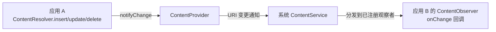
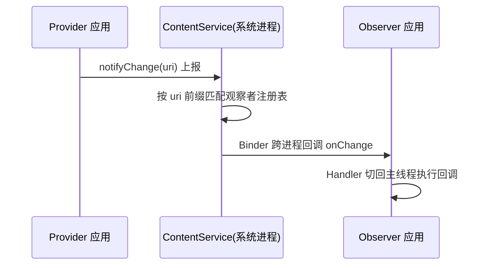

# ContentObserver 数据监听机制

> 面试高频指数：中 — 数据库/通讯录/系统设置数据变化的监听方案，ContentObserver 与 Provider 的配合机制是内容组件体系的重要考点。

## 一、ContentObserver 是什么

**ContentObserver（内容观察者）** 用于监听 ContentProvider 数据的增删改变化。任何应用修改了某张数据表，其他应用通过注册的 Observer 都能收到通知，实现**跨进程的数据变更感知**。



## 二、核心用法

### 2.1 注册与注销

```kotlin
class ContactsFragment : Fragment() {

    // 1. 定义观察者
    private val contactsObserver = object : ContentObserver(Handler(Looper.getMainLooper())) {
        override fun onChange(selfChange: Boolean) {
            // 数据变化回调（主线程）
            reloadContacts()
        }

        override fun onChange(selfChange: Boolean, uri: Uri?) {
            super.onChange(selfChange, uri)
            // 带具体 URI 的回调（API 16+）
        }
    }

    private var isRegistered = false

    override fun onStart() {
        super.onStart()
        // 2. 注册监听
        requireContext().contentResolver.registerContentObserver(
            ContactsContract.Contacts.CONTENT_URI,  // 观察的 URI
            true,                                    // 是否监听子路径
            contactsObserver
        )
        isRegistered = true
    }

    override fun onStop() {
        super.onStop()
        // 3. 必须注销，防止泄漏
        if (isRegistered) {
            requireContext().contentResolver.unregisterContentObserver(contactsObserver)
            isRegistered = false
        }
    }
}
```

### 2.2 通知数据变化（Provider 侧）

ContentProvider 在数据变更后需要主动通知：

```kotlin
class MyProvider : ContentProvider() {
    override fun insert(uri: Uri, values: ContentValues?): Uri? {
        // ...写入数据库
        val newUri = Uri.withAppendedPath(uri, id.toString())
        // 通知所有监听该 URI 的观察者
        context?.contentResolver?.notifyChange(newUri, null)
        return newUri
    }

    override fun update(uri: Uri, values: ContentValues?, selection: String?, selectionArgs: Array<String>?): Int {
        val count = super.update(uri, values, selection, selectionArgs)
        if (count > 0) {
            context?.contentResolver?.notifyChange(uri, null)
        }
        return count
    }
}
```

## 三、跨进程分发原理



- `registerContentObserver` 通过 Binder 把观察者注册到系统的 **ContentService**
- `notifyChange` 时系统按 URI 做前缀匹配，分发到所有注册者
- 观察者内部用 Handler 封装，回调运行在注册时指定的线程
- `selfChange` 标记本次变更是否由自己应用发起

## 四、经典应用场景

### 4.1 监听系统通讯录

```kotlin
// 通讯录变化实时感知
val uri = ContactsContract.Contacts.CONTENT_URI
contentResolver.registerContentObserver(uri, true, observer)
```

### 4.2 监听系统设置

```kotlin
// 监听系统语言变化
val uri = Settings.System.getUriFor(Settings.System.LOCALE)
contentResolver.registerContentObserver(uri, false, localeObserver)
```

### 4.3 监听媒体库（相册）

```kotlin
// 相册新增图片
val uri = MediaStore.Images.Media.EXTERNAL_CONTENT_URI
contentResolver.registerContentObserver(uri, true, mediaObserver)
```

### 4.4 监听自己 Provider 的表变化

```kotlin
// 数据表变化 → 自动刷新列表
val uri = Uri.parse("content://com.example.app.provider/article")
contentResolver.registerContentObserver(uri, true, articleObserver)
```

## 五、与 Flow / LiveData 结合

### 5.1 封装为回调 Flow

```kotlin
fun Context.observeContentChanges(uri: Uri, notifyForDescendants: Boolean = true): Flow<Uri> = callbackFlow {
    val observer = object : ContentObserver(Handler(Looper.getMainLooper())) {
        override fun onChange(selfChange: Boolean, uri: Uri?) {
            trySend(uri ?: this@observeContentChanges.uri)
        }
    }
    contentResolver.registerContentObserver(uri, notifyForDescendants, observer)
    awaitClose {
        contentResolver.unregisterContentObserver(observer)
    }
}
```

### 5.2 配合 Room invalidate

Room 内部就是通过 `InvalidationTracker` + ContentObserver 机制感知表变化的：Room 在 SQLite 表上注册观察者，数据变更后自动通知 Flow 重新查询。

```kotlin
@Dao
interface ArticleDao {
    // 表数据变化时 Flow 自动发射新数据（底层就是 ContentObserver 机制）
    @Query("SELECT * FROM article WHERE id = :id")
    fun observeArticle(id: Long): Flow<Article?>
}
```

## 六、注意事项与坑点

| 注意点 | 说明 |
|--------|------|
| 必须成对注销 | `onStop`/`onDestroy` 中注销，否则观察者持有 Activity 引用导致泄漏 |
| 线程安全 | 回调线程由注册时 Handler 决定，默认 Looper 线程 |
| `notifyForDescendants` | true 监听 URI 的所有子路径，false 只监听精确 URI |
| 避免自我触发 | Provider 侧用 `selfChange` 区分自己写的变更 |
| 回调频繁 | 高频率数据（日志类）注意节流防卡顿 |
| 匿名内部类 | 用对象表达式时无法注销引用，需持有实例引用 |

## 七、高频面试题

### Q1：ContentObserver 的原理是什么？
::: details 查看答案
ContentObserver 采用观察者模式实现跨进程数据监听：应用通过 ContentResolver.registerContentObserver 把观察者注册到系统进程的 ContentService（Binder 通信）；数据变更方（Provider）调用 notifyChange 后，ContentService 按 URI 前缀匹配观察者注册表，通过 Binder 跨进程回调 onChange；观察者内部 Handler 把回调投递到指定线程执行。注销时 unregisterContentObserver 从注册表移除。
:::

### Q2：notifyChange 和 registerContentObserver 的 URI 匹配规则？
::: details 查看答案
registerContentObserver 的 notifyForDescendants 参数控制匹配范围：true 时监听指定 URI 及其所有子路径（前缀匹配），false 时只监听精确匹配的 URI。Provider 侧 notifyChange 传入的 URI 会与观察者注册的 URI 做匹配，匹配成功才分发。实践中数据库表的主 URI 用 notifyForDescendants=true 可覆盖整表所有行级 URI。
:::

### Q3：ContentObserver 回调在哪个线程？
::: details 查看答案
取决于注册时构造 ContentObserver 传入的 Handler：传入带主线程 Looper 的 Handler，回调在主线程；传入工作线程 Handler，回调在对应线程。若不传 Handler（null），回调在线程池线程执行。跨进程分发本身通过 Binder 线程池，Handler 负责把回调切到目标线程。UI 操作必须确保回调在主线程。
:::

### Q4：Room 的 Flow 自动刷新与 ContentObserver 有什么关系？
::: details 查看答案
Room 内部使用 InvalidationTracker 监听 SQLite 表变化：Room 打开数据库时注册内部 ContentObserver（观察的是 Room 内部通知 URI），任何表数据变更触发 invalidation，InvalidationTracker 通知依赖该表的 Flow/LiveData 重新查询发射新数据。这是 Room 响应式查询的底层机制，与手动 ContentObserver 监听同一套系统能力。
:::

### Q5：ContentObserver 会导致内存泄漏吗，如何避免？
::: details 查看答案
会。ContentObserver 注册到系统进程的 ContentService 后，系统进程持有观察者引用，而观察者可能持有 Activity/Fragment 引用，若未注销则 Activity 无法回收。避免方式：① 在 onStop/onDestroy 中调用 unregisterContentObserver 成对注销；② 观察者对象不要持有 Activity 强引用（用 ViewModel 或弱引用）；③ 用 Flow 封装（callbackFlow + awaitClose 自动注销）。
:::

## 八、小结

ContentObserver 是 ContentProvider 体系中的数据变化感知机制：

1. **注册**：`registerContentObserver(uri, notifyForDescendants, observer)`
2. **通知**：Provider 侧 `notifyChange(uri, null)` 触发分发
3. **原理**：系统 ContentService 做跨进程观察者分发
4. **应用**：通讯录/相册/设置监听、Room 响应式查询底层
5. **注意**：成对注销防泄漏、线程由 Handler 决定、URI 匹配范围控制

相关阅读：[ContentProvider 详解](/android/content-provider/content-provider-basics.md)、[FileProvider 跨应用文件分享](/android/content-provider/fileprovider.md)、[Room 详解](/jetpack/room-datastore/room-guide.md)。
