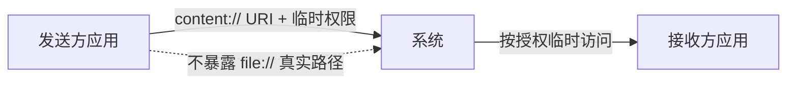
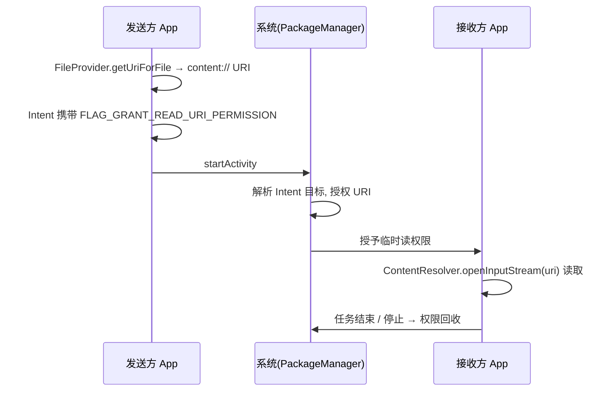

# FileProvider 跨应用文件分享

> 面试高频指数：高 — 拍照、分享、安装 APK 都要用到 FileProvider，`FileUriExposedException` 的成因与 content:// URI 机制是必考细节。

## 一、为什么需要 FileProvider

### 1.1 FileUriExposedException 的由来

Android 7.0（API 24）之前，应用间分享文件直接传递 `file://` 路径：

::: code-tabs

@tab:active Java

```java
Intent intent = new Intent(Intent.ACTION_VIEW);
intent.setDataAndType(Uri.fromFile(new File("/storage/emulated/0/DCIM/1.jpg")), "image/*");
```

@tab Kotlin

```kotlin
val intent = Intent(Intent.ACTION_VIEW)
intent.setDataAndType(Uri.fromFile(File("/storage/emulated/0/DCIM/1.jpg")), "image/*")
```

:::

这种方式的严重安全问题是：**file:// URI 暴露了文件的绝对路径**，接收方拿到路径后可以越权访问其他应用未授权的文件。

Android 7.0 起，系统禁止在 Intent 中暴露 `file://` URI，否则抛出 `FileUriExposedException`：

```
android.os.FileUriExposedException: file:///storage/emulated/0/... exposed beyond app through ClipData.Item
```

### 1.2 content:// URI 方案

官方方案是用 **ContentProvider 生成 content:// URI**，由系统级授权机制（临时权限）控制访问范围：



- `content://` 不暴露真实路径，由 Provider 内部映射
- 通过 Intent 的 `FLAG_GRANT_READ_URI_PERMISSION` 授予**临时读写权限**
- 权限在接收方处理完（或任务结束）后自动失效

## 二、FileProvider 配置

### 2.1 Manifest 声明

```xml
<application>
    <provider
        android:name="androidx.core.content.FileProvider"
        android:authorities="${applicationId}.fileprovider"
        android:exported="false"
        android:grantUriPermissions="true">
        <meta-data
            android:name="android.support.FILE_PROVIDER_PATHS"
            android:resource="@xml/file_paths" />
    </provider>
</application>
```

| 属性 | 说明 |
|------|------|
| `android:name` | 固定为 `androidx.core.content.FileProvider`（框架实现） |
| `android:authorities` | 唯一标识，建议 `${applicationId}.fileprovider`，重复会冲突 |
| `android:exported` | 必须为 false（由系统通过 grantUriPermissions 授权） |
| `android:grantUriPermissions` | true，允许授予临时权限 |
| `meta-data` | 指定路径映射配置 `@xml/file_paths` |

### 2.2 file_paths 配置

```xml
<?xml version="1.0" encoding="utf-8"?>
<paths>
    <files-path
        name="internal_files"
        path="." />
    <cache-path
        name="cache"
        path="." />
    <external-path
        name="external"
        path="." />
    <external-files-path
        name="external_files"
        path="." />
    <external-cache-path
        name="external_cache"
        path="." />
    <!-- Android 11+ 支持共享存储根目录 -->
    <root-path
        name="root"
        path="." />
</paths>
```

### 2.3 标签与根目录对应表

| 标签 | 根目录（context 相对） | 示例 |
|------|------------------------|------|
| `<root-path>` | 文件系统根 `/` | 整个设备（谨慎使用） |
| `<files-path>` | `context.getFilesDir()` | `/data/data/<pkg>/files` |
| `<cache-path>` | `context.getCacheDir()` | `/data/data/<pkg>/cache` |
| `<external-path>` | `Environment.getExternalStorageDirectory()` | `/storage/emulated/0` |
| `<external-files-path>` | `context.getExternalFilesDir(null)` | `/storage/emulated/0/Android/data/<pkg>/files` |
| `<external-cache-path>` | `context.getExternalCacheDir()` | `/storage/emulated/0/Android/data/<pkg>/cache` |

> 安全要点：`path` 用 `.` 表示整个根目录，但暴露范围越大越不安全。生产环境建议**精确到子目录**，例如 `path="images/"` 只暴露图片目录，防止接收方越权读取同根目录下的其他文件。

## 三、生成与使用 content URI

### 3.1 获取 URI

::: code-tabs

@tab:active Java

```java
// 核心 API
Uri uri = FileProvider.getUriForFile(
    context,
    context.getPackageName() + ".fileprovider",
    file
);
```

@tab Kotlin

```kotlin
// 核心 API
val uri: Uri = FileProvider.getUriForFile(
    context,
    "${context.packageName}.fileprovider",
    file
)
```

:::

生成的 URI 形如：`content://com.example.app.fileprovider/images/IMG_20260101.jpg`

### 3.2 授予临时权限

::: code-tabs

@tab:active Java

```java
// 拍照场景：相机需要写入输出文件
Intent intent = new Intent(MediaStore.ACTION_IMAGE_CAPTURE);
intent.putExtra(MediaStore.EXTRA_OUTPUT, photoUri);
// 授予相机写权限
intent.addFlags(Intent.FLAG_GRANT_WRITE_URI_PERMISSION);
```

@tab Kotlin

```kotlin
// 拍照场景：相机需要写入输出文件
val intent = Intent(MediaStore.ACTION_IMAGE_CAPTURE).apply {
    putExtra(MediaStore.EXTRA_OUTPUT, photoUri)
    // 授予相机写权限
    addFlags(Intent.FLAG_GRANT_WRITE_URI_PERMISSION)
}
```

:::

### 3.3 分享场景

::: code-tabs

@tab:active Java

```java
public void shareImage(Context context, File file) {
    Uri uri = FileProvider.getUriForFile(context, context.getPackageName() + ".fileprovider", file);
    Intent intent = new Intent(Intent.ACTION_SEND);
    intent.setType("image/*");
    intent.putExtra(Intent.EXTRA_STREAM, uri);
    // 授予读取权限
    intent.addFlags(Intent.FLAG_GRANT_READ_URI_PERMISSION);
    // 配合 ClipData，让系统把权限授予给所有目标应用
    intent.setClipData(ClipData.newUri(context.getContentResolver(), "分享图片", uri));
    startActivity(Intent.createChooser(intent, "分享到"));
}
```

@tab Kotlin

```kotlin
fun shareImage(context: Context, file: File) {
    val uri = FileProvider.getUriForFile(context, "${context.packageName}.fileprovider", file)
    val intent = Intent(Intent.ACTION_SEND).apply {
        type = "image/*"
        putExtra(Intent.EXTRA_STREAM, uri)
        // 授予读取权限
        addFlags(Intent.FLAG_GRANT_READ_URI_PERMISSION)
        // 配合 ClipData，让系统把权限授予给所有目标应用
        clipData = ClipData.newUri(contentResolver, "分享图片", uri)
    }
    startActivity(Intent.createChooser(intent, "分享到"))
}
```

:::

> 关键点：Android 4.4+ 的 `ClipData` 机制会把临时权限授予**所有可处理该 Intent 的应用**。只有 clipData 中的 URI 会被授权，单纯放 extras 在某些场景授权不生效。

## 四、临时权限机制



- 临时权限绑定**接收方进程 + URI + 授予类型**（读/写）
- 接收方任务栈销毁或进程停止后权限自动撤销
- `takePersistableUriPermission()` 可申请**持久授权**（配合 `FLAG_GRANT_PERSISTABLE_URI_PERMISSION`），适合文档编辑等场景

## 五、常见问题与排查

### 5.1 常见异常

| 异常 | 原因 | 解决 |
|------|------|------|
| `FileUriExposedException` | Intent 中直接传递 file:// URI | 改用 FileProvider content:// URI |
| `IllegalArgumentException: Failed to find configured root` | file_paths 中没有匹配目标文件的根目录 | 检查路径标签与文件位置是否匹配 |
| `SecurityException: Permission Denial` | 接收方无读取权限 | 确认 FLAG_GRANT_READ_URI_PERMISSION 与 ClipData 配置 |
| `authorities` 冲突 | 多 provider 使用相同 authorities | 使用 `${applicationId}.xxx` 保证唯一 |

### 5.2 常见坑点

- **authorities 必须全局唯一**，与其他应用重复会导致其中一个无法访问
- `external-path` 在 Android 11+ 分区存储下默认不可直接访问公共目录文件，需用 `MediaStore` 或 SAF
- 自定义 `FileProvider` 子类时，`onCreate` 中必须先 `super.onCreate()` 否则路径映射无效
- 拍照到 `getExternalFilesDir` 时，Android 10+ 无需存储权限（应用专属目录），但 Camera 应用写入输出 URI 仍需授权

## 六、高频面试题

### Q1：为什么 Android 7.0 起禁止 file:// URI？FileProvider 如何解决？
::: details 查看答案
file:// URI 暴露文件绝对路径，接收方拿到路径可越权访问文件，且无法控制访问范围。FileProvider 是 ContentProvider 子类，把本地文件映射为 content:// URI：① 不暴露真实路径；② 通过 Intent 的 FLAG_GRANT_READ/WRITE_URI_PERMISSION 授予临时权限；③ 权限由系统管理，接收方任务结束自动回收；④ exported=false 防止外部直接访问。
:::

### Q2：FileProvider 的 file_paths 配置里不同标签对应哪些目录？
::: details 查看答案
root-path 对应文件系统根 /；files-path 对应 getFilesDir()（内部私有目录）；cache-path 对应 getCacheDir()（缓存目录）；external-path 对应 Environment.getExternalStorageDirectory()（共享存储根）；external-files-path 对应 getExternalFilesDir()（应用专属外部目录）；external-cache-path 对应 getExternalCacheDir()。配置的 path 属性是相对这些根目录的子路径，"." 表示整个根目录。
:::

### Q3：临时权限的授予和回收机制是怎样的？
::: details 查看答案
发送方在 Intent 上添加 FLAG_GRANT_READ_URI_PERMISSION 或 FLAG_GRANT_WRITE_URI_PERMISSION，并携带 ClipData（Android 4.4+），系统解析 Intent 后把权限授予接收方进程，记录在包管理器中。回收时机：接收方任务栈销毁、进程停止、或 Activity 结果返回后自动回收。如需长期访问，用 takePersistableUriPermission() 请求持久授权（需 FLAG_GRANT_PERSISTABLE_URI_PERMISSION）。
:::

### Q4：拍照时如何把照片保存到应用私有目录并用 FileProvider 分享？
::: details 查看答案
① 在应用专属目录创建文件，如 File(context.filesDir, "photos/xxx.jpg")；② 用 FileProvider.getUriForFile 生成 content URI；③ 把 URI 放入 ACTION_IMAGE_CAPTURE 的 EXTRA_OUTPUT，并加 FLAG_GRANT_WRITE_URI_PERMISSION；④ 相机写完后通过 contentResolver 读取该 URI 展示或再次授权分享。这样无需任何存储权限即可完成拍照（Android 10+ 完全免权限）。
:::

### Q5：为什么 sometimes 分享 Intent 加了权限还是报 Permission Denial？
::: details 查看答案
常见原因：① 只把 URI 放在 EXTRA_STREAM 而没有 clipData，Android 4.4+ 的授权机制只针对 ClipData 中的 URI，需要同时设置 clipData = ClipData.newUri(...)；② 目标应用通过隐式 Intent 多目标解析时，只有 clipData 才能把权限授予所有匹配应用；③ authorities 写错或 file_paths 未覆盖目标文件路径导致 URI 本身无效；④ 用了自定义 FileProvider 子类但未调用 super.onCreate。
:::

## 七、小结

FileProvider 是 Android 应用间安全共享文件的标准方案：

1. **背景**：7.0 起禁止 file:// URI 暴露，改用 content:// + 临时权限
2. **配置**：Manifest 声明 provider + `file_paths` 路径映射，authorities 全局唯一
3. **使用**：`getUriForFile` 生成 URI + Intent Flags 授权 + ClipData 兜底
4. **安全**：路径精确到子目录、exported=false、权限自动回收
5. **场景**：拍照、分享、APK 安装、文档选择等一切跨应用文件传递

相关阅读：[ContentProvider 详解](/android/content-provider/content-provider-basics.md)、[ContentObserver 数据监听](/android/content-provider/contentobserver.md)、[Activity Result API 详解](/android/activity/activity-result-api.md)。
