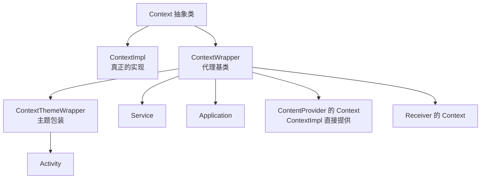
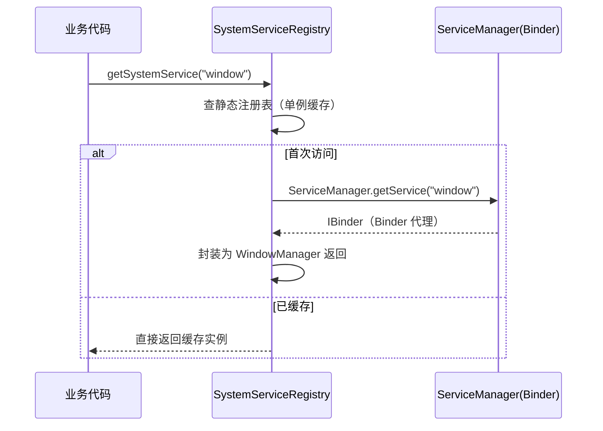

# Context 详解

> 面试高频指数：⭐⭐⭐⭐
> Context 是 Android 中最容易被忽视却无处不在的抽象——四大组件、资源加载、系统服务调用全都依赖它。理解 Context 的**继承体系、代理机制、类型区别与泄漏陷阱**是 Android 基本功。

## 一、Context 是什么

Context（上下文）是**对应用环境的抽象**：它封装了资源访问（Resources）、包信息（PackageManager）、类加载（ClassLoader）、文件 I/O、系统服务（getSystemService）、四大组件启动（startActivity/startService）等所有"与环境交互"的能力。

### 1.1 继承体系



- **ContextImpl**：真正的实现类，所有实际工作都在这里（资源、服务、组件启动）。
- **ContextWrapper**：代理类，把调用**委托给 mBase**（ContextImpl），方便子类覆盖行为。
- **ContextThemeWrapper**：在 ContextWrapper 基础上增加了主题能力，Activity 继承它。

### 1.2 ContextWrapper 代理机制（核心）

```java
// ContextWrapper 的所有方法都是委托给 mBase
public class ContextWrapper extends Context {
    Context mBase;

    public ContextWrapper(Context base) {
        mBase = base;
    }

    @Override
    public Resources getResources() {
        return mBase.getResources();   // 委托给 ContextImpl
    }

    @Override
    public Object getSystemService(String name) {
        return mBase.getSystemService(name);
    }
}
```

```java
// 组件创建时注入 base
protected void attachBaseContext(Context newBase) {
    if (mBase != null) {
        throw new IllegalStateException("Base context already set");
    }
    mBase = newBase;
}
```

**设计好处**：
- 可以**子类化 Context 修改行为**而不改原始实现（如 ContextThemeWrapper 注入主题）。
- 组件（Activity/Service/Application）各自持有自己的 Context 实例，行为可按需定制。

## 二、Context 的几种类型对比（必考）

| 类型 | 实例 | 生命周期 | 使用场景 |
| --- | --- | --- | --- |
| Application | 应用级单例 | 进程存活期间 | 全局单例、长生命周期对象、工具类初始化 |
| Activity | 界面级 | Activity 存在期间 | 创建 UI、Dialog、Toast、startActivity |
| Service | 服务级 | Service 存在期间 | Service 内部操作 |
| Receiver | 回调级 | onReceive 执行期间 | onReceive 内操作（不可持有！） |
| Provider | 组件级 | Provider 存在期间 | Provider 内部操作 |

### 2.1 Application vs Activity Context

| 对比项 | Application Context | Activity Context |
|--------|--------------------|------------------|
| 生命周期 | 进程级（长） | Activity 级（短） |
| 主题 | 无主题（默认） | 有主题（ContextThemeWrapper） |
| Dialog | ❌ 无 token 不可用 | ✅ 可用 |
| Toast | ✅ | ✅ |
| startActivity | 需 `FLAG_ACTIVITY_NEW_TASK` | ✅ 直接启动 |
| inflate 布局 | 无主题属性（可能错） | ✅ 正确应用主题 |

## 三、Context 数量问题

```text
一个应用进程中的 Context 数量 = Application(1) + Activity(N) + Service(N) + Receiver(每次回调临时) + Provider(N)
```

- **Application 只有一个**。
- 每个 Activity/Service 各有一个（随生命周期创建/销毁）。
- Receiver 的 Context 是**临时的**（onReceive 期间有效，结束后不可持有）。
- Provider 的 Context 在 Provider 创建时注入。

**判断技巧**：`context === context.applicationContext` 可判断当前是否为 Application Context。

## 四、使用注意事项与内存泄漏（核心考点）

### 4.1 内存泄漏案例

```kotlin
// ❌ 泄漏：单例持有 Activity Context
object UserManager {
    lateinit var context: Context   // 持有的是 Activity → Activity 无法回收
}

// ✅ 正确：用 Application Context
object UserManager {
    val context: Context = MyApp.instance   // 进程级，不泄漏
}
```

**泄漏链条**：单例 → Activity Context → Activity 持有 Window/DecorView → 整个 Activity 无法 GC。**LeakCanary 检测到的泄漏绝大多数是这类。**

```kotlin
// ❌ 泄漏：静态 View 引用（View 内部持 Activity）
companion object {
    var sView: View? = null
}

// ❌ 泄漏：内部类 Handler 持有 Activity
// ✅ 解决：静态内部类 + WeakReference，或 lifecycleScope
```

### 4.2 使用规则清单

1. **Dialog 必须用 Activity Context**（需要 Window token）；Application Context 会报 `BadTokenException`。
2. **长生命周期对象用 `getApplicationContext()`**，绝不持有 Activity/Service Context。
3. **Application Context 启动 Activity 需加 `FLAG_ACTIVITY_NEW_TASK`**（不在 Activity 栈中）。
4. **Receiver 的 Context 不能持有**（onReceive 结束后失效）。
5. **inflate 用 Activity Context**（保证主题/样式正确）。
6. `getBaseContext()` 返回 mBase（ContextImpl），业务中不要直接用。

## 五、getSystemService 原理

```java
// ContextImpl.getSystemService
@Override
public Object getSystemService(String name) {
    return SystemServiceRegistry.getSystemService(this, name);
}

// SystemServiceRegistry 维护服务单例注册表
public static Object getSystemService(ContextImpl ctx, String name) {
    ServiceFetcher<?> fetcher = SYSTEM_SERVICE_FETCHERS.get(name);
    return fetcher != null ? fetcher.getService(ctx) : null;
}
```



**要点**：
- 系统服务通过 **Binder** 与 system_server 通信（客户端代理 + 服务端实现）。
- 每种服务在进程内有**单例缓存**（ServiceFetcher），多次调用开销极小。
- `getSystemService` 是**纯内存查找**，不在主线程做 I/O，可放心主线程调用。

## 六、多进程与 Application 初始化

```kotlin
class MyApplication : Application() {
    override fun onCreate() {
        super.onCreate()
        val processName = getProcessName()
        if (processName == packageName) {
            // 主进程：完整初始化（推送、图片库、崩溃收集）
        } else {
            // 子进程（如 :remote）：只初始化必要的
        }
    }
}
```

> 多进程下 Application.onCreate 执行**多次**（每个进程一次），必须按进程名分支。详见[进程与保活](/android/process/process-lifecycle.md)。

## 七、高频面试题（带详解）

**Q1：Activity、Service、Application 的 Context 有什么区别？**
A：三者都是 ContextWrapper 子类，内部委托 ContextImpl。区别在生命周期与能力：Activity 有主题 + Window token（可弹 Dialog）；Service 无主题；Application 进程级、无主题。三者获取方式与使用场景不同。

**Q2：为什么单例不能持有 Activity Context？**
A：Activity 生命周期短，单例生命周期长（进程级），持有会导致 Activity 无法被 GC 回收 → 内存泄漏。应使用 `getApplicationContext()`。

**Q3：Application Context 能启动 Activity 吗？**
A：能，但必须添加 `FLAG_ACTIVITY_NEW_TASK`（因为不在 Activity 任务栈中，需要新任务）。

**Q4：Dialog 用 Application Context 会怎样？**
A：抛 `BadTokenException`——Dialog 需要 Window token，只有 Activity（或持有 token 的 View）能提供。Toast 无此问题。

**Q5：ContextWrapper 的作用？**
A：代理模式——把 Context 调用委托给 mBase（ContextImpl），使子类可以覆盖行为（如 ContextThemeWrapper 加主题、测试中 mock Context）。

**Q6：getSystemService 为什么能直接在主线程调用？**
A：它只是从 SystemServiceRegistry 的静态缓存中取实例（首次通过 Binder 从 system_server 获取代理并缓存），是纯内存操作，无 I/O 阻塞。

**Q7：Receiver 的 Context 为什么不能持有？**
A：Receiver 每次回调创建的 Context 是临时的，onReceive 返回后失效，持有会泄漏或拿到无效对象。

**Q8：如何判断当前是否为 Application Context？**
A：`context === context.applicationContext` 返回 true 即为 Application Context（Kotlin 用 `===` 引用比较）。

## 八、小结

- Context 体系：ContextImpl（实现）+ ContextWrapper（代理）+ ContextThemeWrapper（主题）。
- 类型选择心法：**短生命周期用短 Context，长生命周期用 Application Context**。
- 泄漏核心：单例/静态持有 Activity Context；Handler 内部类持有 Activity。
- getSystemService 是注册表单例查找 + Binder 代理，主线程安全。
- 多进程：Application.onCreate 多次执行，按进程名分支初始化。

> 📖 进阶阅读：[Activity 详解](/android/activity/activity-lifecycle.md) | [进程与保活](/android/process/process-lifecycle.md) | [Binder 机制](/system/binder/)
