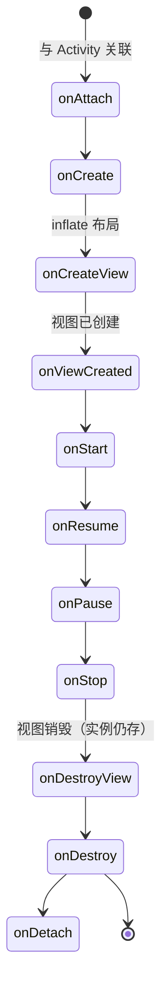
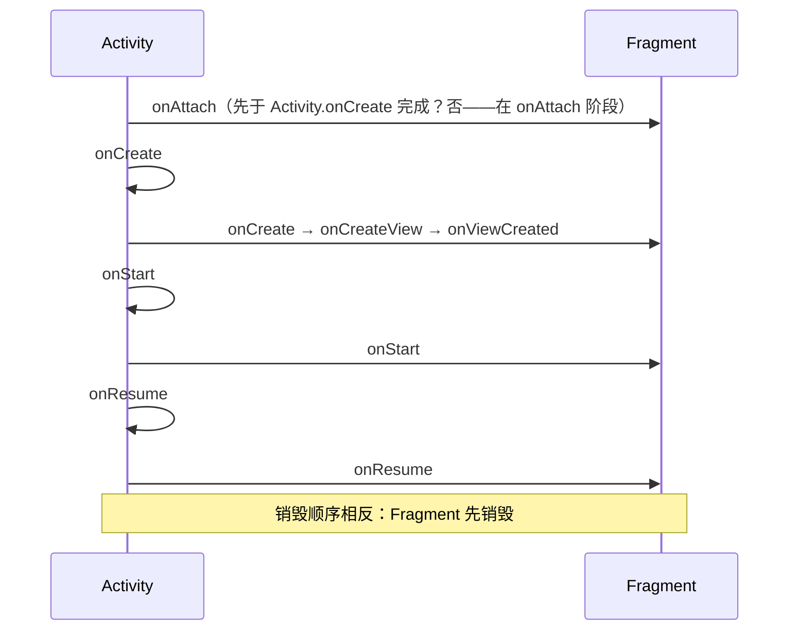

# Fragment 生命周期与通信

> Fragment 表示 Activity 中的一段**可重用 UI**，支持在不同屏幕尺寸下灵活组合。理解其**独特的生命周期模型**（与 View 生命周期分离）、**事务机制**与**通信方式**，是构建现代 Android 应用（单 Activity + 多 Fragment）的基础。

## 一、Fragment 生命周期

### 1.1 生命周期全景



### 1.2 生命周期与 Activity 联动



### 1.3 核心回调详解

| 回调 | 时机 | 典型操作 | 注意事项 |
|------|------|----------|----------|
| `onAttach` | 与 Activity 关联（最早） | 保存 Activity 引用、初始化接口回调 | 此时 Activity 可能还未 `onCreate` |
| `onCreate` | Fragment 创建 | 初始化**非 View** 数据（ViewModel、参数解析） | 不要在此访问 View |
| `onCreateView` | 创建 UI 视图 | `inflate` 布局 | 可返回 null（无 UI 的 Fragment） |
| `onViewCreated` | 视图创建完成 | 初始化 View、绑定点击事件 | **视图初始化都在这里** |
| `onStart` | Fragment 可见 | 注册观察者 | 与 Activity.onStart 同步 |
| `onResume` | 可交互 | 开始动画 | 与 Activity.onResume 同步 |
| `onPause` | 失去交互 | 暂停动画 | 与 Activity 同步 |
| `onStop` | 不可见 | 注销观察者 | 与 Activity 同步 |
| `onDestroyView` | 视图销毁 | 释放 View 引用 | **实例仍存活**，可重建视图 |
| `onDestroy` | Fragment 销毁 | 释放非 View 资源 | 与 Activity 生命周期对应 |
| `onDetach` | 与 Activity 解绑 | 清空 Activity 引用 | 最后回调 |

### 1.4 两个生命周期的分离（核心概念）

```text
Fragment 实例生命周期：onCreate → ... → onDestroy（Activity 存在期间存活）
View 生命周期：        onCreateView → ... → onDestroyView（可能多次重建！）
```

**关键认知**：
- Fragment 的 **View 可能先于 Fragment 销毁**（例如 `replace` 后 Fragment 实例还在返回栈里，但 View 已被销毁）。
- 重建 View 时（如从返回栈弹出、配置变更），会重新走 `onCreateView → onViewCreated`，**但不会重新走 onCreate**。
- 因此 **View 相关操作必须绑定 `viewLifecycleOwner`**，而非 Fragment 本身的 lifecycle。

```kotlin
// 正确：观察 View 的生命周期
viewLifecycleOwner.lifecycleScope.launch {
    repeatOnLifecycle(Lifecycle.State.STARTED) {
        viewModel.uiState.collect { binding.render(it) }
    }
}

// 错误：Fragment 生命周期活着时 View 可能已销毁
lifecycleScope.launch {
    viewModel.uiState.collect { binding.render(it) }  // 可能操作已销毁的 View
}
```

## 二、FragmentManager 与事务

### 2.1 三个 FragmentManager 的区别

| Manager | 作用域 | 获取方式 | 典型场景 |
|---------|--------|----------|----------|
| `supportFragmentManager` | Activity 级 | `supportFragmentManager` | 管理 Activity 的 Fragment |
| `childFragmentManager` | Fragment 级 | `childFragmentManager` | 管理 Fragment 内嵌的 Fragment |
| `parentFragmentManager` | 父级 | `parentFragmentManager` | 内嵌 Fragment 找父级 |

::: danger 高频错误
**嵌套 Fragment 必须用 `childFragmentManager`**。用 `supportFragmentManager` 会把子 Fragment 挂到 Activity 的事务队列，导致父 Fragment 重建时子 Fragment 状态错乱。
:::

### 2.2 事务操作详解

```kotlin
supportFragmentManager.commit {
    setReorderingAllowed(true)          // 推荐开启：优化状态恢复与动画
    add<DetailFragment>(R.id.container) // 叠加添加
    // replace<DetailFragment>(R.id.container)  // 替换（移除旧的全部）
    addToBackStack("detail")            // 加入返回栈（返回键可回退）
}
```

| 操作 | 行为 | 状态保留 | 适用场景 |
|------|------|----------|----------|
| `add` | 叠加显示（新旧并存） | 都保留 | 同时展示多个 Fragment（如平板双栏） |
| `replace` | 移除容器内全部旧 Fragment 再添加 | 旧的销毁 | 单栏页面跳转 |
| `show` / `hide` | 显示/隐藏（**不销毁 View**） | 完整保留 | Tab 切换、需要快速回显 |
| `remove` | 移除 | 销毁 | 清理页面 |
| `detach` / `attach` | 分离/重新附加（销毁 View 但保留实例） | 实例保留 | 优化内存 |

::: tip add vs replace 的选择
- 需要**快速切换且保留状态**（底部 Tab）：`show/hide` 或 `add`（配合 `hide`）。
- 页面跳转（详情页）：`replace`（栈中不留冗余）。
- 平板自适应（主从式布局）：`add` 让两个 Fragment 并存。
:::

### 2.3 commit 的三种方式

| API | 行为 | 场景 |
|-----|------|------|
| `commit()` | 异步提交，状态丢失时抛异常 | 默认选择 |
| `commitNow()` | 同步执行，立即生效 | 需要在返回栈监听中马上生效 |
| `commitAllowingStateLoss()` | 允许状态丢失（静默丢弃） | 异步回调、非关键 UI |

## 三、Fragment 间通信（四种方式）

### 3.1 共享 ViewModel（推荐首选）

```kotlin
// 两个 Fragment 通过 activityViewModels() 共享同一实例
class ListFragment : Fragment() {
    private val vm: SharedViewModel by activityViewModels()
}

class DetailFragment : Fragment() {
    private val vm: SharedViewModel by activityViewModels()
}
```

- 作用域是**宿主 Activity**（或 `by viewModels()` 作用于本 Fragment）。
- 配置变更后数据不丢；配合 `StateFlow` 天然响应式。
- 父子 Fragment 间共享用 `by viewModels(ownerProducer = { requireParentFragment() })` 或 `activityViewModels()`。

### 3.2 setFragmentResult（官方轻量通信）

```kotlin
// 接收方（必须在 onStart 前注册）
class DetailFragment : Fragment() {
    override fun onCreate(savedInstanceState: Bundle?) {
        super.onCreate(savedInstanceState)
        setFragmentResultListener("request_key") { key, bundle ->
            val result = bundle.getString("result")
            updateUI(result)
        }
    }
}

// 发送方
setFragmentResult("request_key", bundleOf("result" to "data"))
```

- **无需相互持有引用**，解耦最彻底。
- 适合"一次性结果回传"（表单结果、选择结果）。
- 注意：监听器回调在 **onStart 之后才可用**（FragmentManager 会在 onStart 时投递延迟结果）。

### 3.3 接口回调（传统方式）

```kotlin
class ItemListFragment : Fragment() {
    interface OnItemClickListener {
        fun onItemClick(item: Item)
    }
    private var listener: OnItemClickListener? = null

    override fun onAttach(context: Context) {
        super.onAttach(context)
        listener = context as? OnItemClickListener   // 宿主实现接口
    }

    override fun onDetach() {
        super.onDetach()
        listener = null   // 必须清空，防止泄漏
    }
}
```

### 3.4 直接访问（简单场景，谨慎使用）

```kotlin
// 父 Fragment 访问子 Fragment
val child = childFragmentManager.findFragmentByTag("child") as? ChildFragment

// Activity 访问 Fragment
val fragment = supportFragmentManager.findFragmentById(R.id.container) as? DetailFragment
```

## 四、Fragment 状态保存

| 状态类型 | 保存机制 | 恢复时机 |
|----------|----------|----------|
| `arguments` | FragmentManager 自动保存 | 重建时自动传入 |
| View 状态（EditText 文本等） | View 自身的 onSaveInstanceState | `onViewCreated` 后自动恢复 |
| 成员变量 | **不会自动保存** | 需手动 `onSaveInstanceState` |
| 业务数据 | ViewModel（推荐） | 进程内跨配置变更 |

```kotlin
class ProfileFragment : Fragment() {

    private var userId: String? = null

    override fun onSaveInstanceState(outState: Bundle) {
        super.onSaveInstanceState(outState)
        outState.putString("userId", userId)   // 手动保存成员变量
    }

    override fun onViewStateRestored(savedInstanceState: Bundle?) {
        super.onViewStateRestored(savedInstanceState)
        userId = savedInstanceState?.getString("userId")
    }
}
```

> **现代推荐**：业务数据放 ViewModel；UI 状态用 `SavedStateHandle`；只有"无法放 ViewModel 的轻量标志"才手动 `onSaveInstanceState`。

## 五、Fragment 与 ViewPager2

```kotlin
class MainActivity : AppCompatActivity() {

    private val adapter = object : FragmentStateAdapter(this) {
        override fun getItemCount(): Int = 3
        override fun createFragment(position: Int): Fragment =
            when (position) {
                0 -> HomeFragment()
                1 -> DiscoverFragment()
                else -> ProfileFragment()
            }
    }

    override fun onCreate(savedInstanceState: Bundle?) {
        super.onCreate(savedInstanceState)
        binding.viewPager2.adapter = adapter
    }
}
```

| 适配器 | 特点 | 适用场景 |
|--------|------|----------|
| `FragmentStateAdapter`（ViewPager2） | 只保存可见页 + 相邻页，**离屏销毁**（状态靠 ViewModel/onSaveInstanceState） | 页数多、需要内存优化 |
| `FragmentPagerAdapter`（已废弃） | 保留所有页面实例 | 页数少 |

**懒加载**：ViewPager2 默认预加载相邻页。真正"用户可见"的时机判断用 `OnPageChangeCallback` + `isResumed` 组合（旧 `setUserVisibleHint` 已废弃）。

## 六、现代架构：单 Activity + 多 Fragment

```text
MainActivity（单一宿主）
 ├── NavHostFragment（Navigation 组件）
 │    ├── HomeFragment → DetailFragment → ...
 │    ├── LoginFragment
 │    └── ...
```

- **导航**：Navigation 组件（`NavHostFragment` + `nav_graph.xml`）管理 Fragment 栈。
- **状态**：每个页面一个 ViewModel（`by viewModels()`），共享数据用 `activityViewModels()`。
- **依赖注入**：Hilt 注入 ViewModel / Repository。
- **优点**：生命周期统一、页面间状态可控、深链接友好、返回栈由系统管理。

## 七、高频面试题（带详解）

**Q1：Fragment 与 Activity 的通信方式有哪些？**
A：① 共享 ViewModel（`activityViewModels`，推荐）；② `setFragmentResult`/`setFragmentResultListener`（官方解耦）；③ 接口回调（`onAttach` 中强转宿主）；④ 直接引用（`findFragmentByTag`）；⑤ 事件总线（Flow/Channel）。

**Q2：`add` 与 `replace` 的区别？谁更容易重叠？**
A：`add` 叠加（旧 Fragment 保留，可能并存显示）；`replace` 先移除容器内所有旧 Fragment 再添加。**`add` 更容易造成重叠**——Activity 被系统重建时若在 `onCreate` 中无条件再次 `add`，新旧实例叠加。解决：`savedInstanceState == null` 时再 add。

**Q3：Fragment 状态丢失如何解决？**
A：`onSaveInstanceState` 之后 commit 抛 `IllegalStateException`。解决：提交前判断 `supportFragmentManager.isStateSaved`；异步回调中确实需要提交用 `commitAllowingStateLoss()`。

**Q4：`onDestroyView` 后还能用 View 引用吗？**
A：不能。`onDestroyView` 后 View 被销毁，持有引用会造成内存泄漏（View 持有 Activity 引用链）。异步回调必须用 `viewLifecycleOwner` 绑定。

**Q5：为什么 Fragment 的 View 生命周期与 Fragment 生命周期分离？**
A：为了"实例存活但 View 可重建"——Fragment 进返回栈后 View 被销毁以省内存，弹出时重建 View 但保留实例状态（arguments、ViewModel）。这是 Fragment 实现"页面缓存"的基础。

**Q6：`setFragmentResultListener` 何时注册？**
A：在 `onStart` **之前**注册（推荐 `onCreate`），否则首次结果可能丢失。监听器回调发生在 Fragment 处于 `STARTED` 状态之后。

**Q7：Fragment 重叠问题的根因与解法？**
A：根因是 Activity 重建（旋转/进程回收）后 `onCreate` 中再次无条件 `add`，而 FragmentManager 已自动恢复了旧实例。解法：`if (savedInstanceState == null) { add(...) }`；或使用 Navigation 组件（自动处理）。

## 八、小结

- Fragment 生命周期 = 实例生命周期 + View 生命周期，**两者分离**是核心心智模型。
- View 操作绑定 `viewLifecycleOwner`；业务数据放 ViewModel。
- 通信四件套：共享 ViewModel > setFragmentResult > 接口回调 > 直接引用。
- 嵌套 Fragment 用 `childFragmentManager`；`add` vs `replace` 按场景选。
- 现代架构：单 Activity + Navigation + ViewModel。

> 进阶阅读：[Fragment 常见坑点总结](fragment-pitfalls.md) | [Paging / Navigation](/jetpack/paging-navigation/) | [Lifecycle / ViewModel](/jetpack/lifecycle-viewmodel/)
