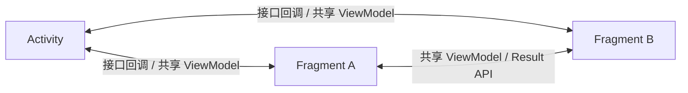
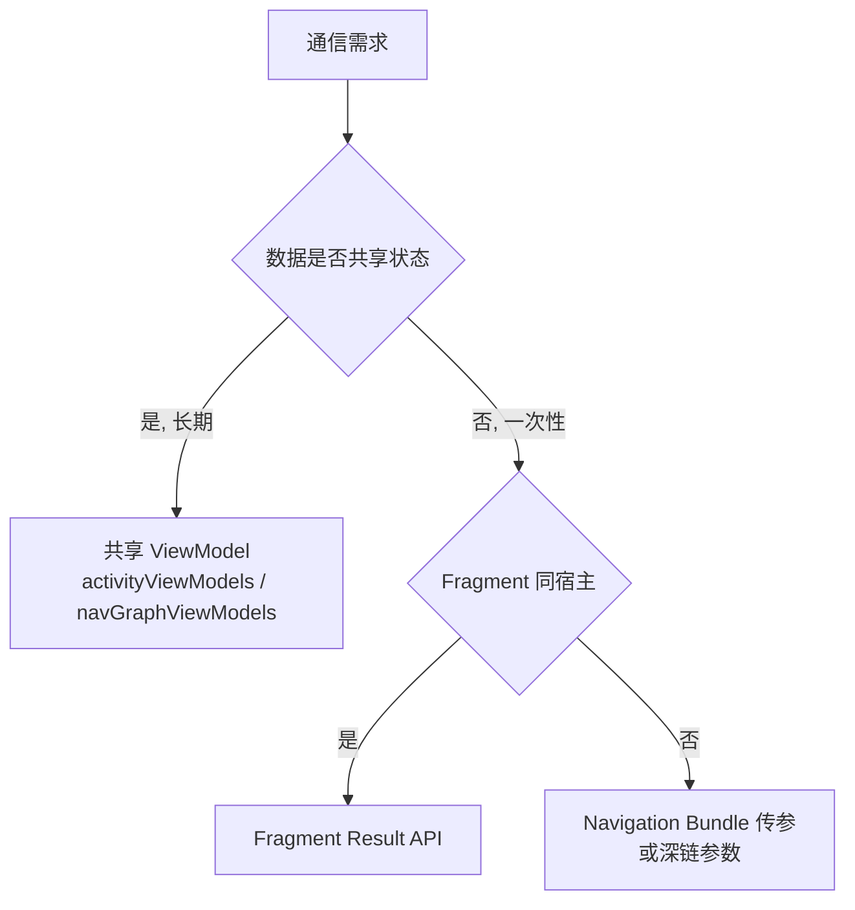

# Fragment 通信方案全解析

> 面试高频指数：中 — Fragment 与 Activity、Fragment 与 Fragment 之间如何安全通信，是组件化与单 Activity 架构下的高频面试题。

## 一、通信场景全景

Fragment 通信主要分四类场景：

| 场景 | 示例 | 推荐方案 |
|------|------|----------|
| Fragment 向 Activity 通知 | 列表项点击、用户操作 | 接口回调 / 共享 ViewModel |
| Activity 向 Fragment 下发指令 | 刷新数据、变更页签 | ViewModel 状态 / 接口方法调用 |
| Fragment 与 Fragment | 详情页接收列表页选中项 | 共享 ViewModel / Result API |
| 跨模块 / 跨页面 | 深链、事件总线 | Navigation Result / 事件总线 |



## 二、Arguments：安全的初始化参数

**Arguments 是 Fragment 之间传递初始化数据的首选**，通过 `setArguments` + `getArguments` 完成：

```kotlin
class DetailFragment : Fragment() {
    companion object {
        const val ARG_ID = "arg_id"

        fun newInstance(id: Long): DetailFragment {
            return DetailFragment().apply {
                arguments = Bundle().apply { putLong(ARG_ID, id) }
            }
        }
    }

    private lateinit var detailId: Long

    override fun onCreate(savedInstanceState: Bundle?) {
        super.onCreate(savedInstanceState)
        detailId = requireArguments().getLong(ARG_ID)
    }
}
```

### 为什么用 Arguments 而不是构造参数

| 对比 | 构造参数 | Arguments |
|------|----------|-----------|
| 系统重建 | 丢失（无参构造重建） | 自动保留 |
| 类型安全 | 无约束 | Bundle 类型约束 |
| 官方推荐 | 不推荐 | 推荐 |

> 关键点：Fragment 必须提供**无参构造**（系统反射重建用），初始化参数一律走 Arguments。Activity 传参给 Fragment 也走 Arguments，如 `fragment.arguments = bundle`。

## 三、接口回调：Fragment 通知 Activity

### 3.1 标准写法

```kotlin
// 1. Fragment 定义接口
class ArticleListFragment : Fragment() {
    interface OnArticleClickListener {
        fun onArticleClick(articleId: Long)
    }

    private var listener: OnArticleClickListener? = null

    // 2. 在 onAttach 中强转获取宿主
    override fun onAttach(context: Context) {
        super.onAttach(context)
        listener = context as? OnArticleClickListener
            ?: throw IllegalStateException("宿主必须实现 OnArticleClickListener")
    }

    // 3. 触发回调
    private fun notifyClick(articleId: Long) {
        listener?.onArticleClick(articleId)
    }

    // 4. 安全解绑
    override fun onDetach() {
        super.onDetach()
        listener = null
    }
}

// Activity 实现接口
class HomeActivity : AppCompatActivity(), ArticleListFragment.OnArticleClickListener {
    override fun onArticleClick(articleId: Long) {
        // 跳转详情页
        findNavController().navigate(R.id.action_list_to_detail, Bundle().apply {
            putLong("id", articleId)
        })
    }
}
```

### 3.2 注意事项

- 接口回调是**同步、强引用**的，`onDetach` 中必须置空，防止内存泄漏
- 若宿主可能不是 Activity（嵌套 Fragment），使用 `parentFragment as?` 逐级查找
- 接口数量多时会产生接口爆炸，可考虑合并为统一回调接口

## 四、共享 ViewModel：最推荐的方案

### 4.1 Activity 作用域共享

**同一个 Activity 内的 Fragment 共享同一个 ViewModel**，通过 `activityViewModels()` 获取：

```kotlin
// 共享 ViewModel
class SharedViewModel : ViewModel() {
    val selectedItem = MutableStateFlow<Article?>(null)
    val listState = MutableStateFlow<List<Article>>(emptyList())
}

class ListFragment : Fragment() {
    private val viewModel: SharedViewModel by activityViewModels()

    override fun onViewCreated(view: View, savedInstanceState: Bundle?) {
        super.onViewCreated(view, savedInstanceState)
        viewModel.listState.collectLatest { list ->
            // 更新列表 UI
        }
    }
}

class DetailFragment : Fragment() {
    private val viewModel: SharedViewModel by activityViewModels()

    override fun onViewCreated(view: View, savedInstanceState: Bundle?) {
        super.onViewCreated(view, savedInstanceState)
        // 观察共享状态
        viewModel.selectedItem.collectLatest { item ->
            item?.let { renderDetail(it) }
        }
    }
}
```

### 4.2 共享 ViewModel 的优点

| 优点 | 说明 |
|------|------|
| 解耦 | Fragment 互不知道对方存在，只依赖 ViewModel 接口 |
| 生命周期安全 | 自动清理，无内存泄漏 |
| 配置变更安全 | 旋转屏幕后 ViewModel 不销毁 |
| 响应式 | 通过 Flow/LiveData 自动刷新 UI |
| 测试友好 | ViewModel 可脱离 UI 单测 |

### 4.3 与 Navigation 的组合

在 Navigation 组件中，还可使用 **Navigation 作用域**的共享 ViewModel（`by navGraphViewModels(R.id.graph_id)`），把共享范围限定在某个导航图内，避免跨图耦合。

```kotlin
class DetailFragment : Fragment() {
    // 限定在当前 NavGraph 内共享
    private val viewModel: SharedViewModel by navGraphViewModels(R.id.checkout_graph)
}
```

## 五、Fragment Result API：结果回传

Fragment 1.3.0+ 提供官方 Result API，适合**一次性的结果回传**（选中、确认等）：

```kotlin
// 结果接收方（列表页）
setFragmentResultListener("request_article") { key, bundle ->
    val articleId = bundle.getLong("article_id")
    // 处理结果
}

// 结果发送方（选择页）
setFragmentResult("request_article", bundleOf("article_id" to 42L))
```

### 5.1 指定接收者

默认结果广播给**同一 FragmentManager** 下的所有监听者，可通过 `requestKey` 精确定位；跨 FragmentManager 需要层层传递：

```kotlin
// 子 Fragment 向父 Fragment 回传
parentFragmentManager.setFragmentResult("child_result", bundleOf("ok" to true))

// 父 Fragment 监听
setFragmentResultListener("child_result") { _, bundle ->
    val ok = bundle.getBoolean("ok")
}
```

### 5.2 Result API vs 接口回调

| 维度 | Fragment Result API | 接口回调 |
|------|---------------------|----------|
| 生命周期 | 监听器在 STARTED 后接收，安全 | 同步调用，可能空指针 |
| 解耦 | 无需实现接口 | 需要接口契约 |
| 一次性 vs 流式 | 一次性结果 | 可连续回调 |
| 推荐场景 | 确认框、选择器回传 | 连续事件通知 |

> 生命周期安全：Result 监听器只在 `Lifecycle.State.STARTED` 之后派发，避免在后台 Fragment 中收到结果导致崩溃。

## 六、其他通信手段

### 6.1 事件总线（EventBus / LiveDataBus）

```kotlin
// EventBus 简单用法
EventBus.getDefault().post(ArticleRefreshEvent())

@Subscribe(threadMode = ThreadMode.MAIN)
fun onRefresh(event: ArticleRefreshEvent) {
    // 处理事件
}
```

- 优点：跨任意对象解耦通信，无需实现接口
- 缺点：**全局广播**，事件来源不可追踪、容易误接收、需要手动注册注销（防泄漏）
- 使用建议：仅限**跨模块低频事件**（登录态变化、主题切换），页面内通信优先 ViewModel

### 6.2 findFragmentById / parentFragment 直接调用

```kotlin
// 不建议：直接拿到 Fragment 实例调用其方法
(parentFragment as? DetailFragment)?.refreshData()
```

- 破坏封装、强耦合、无法处理 Fragment 尚未创建等时序问题
- 仅适合非常简单的同层级临时操作

### 6.3 单 Activity 架构下的选择



## 七、高频面试题

### Q1：Fragment 之间通信有哪些方式，推荐哪种？
::: details 查看答案
① Arguments 传初始化参数；② 接口回调（Fragment 通知 Activity）；③ 共享 ViewModel（同 Activity 用 activityViewModels，同导航图用 navGraphViewModels）；④ Fragment Result API 一次性结果回传；⑤ 事件总线兜底。推荐：数据共享用共享 ViewModel（生命周期安全、自动清理、旋转不丢）；一次性结果用 Result API；跨模块低频事件才考虑事件总线。
:::

### Q2：为什么 Fragment 不能用带参构造传数据？
::: details 查看答案
因为 Fragment 被系统销毁重建（配置变更、进程恢复、FragmentManager 恢复）时通过反射调用无参构造创建新实例，带参构造参数会丢失。初始化数据必须通过 Arguments（setArguments/getArguments）传递，系统重建时自动保存恢复。这也是 newInstance 工厂模式的由来。
:::

### Q3：activityViewModels 和 viewModels 的区别？
::: details 查看答案
viewModels() 获取的是 Fragment 作用域的 ViewModel，与 Fragment 生命周期绑定，不同 Fragment 各自持有独立实例；activityViewModels() 获取宿主 Activity 作用域的 ViewModel，同一 Activity 下所有 Fragment 共享同一个实例。通信用共享数据时用 activityViewModels，各页面独立数据用 viewModels。
:::

### Q4：接口回调为什么会导致内存泄漏，如何避免？
::: details 查看答案
Activity 实现了 Fragment 的监听接口，Fragment 持有监听器引用（Activity），若 Fragment 在 onDetach 后仍保留引用，Activity 无法被回收导致泄漏。避免方式：① onDetach 中把监听器置空；② 使用弱引用持有宿主；③ 优先使用不持有宿主的通信方式（共享 ViewModel、Result API）。
:::

### Q5：setFragmentResultListener 为什么推荐用它替代接口回调？
::: details 查看答案
因为 Result API 有生命周期安全保证：监听器只在宿主 STARTED 之后派发结果，避免在 Fragment 不可见时收到回调引发崩溃或状态错乱；且监听器在 DESTROYED 时自动清理，无泄漏风险；同时发送方与接收方完全解耦，只需约定 requestKey，无需实现接口。适合确认、选择等一次性结果回传场景。
:::

## 八、小结

Fragment 通信方案的选择逻辑：

1. **初始化数据**：Arguments（必须，保证重建恢复）
2. **数据共享**：共享 ViewModel（Activity / NavGraph 作用域），首选
3. **一次性结果**：Fragment Result API，生命周期安全
4. **跨模块低频事件**：事件总线，谨慎使用
5. **直接方法调用**：仅限简单同层级场景

相关阅读：[Fragment 生命周期与通信](/android/fragment/fragment-basics.md)、[Fragment 常见坑点总结](/android/fragment/fragment-pitfalls.md)、[ViewModel 源码解析](/jetpack/lifecycle-viewmodel/viewmodel-source.md)、[Navigation 详解](/jetpack/paging-navigation/navigation.md)。
