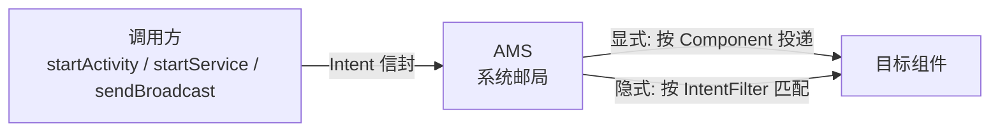

# Intent 详解：显式与隐式

> Intent（意图）是 Android 组件间通信的"消息信封"：它描述"想做什么"（Action）和"发给谁"（Component/Filter），由系统（AMS）负责投递。**一切页面跳转、服务启动、广播发送的本质都是 Intent 传递**。本节从结构、解析、Flags 到安全，系统讲透 Intent。

## 一、Intent 是什么：组件通信的"邮递员"



| 角色 | 对应物 | 说明 |
|------|--------|------|
| 信封 | `Intent` | 描述动作、数据、目标 |
| 邮局 | `AMS`（ActivityManagerService） | 系统级调度，负责投递 |
| 地址（精确） | `ComponentName` | 显式指定目标组件 |
| 地址（模糊） | `IntentFilter` | 按 action/category/data 规则匹配 |

::: tip 核心认知
Intent 本身**不直接调用组件**，它只是描述"意图"的数据对象。真正的投递由系统进程（AMS）完成——这正是 Android 组件可以跨进程通信的原因。
:::

## 二、Intent 的结构组成

```kotlin
val intent = Intent().apply {
    // 1. 组件（显式跳转时设置）
    component = ComponentName(context, TargetActivity::class.java)
    // 2. 动作（隐式匹配时使用）
    action = Intent.ACTION_VIEW
    // 3. 数据与类型（URI + MIME）
    data = Uri.parse("https://wikiandroid.com")
    type = "text/html"
    // 4. 分类
    addCategory(Intent.CATEGORY_DEFAULT)
    // 5. 附加数据（键值对）
    putExtra("key", "value")
    // 6. 标志位（控制任务栈等行为）
    addFlags(Intent.FLAG_ACTIVITY_NEW_TASK)
}
```

| 属性 | 作用 | 典型值 |
|------|------|--------|
| `component` | 精确指定目标组件 | `ComponentName(pkg, class)` |
| `action` | 声明要执行的动作 | `ACTION_VIEW` / `ACTION_SEND` / `ACTION_MAIN` |
| `data` + `type` | 操作的数据 URI 与 MIME 类型 | `tel:` / `mailto:` / `https://` |
| `category` | 附加分类信息 | `CATEGORY_DEFAULT` / `CATEGORY_LAUNCHER` |
| `extras` | Bundle 键值对数据 | `putExtra("id", 100L)` |
| `flags` | 控制组件行为与任务栈 | `FLAG_ACTIVITY_NEW_TASK` 等 |

### action 与 data 的"联合声明"语义

Intent 中 `action` 与 `data` 是一体的：例如 `ACTION_VIEW` + `Uri.parse("tel:10086")` 表示"查看电话号码"，`ACTION_VIEW` + `https://` 表示"打开网页"。**同一个 action 配合不同 data 会进入不同的匹配分支**。

## 三、显式 Intent：精确指定目标

```kotlin
// 方式一：直接传 Class（内部会构造 ComponentName）
val intent = Intent(this, ProfileActivity::class.java)
startActivity(intent)

// 方式二：指定包名 + 类名（跨应用跳转）
val intent = Intent().apply {
    component = ComponentName(
        "com.example.target",
        "com.example.target.TargetActivity"
    )
}
startActivity(intent)
```

**使用场景**：应用内导航（绝大多数情况）、跨应用跳转到已知类名。

| 特点 | 说明 |
|------|------|
| 精确 | 直接指定组件，无需系统匹配 |
| 快速 | 省去 IntentFilter 解析过程 |
| 安全 | 不会误触其他应用的同 action 组件 |
| 局限 | 需要知道目标类的包名与类名 |

## 四、隐式 Intent：按规则匹配

隐式 Intent 不指定组件，由系统根据 IntentFilter 匹配"谁能处理这个意图"。

```kotlin
// 打开网页
startActivity(Intent(Intent.ACTION_VIEW, Uri.parse("https://wikiandroid.com")))

// 发送分享
val send = Intent(Intent.ACTION_SEND).apply {
    type = "text/plain"
    putExtra(Intent.EXTRA_TEXT, "看看这个知识库！")
}
startActivity(Intent.createChooser(send, "分享到"))

// 打开拨号盘
startActivity(Intent(Intent.ACTION_DIAL, Uri.parse("tel:10086")))
```

**匹配失败与多匹配**：

| 情况 | 结果 | 处理方式 |
|------|------|----------|
| 唯一匹配 | 直接启动该组件 | — |
| 多个匹配 | 弹出选择器（或触发默认应用） | `createChooser` 自定义标题 |
| **无匹配** | 抛 `ActivityNotFoundException` | `resolveActivity` 预检查 |

```kotlin
// 安全调用：先检查是否有组件能处理
val intent = Intent(Intent.ACTION_VIEW, Uri.parse(url))
if (intent.resolveActivity(packageManager) != null) {
    startActivity(intent)
} else {
    // 无浏览器可处理，降级处理
    Toast.makeText(this, "无法打开链接", Toast.LENGTH_SHORT).show()
}
```

## 五、Flags：控制任务栈与启动行为

Intent Flags 用于**跨进程/跨应用场景**下干预组件的启动行为，与 Manifest 中 `launchMode` 互补。

| Flag | 作用 | 与启动模式关系 |
|------|------|----------------|
| `FLAG_ACTIVITY_NEW_TASK` | 在新任务栈启动（**Service 中 startActivity 必须携带**） | 类似 `singleTask` |
| `FLAG_ACTIVITY_SINGLE_TOP` | 若栈顶已存在该实例则复用 | 类似 `singleTop` |
| `FLAG_ACTIVITY_CLEAR_TOP` | 清除目标 Activity 之上的所有 Activity | 配合 `SINGLE_TOP` 实现"回到已有实例" |
| `FLAG_ACTIVITY_EXCLUDE_FROM_RECENTS` | 不显示在最近任务 | — |
| `FLAG_ACTIVITY_NO_HISTORY` | 离开即销毁，不保留历史 | — |
| `FLAG_ACTIVITY_CLEAR_TASK` | 启动前清空目标任务栈（需配合 `NEW_TASK`） | 常用于"回到首页并清空" |

```kotlin
// 经典场景：从通知/后台回到首页，清除中间页面
val intent = Intent(this, MainActivity::class.java).apply {
    addFlags(Intent.FLAG_ACTIVITY_NEW_TASK or Intent.FLAG_ACTIVITY_CLEAR_TOP)
}
startActivity(intent)
```

::: warning 注意
`FLAG_ACTIVITY_CLEAR_TOP` 默认会**销毁**栈顶以上的所有 Activity；若配合 `FLAG_ACTIVITY_SINGLE_TOP`，则目标 Activity 复用实例且只回调 `onNewIntent`，不重建。
:::

### 跨应用跳转的"坑"：startActivity 需要 NEW_TASK

在 **Service / Application / 非 Activity Context** 中调用 `startActivity`，必须添加 `FLAG_ACTIVITY_NEW_TASK`，否则抛 `AndroidRuntimeException: Calling startActivity() from outside of an Activity context requires the FLAG_ACTIVITY_NEW_TASK flag`。原因：非 Activity Context 没有任务栈上下文，系统需要知道"放到哪个任务栈"。

## 六、Extras：组件间数据传递

```kotlin
// 发送方
val intent = Intent(this, DetailActivity::class.java).apply {
    putExtra("id", 42L)
    putExtra("title", "Intent 详解")
    putExtra("tags", arrayOf("android", "intent"))
}

// 接收方
val id = intent.getLongExtra("id", -1L)
val title = intent.getStringExtra("title")
val tags = intent.getStringArrayExtra("tags")
```

| 传递方式 | 使用场景 | 特点 |
|----------|----------|------|
| `putExtra` 基本类型/序列化对象 | 常规页面间传参 | 简单直接 |
| `Parcelable` 对象 | 传递自定义数据类 | 高效，跨进程首选（**必须 Parcelable，不能 Serializable 用于 Intent** 的跨进程场景） |
| `Bundle` | 批量传参 | 统一封装、可复用 |
| `Intent` 作为参数 | 携带"继续执行"的意图 | 常配合 `startActivityForResult` / PendingIntent |

```kotlin
// Parcelable 数据类（Kotlin 用 @Parcelize 一行搞定）
@Parcelize
data class Article(
    val id: Long,
    val title: String,
    val tags: List<String>,
) : Parcelable

// 传递
intent.putExtra("article", article)
// 接收
val article = intent.getParcelableExtra<Article>("article")
```

## 七、Intent 在三大组件中的使用

| 组件 | 启动方式 | Intent 作用 |
|------|----------|-------------|
| Activity | `startActivity(intent)` | 页面跳转、携带数据 |
| Service | `startService(intent)` / `bindService(intent, ...)` | 启动/绑定服务，传参 |
| BroadcastReceiver | `sendBroadcast(intent)` | 广播消息分发（可指定包名/权限） |

```kotlin
// 启动前台服务并传参
val intent = Intent(this, DownloadService::class.java).apply {
    putExtra("url", url)
    putExtra("file", file)
}
ContextCompat.startForegroundService(this, intent)

// 发送"应用内"广播（Android 13+ 建议指定包名）
val intent = Intent("com.example.ACTION_REFRESH").apply {
    setPackage(packageName) // 仅本应用可接收
}
sendBroadcast(intent)
```

## 八、Intent 安全最佳实践

| 风险 | 场景 | 防护措施 |
|------|------|----------|
| 隐式 Intent 泄露 | 隐式跳转被恶意应用拦截（Intent 劫持） | 指定 `setPackage`；使用 `createChooser`；敏感跳转改显式 |
| 组件暴露 | 导出的组件可被任意应用调用 | Manifest 中 `android:exported="false"`（有 intent-filter 时必须显式声明）；接收方校验 `getCallingPackage()` |
| 数据注入 | 恶意应用伪造 Extras | 接收方校验来源包名与数据合法性 |
| 广播滥用 | 全局广播被其他应用监听 | 指定包名 / 权限 / 使用 `LocalBroadcastManager`（已被 `registerForActivityResult` 等替代）或 `sendBroadcast(intent, permission)` |

```xml
<!-- Android 12+ 强制：声明了 intent-filter 必须显式设置 exported -->
<activity
    android:name=".ShareActivity"
    android:exported="false">
    <!-- 有 intent-filter 但仅应用内使用，必须显式 false -->
</activity>
```

## 九、高频面试题精讲

**Q1：显式 Intent 与隐式 Intent 的区别？**
A：显式 Intent 通过 `setComponent` 精确指定目标组件，应用内跳转首选，无需系统匹配；隐式 Intent 不指定组件，由系统根据 action/category/data 与各应用 Manifest 中声明的 IntentFilter 匹配，用于跨应用能力复用（打开网页、分享、拨号）。隐式存在多个匹配（弹选择器）与无匹配（抛异常）两种风险，需用 `resolveActivity` 预检查。

**Q2：IntentFilter 的匹配规则是什么？**
A：三大要素：① `action`：Intent 的 action 与 Filter 中任一 action 相等即匹配（**必须至少匹配一个**）；② `category`：Intent 携带的**所有** category 都必须在 Filter 中声明（Filter 可多，Intent 必须全含），`startActivity` 默认自动添加 `CATEGORY_DEFAULT`，因此隐式接收方 Filter 必须声明 `DEFAULT`；③ `data`：scheme/host/port/path 与 MIME 类型逐一匹配。三大要素**同时满足**才算匹配成功。

**Q3：`FLAG_ACTIVITY_NEW_TASK` 为什么在非 Activity Context 中必须加？**
A：Activity 启动依赖任务栈（Task）。Activity Context 天然有任务栈上下文，系统知道把新页面放进当前 Task；而 Service / Application 等非 Activity Context 没有 Task 概念，必须用 `FLAG_ACTIVITY_NEW_TASK` 告诉系统"为这个页面新建（或复用）一个任务栈"，否则抛出 `AndroidRuntimeException`。

**Q4：Intent 传递大对象为什么用 Parcelable 不用 Serializable？**
A：Intent 跨进程传递时数据需要序列化到 Binder 缓冲区。Parcelable 是 Android 专用机制，通过 writeToParcel 手工写入，**不经过反射**，性能远高于 Serializable（Serializable 依赖反射、产生大量临时对象）；且 Parcelable 大小受 Binder 事务缓冲区限制（约 1MB），超大对象建议落盘传路径。

**Q5：`FLAG_ACTIVITY_CLEAR_TOP` 与 `singleTask` 的区别？**
A：两者都能"复用已有实例并清除其上页面"。`singleTask` 是 Manifest 静态配置，作用域为**整个任务栈**（首次启动时新建 Task，后续复用实例）；`FLAG_ACTIVITY_CLEAR_TOP` 是动态 Flag，且默认行为是**销毁**目标之上所有 Activity 并重建目标（除非同时加 `FLAG_ACTIVITY_SINGLE_TOP` 才复用实例）。实际开发常二者结合使用。

**Q6：如何防止隐式 Intent 被其他应用劫持？**
A：① 跳转前用 `resolveActivity()` 检查是否有安全目标；② 敏感操作使用显式 Intent；③ 若必须隐式，`setPackage()` 限定目标应用；④ 用 `Intent.createChooser()` 让用户看到并选择目标应用，避免被恶意应用静默接管。

## 十、小结

Intent 是 Android 组件通信的基石：

- **结构**：component / action / data / category / extras / flags 六大属性各司其职
- **显式 vs 隐式**：显式精确安全（应用内），隐式灵活可复用（跨应用），需处理无匹配异常
- **Flags**：`NEW_TASK`（非 Activity Context 必须）、`CLEAR_TOP`（栈清理）、`SINGLE_TOP`（复用栈顶）
- **数据**：基本类型直接传，复杂对象用 Parcelable，注意 Binder 缓冲区 1MB 上限
- **安全**：`exported` 显式声明、`setPackage` 限包、接收方校验来源

> 进阶阅读：[IntentFilter 匹配规则](/android/intent/intent-filter.md) | [Activity 任务栈与返回栈](/android/activity/task-stack.md) | [PendingIntent 详解](/android/notification/pendingintent.md)
