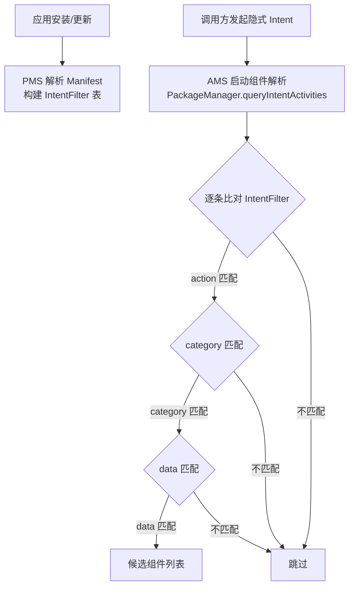

# IntentFilter 匹配规则

> 隐式 Intent 的投递依赖系统对 **IntentFilter** 的匹配。这是面试中"Intent 与组件通信"最常被深挖的考点：`action` 怎么比、`category` 为什么必须含 `DEFAULT`、`data` 的 scheme/host/port 如何匹配。本节把解析过程拆到源码层面讲透。

## 一、什么是 IntentFilter

IntentFilter（意图过滤器）声明在组件所在应用的 Manifest 中，描述该组件**能处理什么类型的意图**：

```xml
<activity android:name=".WebActivity">
    <!-- 该 Activity 能"查看网页" -->
    <intent-filter>
        <action android:name="android.intent.action.VIEW" />
        <category android:name="android.intent.category.DEFAULT" />
        <data android:scheme="https" />
    </intent-filter>
</activity>
```



## 二、action 匹配规则

```xml
<intent-filter>
    <action android:name="android.intent.action.VIEW" />
    <action android:name="android.intent.action.EDIT" />
</intent-filter>
```

| 规则 | 说明 |
|------|------|
| 匹配条件 | Intent 的 action 与 Filter 中**任意一个** action 字符串完全相等 |
| 至少一个 | **必须至少匹配一个 action**，否则直接判定不匹配 |
| 大小写 | 字符串严格相等，区分大小写 |
| 空 Intent action | Intent 未设置 action 时，不参与 action 匹配（等于绕过） |

```kotlin
// 发送方
val intent = Intent(Intent.ACTION_VIEW)
// 若存在 Filter 声明了 VIEW，则匹配成功
```

::: warning 关键点
`<action>` 是**唯一一个"Intent 必须命中其一"**的匹配项。如果 Intent 设置了 action，但没有任何 Filter 声明该 action → 不匹配。
:::

## 三、category 匹配规则

```xml
<intent-filter>
    <action android:name="android.intent.action.MAIN" />
    <category android:name="android.intent.category.LAUNCHER" />
    <category android:name="android.intent.category.DEFAULT" />
</intent-filter>
```

| 规则 | 说明 |
|------|------|
| 包含关系 | Intent 携带的**每一个** category 都必须出现在 Filter 中（Filter 可以声明更多） |
| 方向性 | Filter 多、Intent 少 → 匹配；Filter 少、Intent 多 → 不匹配 |
| 自动补充 | `startActivity` / `startActivityForResult` 会自动给 Intent 加 `CATEGORY_DEFAULT` |
| 隐含要求 | **隐式 Intent 的接收方 Filter 必须声明 `CATEGORY_DEFAULT`**，否则 `startActivity` 无法匹配 |

```kotlin
// 发送方源码层面：ContextImpl.startActivity → mMainThread.getApplicationThread()
// 在 Activity.startActivityForResult 中：
// intent.addCategory(Intent.CATEGORY_DEFAULT);  ← 系统自动添加
```

### 为什么接收方必须声明 DEFAULT

```xml
<!-- 反面教材：Filter 未声明 DEFAULT -->
<intent-filter>
    <action android:name="com.example.ACTION_HELLO" />
    <!-- 缺 category DEFAULT -->
</intent-filter>
```

由于 `startActivity` 自动携带 `CATEGORY_DEFAULT`，而该 Filter 未声明 → "Intent 的 category 不在 Filter 中" → **永远匹配失败**。这也是新手最常见的坑。

## 四、data 匹配规则

```xml
<intent-filter>
    <data android:scheme="https"
          android:host="wikiandroid.com"
          android:port="443"
          android:path="/docs" />
</intent-filter>
```

data 由四部分构成：`scheme`（协议）、`host`（主机）、`port`（端口）、`path`（路径），外加独立的 MIME `type`。

| 部分 | 规则 |
|------|------|
| scheme | 必须匹配（有 data 时必须声明）；可省略表示"任何 scheme" |
| host | 声明了 scheme 后 host 才生效；未声明 host 表示任意 |
| port | 仅当 host 声明后才参与匹配 |
| path / pathPrefix / pathPattern | 精确匹配 / 前缀匹配 / 正则（`*` 通配）匹配 |
| type（MIME） | 与 data 相互独立、可同时存在 |

### data 与 type 的组合语义

| Filter 声明 | Intent 提供 | 匹配结果 |
|------------|-------------|----------|
| 仅 data（无 type） | 仅 data | 匹配（type 为空） |
| 仅 type（无 data） | 仅 type | 匹配（data 为空） |
| data + type 都有 | data + type | 需**同时**匹配 |
| 仅 data | 仅 type | **不匹配** |

```kotlin
// 发送方同时携带 data + type
val intent = Intent(Intent.ACTION_VIEW, Uri.parse("content://com.example/doc/1")).apply {
    type = "text/plain"
}
// 接收方 Filter 必须同时声明对应 scheme/host + mimeType 才能匹配
```

::: tip 源码细节
Android 源码 `IntentFilter.matchData()` 中，如果 Filter 未声明 data 也未声明 type，则**跳过 data 匹配**（视为匹配成功）；否则必须逐项比对。`ACTION_VIEW` 等系统 action 通常要求 data 匹配。
:::

## 五、完整匹配流程（源码视角）

`ActivityTaskManager` / `AMS` 最终调用 `PackageManager.queryIntentActivities(intent, flags)` 完成解析：

```
1. 收集：遍历所有应用的 PackageInfo（PMS 缓存的已解析 IntentFilter 表）
2. 粗筛：intent.action 必须命中 Filter 的 action 列表（唯一强制项）
3. 细筛：category 全包含 + data 逐项匹配（scheme → host → port → path → type）
4. 安全：Android 12+ 检查 exported 属性；未导出的组件不参与隐式匹配
5. 输出：返回候选组件列表（可能为空 / 多个）
```

```kotlin
// 手动查询验证匹配结果（开发调试利器）
val pm = packageManager
val candidates = pm.queryIntentActivities(intent, PackageManager.MATCH_ALL)
candidates.forEach { ri ->
    Log.d("TAG", "匹配组件: ${ri.activityInfo.packageName}/${ri.activityInfo.name}")
}
```

## 六、匹配优先级与选择器

当多个组件匹配同一隐式 Intent 时：

| 优先级 | 规则 |
|--------|------|
| 1 | 显式指定 component（完全绕过匹配） |
| 2 | 系统"默认应用"设置（如默认浏览器） |
| 3 | 用户最近选择的"始终"选项 |
| 4 | 弹系统选择器（Chooser），用户临时选择 |

```kotlin
// 强制显示选择器（即使有默认应用）
val chooser = Intent.createChooser(intent, "选择打开方式")
startActivity(chooser)
```

## 七、常见实战场景 Filter 模板

### 场景 1：应用主入口（桌面图标）

```xml
<activity android:name=".MainActivity"
          android:exported="true">
    <intent-filter>
        <action android:name="android.intent.action.MAIN" />
        <category android:name="android.intent.category.LAUNCHER" />
    </intent-filter>
</activity>
```

### 场景 2：网页链接直达（Deep Link）

```xml
<activity android:name=".WebActivity"
          android:exported="true">
    <intent-filter>
        <action android:name="android.intent.action.VIEW" />
        <category android:name="android.intent.category.DEFAULT" />
        <category android:name="android.intent.category.BROWSABLE" />
        <data android:scheme="https"
              android:host="wikiandroid.com"
              android:pathPrefix="/article" />
    </intent-filter>
</activity>
```

> `BROWSABLE`：允许浏览器等应用通过链接跳入；`DEFAULT`：允许 `startActivity` 隐式匹配。

### 场景 3：文件打开（MIME 匹配）

```xml
<activity android:name=".PdfViewerActivity"
          android:exported="true">
    <intent-filter>
        <action android:name="android.intent.action.VIEW" />
        <category android:name="android.intent.category.DEFAULT" />
        <data android:mimeType="application/pdf" />
    </intent-filter>
</activity>
```

## 八、高频面试题精讲

**Q1：为什么隐式 Intent 的接收方必须声明 `CATEGORY_DEFAULT`？**
A：因为 `startActivity` 在发起时会**自动**为 Intent 添加 `CATEGORY_DEFAULT`（源码 `Activity.startActivityForResult` 中 `intent.addCategory(Intent.CATEGORY_DEFAULT)`），而 category 的匹配规则是"Intent 携带的每个 category 都必须在 Filter 中"。若 Filter 未声明 DEFAULT，则 Intent 的 DEFAULT 找不到对应声明 → 匹配失败。

**Q2：action / category / data 三个匹配规则的本质区别？**
A：`action` 是"或"逻辑——Intent 的 action 命中 Filter 任意一个声明即可（且 Intent 设置 action 时必选）；`category` 是"与"逻辑——Intent 的所有 category 必须全部被 Filter 覆盖（Filter 可多不可少）；`data` 是"部分与"——scheme/host/port/path 逐级约束（host 依赖 scheme、port 依赖 host），三者规则完全不同，需分别记忆。

**Q3：Intent 的 action 为空会怎样？**
A：action 为空（未设置）时，系统**跳过 action 匹配**，不会因为"Intent 没有 action"而失败——它不参与比较。但 category（若设置）与 data 仍按规则匹配。因此"空 action + 仅 category/data"的 Intent 理论上也能匹配到 Filter。

**Q4：如何让一个 Activity 既能被隐式匹配又不暴露给其他应用？**
A：Android 12（API 31）起，声明了 `<intent-filter>` 的组件必须显式设置 `android:exported`。若只想应用内隐式匹配：设置 `android:exported="false"`——系统仍然会为该应用内部的隐式 Intent 匹配，但其他应用无法通过隐式 Intent 启动它（跨应用匹配会因未导出被过滤）。

**Q5：`data` 的 `path`、`pathPrefix`、`pathPattern` 区别？**
A：`path` 精确全路径匹配；`pathPrefix` 仅匹配路径前缀（如 `/article` 匹配 `/article/1`）；`pathPattern` 支持通配符 `*`（匹配一段任意字符，不跨 `/`）与 `.*`（可跨 `/`）。三者互斥，同一 `<data>` 只能声明一个。

**Q6：隐式 Intent 匹配失败会怎样？如何避免崩溃？**
A：`startActivity` 找不到任何匹配组件时抛 `ActivityNotFoundException`（运行时崩溃）。避免方式：① 用 `intent.resolveActivity(packageManager)` 先检查是否非 null；② 业务兜底（Toast 提示或引导到默认应用）；③ 若目标是自己应用内部组件，改显式 Intent 最稳妥。

## 九、小结

- **action**：唯一"必中其一"的强制项，Intent 设置了就必须命中 Filter 声明
- **category**：Intent 全包含校验，`DEFAULT` 是隐式匹配的"通行证"
- **data**：scheme → host → port → path → type 逐级精确约束
- **匹配流程**：PMS 缓存表 → 粗筛 action → 细筛 category/data → 安全过滤 → 候选列表
- **工程实践**：Deep Link 用 `scheme + host + pathPrefix`；文件打开用 `mimeType`；应用内跳转用显式 Intent 最安全

> 进阶阅读：[Intent 详解：显式与隐式](/android/intent/intent-basics.md) | [Activity 启动流程源码分析](/android/activity/activity-launch-process.md) | [Binder 跨进程通信](/system/binder/binder-mechanism.md)
