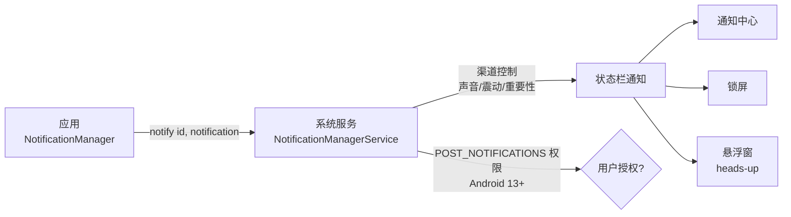
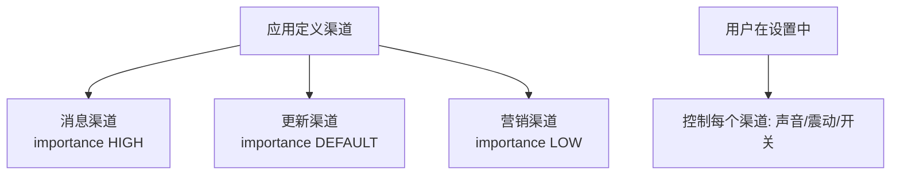

# 通知机制详解：渠道、构建与样式

> 通知（Notification）是应用在系统状态栏展示的消息卡片：新消息、播放控制、下载进度、后台任务状态……Android 8.0 引入**通知渠道**（Channel）把通知管理权交给用户，Android 13 起又要求**动态申请通知权限**。本节讲透通知的完整体系。

## 一、通知架构

通知从应用到状态栏的完整链路如下：



各角色的职责说明如下：

| 角色 | 说明 |
|------|------|
| `NotificationManager` | 应用侧通知管理器（发送/取消） |
| `NotificationManagerService` | 系统服务，管理所有应用通知 |
| `NotificationChannel` | 通知渠道：分类管理（Android 8.0+） |
| `Notification.Builder` | 构建通知内容 |

## 二、通知渠道（Channel）机制

### 为什么需要渠道

Android 8.0 之前用户只能"全部开/关"通知；有了渠道，用户可以**对每个渠道单独控制**：关闭营销渠道、保留消息渠道。

渠道分类与用户控制的构成关系如下：



### 创建渠道

创建通知渠道的标准写法如下：

::: code-tabs

@tab:active Java

```java
// 必须在首次发送通知前创建渠道（Application 中统一创建）
public class WikiApplication extends Application {
    @Override
    public void onCreate() {
        super.onCreate();
        createNotificationChannels();
    }

    private void createNotificationChannels() {
        NotificationManager manager = getSystemService(NotificationManager.class);

        // 消息渠道：高重要性（悬浮窗 + 声音）
        NotificationChannel messages = new NotificationChannel(
                "messages",          // channel id
                "消息提醒",           // 用户可见的名称
                NotificationManager.IMPORTANCE_HIGH
        );
        messages.setDescription("新消息提醒");
        messages.enableVibration(true);
        manager.createNotificationChannel(messages);

        // 下载渠道：默认重要性（声音，无悬浮窗）
        NotificationChannel downloads = new NotificationChannel(
                "downloads",
                "下载进度",
                NotificationManager.IMPORTANCE_DEFAULT
        );
        manager.createNotificationChannel(downloads);
    }
}
```

@tab Kotlin

```kotlin
// 必须在首次发送通知前创建渠道（Application 中统一创建）
class WikiApplication : Application() {
    override fun onCreate() {
        super.onCreate()
        createNotificationChannels()
    }

    private fun createNotificationChannels() {
        val manager = getSystemService(NotificationManager::class.java)

        // 消息渠道：高重要性（悬浮窗 + 声音）
        manager.createNotificationChannel(
            NotificationChannel(
                "messages",          // channel id
                "消息提醒",           // 用户可见的名称
                NotificationManager.IMPORTANCE_HIGH
            ).apply {
                description = "新消息提醒"
                enableVibration(true)
            }
        )

        // 下载渠道：默认重要性（声音，无悬浮窗）
        manager.createNotificationChannel(
            NotificationChannel(
                "downloads",
                "下载进度",
                NotificationManager.IMPORTANCE_DEFAULT
            )
        )
    }
}
```

:::

各重要性的行为表现如下：

| 重要性 | 行为 |
|--------|------|
| `IMPORTANCE_HIGH` | 悬浮窗 + 声音 + 震动 |
| `IMPORTANCE_DEFAULT` | 声音，无悬浮窗 |
| `IMPORTANCE_LOW` | 无声音 |
| `IMPORTANCE_MIN` | 折叠展示，无声音 |

::: warning 渠道的不可变性
渠道创建后**只能改重要性（限降级）**，名称/描述/声音等一旦创建不可修改（需卸载重装）。渠道 ID 要在一开始规划好。
:::

## 三、构建通知

构建并发送通知的完整示例代码如下：

::: code-tabs

@tab:active Java

```java
void showMessageNotification(String title, String content) {
    // 1. 构建点击意图（PendingIntent）
    Intent intent = new Intent(this, MessageActivity.class);
    intent.setFlags(Intent.FLAG_ACTIVITY_NEW_TASK | Intent.FLAG_ACTIVITY_CLEAR_TOP);
    PendingIntent pendingIntent = PendingIntent.getActivity(
            this, 0, intent, PendingIntent.FLAG_IMMUTABLE | PendingIntent.FLAG_UPDATE_CURRENT
    );

    // 2. 构建通知
    Notification notification = new NotificationCompat.Builder(this, "messages")
            .setSmallIcon(R.drawable.ic_message)
            .setContentTitle(title)
            .setContentText(content)
            .setContentIntent(pendingIntent)      // 点击跳转
            .setAutoCancel(true)                   // 点击后自动消失
            .setPriority(NotificationCompat.PRIORITY_HIGH)
            .setWhen(System.currentTimeMillis())
            .build();

    // 3. 发送（id 唯一，重复 id 覆盖）
    NotificationManagerCompat.from(this).notify(1001, notification);
}
```

@tab Kotlin

```kotlin
fun showMessageNotification(title: String, content: String) {
    // 1. 构建点击意图（PendingIntent）
    val intent = Intent(this, MessageActivity::class.java).apply {
        flags = Intent.FLAG_ACTIVITY_NEW_TASK or Intent.FLAG_ACTIVITY_CLEAR_TOP
    }
    val pendingIntent = PendingIntent.getActivity(
        this, 0, intent, PendingIntent.FLAG_IMMUTABLE or PendingIntent.FLAG_UPDATE_CURRENT
    )

    // 2. 构建通知
    val notification = NotificationCompat.Builder(this, "messages")
        .setSmallIcon(R.drawable.ic_message)
        .setContentTitle(title)
        .setContentText(content)
        .setContentIntent(pendingIntent)      // 点击跳转
        .setAutoCancel(true)                   // 点击后自动消失
        .setPriority(NotificationCompat.PRIORITY_HIGH)
        .setWhen(System.currentTimeMillis())
        .build()

    // 3. 发送（id 唯一，重复 id 覆盖）
    NotificationManagerCompat.from(this).notify(1001, notification)
}
```

:::

### Builder 常用方法

Builder 常用方法的作用说明如下：

| 方法 | 作用 |
|------|------|
| `setSmallIcon` | 状态栏小图标（**必须设置**） |
| `setContentTitle` / `setContentText` | 标题与内容 |
| `setContentIntent` | 点击通知的 PendingIntent |
| `setAutoCancel` | 点击后自动移除 |
| `setPriority` | 优先级（辅助渠道重要性） |
| `setWhen` / `setShowWhen` | 时间戳 |
| `setColor` | 小图标着色 |
| `setTimeoutAfter` | 自动过期时间（秒） |
| `setOnlyAlertOnce` | 同 id 更新时不重复提醒 |
| `setDeleteIntent` | 用户滑动删除时回调 |

## 四、通知样式（Style）

四种常用通知样式的写法如下：

::: code-tabs

@tab:active Java

```java
// 1. 长文本样式
new NotificationCompat.BigTextStyle()
        .bigText(longContent)
        .setBigContentTitle("标题")
        .setSummaryText("摘要");

// 2. 收件箱样式（多条消息）
new NotificationCompat.InboxStyle()
        .addLine("第一条消息")
        .addLine("第二条消息")
        .setSummaryText("+2 条新消息");

// 3. 大图样式
new NotificationCompat.BigPictureStyle()
        .bigPicture(bitmap);

// 4. 进度条样式（下载）
new NotificationCompat.Builder(this, "downloads")
        .setContentTitle("下载中")
        .setProgress(100, 45, false)   // max, progress, indeterminate
        // 更新时：progress(100, 60, false); 完成后移除或转完成态
```

@tab Kotlin

```kotlin
// 1. 长文本样式
NotificationCompat.BigTextStyle()
    .bigText(longContent)
    .setBigContentTitle("标题")
    .setSummaryText("摘要")

// 2. 收件箱样式（多条消息）
NotificationCompat.InboxStyle()
    .addLine("第一条消息")
    .addLine("第二条消息")
    .setSummaryText("+2 条新消息")

// 3. 大图样式
NotificationCompat.BigPictureStyle()
    .bigPicture(bitmap)

// 4. 进度条样式（下载）
NotificationCompat.Builder(this, "downloads")
    .setContentTitle("下载中")
    .setProgress(100, 45, false)   // max, progress, indeterminate
    // 更新时：progress(100, 60, false); 完成后移除或转完成态
```

:::

## 五、通知权限（Android 13+）

```xml
<uses-permission android:name="android.permission.POST_NOTIFICATIONS" />
```

动态申请通知权限的示例代码如下：

::: code-tabs

@tab:active Java

```java
// targetSdk 33+ 必须动态申请，否则通知被静默丢弃
void ensureNotificationPermission() {
    if (Build.VERSION.SDK_INT >= 33) {
        ActivityResultLauncher<String> launcher = registerForActivityResult(
                new ActivityResultContracts.RequestPermission(),
                granted -> { /* granted? */ }
        );
        launcher.launch(Manifest.permission.POST_NOTIFICATIONS);
    }
}
```

@tab Kotlin

```kotlin
// targetSdk 33+ 必须动态申请，否则通知被静默丢弃
fun ensureNotificationPermission() {
    if (Build.VERSION.SDK_INT >= 33) {
        val launcher = registerForActivityResult(
            ActivityResultContracts.RequestPermission()
        ) { /* granted? */ }
        launcher.launch(Manifest.permission.POST_NOTIFICATIONS)
    }
}
```

:::

不同 targetSdk 下的通知权限行为如下：

| targetSdk | 行为 |
|-----------|------|
| < 33 | 无需申请，默认可发通知 |
| ≥ 33 | 必须申请 `POST_NOTIFICATIONS`，拒绝则通知不显示 |
| 用户设置 | 可对每个渠道/应用关闭通知 |

## 六、前台服务通知

后台任务必须配合前台服务 + 常驻通知（Android 8.0 起后台服务受限）：

::: code-tabs

@tab:active Java

```java
public class MusicService extends Service {

    @Override
    public void onCreate() {
        super.onCreate();
        startForegroundWithNotification();
    }

    private void startForegroundWithNotification() {
        Notification notification = new NotificationCompat.Builder(this, "media")
                .setSmallIcon(R.drawable.ic_music)
                .setContentTitle("正在播放")
                .setContentText("歌曲名")
                .setOngoing(true)                 // 不可滑动移除
                .addAction(0, "暂停", pauseIntent) // 操作按钮
                .build();
        startForeground(NOTIFICATION_ID, notification);
    }
}
```

@tab Kotlin

```kotlin
class MusicService : Service() {

    override fun onCreate() {
        super.onCreate()
        startForegroundWithNotification()
    }

    private fun startForegroundWithNotification() {
        val notification = NotificationCompat.Builder(this, "media")
            .setSmallIcon(R.drawable.ic_music)
            .setContentTitle("正在播放")
            .setContentText("歌曲名")
            .setOngoing(true)                 // 不可滑动移除
            .addAction(0, "暂停", pauseIntent) // 操作按钮
            .build()
        startForeground(NOTIFICATION_ID, notification)
    }
}
```

:::

## 七、常见问题排查

常见问题的原因与解决方案对比如下：

| 问题 | 原因 | 解决方案 |
|------|------|----------|
| 通知不显示 | 未创建渠道 / 未申请通知权限 | 先建渠道再 notify；申请 POST_NOTIFICATIONS |
| 通知没声音 | 渠道重要性过低 | 检查 IMPORTANCE 设置 |
| 渠道创建后改不了名称 | 渠道不可变性 | 换新渠道 ID |
| 点击通知不跳转 | PendingIntent 的 flags 问题 | 检查 Intent 的 NEW_TASK 与 PendingIntent 的 FLAG |
| 通知在 Android 8 以下崩溃 | 未做渠道兼容 | 用 `NotificationCompat` + `NotificationChannelCompat` |
| 后台发通知被限制 | Android 8+ 后台限制 | 用前台服务 |

## 八、高频面试题精讲

**Q1：什么是通知渠道？为什么引入？**
A：通知渠道（NotificationChannel，Android 8.0+）是通知的"分类"，每个渠道有独立的重要性、声音、震动设置。引入原因：① 让用户精细控制不同类型通知（关闭营销、保留消息）；② 规范应用通知行为。**发送通知前必须创建渠道**，否则通知无法显示；渠道创建后名称/描述不可改。

**Q2：Android 13 的通知权限变化？**
A：targetSdk 33+ 的应用必须**动态申请** `POST_NOTIFICATIONS` 权限才能发通知：用户拒绝后应用所有通知被静默丢弃；老应用（targetSdk < 33）默认可发但用户可在设置中关闭。适配要点：① Manifest 声明权限；② 用 `registerForActivityResult` 申请；③ 引导用户开启被关闭的通知。

**Q3：如何实现"点击通知跳转并清空中间页面"？**
A：① PendingIntent 内 Intent 加 `FLAG_ACTIVITY_NEW_TASK or FLAG_ACTIVITY_CLEAR_TOP`，目标 Activity 复用实例并清除其上页面；② 配合 `singleTop`（或 `FLAG_ACTIVITY_SINGLE_TOP`）避免重复创建；③ 目标 Activity 在 `onNewIntent` 中更新数据。

**Q4：PendingIntent 的 FLAG_IMMUTABLE 与 FLAG_MUTABLE 区别？**
A：`FLAG_IMMUTABLE`：创建后 Intent 内容不可被其他应用修改（**安全推荐**，Android 12 起 targetSdk 31+ 默认要求明确声明）；`FLAG_MUTABLE`：允许内容被修改（少数场景需要，如系统组件填充 extras）。通知、小部件的 PendingIntent 一律用 `FLAG_IMMUTABLE`，防止 Intent 注入攻击。

**Q5：如何更新和取消通知？**
A：更新：用**相同通知 ID** 重新 `notify(id, newNotification)` 即覆盖（配合 `setOnlyAlertOnce(true)` 避免重复提醒）；取消：`cancel(id)` 单个取消、`cancelAll()` 全部取消；用户操作（点击 `setAutoCancel`、滑动删除、`setTimeoutAfter` 过期）也会移除通知。

**Q6：前台服务通知有什么特殊要求？**
A：前台服务必须调用 `startForeground(id, notification)` 展示常驻通知：① 通知不可被滑动移除（`setOngoing(true)`）；② Android 14+ 需声明 `foregroundServiceType` 并申请对应类型权限（如媒体播放、定位）；③ Android 13+ 通知权限拒绝时，前台服务通知仍显示（在任务管理器中）但用户可能看不到；④ 后台启动前台服务受限制（需用户可见操作触发）。

## 九、小结

- **渠道先行**：Android 8.0+ 先建渠道再发通知，渠道不可改
- **权限必申**：Android 13+ 动态申请 POST_NOTIFICATIONS
- **构建有方**：NotificationCompat.Builder + 样式（BigText/Inbox/Progress）+ PendingIntent
- **前台服务**：后台任务用前台服务 + 常驻通知
- **安全**：PendingIntent 用 FLAG_IMMUTABLE 防注入

> 进阶阅读：[PendingIntent 详解](/android/notification/pendingintent.md) | [Service 详解](/android/service/service-basics.md) | [权限系统](/android/permission/permission-basics.md)
