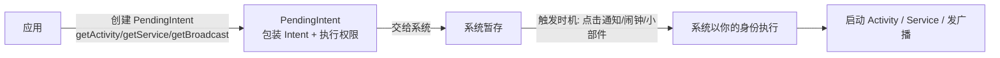

# PendingIntent 详解

> PendingIntent 是"**授权给其他应用/系统代为执行的 Intent**"：你把一个"未来要执行的 Intent"和"执行权限"一起打包交给系统，等时机成熟（用户点击通知、闹钟响起、小部件点击）由系统代替你启动。理解它与普通 Intent 的区别是本节核心。

## 一、PendingIntent 是什么



| 对比 | Intent | PendingIntent |
|------|--------|---------------|
| 执行者 | **当前应用**立即执行 | **系统代执行**（稍后/由其他组件触发） |
| 生命周期 | 用完即弃 | 持久保存，直到被消费或取消 |
| 传递场景 | 组件间传数据 | 交给系统 API（通知/小部件/闹钟） |
| 权限 | 应用自身权限 | **携带创建者的权限令牌** |
| 创建方式 | `new Intent()` | `PendingIntent.getActivity()/getService()/getBroadcast()` |

::: tip 核心认知
PendingIntent = **Intent + 执行权限 + 触发时机**。系统在触发时"以你的应用身份"执行这个 Intent，因此它能在通知点击后启动你的页面、在小部件点击后执行你的逻辑。
:::

## 二、三种创建方式

```kotlin
// 1. 启动 Activity（通知点击最常见）
val intent = Intent(this, DetailActivity::class.java)
val pendingIntent = PendingIntent.getActivity(
    this,
    requestCode = 1001,               // 请求码：区分不同 PendingIntent
    intent,
    PendingIntent.FLAG_IMMUTABLE or PendingIntent.FLAG_UPDATE_CURRENT
)

// 2. 启动/绑定 Service
val serviceIntent = Intent(this, DownloadService::class.java)
val pendingService = PendingIntent.getService(
    this, 2001, serviceIntent,
    PendingIntent.FLAG_IMMUTABLE or PendingIntent.FLAG_UPDATE_CURRENT
)

// 3. 发送广播（通知操作按钮常用）
val actionIntent = Intent("com.example.ACTION_PAUSE")
val pendingBroadcast = PendingIntent.getBroadcast(
    this, 3001, actionIntent,
    PendingIntent.FLAG_IMMUTABLE or PendingIntent.FLAG_UPDATE_CURRENT
)
```

| 方法 | 触发结果 | 典型场景 |
|------|----------|----------|
| `getActivity` | 启动 Activity | 点击通知跳转页面 |
| `getService` | 启动服务 | 通知操作启动后台服务 |
| `getBroadcast` | 发送广播 | 通知操作按钮（暂停/播放）、小部件 |

## 三、FLAG 更新规则

PendingIntent 通过 `requestCode` + Intent 是否匹配来决定"复用还是新建"。Flags 控制行为：

| Flag | 行为 | 适用 |
|------|------|------|
| `FLAG_CANCEL_CURRENT` | 先取消旧的再创建新的 | 旧 PendingIntent 必须失效时 |
| `FLAG_UPDATE_CURRENT` | **复用**旧的，但更新其 Intent 内容（extras） | 通知频繁更新内容（最常用） |
| `FLAG_NO_CREATE` | 不存在则返回 null（不创建） | 检查是否已存在 |
| `FLAG_IMMUTABLE` | 创建后 Intent 不可修改（**安全默认**） | 通知/小部件（Android 12 起强制） |
| `FLAG_MUTABLE` | 允许其他组件修改 Intent 内容 | 特定系统场景（如媒体会话） |

```kotlin
// 经典场景：通知 ID 不变、内容更新 —— 用 UPDATE_CURRENT
fun updateNotification(articleId: Long, title: String) {
    val intent = Intent(this, DetailActivity::class.java).apply {
        putExtra("id", articleId)      // 每次更新 extras
    }
    val pendingIntent = PendingIntent.getActivity(
        this,
        articleId.toInt(),             // 不同文章用不同 requestCode
        intent,
        PendingIntent.FLAG_IMMUTABLE or PendingIntent.FLAG_UPDATE_CURRENT
    )
    // 相同 requestCode + 相同 Intent → 复用同一 PendingIntent，只更新内容
}
```

::: warning Android 12+ 强制要求
targetSdk 31+ 创建 PendingIntent **必须显式声明** `FLAG_IMMUTABLE` 或 `FLAG_MUTABLE`，否则抛 `IllegalArgumentException`。安全建议：一律用 `FLAG_IMMUTABLE`（除非确实需要被填充内容）。
:::

## 四、典型使用场景

### 场景 1：通知点击跳转

```kotlin
val intent = Intent(this, ChatActivity::class.java).apply {
    flags = Intent.FLAG_ACTIVITY_NEW_TASK or Intent.FLAG_ACTIVITY_CLEAR_TOP
    putExtra("chatId", chatId)
}
val contentIntent = PendingIntent.getActivity(
    this, chatId, intent,
    PendingIntent.FLAG_IMMUTABLE or PendingIntent.FLAG_UPDATE_CURRENT
)

val notification = NotificationCompat.Builder(this, "messages")
    .setSmallIcon(R.drawable.ic_chat)
    .setContentTitle(sender)
    .setContentText(message)
    .setContentIntent(contentIntent)
    .setAutoCancel(true)
    .build()
NotificationManagerCompat.from(this).notify(chatId, notification)
```

### 场景 2：通知操作按钮（播放/暂停）

```kotlin
// 操作按钮用广播 PendingIntent
val pauseIntent = PendingIntent.getBroadcast(
    this, 1,
    Intent("com.example.MEDIA_PAUSE"),
    PendingIntent.FLAG_IMMUTABLE or PendingIntent.FLAG_UPDATE_CURRENT
)

NotificationCompat.Builder(this, "media")
    .addAction(R.drawable.ic_pause, "暂停", pauseIntent)
    // 用户点击"暂停" → 系统发广播 → Receiver 处理
```

### 场景 3：桌面小部件

```kotlin
// AppWidgetProvider 中
val intent = Intent(context, MainActivity::class.java)
val pending = PendingIntent.getActivity(
    context, 0, intent,
    PendingIntent.FLAG_IMMUTABLE or PendingIntent.FLAG_UPDATE_CURRENT
)
views.setOnClickPendingIntent(R.id.widget_root, pending)
```

### 场景 4：AlarmManager 闹钟

```kotlin
val pending = PendingIntent.getBroadcast(
    this, 0,
    Intent(this, AlarmReceiver::class.java),
    PendingIntent.FLAG_IMMUTABLE or PendingIntent.FLAG_UPDATE_CURRENT
)
alarmManager.setExactAndAllowWhileIdle(
    AlarmManager.RTC_WAKEUP, triggerAtMillis, pending
)
```

## 五、安全最佳实践

| 风险 | 说明 | 防护 |
|------|------|------|
| Intent 注入 | 恶意应用篡改 PendingIntent 内容 | `FLAG_IMMUTABLE` |
| 伪造 PendingIntent | 恶意应用冒充你的通知 | PendingIntent 只交给可信系统 API |
| 隐私泄露 | extras 携带敏感数据被读取 | 不把敏感数据放 PendingIntent 的 extras |
| 滥用特权 | 利用"以应用身份执行"特性 | 接收方校验来源（`getCallingPackage` 等） |

```kotlin
// 安全规范
// 1. 一律 FLAG_IMMUTABLE
PendingIntent.FLAG_IMMUTABLE or PendingIntent.FLAG_UPDATE_CURRENT
// 2. 敏感数据不要放 extras（改为 ID，目标页面再查）
intent.putExtra("id", 42L)   // ✅ 只传 ID
// intent.putExtra("token", secretToken)  // ❌ 不传敏感数据
```

## 六、高频面试题精讲

**Q1：Intent 和 PendingIntent 的区别？**
A：Intent 是**立即执行**的意图描述，由当前应用直接调用系统启动组件；PendingIntent 是**延迟执行**的意图包装：它把 Intent + 创建者权限打包交给系统暂存，由系统在触发时机（点击通知、小部件、闹钟）**代替应用执行**。核心差异：执行者不同（应用 vs 系统）、时机不同（立即 vs 延迟）、权限模型不同（PendingIntent 携带权限令牌）。

**Q2：FLAG_UPDATE_CURRENT 和 FLAG_CANCEL_CURRENT 的区别？**
A：两者都用于 requestCode + Intent 匹配到已有 PendingIntent 的情况。`FLAG_UPDATE_CURRENT`：**保留**原 PendingIntent 但用新 Intent 内容**更新**它（extras 刷新），通知频繁更新内容时用它；`FLAG_CANCEL_CURRENT`：**先取消旧的再创建全新**的，旧对象失效——用于需要彻底替换（如权限/类型变化）的场景。不传 flag 则复用旧对象且不更新内容（内容不刷新，常见 bug）。

**Q3：为什么 PendingIntent 能"以应用身份"执行？**
A：创建时系统记录了创建者的 UID/权限信息，并生成一个令牌（token）绑定。触发执行时，系统用**创建者（而非触发者）的权限**来启动组件，所以通知点击能拉起你的 Activity、你的广播能收到——即使触发方是系统或第三方。这是"授权执行"机制的本质，也因此必须防止 PendingIntent 被恶意填充（FLAG_IMMUTABLE）。

**Q4：requestCode 的作用？什么情况下会复用？**
A：requestCode 是 PendingIntent 的"身份标识"。系统判断是否复用：**requestCode 相同 + Intent 的 action/data/component 等匹配** → 返回同一个 PendingIntent 对象（此时 flags 决定是否更新内容）；不同 → 创建新的。应用场景：多条通知各自独立跳转（每条用不同 requestCode），同一内容更新复用（相同 requestCode + UPDATE_CURRENT）。

**Q5：FLAG_IMMUTABLE 与 FLAG_MUTABLE 的使用场景？**
A：`FLAG_IMMUTABLE`：创建后 Intent 内容**不可变**，防止被其他应用注入修改，通知、小部件、闹钟等绝大多数场景用它（Android 12+ targetSdk 31+ 默认强制声明）；`FLAG_MUTABLE`：允许 Intent 内容被修改，仅当系统组件需要填充内容时使用（如 `MediaSession` 的 PendingIntent 需要系统填入状态）。

**Q6：如何取消一个 PendingIntent？**
A：① 创建时用相同参数调用 `getXxx` 并加 `FLAG_CANCEL_CURRENT` 覆盖旧对象；② `PendingIntent.cancel()` 显式取消；③ 通知场景：`NotificationManager.cancel(id)` 移除通知时，与之关联的 PendingIntent 仍存活（可复用），需主动 `pendingIntent.cancel()` 彻底回收。

## 七、小结

- **本质**：PendingIntent = Intent + 执行权限 + 延迟触发，系统代执行
- **三种创建**：getActivity / getService / getBroadcast 对应三大组件
- **Flags**：UPDATE_CURRENT 更新复用、CANCEL_CURRENT 取消重建、IMMUTABLE 安全默认
- **场景**：通知点击、操作按钮、桌面小部件、AlarmManager 闹钟
- **安全**：FLAG_IMMUTABLE 防注入、extras 不传敏感数据

> 📖 进阶阅读：[通知机制详解](/android/notification/notification-basics.md) | [Intent 详解](/android/intent/intent-basics.md) | [Service 与前台服务](/android/service/foreground-service.md)
