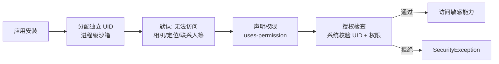
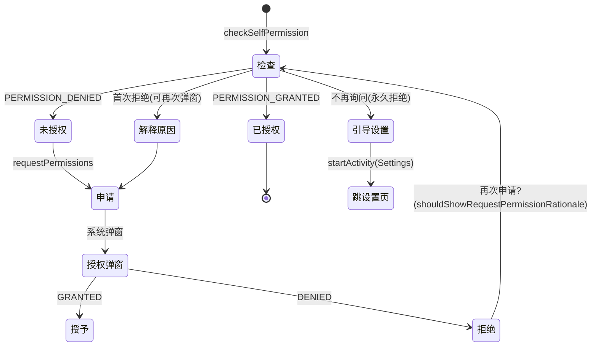

# 权限机制与运行时权限详解

> Android 应用默认运行在**沙箱**中：进程隔离、数据隔离。要访问相机、定位、联系人等敏感能力，必须获得用户授权。Android 6.0 引入的运行时权限把"安装时全部授权"改为"使用时逐项申请"，深刻影响了所有应用的交互设计。

## 一、安全模型：沙箱 + 权限



| 机制 | 说明 |
|------|------|
| UID 沙箱 | 每个应用独立 UID，进程/文件默认隔离 |
| 权限声明 | Manifest 中 `uses-permission` 申请 |
| 授权检查 | 系统 API 调用前校验权限状态 |
| 权限分级 | normal / dangerous / signature 三种保护级别 |

## 二、权限保护级别（protectionLevel）

| 级别 | 授予方式 | 说明 | 示例 |
|------|----------|------|------|
| `normal` | 安装时自动授予 | 低风险，不影响隐私 | `INTERNET`、`VIBRATE` |
| `dangerous` | **运行时用户确认** | 涉及隐私/敏感数据 | `CAMERA`、`LOCATION`、`READ_CONTACTS` |
| `signature` | 仅同签名应用 | 系统级保护 | `ACCESS_SUPERUSER` 等 |
| `signature\|privileged` | 同签名或特权应用 | 系统应用特权 | — |

**权限组（Permission Group）**：dangerous 权限按功能分组，早期同组权限"同授同拒"：

| 权限组 | 权限示例 |
|--------|----------|
| `CAMERA` | CAMERA |
| `LOCATION` | ACCESS_FINE_LOCATION、ACCESS_COARSE_LOCATION |
| `STORAGE` | READ_EXTERNAL_STORAGE、WRITE_EXTERNAL_STORAGE |
| `CONTACTS` | READ_CONTACTS、WRITE_CONTACTS |
| `PHONE` | CALL_PHONE、READ_PHONE_STATE |
| `CALENDAR` | READ_CALENDAR、WRITE_CALENDAR |
| `SMS` | SEND_SMS、READ_SMS、RECEIVE_SMS |
| `MICROPHONE` | RECORD_AUDIO |

::: warning 版本差异
**Android 11（API 30）起**，权限组内的权限可被单独授予/拒绝——"同授同拒"不再成立。**Android 13 起**存储权限被细化为 `READ_MEDIA_IMAGES` / `READ_MEDIA_VIDEO` / `READ_MEDIA_AUDIO`，`READ_EXTERNAL_STORAGE` 失效；新增 `POST_NOTIFICATIONS` 通知权限。
:::

## 三、运行时权限申请机制（Android 6.0+）

### 申请流程



### 标准申请代码

```kotlin
class MainActivity : ComponentActivity() {

    private val permissionLauncher =
        registerForActivityResult(ActivityResultContracts.RequestPermission()) { granted ->
            if (granted) {
                openCamera()
            } else {
                // 1. 用户拒绝：是否要解释原因
                if (shouldShowRequestPermissionRationale(Manifest.permission.CAMERA)) {
                    showRationaleDialog() // 解释后再申请
                } else {
                    showGoSettingsDialog() // 永久拒绝，引导去设置
                }
            }
        }

    fun requestCamera() {
        when {
            ContextCompat.checkSelfPermission(
                this, Manifest.permission.CAMERA
            ) == PackageManager.PERMISSION_GRANTED -> openCamera()
            else -> permissionLauncher.launch(Manifest.permission.CAMERA)
        }
    }
}
```

### 三种"拒绝"状态的区分

| 状态 | `shouldShowRequestPermissionRationale` | 处理 |
|------|----------------------------------------|------|
| 首次拒绝 | `true` | 弹自定义解释弹窗，说明用途后重新申请 |
| 拒绝并勾选"不再询问" | `false` | 只能跳系统设置页让用户手动开启 |
| 永久拒绝（系统策略） | `false` | 同上，引导设置页 |

```kotlin
// 跳转应用详情设置页
fun goToAppSettings() {
    Intent(Settings.ACTION_APPLICATION_DETAILS_SETTINGS).apply {
        data = Uri.fromParts("package", packageName, null)
        startActivity(this)
    }
}
```

## 四、权限版本演进（面试高频）

| 版本 | 变化 | 影响 |
|------|------|------|
| Android 6.0 | 引入**运行时权限** | dangerous 权限需动态申请 |
| Android 8.0 | 通知渠道（不影响权限） | — |
| Android 10 | 分区存储（storage 权限弱化） | 应用只能访问自身文件 + 公共媒体 |
| Android 11 | **单次授权**（"仅本次允许"） | 权限组独立控制 |
| Android 12 | 近似位置选项 | 模糊定位 |
| Android 13 | 通知权限 + 媒体权限细分 | 需单独申请 `POST_NOTIFICATIONS` |
| Android 14 | 部分照片访问权限 | 无需全部授权即可选图 |

**Android 13 通知权限示例**：

```xml
<uses-permission android:name="android.permission.POST_NOTIFICATIONS" />
```

```kotlin
// Android 13+ 需要动态申请通知权限
val launcher = registerForActivityResult(
    ActivityResultContracts.RequestPermission()
) { /* granted */ }
if (Build.VERSION.SDK_INT >= 33) {
    launcher.launch(Manifest.permission.POST_NOTIFICATIONS)
}
```

## 五、底层校验流程（源码视角）

```
应用调用相机 API
  → ActivityManager.checkPermission(权限, pid, uid)
  → PermissionManagerService（系统服务）
     ├─ 查询 app 的 grantedPermissions 列表
     ├─ 校验保护级别与授予状态
     └─ 返回 GRANTED / DENIED
```

| 关键类 | 职责 |
|--------|------|
| `PermissionManagerService` | 权限授予状态的权威存储与校验 |
| `AppOpsManager` | 权限的"使用记录"跟踪（隐私面板） |
| `PermissionController` | 系统权限管理 UI（授权弹窗） |
| `ActivityManager` | 提供 `checkPermission` 等校验入口 |

## 六、高频面试题精讲

**Q1：normal 权限与 dangerous 权限的区别？**
A：normal 权限风险低（联网、震动），**安装时自动授予**，无需用户交互；dangerous 权限涉及隐私（相机、定位、联系人），**必须运行时动态申请**，用户可随时在设置中撤回。区分依据是 Google 定义的 protectionLevel，应用自定义权限也可指定级别。

**Q2：权限组的作用？Android 11 后有什么变化？**
A：权限组把功能相关的 dangerous 权限归类。早期（6.0-10）：同组权限"同授同拒"，授予一个等于授予全组；**Android 11 起**：同组权限可独立授予/拒绝，弹窗也只显示单个权限。因此**不要依赖"授予 A 就一定有同组 B"**，每个权限单独检查单独申请。

**Q3：shouldShowRequestPermissionRationale 的含义与用法？**
A：它在"应用**曾被拒绝过**且**未勾选不再询问**"时返回 true（首次请求返回 false）。用途：① 返回 true → 需要向用户解释权限用途，弹自定义说明后重新申请；② 返回 false 且权限未授予 → 用户已永久拒绝或系统策略限制，只能跳系统设置页手动开启。

**Q4：Android 13 新增了哪些权限变化？**
A：① **通知权限** `POST_NOTIFICATIONS`：targetSdk 33+ 必须动态申请才能发通知（老应用默认关闭通知）；② **媒体权限细分**：`READ_MEDIA_IMAGES/VIDEO/AUDIO` 取代 `READ_EXTERNAL_STORAGE`；③ 新增 `NEARBY_WIFI_DEVICES`（附近 Wi-Fi 设备）等。适配要点：targetSdk 升级到 33+ 时逐项检查新权限申请。

**Q5：如何判断用户是否"永久拒绝"权限？**
A：`checkSelfPermission == DENIED` 且 `shouldShowRequestPermissionRationale == false`（且不是首次请求）→ 判定为永久拒绝/不再询问。此时调用 `requestPermissions` 不会再弹系统窗，必须跳转应用详情页（`ACTION_APPLICATION_DETAILS_SETTINGS`）让用户手动开启。

**Q6：权限校验的底层流程？**
A：应用调用敏感 API → 系统通过 `ActivityManager.checkPermission`（传权限名、进程 pid/uid）→ `PermissionManagerService` 查询该 UID 的已授予权限集合 → 返回 `PERMISSION_GRANTED/DENIED`。校验不通过时大多数 API 抛 `SecurityException`。授权状态的持久化存储、隐私面板的"使用记录"由 `AppOpsManager` 跟踪。

## 七、小结

- **沙箱模型**：UID 隔离是根基，权限是"授权访问"的令牌
- **三级保护**：normal 自动、dangerous 运行时、signature 同签名
- **申请流程**：检查 → 申请 → 回调处理三种拒绝态（可再问 / 不再询问 / 永久拒绝）
- **版本演进**：6.0 运行时权限 → 11 单次授权 → 13 通知+媒体细分 → 14 部分照片
- **工程要点**：逐个权限独立检查、`registerForActivityResult` 现代化申请、合理引导设置页

> 进阶阅读：[权限申请最佳实践与常见问题](/android/permission/permission-practice.md) | [Manifest 清单文件详解](/android/app/manifest-guide.md) | [通知机制详解](/android/notification/notification-basics.md)
