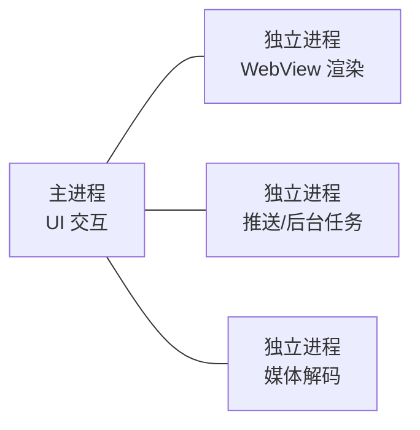

# 多进程机制详解

> 面试高频指数：高 — "为什么用多进程？Application 会执行几次？多进程下 SharedPreferences 为什么失效？"是源码面与实战面的经典连环问。

## 一、为什么需要多进程

### 1.1 单进程的瓶颈

单进程模式的典型瓶颈如下：

| 问题 | 说明 |
|------|------|
| 内存限制 | 每个应用进程默认 256MB-512MB 堆内存（按机型），大应用易 OOM |
| 稳定性 | 任何组件崩溃（native 崩溃）都可能导致整个进程被杀 |
| 后台任务 | 前台进程被杀后，同一进程内的后台组件全部失效 |

### 1.2 多进程的收益

多进程的构成关系如下：



- **内存隔离**：每个进程有独立的堆内存配额，总内存 = 各进程之和
- **稳定性隔离**：一个进程崩溃（如 WebView native crash）不影响其他进程
- **任务分流**：重量级任务（图片处理、视频播放）放独立进程，避免主进程卡顿
- **后台保活**：通过多进程 + 前台服务组合，降低被杀概率（已受限，谨慎）

## 二、如何开启多进程

### 2.1 android:process 配置

```xml
<application>
    <!-- 主进程：无 android:process 属性，默认包名进程 -->

    <activity
        android:name=".MainActivity"
        android:process="com.example.app" />  <!-- 显式指定主进程名 -->

    <service
        android:name=".PushService"
        android:process=":remote" />          <!-- 私有进程 -->

    <provider
        android:name=".ImageProvider"
        android:process="com.example.app.image" />  <!-- 全局进程 -->
</application>
```

### 2.2 进程命名规则

两种进程命名方式的说明如下：

| 写法 | 实际进程名 | 权限 |
|------|-----------|------|
| `:remote` | `com.example.app:remote` | 私有进程（前缀冒号），仅本应用可用 |
| `com.example.app.image` | `com.example.app.image` | 全局进程，其他应用可复用（需同 UID） |

> 关键点：`:` 前缀表示**应用私有进程**，进程名前自动加包名；无冒号的完整进程名是**全局进程**，可被同 UID 的兄弟应用共享。多进程应用几乎都用私有进程。

## 三、多进程的关键影响

### 3.1 Application 多次创建

**每个进程都会独立创建 Application 实例**，`onCreate` 会被执行多次：

::: code-tabs

@tab:active Java

```java
class App extends Application {
    @Override
    public void onCreate() {
        super.onCreate();
        String processName = getProcessName();
        // 只初始化主进程的 UI 相关逻辑
        if (packageName.equals(processName)) {
            initCrashHandler();      // 只主进程
            initRouter();            // 只主进程
        }
        // 所有进程都需要的基础初始化
        initNetwork();
    }
}
```

@tab Kotlin

```kotlin
class App : Application() {
    override fun onCreate() {
        super.onCreate()
        val processName = getProcessName()
        // 只初始化主进程的 UI 相关逻辑
        if (processName == packageName) {
            initCrashHandler()      // 只主进程
            initRouter()            // 只主进程
        }
        // 所有进程都需要的基础初始化
        initNetwork()
    }
}
```

:::

获取当前进程名的方法如下：

::: code-tabs

@tab:active Java

```java
// 获取当前进程名
@Nullable
public String getProcessName() {
    if (Build.VERSION.SDK_INT >= 28) {
        return Application.getProcessName();
    }
    int pid = Process.myPid();
    ActivityManager am = (ActivityManager) getSystemService(Context.ACTIVITY_SERVICE);
    if (am.getRunningAppProcesses() != null) {
        for (ActivityManager.RunningAppProcessInfo info : am.getRunningAppProcesses()) {
            if (info.pid == pid) {
                return info.processName;
            }
        }
    }
    return null;
}
```

@tab Kotlin

```kotlin
// 获取当前进程名
fun getProcessName(): String? {
    if (Build.VERSION.SDK_INT >= 28) {
        return Application.getProcessName()
    }
    val pid = Process.myPid()
    val am = getSystemService(Context.ACTIVITY_SERVICE) as ActivityManager
    return am.runningAppProcesses?.firstOrNull { it.pid == pid }?.processName
}
```

:::

### 3.2 数据共享问题

各数据源在多进程下的可用性说明如下：

| 数据源 | 跨进程可用性 | 原因 |
|--------|-------------|------|
| 静态变量 / 单例 | 不可用 | 每个进程独立 JVM，内存不共享 |
| SharedPreferences | 不可靠 | 读写基于内存缓存 + 文件锁，多进程并发写丢失 |
| 文件 | 部分可用 | 需自行处理并发锁，无原子性 |
| SQLite | 可用 | 文件级数据库，但需处理写锁 |
| ContentProvider | 可用（推荐） | 官方跨进程数据方案 |
| Binder / AIDL | 可用（推荐） | 进程间通信标准方案 |
| 共享内存（Ashmem） | 可用 | 大块只读数据共享 |

### 3.3 多进程下的 SP 陷阱

多进程写 SharedPreferences 的问题示意如下：

::: code-tabs

@tab:active Java

```java
// 多进程写 SP：内存缓存不同步，后写覆盖先写
// 进程 A：editor.putInt("count", 100).commit()
// 进程 B：editor.putInt("count", 200).commit()
// 最终结果不确定（可能 100 也可能 200），且 B 可能读不到 A 的写入
```

@tab Kotlin

```kotlin
// 多进程写 SP：内存缓存不同步，后写覆盖先写
// 进程 A：editor.putInt("count", 100).commit()
// 进程 B：editor.putInt("count", 200).commit()
// 最终结果不确定（可能 100 也可能 200），且 B 可能读不到 A 的写入
```

:::

正确做法：多进程共享数据用 **ContentProvider（或 Room/DataStore 的跨进程方案）**。

## 四、进程间通信方案

### 4.1 方案对比

进程间通信方案的对比说明如下：

| 方案 | 特点 | 适用场景 |
|------|------|----------|
| Binder / AIDL | 高效、安全、支持双向 | 结构化接口通信 |
| Messenger | Binder 封装，串行消息队列 | 简单消息传递 |
| ContentProvider | 数据共享，天然跨进程 | 数据库/数据访问 |
| Broadcast | 低频、广播式 | 事件通知 |
| 共享文件 | 简单但无同步 | 小量配置（不推荐） |

### 4.2 多进程 Binder 池

多进程 Binder 池的完整实现如下：

::: code-tabs

@tab:active Java

```java
// AIDL 服务端
class RemoteService extends Service {
    private final IRemoteInterface.Stub binder = new IRemoteInterface.Stub() {
        @Override
        public Result process(Task task) {
            return handle(task);  // 独立进程执行重量任务
        }
    };

    @Override
    public IBinder onBind(Intent intent) {
        return binder;
    }
}

// 客户端：绑定远程服务
void bindRemote(Context context) {
    Intent intent = new Intent(context, RemoteService.class);
    context.bindService(intent, new ServiceConnection() {
        @Override
        public void onServiceConnected(ComponentName name, IBinder service) {
            IRemoteInterface remote = IRemoteInterface.Stub.asInterface(service);
            // 跨进程调用，重量任务在独立进程执行
            Result result = remote.process(new Task(...));
        }

        @Override
        public void onServiceDisconnected(ComponentName name) {}
    }, Context.BIND_AUTO_CREATE);
}
```

@tab Kotlin

```kotlin
// AIDL 服务端
class RemoteService : Service() {
    private val binder = object : IRemoteInterface.Stub() {
        override fun process(task: Task): Result {
            return handle(task)  // 独立进程执行重量任务
        }
    }
    override fun onBind(intent: Intent): IBinder = binder
}

// 客户端：绑定远程服务
fun bindRemote(context: Context) {
    val intent = Intent(context, RemoteService::class.java)
    context.bindService(intent, object : ServiceConnection {
        override fun onServiceConnected(name: ComponentName?, service: IBinder?) {
            val remote = IRemoteInterface.Stub.asInterface(service)
            // 跨进程调用，重量任务在独立进程执行
            val result = remote.process(Task(...))
        }
        override fun onServiceDisconnected(name: ComponentName?) {}
    }, Context.BIND_AUTO_CREATE)
}
```

:::

## 五、多进程实战场景

### 5.1 WebView 独立进程

```xml
<activity
    android:name=".WebActivity"
    android:process=":web" />
```

- WebView 渲染引擎（chromium）是 native 代码，崩溃率高
- 独立进程后，WebView 崩溃只影响该进程，主进程不挂
- 代价：跨进程传输数据（URL、截图）需 IPC

### 5.2 推送/长连接独立进程

- 网络连接（IM、推送）放独立进程，与 UI 进程解耦
- 即使 UI 进程被系统回收，长连接进程仍存活（受系统限制政策约束）

### 5.3 大图/视频处理独立进程

- 图片压缩、视频转码等内存密集型任务独立进程，避免主进程 OOM
- 任务完成后通过 Binder/广播通知主进程

## 六、多进程的坑

多进程开发中的常见坑点如下：

| 坑点 | 描述 | 解决 |
|------|------|------|
| Application 多次初始化 | 每个进程一次 onCreate | 按进程名条件初始化 |
| 静态数据不同步 | 单例/静态变量各进程独立 | 用 IPC 或 Provider 共享 |
| SP 数据丢失 | 内存缓存不同步 | 改用 Provider/数据库 |
| 线程池重复创建 | 每进程一套 | 幂等初始化 |
| 内存"翻倍" | 多进程总内存上升 | 评估收益，不过度拆分 |
| 调试困难 | 崩溃栈、单步调试跨进程 | 按进程过滤日志 |

## 七、高频面试题

### Q1：为什么有时候需要多进程？多进程有什么代价？
::: details 查看答案
多进程收益：① 突破单进程内存上限，防 OOM；② 稳定性隔离，native 崩溃不拖垮整个应用；③ 重量级任务分流，保证 UI 流畅；④ 后台任务与 UI 解耦。代价：① 每个进程都执行 Application.onCreate，初始化翻倍；② 静态变量/单例不共享；③ 进程间通信有 IPC 开销；④ 总内存占用上升；⑤ 调试与问题排查更复杂。收益明显时才用（WebView、推送、媒体处理）。
:::

### Q2：多进程下 Application 会执行几次？如何区分当前进程？
::: details 查看答案
每个进程都会创建独立的 Application 实例并执行 onCreate，进程数 = Application 创建次数。区分进程：① API 28+ 用 Application.getProcessName()；② 旧版本通过 ActivityManager.getRunningAppProcesses 按 pid 匹配进程名。初始化时用 if (processName == packageName) 包裹 UI 相关初始化，网络/基础组件初始化放公共部分。
:::

### Q3：多进程下 SharedPreferences 有什么问题？
::: details 查看答案
SP 基于内存缓存 + 文件锁实现：每个进程启动时把文件读入自己的内存缓存，写入时只更新本进程缓存并异步写文件。多进程下：① 进程 B 读不到进程 A 的写入（缓存不同步）；② 两进程同时写会互相覆盖；③ 官方明确多进程场景不安全。替代方案：ContentProvider 封装（如 Room）、DataStore 暂无官方跨进程方案、文件+锁自定义实现。
:::

### Q4：:remote 和完整进程名的区别？
::: details 查看答案
:remote 是应用私有进程：进程名自动加包名前缀（com.example.app:remote），只允许本应用使用，其他应用即使指定相同名字也无法复用；完整进程名（如 com.example.app.remote）是全局进程，同 UID（同签名或 sharedUserId）的多个应用可以共享该进程，进程中会同时运行多个应用的组件。绝大多数场景用私有进程（:xxx）。
:::

### Q5：进程间通信为什么推荐 Binder 而不是共享内存？
::: details 查看答案
Binder 优点：① 一次拷贝（共享内存需两次拷贝），性能高效；② 基于 UID 安全校验，内核级权限控制，接收方可验证调用方身份；③ 支持双向通信（客户端也可回调服务端）；④ 是 Android 组件（ActivityManager、WindowManager 等）的统一通信底座，生态一致。共享内存在 Android 中主要用于大块只读数据（Ashmem），需要自行处理同步与安全，不适合通用 IPC。
:::

## 八、小结

多进程机制要点：

1. `android:process` 配置进程，`:` 前缀是私有进程
2. 每个进程独立 Application，按进程名条件初始化
3. 静态数据/SP 跨进程失效，用 Binder/ContentProvider 共享
4. 典型场景：WebView、推送、媒体处理独立进程
5. 权衡内存翻倍与稳定性收益，避免过度拆分

相关阅读：[Android 进程与保活](/android/process/process-lifecycle.md)、[AIDL 跨进程通信](/android/service/aidl.md)、[Binder 机制详解](/system/binder/binder-mechanism.md)、[Application 详解与全局初始化](/android/app/application-basics.md)。
