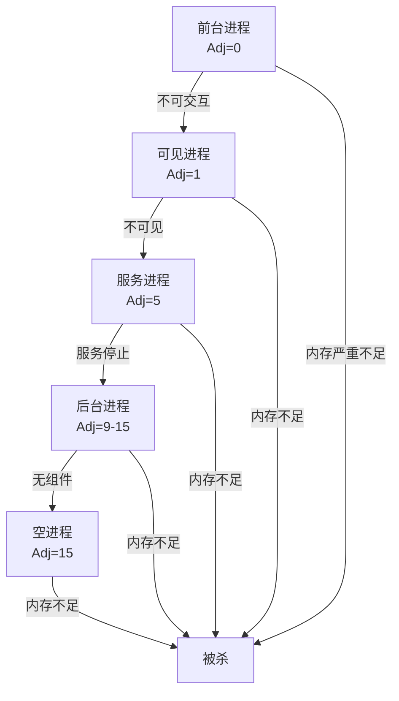
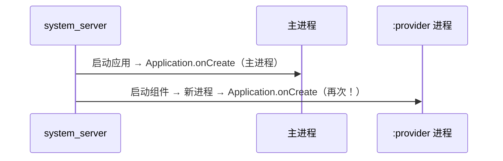
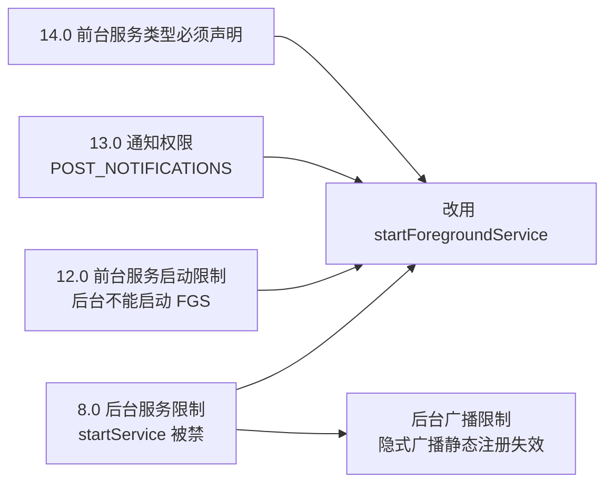

# Android 进程与保活

> 面试高频指数：极高
> 进程管理是 Android 资源调度的核心。本文梳理进程概念、五级生命周期、OOM_ADJ 机制、多进程注意事项、保活方案演进，以及"进程与线程"这个经典面试题。

## 一、进程概念

进程（Process）是程序的一次运行活动，是系统进行**资源分配和调度**的基本单位。Android 基于 Linux 内核，每个应用默认运行在**独立进程**中（UID 隔离 + 沙箱）。

### 1.1 默认进程与线程模型

- 默认情况下，同一应用的所有组件运行在**同一个进程**（包名）的**主线程**中。
- `android:process` 属性可让指定组件运行在独立进程：

```xml
<!-- 让 Provider 运行在独立进程 -->
<provider
    android:name=".data.MyProvider"
    android:process=":provider" />   <!-- 冒号前缀 = 私有进程 -->

<service
    android:name=".remote.RemoteService"
    android:process="com.example.remote" />  <!-- 完整包名 = 全局进程 -->
```

- **冒号（:）前缀**：私有进程，其他应用无法访问；
- **完整包名**：全局进程，可被其他应用复用（需共享 UID）。

### 1.2 进程与线程的区别（经典面试题）

| 维度 | 进程 | 线程 |
|------|------|------|
| 定义 | 资源分配的基本单位 | CPU 调度的基本单位 |
| 内存 | 独立地址空间（隔离） | 共享进程内存 |
| 通信 | Binder/共享内存/文件 | 直接共享变量（需同步） |
| 崩溃影响 | 进程崩溃互不影响 | 线程崩溃（异常）可能导致进程崩溃 |
| 开销 | 创建/切换开销大 | 创建/切换开销小 |
| Android 中 | 一个 App 默认一个进程 | 主线程 + 若干子线程 |

## 二、进程生命周期（五级）

> 与 Activity 生命周期无关——**进程优先级由组件状态决定**，系统按优先级回收进程。



| 级别 | 条件 | 被杀优先级 |
| --- | --- | --- |
| 前台进程 | 正在交互的 Activity（`onResume`）；绑定前台 Activity 的 Service；前台服务（`startForeground`）；正在执行生命周期回调的 Service；正在执行 `onReceive()` 的 Receiver | 最后被杀 |
| 可见进程 | 不在前台但可见的 Activity（`onPause`）；绑定可见 Activity 的 Service | 次之 |
| 服务进程 | `startService` 启动且不属于上两类 | 再次 |
| 后台进程 | 用户不可见的 Activity（`onStop`），LRU 列表管理 | 较前 |
| 空进程 | 无任何活动组件，仅缓存加速启动 | 最先被杀 |

## 三、进程优先级背后的 OOM_ADJ 机制

系统用 **ADJ（Adjustment）值**对进程打分，值越小优先级越高（越晚被杀）。这是 LMK（Low Memory Killer，内核 `lmkd` 进程）决策的依据：

| ADJ 级别 | 取值 | 解释 |
| --- | --- | --- |
| NATIVE_ADJ | -17 | native 进程（不受系统管理） |
| SYSTEM_ADJ | -16 | 系统进程 |
| PERSISTENT_PROC_ADJ | -12 | 系统 persistent 进程（如 telephony） |
| PERSISTENT_SERVICE_ADJ | -11 | 关联系统/persistent 的 Service |
| FOREGROUND_APP_ADJ | 0 | 前台进程 |
| VISIBLE_APP_ADJ | 1 | 可见进程 |
| PERCEPTIBLE_APP_ADJ | 2 | 可感知进程（后台音乐播放等） |
| BACKUP_APP_ADJ | 3 | 备份进程 |
| HEAVY_WEIGHT_APP_ADJ | 4 | 后台重量级进程 |
| SERVICE_ADJ | 5 | 服务进程 |
| HOME_APP_ADJ | 6 | Home 进程 |
| PREVIOUS_APP_ADJ | 7 | 上一个 App（按返回键后） |
| SERVICE_B_ADJ | 8 | B List 中较老的 Service |
| CACHED_APP_MIN_ADJ | 9 | 后台进程 adj 下限 |
| CACHED_APP_MAX_ADJ | 15 | 后台进程 adj 上限 |
| UNKNOWN_ADJ | 16 | 未知（即将变缓存进程） |

**关键结论**：
- ADJ 是**动态变化的**——同一进程的优先级随组件状态实时调整。
- 前台进程（0）几乎不会被杀，只有系统内存极端紧张时才可能。
- 后台进程按 LRU + 内存占用排序，**最久未用且占用内存大的先被杀**。

## 四、多进程模式

### 4.1 为什么会创建多个 Application



**四大组件只要声明了 `android:process`，在各自进程启动时都会重新执行一次 `Application.onCreate`。**

### 4.2 多进程带来的问题

| 问题 | 原因 | 解决 |
|------|------|------|
| 静态成员/单例失效 | 每个进程独立内存，变量不共享 | 进程内判断 + 跨进程通信（Binder） |
| 线程同步失效 | 锁只在单进程内有效 | 进程间通信本身有同步机制 |
| SharedPreferences 不可靠 | 内存缓存不同步 | 用 ContentProvider 或数据库（如 Room） |
| Application 多次初始化 | 每进程都走 onCreate | 按进程名分支初始化 |
| Binder 死锁风险 | 主线程等待其他进程 Binder 返回 | 避免主线程同步跨进程调用 |

::: code-tabs

@tab:active Java

```java
// 按进程名分支初始化（常见做法）
class MyApplication extends Application {
    @Override
    public void onCreate() {
        super.onCreate();
        if (ProcessUtils.isMainProcess(this)) {
            // 只初始化主进程需要的：推送、图片库、崩溃收集
        } else {
            // 子进程（如 :remote）：只做轻量初始化
        }
    }
}
```

@tab Kotlin

```kotlin
// 按进程名分支初始化（常见做法）
class MyApplication : Application() {
    override fun onCreate() {
        super.onCreate()
        if (ProcessUtils.isMainProcess(this)) {
            // 只初始化主进程需要的：推送、图片库、崩溃收集
        } else {
            // 子进程（如 :remote）：只做轻量初始化
        }
    }
}
```

:::

### 4.3 多进程的适用场景

- **进程隔离**：WebView 崩溃不影响主进程（WebView 多进程模式）。
- **远程服务**：音乐播放、下载任务常驻独立进程。
- **超大内存需求**：独立进程申请独立堆内存。

## 五、进程保活方案演进

### 5.1 历史上的保活手段

| 方案 | 原理 | 现状 |
|------|------|------|
| 一个像素 Activity | 透明 Activity 提升前台优先级 | ✗ 已被系统检测限制（8.0+） |
| 前台服务 | `startForeground` 提升为可感知进程（Adj=2） | ✓ 合法，但 8.0+ 需通知；Android 13 需权限 |
| 双进程守护 | 两个进程互拉（A 被杀 B 拉起 A） | ✗ 8.0+ 后台启动限制下失效 |
| JobScheduler 唤醒 | 系统调度周期任务 | ✓ 合法但间隔受系统控制 |
| START_STICKY | 服务被杀后系统自动重启 | ✓ 仅限系统非强制杀 |
| 与系统服务捆绑 | 绑定系统组件提高优先级 |  属于 hack，不推荐 |
| 静默前台服务 | 隐藏通知 | ✗ Android 8.0+ 必须显示通知，否则崩溃 |

### 5.2 Android 8.0+ 的现实



**结论**：传统保活手段几乎全部失效。现代 Android 的正确做法：

1. **合法前台服务**：用户可感知的任务（播放、下载、导航），声明类型 + 通知。
2. **引导用户加入电池优化白名单**：`ACTION_REQUEST_IGNORE_BATTERY_OPTIMIZATIONS`。
3. **WorkManager**：系统统一调度的延迟/周期任务，优先于自行保活。
4. **接受现实**：纯后台 App 在息屏后被杀是**系统设计**，不是 bug。

::: code-tabs

@tab:active Java

```java
// 判断是否在白名单
PowerManager pm = (PowerManager) getSystemService(Context.POWER_SERVICE);
pm.isIgnoringBatteryOptimizations(getPackageName());
```

@tab Kotlin

```kotlin
// 判断是否在白名单
val pm = getSystemService(PowerManager::class.java)
pm.isIgnoringBatteryOptimizations(packageName)
```

:::

## 六、高频面试题（带详解）

**Q1：进程与线程的区别？**
A：进程是资源分配单位（独立内存、相互隔离），线程是 CPU 调度单位（共享进程内存）。Android 中一个 App 默认一个进程多个线程，进程被杀线程随之消亡。

**Q2：如何查看进程优先级？**
A：`adb shell dumpsys activity processes` 查看各进程的 `adj` 值；`adb shell cat /proc/<pid>/oom_score_adj` 查看内核 oom_score_adj。

**Q3：为什么 App 切后台一会儿就被杀了？**
A：后台进程 ADJ 值高（9-15），内存不足时系统优先回收。这是系统内存管理机制，正常现象。

**Q4：多进程下 Application 会执行几次 onCreate？**
A：每个进程都会执行一次。需要按 `getProcessName()` 分支初始化，避免重复初始化资源。

**Q5：如何实现进程保活？**
A：合法手段：前台服务（`startForeground` + 通知 + 类型声明）、引导白名单、WorkManager。8.0+ 后一个像素 Activity、双进程守护等 hack 方案均已失效。

**Q6：前台服务为什么进程优先级高？**
A：前台服务使进程处于 PERCEPTIBLE_APP_ADJ（2），高于普通服务（5）和后台进程（9-15），系统几乎不会杀它，除非内存极端紧张。

**Q7：START_STICKY 能保证服务不被杀吗？**
A：不能。它只保证**系统主动杀**（非 force-stop）后尝试重建服务（传 null Intent）；用户手动强制停止（Force Stop）后不会重启。

**Q8：为什么说"被杀后自动重启"是反模式？**
A：8.0+ 后台启动限制下，自启动手段被系统拦截，还可能被标记为恶意行为；正确的长任务设计是前台服务 + WorkManager + 用户授权。

## 七、小结

- 进程优先级五级（前台→空进程）由组件状态决定，背后是 ADJ 机制。
- 多进程 = 多 Application 实例 + 静态失效 + 通信成本，按需使用。
- 保活方案随版本演进不断收紧，现代正确姿势是前台服务 + 白名单 + WorkManager。
- 面试核心：五级优先级、ADJ、多进程问题、保活方案演进、进程 vs 线程。

> 进阶阅读：[AMS 与 WMS](/system/ams-wms/) | [Binder 机制](/system/binder/) | [Service 详解](/android/service/service-basics.md)
