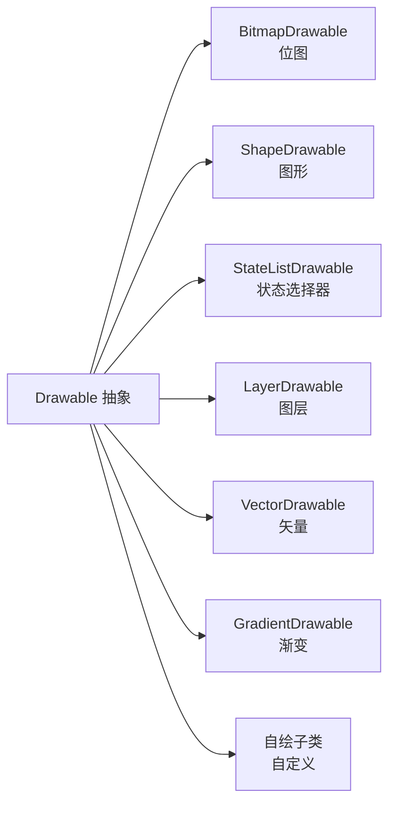

# Drawable 详解与实战

> 面试高频指数：中 — Drawable 的分类、shape 与 selector 的用法、VectorDrawable 原理与 Bitmap 的区别，是 UI 基础面试的高频考点。

## 一、Drawable 是什么

**Drawable（可绘制对象）** 是 Android 中"可以被绘制的东西"的抽象，不同于 Bitmap（像素图），Drawable 更关注**绘制指令**与**尺寸无关的适配**。



### Drawable 与 Bitmap 的区别

| 维度 | Drawable | Bitmap |
|------|----------|--------|
| 本质 | 绘制指令/资源对象 | 像素数据 |
| 缩放 | 矢量类可无损缩放 | 放大模糊 |
| 内存 | 取决于实现（Vector 很小） | 与宽高像素成正比 |
| 使用方式 | `imageView.setImageDrawable()` | `imageView.setImageBitmap()` |
| 获取 | `getDrawable(resId)` | `BitmapFactory.decode...` |

## 二、Shape Drawable（图形）

### 2.1 基本用法

```xml
<!-- res/drawable/rounded_card.xml -->
<shape xmlns:android="http://schemas.android.com/apk/res/android"
    android:shape="rectangle">
    <solid android:color="#FFFFFF" />
    <stroke
        android:width="1dp"
        android:color="#E0E0E0" />
    <corners android:radius="12dp" />
    <padding
        android:left="16dp"
        android:top="12dp"
        android:right="16dp"
        android:bottom="12dp" />
</shape>
```

### 2.2 shape 类型

| 类型 | 值 | 说明 |
|------|-----|------|
| rectangle | 默认 | 矩形（配合 corners 圆角） |
| oval | 圆形/椭圆 | 头像占位、按钮背景 |
| line | 横线 | 分割线 |
| ring | 圆环 | 进度环（需 innerRadius 等） |

### 2.3 渐变与阴影

```xml
<shape android:shape="rectangle">
    <gradient
        android:startColor="#4FC3F7"
        android:endColor="#0288D1"
        android:angle="45" />   <!-- 仅 linear 生效 -->
    <size
        android:width="200dp"
        android:height="80dp" />
</shape>
```

> 关键点：shape 的 `<solid>` 与 `<gradient>` 互斥，同时存在时 gradient 优先。selector 中的 state 组合可实现按下/选中反馈。

## 三、StateListDrawable（Selector）

### 3.1 状态选择器

```xml
<!-- res/drawable/btn_primary.xml -->
<selector xmlns:android="http://schemas.android.com/apk/res/android">
    <!-- 按下态（最优先） -->
    <item android:state_pressed="true">
        <shape>
            <solid android:color="#CC0288D1" />
            <corners android:radius="8dp" />
        </shape>
    </item>
    <!-- 禁用态 -->
    <item android:state_enabled="false">
        <shape>
            <solid android:color="#E0E0E0" />
            <corners android:radius="8dp" />
        </shape>
    </item>
    <!-- 默认态（放最后） -->
    <item>
        <shape>
            <solid android:color="#0288D1" />
            <corners android:radius="8dp" />
        </shape>
    </item>
</selector>
```

### 3.2 常用状态位

| 状态 | 含义 |
|------|------|
| `state_pressed` | 按下 |
| `state_selected` | 选中（如 tab） |
| `state_checked` | 勾选（CheckBox/RadioButton） |
| `state_enabled` | 可用 |
| `state_focused` | 焦点（键盘导航） |
| `state_hovered` | 悬停（鼠标/触控笔） |
| `state_activated` | 激活（列表当前项） |

> 匹配规则：**从上到下按顺序匹配**，第一个满足所有条件的 item 生效，默认 item 放最后。状态组合用 `state_checked` 与 `state_enabled` 同时约束。

## 四、LayerDrawable（图层）与 InsetDrawable

### 4.1 LayerList 组合

```xml
<!-- res/drawable/shadow_card.xml -->
<layer-list xmlns:android="http://schemas.android.com/apk/res/android">
    <!-- 底层阴影 -->
    <item android:left="4dp" android:top="4dp">
        <shape>
            <solid android:color="#33000000" />
            <corners android:radius="12dp" />
        </shape>
    </item>
    <!-- 上层内容 -->
    <item android:bottom="4dp" android:right="4dp">
        <shape>
            <solid android:color="#FFFFFF" />
            <corners android:radius="12dp" />
        </shape>
    </item>
</layer-list>
```

### 4.2 常用组合 Drawable

| 类型 | 作用 |
|------|------|
| layer-list | 多层叠加（阴影、水印、进度背景） |
| inset | 内缩（图标距边界留白） |
| clip | 裁剪（进度条按比例显示） |
| scale | 缩放（透明度/缩放动画） |
| transition | 交叉淡入淡出（两个 Drawable 过渡） |

## 五、VectorDrawable（矢量图）

### 5.1 定义与原理

```xml
<!-- res/drawable/ic_arrow.xml -->
<vector xmlns:android="http://schemas.android.com/apk/res/android"
    android:width="24dp"
    android:height="24dp"
    android:viewportWidth="24"
    android:viewportHeight="24">
    <path
        android:fillColor="#FF000000"
        android:pathData="M8.59,16.59L13.17,12L8.59,7.41L10,6L16,12L10,18L8.59,16.59Z" />
</vector>
```

- **原理**：使用 **path 指令（pathData）描述图形**，类似 SVG
- **无损缩放**：`viewportWidth/Height` 定义逻辑坐标系，任意尺寸渲染不模糊
- **内存优势**：只存指令字符串，比同等位图小一个数量级
- **兼容性**：Android 5.0+ 原生支持，旧版本可用 VectorDrawableCompat（AppCompat）

### 5.2 矢量图与位图对比

| 维度 | VectorDrawable | Bitmap |
|------|----------------|--------|
| 文件大小 | 很小（KB 级） | 随分辨率增长 |
| 缩放质量 | 无损 | 放大模糊 |
| 内存占用 | 极小 | 像素计算 |
| 复杂照片 | 不支持 | 支持 |
| 动画 | 支持 path 动画 | 需帧动画 |

### 5.3 AnimatedVectorDrawable

```xml
<!-- 矢量动画：路径变形 / 旋转 -->
<animated-vector xmlns:android="http://schemas.android.com/apk/res/android"
    android:drawable="@drawable/ic_arrow">
    <target
        android:name="arrow_group"
        android:animation="@animator/rotate_anim" />
</animated-vector>
```

## 六、自定义 Drawable

```kotlin
// 自定义 Drawable：渐变圆环进度
class RingDrawable(
    private val progress: Float,
    private val ringColor: Int
) : Drawable() {

    private val paint = Paint(Paint.ANTI_ALIAS_FLAG).apply {
        style = Paint.Style.STROKE
        strokeWidth = 8.dp()
        strokeCap = Paint.Cap.ROUND
    }

    override fun draw(canvas: Canvas) {
        paint.color = ringColor
        val rect = bounds.toRectF().inset(4f, 4f)
        // 背景环
        canvas.drawArc(rect, 0f, 360f, false, paint)
        // 进度环
        paint.color = Color.WHITE
        canvas.drawArc(rect, -90f, 360f * progress, false, paint)
    }

    override fun setAlpha(alpha: Int) { paint.alpha = alpha }
    override fun setColorFilter(cf: ColorFilter?) { paint.colorFilter = cf }
    override fun getOpacity(): Int = PixelFormat.TRANSLUCENT
}
```

## 七、高频面试题

### Q1：Drawable 和 Bitmap 有什么区别？
::: details 查看答案
Drawable 是可绘制对象的抽象，包含绘制指令（Shape、Vector 等），关注绘制行为；Bitmap 是像素数据本身，关注图像存储。区别：① VectorDrawable 无损缩放而 Bitmap 放大模糊；② Drawable 内存取决于实现（Vector 极小），Bitmap 与像素数成正比；③ Drawable 支持状态（selector）和动画（animated-vector），Bitmap 是静态像素；④ 使用上 setImageDrawable 与 setImageBitmap 对应。应用图标等推荐 Vector，照片等只能用 Bitmap。
:::

### Q2：selector 的匹配规则是什么？
::: details 查看答案
selector 按 item 声明顺序从上到下匹配，取第一个所有 state 条件都满足的 item：① 状态位缺省表示不关心该状态；② 按下态、禁用态等应放在默认 item 之前；③ 默认 item（无状态约束）必须放最后兜底；④ state_checked 与 state_enabled 可组合；⑤ 不满足任何条件时若无默认 item 则不绘制。判断依据是 View 当前的 stateSet（由 View 的 enabled/pressed/checked 等组合）。
:::

### Q3：VectorDrawable 的原理和优势？
::: details 查看答案
VectorDrawable 用 pathData 描述矢量图形（类似 SVG 的 path 指令），通过 viewportWidth/Height 定义逻辑坐标系，渲染时按目标尺寸换算为实际路径：优势：① 任意尺寸无损缩放，适配多分辨率屏幕；② 文件体积小（KB 级）；③ 内存占用极低；④ 支持 path 动画（AnimatedVectorDrawable）。劣势：复杂位图无法描述；早期版本需 AppCompat 兼容；复杂 path 的解析也有 CPU 开销。
:::

### Q4：shape 里的 solid 和 gradient 能同时使用吗？
::: details 查看答案
不能同时生效。shape 的绘制内容按类型解析，solid 是纯色填充，gradient 是渐变填充，二者互斥，同时声明时 gradient 优先于 solid。类似的还有 stroke（描边）与 corners（圆角）独立于填充。开发中常见错误：想要"渐变+边框"效果时，需要 layer-list 组合两个 shape，或用 stroke 嵌套在渐变 shape 外层。
:::

### Q5：如何实现一个带动画效果的自定义 Drawable？
::: details 查看答案
① 继承 Drawable 重写 draw()/setAlpha()/setColorFilter()/getOpacity() 四个核心方法；② 用 Animator 或 ValueAnimator 驱动进度值，在动画回调中调用 invalidateSelf() 触发重绘；③ 关键点：invalidateSelf() 而非 invalidate()，保证只重绘当前 Drawable 所在区域；④ 动画值通过属性控制（如 progress），由调用方设置；⑤ 复杂场景可继承 Animatable2 接口管理动画生命周期。进度环、波纹等常用此方式。
:::

## 八、小结

Drawable 体系要点：

1. Drawable 是绘制指令抽象，与 Bitmap 像素图有本质区别
2. Shape 负责图形：solid/stroke/corners/gradient
3. Selector 按状态匹配，默认 item 兜底
4. LayerList 组合多层，实现阴影/叠加效果
5. Vector 矢量图无损缩放、内存极小、可动画
6. 自定义 Drawable 重写四个核心方法 + invalidateSelf()

相关阅读：[资源系统详解：R 文件、类型与加载](/android/resource/resource-basics.md)、[主题与样式系统](/android/resource/theme-style.md)、[Bitmap 详解与图片压缩](/ui/bitmap/bitmap-guide.md)、[Canvas 与 Path 绘制艺术](/ui/custom-view/canvas-path.md)。
