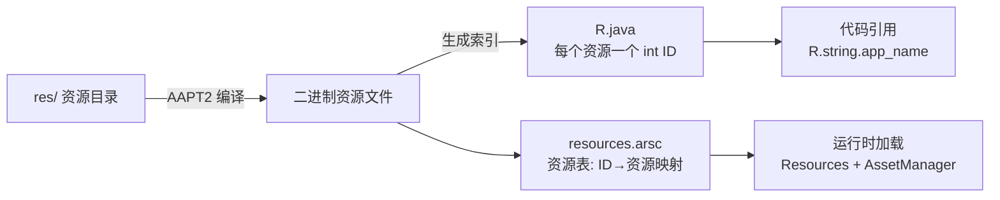

# 资源系统详解：R 文件、类型与加载

> Android 将**代码与资源分离**：布局、字符串、图片、颜色等一切"非代码内容"放在 `res/` 目录，由构建工具编译成二进制并生成 `R.java` 索引。运行时系统按设备配置选择最合适的资源。这套机制是 Android 多语言、多屏幕适配的根基。

## 一、为什么要资源系统



| 好处 | 说明 |
|------|------|
| 代码与内容分离 | 字符串/布局/图片不写死在代码里，便于维护 |
| 多语言适配 | 同一 ID 对应多语言资源，运行时自动选择 |
| 多屏幕适配 | 按密度/尺寸/方向提供不同资源 |
| 编译期检查 | 资源引用错误直接编译失败（`resource not found`） |
| 性能优化 | 资源预编译为二进制，加载更快 |

## 二、res/ 目录与资源类型

```
res/
├── layout/          # 布局文件（XML → View 树）
├── drawable/        # 图片与矢量图形（png/jpg/webp/selector/shape）
├── mipmap/          # 应用图标（各密度一套）
├── values/          # 简单值资源
│   ├── strings.xml  # 字符串
│   ├── colors.xml   # 颜色
│   ├── dimens.xml   # 尺寸
│   ├── styles.xml   # 样式与主题
│   └── arrays.xml   # 数组
├── anim/            # 补间动画（view 动画）
├── animator/        # 属性动画
├── color/           # 颜色状态列表（color state list）
├── font/            # 字体（.ttf/.otf）
├── menu/            # 菜单
├── raw/             # 原始文件（原样打包，不编译）
├── xml/             # 任意 XML 配置（如网络配置、备份规则）
└── assets/          # 【注意】assets 不属于 res，原样打包，无 ID
```

| 资源类型 | 引用方式 | 说明 |
|----------|----------|------|
| layout | `R.layout.activity_main` | XML 布局 |
| drawable | `R.drawable.ic_launcher` | 图片/形状/选择器 |
| mipmap | `R.mipmap.ic_launcher` | 启动图标（各密度） |
| string | `R.string.app_name` | 字符串 |
| color | `R.color.primary` | 颜色 |
| dimen | `R.dimen.margin` | 尺寸 |
| style | `R.style.AppTheme` | 样式/主题 |
| array | `R.array.planets` | 数组 |
| anim | `R.anim.fade_in` | 补间动画 |
| font | `R.font.roboto` | 字体 |
| raw | `R.raw.config` | 原样文件（不编译） |

### assets/ vs res/raw/

| 对比 | res/raw/ | assets/ |
|------|----------|---------|
| 是否编译 | 打包进 APK（保留原名） | 原样打包 |
| 引用方式 | `R.raw.xxx`（有 ID） | 通过文件名读取，无 ID |
| 访问 | `getResources().openRawResource()` | `assetManager.open("path")` |
| 适用场景 | 少量配置、音频 | 网页、大文件、目录结构数据 |

## 三、R 文件与资源 ID

```java
// 编译期生成（app/build/generated/.../R.java）
public final class R {
    public static final class string {
        public static final int app_name = 0x7f0a0001;
    }
    public static final class color {
        public static final int primary = 0x7f0b0002;
    }
}
```

资源 ID 是 32 位 int，编码规则：

```
0x  7f    0a      0001
   └──┘  └──┘    └──┘
  包 ID  类型 ID  条目 ID
```

| 段 | 含义 |
|----|------|
| 包 ID（高 8 位） | `0x7f`：应用资源；`0x01`~`0x02`：系统资源（`android.R`） |
| 类型 ID（次 8 位） | 资源类型序号（layout=2、string=3 等，按字母序） |
| 条目 ID（低 16 位） | 同类型内资源序号 |

## 四、加载机制：Resources + AssetManager

```
context.getResources() 
  → Resources（应用资源门面）
  → AssetManager（底层资源管理器，JNI 层）
  → resources.arsc（资源表，二进制）
  → 按 (packageId, typeId, entryId) 查表
  → 结合 Configuration 选择最佳限定符资源
  → 返回资源（字符串 / Drawable / XML 解析为 View）
```

```kotlin
// 常用加载 API
val res = context.resources
val appName = res.getString(R.string.app_name)
val primary = res.getColor(R.color.primary)
val icon = res.getDrawable(R.drawable.ic_logo)
val width = res.getDimension(R.dimen.margin)
val arr = res.getStringArray(R.array.planets)

// XML 资源：解析为对象
val parser = res.getXml(R.xml.config)
val config = res.openRawResource(R.raw.config)
```

::: tip 资源表（resources.arsc）
AAPT2 将 `res/` 下所有资源编译进 APK 的 `resources.arsc`（二进制资源表），包含：每个资源 ID 的条目、对应配置（限定符）、值的数据偏移。运行时查找基于这张表，**一次 IO 定位、按配置过滤**，性能远高于解析 XML 文本。
:::

## 五、主题与样式（Style / Theme）

```xml
<!-- styles.xml -->
<resources>
    <!-- 样式：一组 View 属性集合 -->
    <style name="TextTitle" parent="android:Widget.TextView">
        <item name="android:textSize">18sp</item>
        <item name="android:textStyle">bold</item>
        <item name="android:textColor">@color/primary</item>
    </style>

    <!-- 主题：作用于整个 Activity/应用的样式 -->
    <style name="Theme.Wiki" parent="Theme.Material3.DayNight">
        <item name="colorPrimary">@color/primary</item>
        <item name="colorSecondary">@color/secondary</item>
        <item name="android:statusBarColor">@color/primary</item>
        <item name="android:windowBackground">@drawable/launch_bg</item>
    </style>
</resources>
```

```xml
<!-- 使用 -->
<TextView
    style="@style/TextTitle"
    android:layout_width="wrap_content"
    android:layout_height="wrap_content" />

<activity
    android:name=".MainActivity"
    android:theme="@style/Theme.Wiki" />
```

| 对比 | Style 样式 | Theme 主题 |
|------|-----------|-----------|
| 作用对象 | 单个 View 或组件 | 整个 Activity / Application |
| 使用位置 | `style="@style/xxx"` | `android:theme="@style/xxx"` |
| 本质 | 相同的属性集合 | 也是 Style，但可被 View 继承使用 |
| 典型内容 | textSize、padding | colorPrimary、windowBackground |

**主题属性引用**（最佳实践——把颜色抽成主题属性，支持深色模式自动切换）：

```xml
<TextView
    android:textColor="?attr/colorPrimary"
    android:background="?attr/colorSurface" />
<!-- ?attr/xxx 表示"取当前主题中的该属性值"，换主题自动生效 -->
```

## 六、代码资源分离最佳实践

| 原则 | 说明 | 反例 |
|------|------|------|
| 字符串不硬编码 | 所有文案放 strings.xml | `"确定"` 写死在代码里 |
| 尺寸用 dimen | 统一尺寸规范 | 直接写 `48` dp |
| 颜色用主题属性 | 支持主题切换 | 直接 `#FF0000` |
| 图片放 drawable | 矢量图优先（矢量图适配） | 每个密度放一套位图 |
| 布局用 XML | 代码与 UI 分离 | 代码动态 new View |

```xml
<!-- strings.xml：硬编码的隐患 -->
<string name="confirm">确定</string>
<string name="cancel">取消</string>
```

```kotlin
// 正确引用（多语言自动适配）
val confirm = getString(R.string.confirm)

// 错误示范（无法翻译、无法适配）
// val confirm = "确定"
```

## 七、高频面试题精讲

**Q1：R 文件是什么？资源 ID 如何组成？**
A：R 文件是编译期由 AAPT2 自动生成的 Java 类，为每个资源分配唯一 int 常量 ID。ID 为 32 位：高 8 位是包 ID（0x7f 应用资源、0x01-0x02 系统资源），中 8 位是类型 ID，低 16 位是同类型内的条目 ID。代码通过 `R.类型.名称` 引用，运行时按此 ID 在 resources.arsc 中查表加载。

**Q2：res/ 与 assets/ 的区别？**
A：res/ 下的资源被 AAPT2 编译并生成 R 索引，支持限定符（多语言/密度适配），用 `R.xxx` 或 `getResources()` 访问；assets/ 原样打包，无编译无 ID，用 `AssetManager.open()` 按路径访问，适合放网页、字体、大文件。res/raw/ 介于中间：不编译但有 ID，用 `openRawResource()` 访问。

**Q3：主题和样式的区别？**
A：两者本质都是 style 属性集合。样式（Style）作用于单个 View，指定 textSize/颜色等；主题（Theme）作用于整个 Activity 或应用，包含颜色方案、窗口属性（状态栏、windowBackground）等全局视觉配置，且主题属性可被 View 通过 `?attr/xxx` 引用，切换主题（浅色/深色）时所有引用自动更新。

**Q4：运行时如何根据设备选择资源？**
A：设备启动时系统生成 `Configuration`（语言、屏幕尺寸、密度、方向、夜间模式等）。`getResources()` 拿到的是**结合当前 Configuration 的 Resources 实例**。查资源时按 ID 找到资源的所有配置版本（如 values-zh/、values-en/、drawable-xxhdpi/），用"最佳匹配算法"挑出最合适的那个；没有任何限定符匹配时回退到默认目录（values/、drawable/）。

**Q5：硬编码字符串有什么危害？如何避免？**
A：危害：① 无法多语言翻译；② lint 报 HardcodedText 警告；③ 维护困难。避免：所有文案进 `strings.xml`，代码用 `getString(R.string.xxx)`，布局用 `@string/xxx`。同理颜色用 `@color/xxx` 或主题属性 `?attr/xxx`，尺寸用 `@dimen/xxx`。

**Q6：resources.arsc 是什么？为什么重要？**
A：它是 APK 内的**二进制资源表**，记录了所有资源的 ID、名称、限定符配置与值偏移。运行时加载资源直接在表中二分查找 + 配置过滤，无需解析 XML 文本，加载速度远快于传统 XML 方案。这也是 Android 资源系统性能优秀的关键设计。

## 八、小结

- **资源 = 代码之外的一切**：res/ 编译成二进制 + R 索引，assets 原样打包
- **R 文件**：编译期生成的 ID 表，`R.类型.名称` 引用
- **加载链路**：Resources → AssetManager → resources.arsc → 配置过滤 → 资源值
- **主题与样式**：Style 管 View，Theme 管全局，`?attr/` 引用支持主题切换
- **最佳实践**：字符串/颜色/尺寸全部资源化，多语言多适配才有基础

> 进阶阅读：[资源限定符与多语言适配](/android/resource/resource-qualifiers.md) | [启动流程优化](/android/app/app-launch-process.md) | [View 绘制流程](/ui/view/view-draw-process.md)
