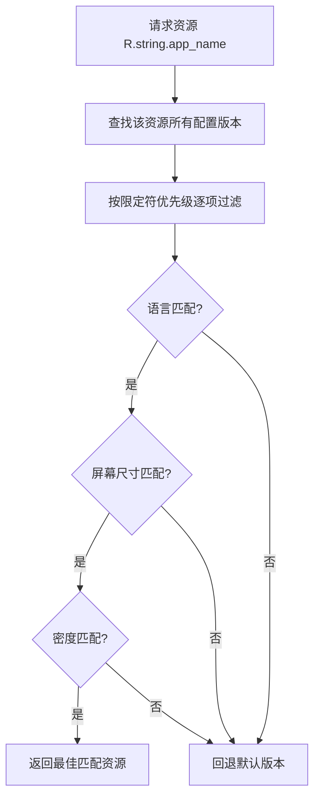

# 资源限定符与多语言适配

> 同一个资源 ID 可以有多个版本——`values-zh`、`values-en`、`drawable-xxhdpi`、`layout-land`……系统根据设备当前配置自动挑选最合适的版本。这就是 Android 多语言、多屏幕适配的魔法。本节讲透限定符体系与匹配算法。

## 一、限定符（Qualifier）体系

限定符是资源目录名中 `-` 后面的部分，描述该资源适用于什么配置：

```
res/
├── values/              # 默认（必须存在！回退目标）
├── values-zh/           # 中文
├── values-zh-rCN/       # 简体中文（地区限定）
├── values-en/           # 英文
├── values-pt-rBR/       # 巴西葡萄牙语
├── values-night/        # 夜间模式
├── values-land/         # 横屏
├── drawable/            # 默认图片
├── drawable-xxhdpi/     # 超高密度图片
├── drawable-night/      # 夜间主题图片
├── layout/              # 默认布局
├── layout-land/         # 横屏布局
└── layout-sw600dp/      # 最小宽度 ≥600dp（平板）
```

| 类别 | 限定符示例 | 含义 |
|------|-----------|------|
| 语言 | `zh`、`en`、`ja` | ISO 639-1 语言码 |
| 语言+地区 | `zh-rCN`、`pt-rBR` | 语言 + `r` + 地区码 |
| 屏幕尺寸 | `small`、`normal`、`large`、`xlarge` | 通用尺寸桶 |
| 屏幕方向 | `land`、`port` | 横屏 / 竖屏 |
| 屏幕密度 | `ldpi`、`mdpi`、`hdpi`、`xhdpi`、`xxhdpi`、`xxxhdpi` | 像素密度等级 |
| 最小宽度 | `sw320dp`、`sw600dp`、`sw720dp` | 最小可用宽度（平板适配首选） |
| 可用宽度 | `w600dp`、`w720dp` | 可用宽度 ≥ 指定值 |
| 可用高度 | `h480dp`、`h640dp` | 可用高度 ≥ 指定值 |
| 夜间模式 | `night` | 深色模式（API 29+ 支持） |
| 平台版本 | `v21`、`v26` | Android 版本限定 |

## 二、最佳匹配算法（如何挑选资源）



**匹配规则**（源码 `AssetManager` / `Resources` 的实现逻辑）：

1. **优先级排序**：限定符按类别有固定优先级（语言 → 语言+地区 → 屏幕尺寸 → 方向 → 密度 → 夜间 → 版本 …）
2. **逐项淘汰**：候选资源中，限定符与设备配置冲突的剔除；若当前配置匹配不上（如设备是英文却只有 values-zh），**回退到无限定符的默认目录**
3. **密度特殊**：`drawable` 密度不精确匹配时会放大/缩小使用（如 xxhdpi 设备用 xhdpi 图会放大，注意清晰度）
4. **最佳而非精确**：算法目标是"最合适"，不是"必须精确等于"

| 设备配置 | 可用资源目录 | 选择结果 |
|----------|-------------|----------|
| 中文设备 | values、values-zh、values-en | `values-zh`（语言精确匹配） |
| 英文设备 | values、values-zh、values-en | `values-en` |
| 日语设备 | values、values-zh、values-en | `values`（默认回退，日语没专属） |
| 竖屏手机 | layout、layout-land、layout-sw600dp | `layout` |
| 横屏平板(600dp) | layout、layout-land、layout-sw600dp | 优先 `layout-land` + `layout-sw600dp` 组合的最终者 |

::: tip 核心铁律
**默认目录必须存在**。`values/`、`drawable/`、`layout/` 是回退兜底，缺失会导致"资源找不到"崩溃或无法安装。新增限定符目录时永远先保证默认目录齐全。
:::

## 三、多语言国际化（i18n）全流程

### 1. 提取字符串

```xml
<!-- values/strings.xml（默认语言） -->
<resources>
    <string name="app_name">WikiAndroid</string>
    <string name="welcome">Welcome to WikiAndroid</string>
    <string name="click_count">Clicked %1$d times</string>
</resources>
```

### 2. 创建各语言目录

```xml
<!-- values-zh/strings.xml -->
<resources>
    <string name="app_name">安卓知识库</string>
    <string name="welcome">欢迎来到安卓知识库</string>
    <string name="click_count">已点击 %1$d 次</string>
</resources>
```

```xml
<!-- values-ja/strings.xml -->
<resources>
    <string name="app_name">WikiAndroid</string>
    <string name="welcome">WikiAndroidへようこそ</string>
    <string name="click_count">%1$d 回クリック</string>
</resources>
```

### 3. 代码引用（自动适配）

```kotlin
val welcome = getString(R.string.welcome) // 系统按当前语言返回
```

### 4. 格式化与占位符

```xml
<string name="click_count">已点击 %1$d 次</string>
```

```kotlin
val msg = getString(R.string.click_count, 42)
```

| 占位符 | 类型 | 示例 |
|--------|------|------|
| `%1$d` | 整数 | 次数、数量 |
| `%1$s` | 字符串 | 用户名 |
| `%1$.2f` | 浮点 | 金额 12.50 |

::: warning 语言顺序陷阱
英语习惯"名词+动词"，中文相反——所以**不要拼接整句**（`getString(R.string.hello) + name`），用占位符让翻译者调整语序：`Hello, %1$s` / `你好，%1$s`。
:::

## 四、多屏幕适配方案

### 方案 1：密度限定符（图片）

```
drawable-mdpi/      # 1x（基准）
drawable-hdpi/      # 1.5x
drawable-xhdpi/     # 2x
drawable-xxhdpi/    # 3x（主流）
drawable-xxxhdpi/   # 4x
```

| 密度 | 比例 | 代表设备 |
|------|------|----------|
| mdpi | 1.0x | 早期 320x480 |
| hdpi | 1.5x | 720p 时代 |
| xhdpi | 2.0x | 1080p（早期旗舰） |
| xxhdpi | 3.0x | 当前主流 |
| xxxhdpi | 4.0x | 2K/高刷旗舰 |

**现代推荐**：矢量图（VectorDrawable）一套搞定，位图放 `drawable-xxxhdpi` 由系统缩放。

### 方案 2：最小宽度（平板适配）

```
layout/             # 手机布局
layout-sw600dp/     # ≥600dp（7寸平板）
layout-sw720dp/     # ≥720dp（10寸平板）
```

```xml
<!-- layout-sw600dp/ 下提供双栏布局 -->
<LinearLayout orientation="horizontal">
    <fragment android:name=".ListFragment" android:layout_weight="1"/>
    <fragment android:name=".DetailFragment" android:layout_weight="1"/>
</LinearLayout>
```

### 方案 3：尺寸适配（dp 单位）

```xml
<!-- dimens.xml 抽尺寸，按需限定 -->
<dimen name="card_margin">16dp</dimen>
```

**核心原则**：布局用 `dp`（密度无关）、文字用 `sp`（随字体缩放）、比例用 `layout_weight`、弹性用 `ConstraintLayout` + `Guideline` 百分比。

## 五、高频面试题精讲

**Q1：什么是资源限定符？系统如何选择资源？**
A：资源限定符是资源目录名 `-` 后的后缀，标记该资源的适用配置（语言、屏幕尺寸、密度、方向、夜间模式等）。选择时：① 系统把设备当前 Configuration 与所有候选资源比对；② 按限定符优先级逐项淘汰不匹配项；③ 有精确/最佳匹配就返回，否则回退到**默认目录**（无限定符）。规则是"最佳匹配 + 兜底回退"。

**Q2：为什么必须保留默认 values/、drawable/ 目录？**
A：默认目录是所有未匹配场景的回退目标。例如只放了 `values-zh/` 的应用在英文设备上会去找 `values/`，找不到就崩溃或显示不完整。同时 lint 会强制要求默认资源存在，否则应用无法发布（Play 商店要求）。**限定符目录是"增强"，默认目录是"底线"**。

**Q3：多语言适配的完整流程？**
A：① 全部文案提取到 `values/strings.xml`（默认语言）；② 为各语言建 `values-xx/` 目录翻译；③ 代码用 `getString(R.string.xxx)` 引用；④ 动态文本用占位符 `%1$s` 而非字符串拼接（照顾不同语言语序）；⑤ 图片、音频等非文本资源同样可建 `drawable-zh/`、`raw-zh/` 等；⑥ 注意 `zh-rCN`（简体）与 `zh-rTW`（繁体）的地区区分。

**Q4：dp、sp、px 的区别？**
A：`px` 物理像素；`dp`（dip）密度无关像素，`1dp = 1px × (density/160)`，保证不同密度下视觉尺寸一致；`sp` 在 dp 基础上跟随用户字体缩放设置。布局尺寸用 dp、字号用 sp、代码转像素用 `TypedValue.applyDimension`。

**Q5：如何适配平板（大屏）？**
A：① 用最小宽度限定符 `layout-sw600dp` / `sw720dp` 提供多栏布局；② 用 `w600dp` 可用宽度做渐进式适配；③ 布局用 ConstraintLayout + Guideline 百分比约束；④ 资源用 `values-sw600dp/dimens.xml` 放大间距字号；⑤ 图片用矢量图或 xxxhdpi 位图保证清晰。

**Q6：限定符冲突时（如横屏+夜间+中文），最终选哪个？**
A：多限定符目录（如 `values-zh-rCN-land-night`）要求**全部限定符都匹配**才候选；单一限定符目录按优先级逐项比较。系统采用"限定符个数最多且全部匹配"的规则，个数相同时按类别优先级排序取最优。设计上建议目录限定符尽量精简（2-3 个），避免组合爆炸与难以维护。

## 六、小结

- **限定符体系**：语言、尺寸、密度、方向、夜间、版本六大类，`-` 拼接
- **匹配算法**：最佳匹配优先，无匹配回退默认目录（默认目录必须存在）
- **多语言**：默认 values/ + 各语言目录，占位符避免拼接，语序交给翻译
- **多屏幕**：密度限定符管图片、sw600dp 管平板、dp/sp 管尺寸
- **工程原则**：资源全部资源化、默认目录保底、限定符精简克制

> 📖 进阶阅读：[资源系统详解](/android/resource/resource-basics.md) | [深色模式适配](/ui/layout/screen-adaptation.md) | [屏幕适配与 dp 体系](/ui/layout/screen-adaptation.md)
