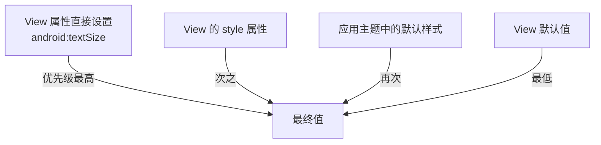

# 主题与样式系统

> 面试高频指数：中 — 主题与样式的关系、自定义属性（styleable）的解析流程、主题继承与动态换肤，是资源系统板块的核心考点。

## 一、Style 与 Theme 的区别

### 1.1 概念辨析

Style 与 Theme 的概念对比如下：

| 维度 | Style（样式） | Theme（主题） |
|------|--------------|--------------|
| 作用范围 | 单个 View | 整个 Activity/Application |
| 应用方式 | `style="@style/xxx"` | `android:theme="@style/xxx"` |
| 生效对象 | View 的属性集合 | 全局窗口背景、文字色、控件默认样式 |
| 本质 | 属性名-值 的映射集合 | 特殊的 Style，作用于全局 |

```xml
<!-- Style：给单个 View 用 -->
<style name="CardStyle">
    <item name="android:background">@drawable/card_bg</item>
    <item name="android:padding">16dp</item>
    <item name="android:elevation">4dp</item>
</style>

<TextView
    style="@style/CardStyle"
    android:text="带样式的文本" />

<!-- Theme：给整个页面用 -->
<style name="AppTheme" parent="Theme.Material3.DayNight">
    <item name="colorPrimary">@color/primary</item>
    <item name="android:windowBackground">@color/bg</item>
</style>
```

> 关键点：**Theme 的本质也是 Style**，只是应用范围不同。Manifest 中设置 `android:theme` 后，所有 View 都会继承主题中定义的默认样式。

## 二、样式的继承

### 2.1 parent 继承

```xml
<style name="BaseText" parent="">
    <item name="android:textSize">14sp</item>
    <item name="android:textColor">@color/text_primary</item>
</style>

<!-- 点号继承：显式指定 parent -->
<style name="TitleText" parent="BaseText">
    <item name="android:textSize">20sp</item>
    <item name="android:textStyle">bold</item>
</style>
```

### 2.2 点号隐式继承

```xml
<!-- 点号继承：名称以父样式名开头 -->
<style name="BaseText.Title">
    <item name="android:textSize">18sp</item>
</style>
<!-- 等价于 parent="BaseText"（仅同包/同资源时生效） -->
```

两种继承方式的对比说明如下：

| 继承方式 | 写法 | 特点 |
|----------|------|------|
| 显式 parent | `parent="BaseText"` | 明确、跨包可用 |
| 点号继承 | `BaseText.Title` | 简洁，仅同包生效 |

> 注意：`parent` 属性用 `parent=""` 显式清空父样式（不继承系统默认样式），Material 主题派生时常用。

## 三、styleable：自定义属性

### 3.1 声明自定义属性

```xml
<!-- attrs.xml 中声明属性集 -->
<resources>
    <declare-styleable name="RatingBar">
        <attr name="maxRating" format="integer" />
        <attr name="starColor" format="color" />
        <attr name="interactive" format="boolean" />
        <attr name="emptyIcon" format="reference" />  <!-- 资源引用 -->
    </declare-styleable>
</resources>
```

### 3.2 属性 format 类型

各 format 类型的说明如下：

| format | 说明 | 示例 |
|--------|------|------|
| `integer` | 整型 | `maxRating` |
| `float` | 浮点型 | `strokeWidth` |
| `boolean` | 布尔 | `interactive` |
| `string` | 字符串 | `hint` |
| `color` | 颜色 | `starColor` |
| `dimension` | 尺寸 | `cornerRadius` |
| `reference` | 资源引用 | `emptyIcon` |
| `enum` | 枚举 | `orientation` |
| `flag` | 位标志 | `scrollbars` |

### 3.3 在 View 中使用

在自定义 View 中解析自定义属性的实现如下：

::: code-tabs

@tab:active Java

```java
public class RatingBar extends View {

    private int maxRating = 5;
    private int starColor = Color.parseColor("#FFB300");

    public RatingBar(Context context) {
        this(context, null);
    }

    public RatingBar(Context context, AttributeSet attrs) {
        this(context, attrs, 0);
    }

    public RatingBar(Context context, AttributeSet attrs, int defStyleAttr) {
        super(context, attrs, defStyleAttr);
        // 解析自定义属性
        TypedArray a = context.obtainStyledAttributes(attrs, R.styleable.RatingBar);
        maxRating = a.getInt(R.styleable.RatingBar_maxRating, 5);
        starColor = a.getColor(R.styleable.RatingBar_starColor, starColor);
        a.recycle();  // 必须回收
    }
}
```

@tab Kotlin

```kotlin
class RatingBar @JvmOverloads constructor(
    context: Context,
    attrs: AttributeSet? = null,
    defStyleAttr: Int = 0
) : View(context, attrs, defStyleAttr) {

    private var maxRating: Int = 5
    private var starColor: Int = Color.parseColor("#FFB300")

    init {
        // 解析自定义属性
        context.obtainStyledAttributes(attrs, R.styleable.RatingBar).apply {
            maxRating = getInt(R.styleable.RatingBar_maxRating, 5)
            starColor = getColor(R.styleable.RatingBar_starColor, starColor)
            recycle()  // 必须回收
        }
    }
}
```

:::

### 3.4 布局中使用

```xml
<com.example.widget.RatingBar
    android:layout_width="wrap_content"
    android:layout_height="wrap_content"
    app:maxRating="5"
    app:starColor="@color/star_yellow"
    app:interactive="true" />
```

> 关键点：`obtainStyledAttributes` 返回的 TypedArray 必须调用 `recycle()` 释放资源；自定义属性在布局中命名空间为 `xmlns:app="http://schemas.android.com/apk/res-auto"`。

## 四、主题链与属性解析

### 4.1 主题优先级

各来源属性的优先级关系如下：



### 4.2 属性查找链

`?attr/xxx` 语法引用主题属性：

```xml
<!-- 引用主题中定义的颜色（跟随主题切换） -->
<TextView
    android:textColor="?attr/colorPrimary"
    android:background="?attr/selectableItemBackground" />
```

解析过程：View 属性 → style → Theme（逐级查 parent）→ 默认值。

### 4.3 主题继承链（Material）

```
Theme.Material3.DayNight
  └─ Theme.Material3.Light / Theme.Material3.Dark
      └─ 自定义 AppTheme（parent="Theme.Material3.DayNight"）
          ├─ 覆盖 colorPrimary、colorOnPrimary 等
          └─ 通过动态属性实现深浅色自适应
```

## 五、Material 主题与动态换肤

### 5.1 主题属性驱动的换肤

主题属性驱动换肤的写法如下：

::: code-tabs

@tab:active Java

```java
// 用主题属性定义颜色，深浅色自动切换
<style name="AppTheme" parent="Theme.Material3.DayNight">
    <item name="colorPrimary">@color/primary</item>
    <item name="colorSurface">@color/surface</item>
    <!-- values-night 中同名 color 自动使用深色值 -->
</style>

// 运行时切换深浅色
AppCompatDelegate.setDefaultNightMode(AppCompatDelegate.MODE_NIGHT_YES);
```

@tab Kotlin

```kotlin
// 用主题属性定义颜色，深浅色自动切换
<style name="AppTheme" parent="Theme.Material3.DayNight">
    <item name="colorPrimary">@color/primary</item>
    <item name="colorSurface">@color/surface</item>
    <!-- values-night 中同名 color 自动使用深色值 -->
</style>

// 运行时切换深浅色
AppCompatDelegate.setDefaultNightMode(AppCompatDelegate.MODE_NIGHT_YES)
```

:::

### 5.2 动态换肤思路

常见换肤方案的对比说明如下：

| 方案 | 原理 | 优缺点 |
|------|------|--------|
| DayNight 资源 | values-night 限定符自动切换 | 官方推荐，需重启 Activity 生效 |
| ThemeOverlay | 运行时替换主题属性 | 局部生效，改动小 |
| 皮肤包加载 | 运行时替换资源（AssetManager） | 灵活但复杂、风险高 |
| 主题属性化 | 所有颜色走 ?attr/ | 最佳实践，配合任意方案 |

```xml
<!-- ThemeOverlay：局部覆盖主题（如按钮） -->
<style name="Overlay.PrimaryButton" parent="ThemeOverlay.Material3.Button">
    <item name="android:textColor">@color/white</item>
</style>
```

## 六、常见坑点

主题与样式使用中的常见坑点如下：

| 坑点 | 说明 |
|------|------|
| `recycle()` 遗漏 | TypedArray 内存泄漏（低版本 GC 前占 Native 内存） |
| 命名空间错误 | 自定义属性必须用 `app:` 前缀（res-auto） |
| 点号继承跨包失效 | 点号继承仅同包有效，跨包用 parent 显式声明 |
| 主题属性引用错误 | `?attr/xxx` 引用不存在属性编译报错 |
| 深浅色适配遗漏 | 硬编码颜色导致暗色模式不可读 |
| 样式优先级误判 | View 直接属性 > style > theme，覆盖关系要清楚 |

## 七、高频面试题

### Q1：Style 和 Theme 有什么区别？
::: details 查看答案
本质相同（都是属性-值的集合），区别在应用范围：Style 通过 style="@style/xxx" 作用于单个 View；Theme 通过 android:theme 作用于 Activity/Application 全局，提供窗口背景、文字颜色、控件默认样式等，且可被 ?attr/ 语法引用实现全局联动。Theme 的 parent 通常继承系统/Material 主题，Style 的 parent 继承自定义样式。
:::

### Q2：自定义 View 的属性如何声明和解析？
::: details 查看答案
① 在 res/values/attrs.xml 中用 declare-styleable 声明属性集，attr 指定 format 类型；② 自定义 View 构造函数接收 AttributeSet，通过 context.obtainStyledAttributes(attrs, R.styleable.xxx) 解析；③ 用 getInt/getColor/getDimension 等读取并应用默认值；④ 必须调用 recycle() 释放；⑤ 布局中通过 xmlns:app="http://schemas.android.com/apk/res-auto" 命名空间使用 app:属性名。
:::

### Q3：?attr/xxx 的作用是什么？为什么推荐用主题属性？
::: details 查看答案
?attr/xxx 在布局/样式中引用主题中定义的属性值，运行时从当前主题解析。推荐原因：① 全局统一，修改主题一处生效；② 深浅色模式自动切换（Theme.Material3.DayNight 下同名属性返回不同值）；③ 组件库与主题解耦，控件只声明需要什么属性不关心具体值；④ 动态换肤的基础。硬编码颜色则是反模式，无法跟随主题。
:::

### Q4：深浅色模式是怎么自动切换的？
::: details 查看答案
系统通过资源限定符机制：values-night/ 目录下同名资源在深色模式下优先匹配。应用侧：① 主题 parent 用 Theme.Material3.DayNight（或 AppCompatDelegate 兼容）；② 颜色/图片资源放到 values-night/ 定义深色版本；③ 界面使用 ?attr/ 主题属性引用而非硬编码；④ AppCompatDelegate.setDefaultNightMode 切换后系统重建 Activity 重新加载资源。isSystemInDarkTheme() 可判断当前模式。
:::

### Q5：TypedArray 不 recycle 会怎样？
::: details 查看答案
TypedArray 底层持有 Native 资源（AssetManager 分配），不调用 recycle() 时：① 早期版本（API 23 前）内存无法及时回收，频繁创建自定义 View 场景（RecyclerView 列表）会持续泄漏 Native 内存，严重时 OOM；② API 23+ 由 GC 兜底但延迟回收，仍有瞬时内存峰值。规范做法：obtainStyledAttributes 后立即 use 或 try/finally 中 recycle()。
:::

## 八、小结

主题与样式系统要点：

1. Style 作用于 View，Theme 作用于全局，本质同为属性集合
2. parent 显式继承 + 点号隐式继承，跨包用 parent
3. declare-styleable 声明自定义属性，TypedArray 解析并 recycle
4. 属性查找：View 直接属性 > style > theme
5. 用 ?attr/ 主题属性 + values-night 实现深浅色与换肤

相关阅读：[资源系统详解：R 文件、类型与加载](/android/resource/resource-basics.md)、[资源限定符与多语言适配](/android/resource/resource-qualifiers.md)、[自定义 View 实战](/ui/custom-view/custom-view-guide.md)。
