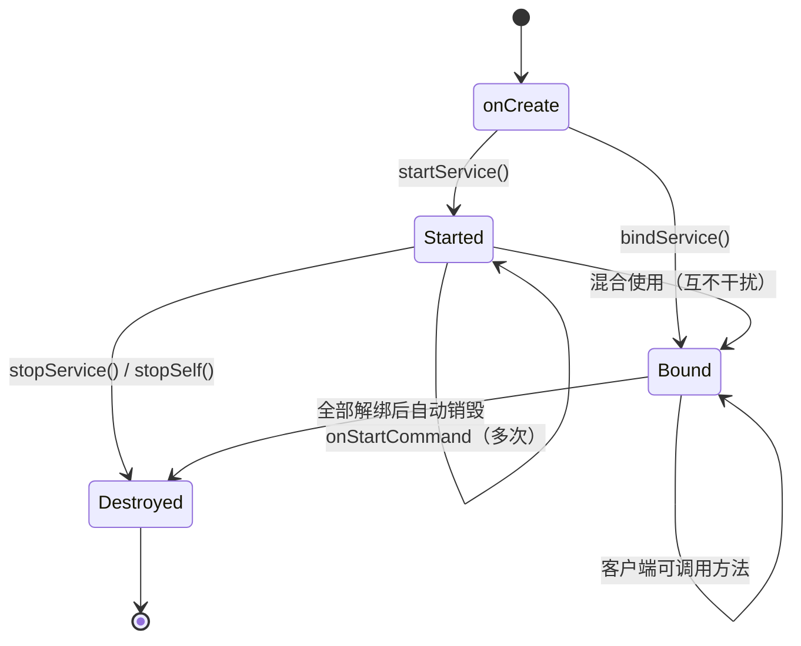
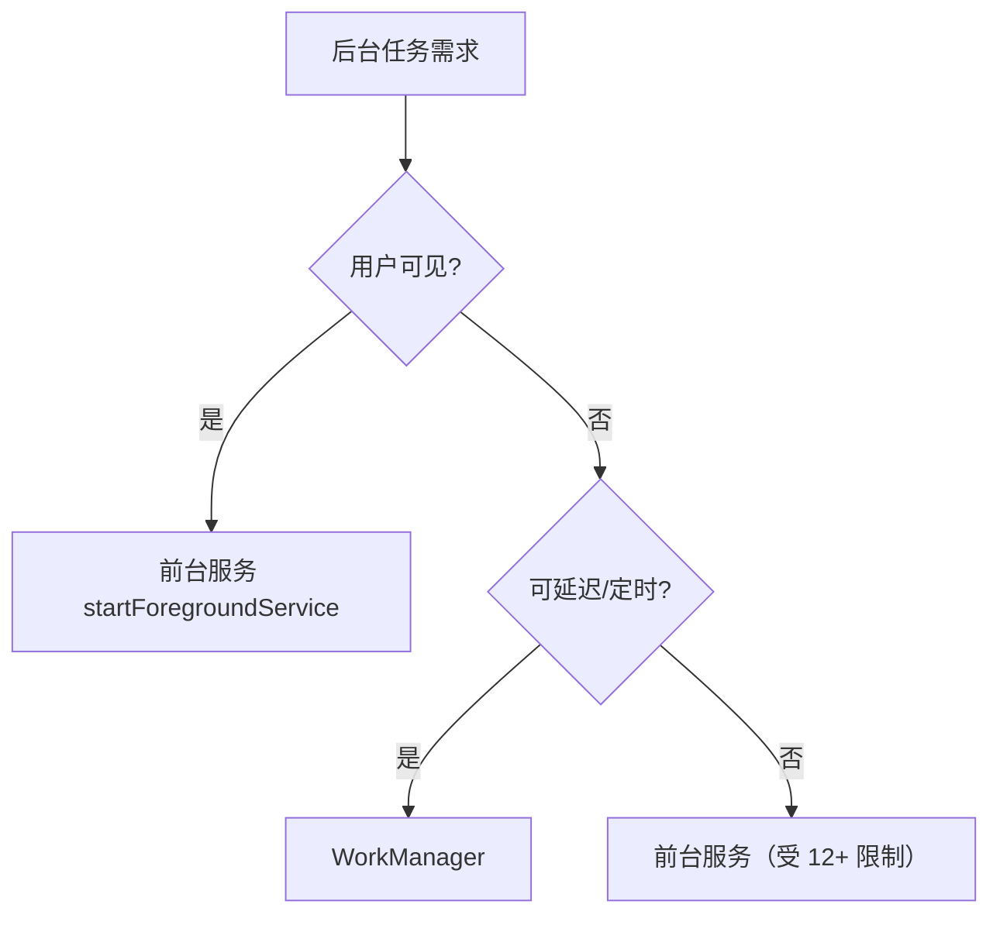

# Service 详解：启动方式与绑定方式

> Service 是 Android 四大组件之一，用于在后台执行不提供 UI 的长时间任务。理解 **startService 与 bindService 两种模式的差异**、**onStartCommand 返回值的语义**以及 **8.0 之后的后台限制**，是使用 Service 的完整知识框架。

## 一、Service 是什么

**Service** 是一个**没有界面的后台组件**，用于执行长时间运行的操作（下载、音乐播放、数据同步等）。

::: warning 最大误区
**Service 不自动创建线程，默认运行在主线程！** 在 `onStartCommand` 中直接执行耗时操作同样会 ANR。Service 只是"没有 UI 的组件容器"，耗时任务必须自己开线程/协程。
:::

```text
Service（主线程）
 ├── 适合：短任务、需要生命周期感知的任务
 ├── 不适合：耗时阻塞任务（需自行开线程）
 └── 真正后台执行：WorkManager（系统调度） / 前台服务 + 协程
```

**什么时候不该用 Service**：

| 需求 | 正确方案 |
|------|----------|
| 延迟/定时后台任务 | WorkManager（即使 App 退出也能执行） |
| 网络请求 | 协程 + Repository（跟随生命周期） |
| 播放音乐 | 前台服务（用户可见） |
| 简单消息跨组件 | LiveData / Flow / 事件总线 |

## 二、两种使用方式

### 2.1 启动式：startService

```kotlin
// 启动（Context 方法）
startService(Intent(this, DownloadService::class.java))
```

```kotlin
class DownloadService : Service() {

    override fun onBind(intent: Intent): IBinder? = null   // 不绑定，返回 null

    override fun onStartCommand(intent: Intent?, flags: Int, startId: Int): Int {
        // 主线程执行！耗时任务需自行开线程/协程
        scope.launch(Dispatchers.IO) {
            downloadFiles()
            stopSelf()   // 任务完成后自行停止
        }
        return START_STICKY
    }

    override fun onDestroy() {
        scope.cancel()
        super.onDestroy()
    }
}
```

**生命周期**：`onCreate → onStartCommand → ... → onDestroy`
**特点**：
- 调用方**无法获取结果**（单向通知）
- 任务完成后必须自己调用 `stopSelf()` / `stopService()`，否则 Service 一直运行
- `startService()` 每次调用都会触发 `onStartCommand`（`onCreate` 只执行一次）

### 2.2 绑定式：bindService

```kotlin
val connection = object : ServiceConnection {
    override fun onServiceConnected(name: ComponentName?, binder: IBinder?) {
        val myBinder = binder as DownloadService.DownloadBinder
        myBinder.startDownload()          // 拿到 Binder，调用服务端方法
    }
    override fun onServiceDisconnected(name: ComponentName?) {
        // 服务异常断开（如进程被杀）时回调；正常 unbind 不会回调
    }
}

bindService(intent, connection, Context.BIND_AUTO_CREATE)
```

```kotlin
class DownloadService : Service() {

    inner class DownloadBinder : Binder() {
        fun startDownload() { /* 具体逻辑 */ }
        fun getProgress(): Int = progress
    }

    private val binder = DownloadBinder()

    override fun onBind(intent: Intent): IBinder = binder   // 返回 Binder 给客户端
    override fun onUnbind(intent: Intent): Boolean {
        // 所有客户端解绑后回调
        return false
    }
}
```

**生命周期**：`onCreate → onBind → onUnbind → onDestroy`
**特点**：
- 客户端**可以调用服务端方法**（通过 Binder）
- 最后一个客户端 `unbindService()` 后，Service 自动销毁（除非还有 `startService` 计数）
- 客户端进程被杀，`onServiceDisconnected` 回调（服务端感知）

### 2.3 两种方式混合使用

```kotlin
// 场景：音乐播放器
// 1. startService：保证播放不因 UI 退出而停止（如用户退出界面仍在播放）
startService(intent)
// 2. bindService：Activity 存活期间获取控制接口（播放/暂停/切歌）
bindService(intent, connection, Context.BIND_AUTO_CREATE)
```



**停止规则**：同时被启动和绑定的 Service，需要 **`stopService()` 且所有客户端解绑** 才会销毁。

## 三、onStartCommand 返回值详解

| 返回值 | 行为 | 适用场景 | 安全性 |
|--------|------|----------|--------|
| `START_NOT_STICKY` | 系统杀死服务后**不重建**（除非有挂起 Intent） | 可随时重启的作业（如定时拉取） | 最安全，推荐默认 |
| `START_STICKY` | 系统杀死后**重建**，回调 `onStartCommand` 但 intent 为 **null** | 媒体播放、不依赖参数的长任务 | 需处理 intent 为 null |
| `START_REDELIVER_INTENT` | 系统杀死后**重建并重新投递最后一个 Intent** | 下载、上传等必须恢复的任务 | 需正确处理重入 |

```kotlin
override fun onStartCommand(intent: Intent?, flags: Int, startId: Int): Int {
    when (intent?.action) {
        ACTION_DOWNLOAD -> startDownload(intent.getStringExtra("url"))
        else -> Log.w(TAG, "START_STICKY 重建：intent 为 null，无需处理")  // 常见场景
    }
    return START_STICKY
}
```

## 四、完整生命周期回调细节

| 回调 | 触发时机 | 注意事项 |
|------|----------|----------|
| `onCreate` | Service 首次创建（只一次） | 适合初始化线程池、通知渠道 |
| `onStartCommand` | 每次 `startService` | **主线程**；多次调用参数不同 |
| `onBind` | 首次 `bindService` | 返回 IBinder；不绑定返回 null |
| `onUnbind` | 所有客户端解绑 | 返回 true 时后续 bind 会回调 `onRebind` |
| `onRebind` | `onUnbind` 返回 true 后再次 bind | 可恢复状态 |
| `onDestroy` | 销毁 | 释放资源、取消协程、移除通知 |

```kotlin
class MyService : Service() {

    override fun onBind(intent: Intent): IBinder? = null

    override fun onRebind(intent: Intent?) {
        super.onRebind(intent)
        // 客户端重新绑定时恢复数据
    }
}
```

## 五、绑定服务的通信方式

### 5.1 Binder（同进程 / 跨进程皆可）

```kotlin
// 服务端
inner class LocalBinder : Binder() {
    fun getService(): MyService = this@MyService
}

// 客户端（同进程场景，直接强转）
override fun onServiceConnected(name: ComponentName?, service: IBinder?) {
    val binder = service as MyService.LocalBinder
    val myService = binder.getService()   // 拿到 Service 实例直接调用
}
```

### 5.2 Messenger（基于 Handler 的轻量 IPC）

```kotlin
// 服务端
class MessengerService : Service() {
    private val handler = object : Handler(Looper.getMainLooper()) {
        override fun handleMessage(msg: Message) {
            // 处理客户端消息；可 msg.replyTo 回复
        }
    }
    private val messenger = Messenger(handler)

    override fun onBind(intent: Intent): IBinder = messenger.binder
}

// 客户端
val messenger = Messenger(service)
messenger.send(Message.obtain(null, MSG_DOWNLOAD).apply {
    replyTo = Messenger(clientHandler)   // 服务端可回信
})
```

| 方式 | 原理 | 适用场景 |
|------|------|----------|
| Binder | 直接方法调用 | 复杂通信、需要类型安全 |
| Messenger | Handler 消息串行分发 | 简单消息、无需并发 |
| AIDL | Binder 的接口定义形式 | 跨进程复杂接口（见 [AIDL 详解](aidl.md)） |

## 六、IntentService（已废弃，理解即可）

`IntentService` 封装了"队列 + 工作线程 + 自动停止"，Android 8.0 后官方弃用，**改用协程 + WorkManager**：

```kotlin
// 旧写法（了解）
class OldIntentService : IntentService("OldIntentService") {
    override fun onHandleIntent(intent: Intent?) {
        // 子线程顺序执行，任务完成后自动 stopSelf
    }
}

// 现代等价写法
class DownloadService : Service() {
    private val scope = CoroutineScope(SupervisorJob() + Dispatchers.IO)
    override fun onStartCommand(intent: Intent?, flags: Int, startId: Int): Int {
        scope.launch {
            doWork()          // 协程执行耗时任务
            stopSelf()        // 完成后停止
        }
        return START_NOT_STICKY
    }
}
```

## 七、Android 8.0+ 后台服务限制



| 版本 | 限制 |
|------|------|
| Android 8.0 (26) | 后台不能 `startService`（抛 `IllegalStateException`），需前台服务或 JobScheduler |
| Android 9 (28) | 前台服务需 `FOREGROUND_SERVICE` 权限 |
| Android 12 (31) | 后台启动前台服务受限（`BackgroundActivityStartManager` 拦截） |
| Android 14 (34) | 前台服务必须声明类型（`foregroundServiceType`）+ 对应权限 |

> 详见 [前台服务与通知](foreground-service.md) 与 [WorkManager](/jetpack/workmanager-hilt/)。

## 八、Service 与线程/协程的正确配合

```kotlin
class DownloadService : Service() {

    // 1. 用 SupervisorJob：一个任务失败不影响其他
    private val scope = CoroutineScope(SupervisorJob() + Dispatchers.IO)

    override fun onStartCommand(intent: Intent?, flags: Int, startId: Int): Int {
        val url = intent?.getStringExtra("url") ?: return START_NOT_STICKY
        scope.launch {
            try {
                repository.download(url)   // suspend 函数，IO 线程
                notifySuccess(url)
            } catch (e: Exception) {
                Log.e(TAG, "download failed", e)
            } finally {
                stopSelf()                 // 全部任务完成后停止
            }
        }
        return START_NOT_STICKY
    }

    override fun onDestroy() {
        scope.cancel()                     // 2. 销毁时取消所有协程
        super.onDestroy()
    }
}
```

## 九、常见坑点清单

1. **`onStartCommand` 执行耗时操作 → ANR**：必须开线程/协程。
2. **忘记 `stopSelf()`**：Service 常驻后台，被系统反复杀死 → 耗电 + 被用户卸载。
3. **绑定未解绑**：`onDestroy` 中必须 `unbindService`，否则泄漏。
4. **8.0+ 直接 `startService` 崩溃**：后台启动需 `startForegroundService` 并 5 秒内 `startForeground`。
5. **`onServiceDisconnected` 与 unbind 混淆**：正常解绑不回调，只有异常断开（进程被杀）才回调。
6. **多进程 Service 直接返回自定义 Binder**：跨进程 Binder 不能直接强转，需 AIDL/Messenger。

## 十、面试高频追问

**Q1：`startService` 与 `bindService` 能否同时使用？如何停止？**
A：可以。此时 Service 同时处于"启动"与"绑定"状态。销毁条件是 **`stopService`/`stopSelf` 且所有客户端解绑** 两者都满足。典型场景是音乐播放器：startService 保证后台播放，bindService 获取控制接口。

**Q2：Service 在子线程执行任务会 ANR 吗？**
A：`onStartCommand`/`onBind` 等回调在主线程执行，**回调本身**耗时才会 ANR；在回调内开子线程/协程执行任务不会 ANR。但 Service 组件本身被系统管理，长时间无前台可见性的普通 Service 会被系统杀掉。

**Q3：`IntentService` 与普通 Service 的区别？**
A：IntentService 内部用 HandlerThread 排队串行处理 Intent，处理完自动 `stopSelf`；但 8.0 后已废弃。现代方案：协程（`Dispatchers.IO`）或 WorkManager。

**Q4：前台服务在 Android 12+ 的限制？**
A：从后台启动前台服务受限，仅用户可见操作、高优先级 FCM、豁免系统广播等场景允许；Android 14 还要求声明 `foregroundServiceType` 和对应运行时权限。

**Q5：`onUnbind` 返回 true 的意义？**
A：返回 true 表示"客户端下次绑定时回调 `onRebind`"，用于恢复状态；返回 false 则下次绑定只走 `onBind`。

**Q6：Service 保活有用吗？**
A：现代 Android（8.0+）下传统保活手段（双进程守护、1px Activity、系统服务绑定）基本失效或违法（Google Play 政策）。正确姿势：前台服务（用户可见）+ 引导加入电池优化白名单 + WorkManager 系统调度。

## 十一、小结

- Service = 无 UI 的后台组件容器，**默认主线程**，耗时任务需自行协程/线程。
- `startService` 单向通知自行停止；`bindService` 双向通信自动销毁；可混合使用。
- `onStartCommand` 三种返回值决定"被杀后是否重建、如何重建"。
- 8.0+ 后台限制 → 前台服务 + WorkManager 是唯一正道。

> 📖 进阶阅读：[前台服务与通知](foreground-service.md) | [AIDL 跨进程通信](aidl.md) | [Android 进程与保活](/android/process/process-lifecycle.md)

> 📖 进阶阅读：[AIDL 跨进程通信](aidl.md) | [Binder 机制详解](/system/binder/binder-mechanism.md)
