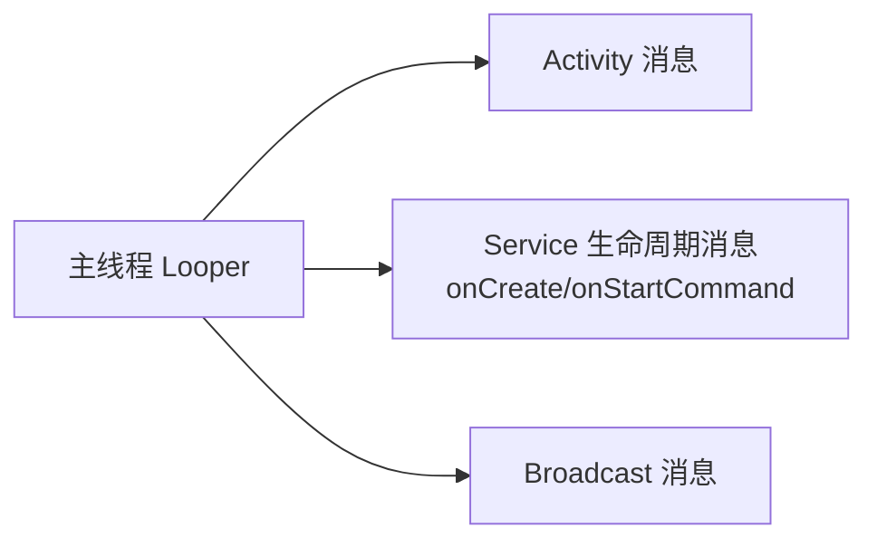
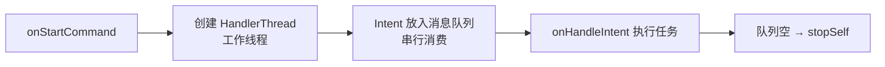
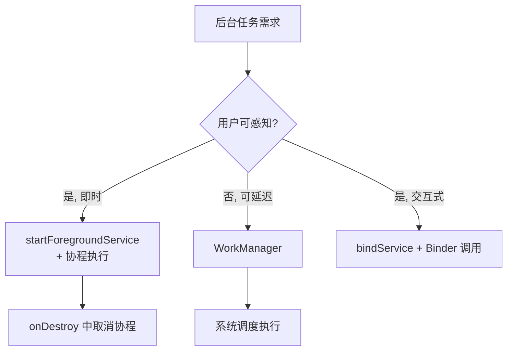

# Service 线程模型与耗时任务

> 面试高频指数：高 — "Service 默认在哪个线程？onStartCommand 里能做耗时操作吗？IntentService 为什么被废弃？"是四大组件面试的必考三连。

## 一、Service 默认运行在主线程

### 1.1 线程真相

**Service 默认运行在应用的主线程（UI 线程）**，与 Activity 共享同一个主线程 Looper：



验证线程真相的示例代码如下：

::: code-tabs

@tab:active Java

```java
class DemoService extends Service {
    @Override
    public void onCreate() {
        super.onCreate();
        Log.d("Thread", "onCreate 线程: " + Thread.currentThread().getName());  // main
    }

    @Override
    public int onStartCommand(Intent intent, int flags, int startId) {
        Log.d("Thread", "onStartCommand 线程: " + Thread.currentThread().getName());  // main
        // 直接做耗时操作会 ANR（超过 5 秒超时）！
        return START_STICKY;
    }
}
```

@tab Kotlin

```kotlin
class DemoService : Service() {
    override fun onCreate() {
        super.onCreate()
        Log.d("Thread", "onCreate 线程: ${Thread.currentThread().name}")  // main
    }

    override fun onStartCommand(intent: Intent?, flags: Int, startId: Int): Int {
        Log.d("Thread", "onStartCommand 线程: ${Thread.currentThread().name}")  // main
        // 直接做耗时操作会 ANR（超过 5 秒超时）！
        return START_STICKY
    }
}
```

:::

### 1.2 常见误区

常见误区的对照说明如下：

| 误区 | 真相 |
|------|------|
| "Service 是后台，可以做耗时操作" | 错，Service 默认主线程，耗时操作一样 ANR |
| "Service 不阻塞 UI" | 错，Service 的耗时任务会阻塞整个主线程消息队列 |
| "Service 就是线程" | 错，Service 是组件，线程是执行单元，二者独立 |

> 关键点：`onCreate`、`onStartCommand`、`onBind`、`onDestroy` 全部在主线程执行。Service 里的耗时任务**必须自行开线程**（或协程）。

## 二、正确姿势：Service + 线程/协程

### 2.1 手动管理线程

手动管理线程的示例代码如下：

::: code-tabs

@tab:active Java

```java
class DownloadService extends Service {
    private final ExecutorService executor = Executors.newFixedThreadPool(3);
    private final Map<Integer, Future<?>> tasks = new HashMap<>();

    @Override
    public int onStartCommand(Intent intent, int flags, int startId) {
        String action = intent != null ? intent.getAction() : null;
        if (ACTION_DOWNLOAD.equals(action)) {
            final String url = intent.getStringExtra("url");
            if (url == null) return START_STICKY;
            // 开线程执行耗时任务
            tasks.put(startId, executor.submit(() -> {
                download(url);
                // 任务完成更新 UI（主线程）
                new Handler(Looper.getMainLooper()).post(() -> notifyProgress(url));
            }));
        } else if (ACTION_STOP.equals(action)) {
            tasks.values().forEach(future -> future.cancel(true));
            stopSelf();  // 无任务后停止服务
        }
        return START_STICKY;
    }

    @Override
    public void onDestroy() {
        super.onDestroy();
        tasks.values().forEach(future -> future.cancel(true));
        executor.shutdown();
    }
}
```

@tab Kotlin

```kotlin
class DownloadService : Service() {
    private val executor = Executors.newFixedThreadPool(3)
    private val jobs = mutableMapOf<Int, Job>()

    override fun onStartCommand(intent: Intent?, flags: Int, startId: Int): Int {
        when (intent?.action) {
            ACTION_DOWNLOAD -> {
                val url = intent.getStringExtra("url") ?: return START_STICKY
                // 开协程执行耗时任务
                jobs[startId] = CoroutineScope(Dispatchers.IO).launch {
                    download(url)
                    // 任务完成更新 UI（主线程）
                    withContext(Dispatchers.Main) { notifyProgress(url) }
                }
            }
            ACTION_STOP -> {
                jobs.values.forEach { it.cancel() }
                stopSelf()  // 无任务后停止服务
            }
        }
        return START_STICKY
    }

    override fun onDestroy() {
        super.onDestroy()
        jobs.values.forEach { it.cancel() }
        executor.shutdown()
    }
}
```

:::

### 2.2 startService vs bindService 的线程差异

两种方式在线程上的差异说明如下：

| 维度 | startService | bindService |
|------|--------------|-------------|
| 生命周期 | 独立运行，需 stopSelf/stopService | 跟随绑定者，全部解绑自动销毁 |
| 通信 | Intent 单向 | Binder 双向调用 |
| 线程 | onStartCommand 主线程 | onBind 返回的 Binder 方法在 Binder 线程池执行 |
| 场景 | 后台任务 | 需要交互式调用 |

> 注意：`onBind` 返回的 **Binder 方法运行在 Binder 线程池**，不是主线程，也不是调用方线程。AIDL 接口实现若涉及 UI 需自行切线程。

## 三、IntentService：曾经的官方答案

### 3.1 原理

IntentService 的典型写法如下：

::: code-tabs

@tab:active Java

```java
// IntentService（API 30 已废弃）
class UploadService extends IntentService {
    public UploadService() {
        super("UploadService");
    }

    @Override
    protected void onHandleIntent(Intent intent) {
        // 在单独的工作线程顺序执行（串行队列）
        String file = intent != null ? intent.getStringExtra("file") : null;
        upload(file);
        // 任务执行完自动 stopSelf
    }
}
```

@tab Kotlin

```kotlin
// IntentService（API 30 已废弃）
class UploadService : IntentService("UploadService") {

    override fun onHandleIntent(intent: Intent?) {
        // 在单独的工作线程顺序执行（串行队列）
        val file = intent?.getStringExtra("file")
        upload(file)
        // 任务执行完自动 stopSelf
    }
}
```

:::

**原理**：



- 内部创建 `HandlerThread`（专用工作线程 + Looper）
- 所有 Intent 排队**串行**执行
- 任务队列清空后自动停止服务

### 3.2 为什么被废弃

IntentService 被废弃的原因说明如下：

| 问题 | 说明 |
|------|------|
| 串行执行 | 不支持并发，多任务排队 |
| 与协程重复 | 现代开发用协程在 Service 内即可 |
| 无进度回传 | 任务进度需额外 IPC |
| 停止控制弱 | 无法按任务取消 |

> 官方建议：**用协程 + 普通 Service（或 WorkManager）替代**，Android 11 起 IntentService 标记废弃。

## 四、WorkManager：现代替代方案

### 4.1 什么时候该用 WorkManager

WorkManager 的适用场景如下：

| 场景 | 方案 |
|------|------|
| 即时后台任务（用户等待） | 协程 + 前台服务 |
| 延迟/周期任务（上传日志、同步） | WorkManager |
| 应用退出后仍需执行 | WorkManager |
| 需要可靠保证（重启恢复） | WorkManager |

### 4.2 WorkManager 与 Service 对比

WorkManager 与 Service 的对比说明如下：

| 维度 | Service | WorkManager |
|------|---------|-------------|
| 保证级别 | 进程被杀即中断 | 可持久化，重启恢复 |
| 约束条件 | 需自行判断 | 网络/电量/充电状态内置 |
| 周期任务 | 无 | 支持 PeriodicWork |
| 链式任务 | 无 | 支持 Work 链 |
| 前台展示 | 需自己管理通知 | 自带 ForegroundInfo |
| 适用 | 即时、交互式 | 后台可靠任务 |

WorkManager 的典型使用代码如下：

::: code-tabs

@tab:active Java

```java
public class SyncWorker extends CoroutineWorker {
    public SyncWorker(Context context, WorkerParameters params) {
        super(context, params);
    }

    @NonNull
    @Override
    public Result doWork() {
        // Java 无协程环境，用同步代码 + ListenableWorker 也可
        return syncData() ? Result.success() : Result.retry();  // 自动重试
    }
}

// 调度：带约束的周期任务
PeriodicWorkRequest request = new PeriodicWorkRequest.Builder(
        SyncWorker.class, 6, TimeUnit.HOURS)
        .setConstraints(new Constraints.Builder()
                .setRequiredNetworkType(NetworkType.CONNECTED)
                .build())
        .build();
WorkManager.getInstance(context).enqueue(request);
```

@tab Kotlin

```kotlin
class SyncWorker(context: Context, params: WorkerParameters) :
    CoroutineWorker(context, params) {

    override suspend fun doWork(): Result {
        // 协程环境，天然支持 suspend
        return try {
            syncData()
            Result.success()
        } catch (e: Exception) {
            Result.retry()  // 自动重试
        }
    }
}

// 调度：带约束的周期任务
val request = PeriodicWorkRequestBuilder<SyncWorker>(6, TimeUnit.HOURS)
    .setConstraints(Constraints.Builder()
        .setRequiredNetworkType(NetworkType.CONNECTED)
        .build())
    .build()
WorkManager.getInstance(context).enqueue(request)
```

:::

## 五、前台服务与后台限制

### 5.1 后台启动限制

- Android 8.0+：后台应用不能随意启动后台 Service（`startService` 抛 IllegalStateException）
- 正确方式：**startForegroundService()** + 5 秒内调用 `startForeground()`（Android 12+ 前台服务启动限制更严格）
- 豁免场景：用户交互、高优先级 FCM、前台 Activity 所在应用等

### 5.2 Service 内耗时任务的标准范式

耗时任务执行方式的决策流程如下：



## 六、高频面试题

### Q1：Service 默认在哪个线程？能直接做耗时操作吗？
::: details 查看答案
Service 默认运行在主线程（UI 线程），与 Activity 共享主线程 Looper，onCreate/onStartCommand/onBind/onDestroy 都在主线程执行。不能直接做耗时操作：主线程被阻塞超过 5 秒会触发 ANR，且会卡住整个应用的 UI 交互。耗时任务必须自行开线程（Thread/线程池/协程），或使用 WorkManager 等系统调度方案。
:::

### Q2：IntentService 的原理是什么？为什么被废弃？
::: details 查看答案
IntentService 内部创建 HandlerThread（带 Looper 的工作线程）：onStartCommand 把 Intent 发到工作线程的消息队列，onHandleIntent 在工作线程串行执行，队列清空后自动调用 stopSelf。被废弃原因：① 串行执行不支持并发；② 现代开发用协程在普通 Service 内即可实现同等效果且更灵活；③ 无法按任务取消、无进度回传；④ 官方推荐 WorkManager 覆盖后台可靠任务场景。
:::

### Q3：onStartCommand 的返回值有哪些？各代表什么？
::: details 查看答案
① START_STICKY：Service 被系统杀死后，系统会重新创建 Service 并回调 onStartCommand（intent 为 null，无原始 Intent），适合下载等需要恢复的任务；② START_NOT_STICKY：被杀后不重建，除非有新的 startService，适合任务完成后无所谓恢复的场景；③ START_REDELIVER_INTENT：被杀后重建并重新投递最后一个 Intent（保证不丢任务），适合重要任务。默认返回 START_STICKY。
:::

### Q4：startService 和 bindService 有什么区别？
::: details 查看答案
① 生命周期：startService 独立运行直到 stopSelf/stopService；bindService 跟随绑定者，所有绑定者解绑后销毁；② 通信：startService 单向 Intent 传递，bindService 通过 Binder 双向调用；③ 线程：startService 的 onStartCommand 在主线程，bindService 的 Binder 方法在 Binder 线程池；④ 组合使用：先 start 再 bind 时，需同时 stopService 和解绑才会销毁。返回 START_STICKY 的 startService 与 bindService 可混合。
:::

### Q5：Service 和 WorkManager 怎么选？
::: details 查看答案
Service：适合即时、用户可感知、需要交互式通信的任务（下载中显示进度、播放音乐、位置上报），配合前台服务保证执行；WorkManager：适合可延迟、需要可靠保证的后台任务（日志上传、数据同步、定时任务），具备持久化、约束条件（网络/充电）、链式任务、失败重试、重启恢复能力。判断标准：用户是否在等待结果——等待用 Service，不等待用 WorkManager。
:::

## 七、小结

Service 线程模型要点：

1. Service 默认主线程，耗时任务必须自己开线程
2. Binder 方法运行在 Binder 线程池，注意线程切换
3. IntentService 原理是 HandlerThread 串行队列，已被协程替代
4. 后台启动受限，用 startForegroundService + startForeground
5. 可靠后台任务首选 WorkManager

相关阅读：[Service 详解：启动方式与绑定方式](/android/service/service-basics.md)、[前台服务与通知](/android/service/foreground-service.md)、[WorkManager 详解](/jetpack/workmanager-hilt/workmanager.md)、[HandlerThread 详解](/network/handler/handlerthread.md)。
