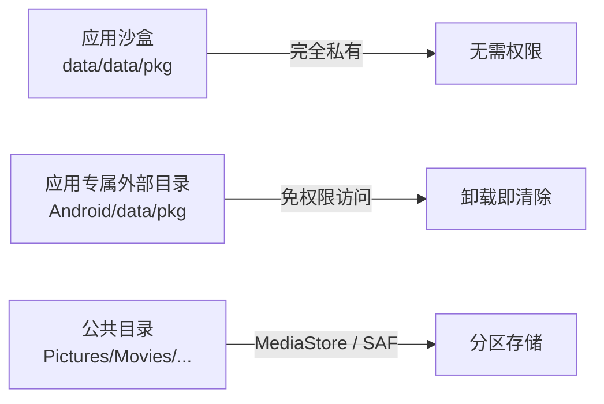
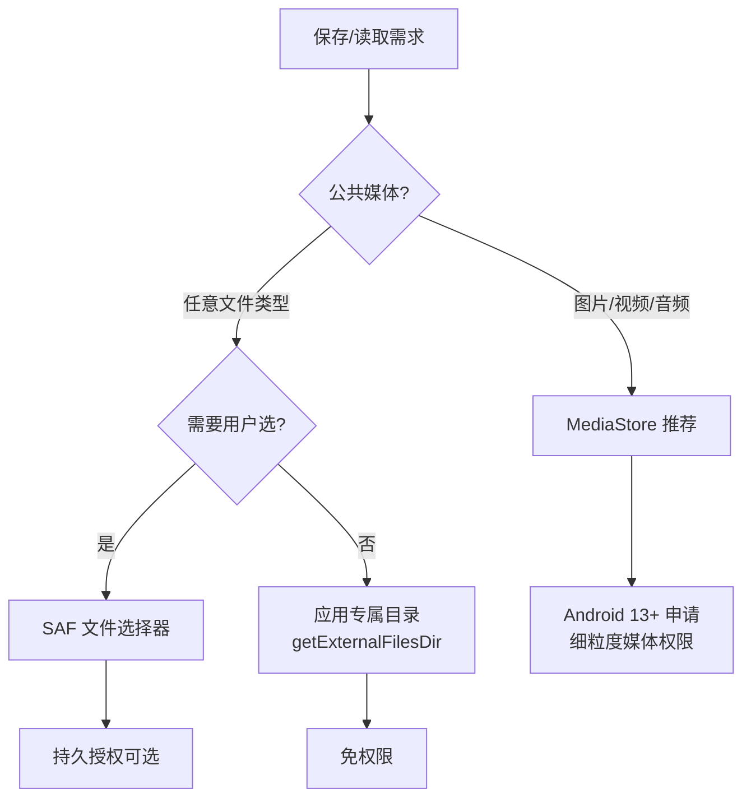

# 分区存储与 MediaStore 实战

> 面试高频指数：高 — 分区存储是近几代 Android 存储变革的核心，MediaStore 操作、SAF 选文件、权限兼容是面试与实战双高频考点。

## 一、分区存储的演进

### 1.1 存储模型变革

各版本存储模型的对比说明如下：

| 版本 | 存储模型 | 公共目录访问 |
|------|----------|--------------|
| Android 9- | 全盘可读，任意文件路径 | `WRITE_EXTERNAL_STORAGE` 权限后直接读写 |
| Android 10 | 分区存储（可开关） | 只能通过 MediaStore / SAF 访问其他应用文件 |
| Android 11+ | 分区存储强制开启 | 同上，且不可关闭 |
| Android 13+ | 细粒度媒体权限 | 读图片/视频/音频分权限申请 |

三层存储空间的构成关系如下：



### 1.2 核心变化

- **应用沙盒隔离**：默认只能访问自己的内部存储与应用专属外部目录
- **公共媒体库**：通过 `MediaStore` API 读写公共目录的图片/视频/音频
- **任意文件访问**：通过 **SAF（Storage Access Framework）** 文件选择器
- **权限收紧**：Android 13 起 READ_MEDIA_IMAGES/VIDEO/AUDIO 细分，Android 14 起选择性访问

## 二、应用专属目录（免权限）

### 2.1 目录获取

各存储目录的获取方式如下：

::: code-tabs

@tab:active Java

```java
// 内部存储（data/data/pkg/）
context.getFilesDir()      // 私有文件
context.getCacheDir()      // 私有缓存（系统可随时清理）

// 外部存储应用专属目录（/storage/emulated/0/Android/data/pkg/）
context.getExternalFilesDir(null)      // 外部文件
context.getExternalFilesDir("images")  // 外部图片子目录
context.getExternalCacheDir()          // 外部缓存
```

@tab Kotlin

```kotlin
// 内部存储（data/data/pkg/）
context.filesDir      // 私有文件
context.cacheDir      // 私有缓存（系统可随时清理）

// 外部存储应用专属目录（/storage/emulated/0/Android/data/pkg/）
context.getExternalFilesDir(null)      // 外部文件
context.getExternalFilesDir("images")  // 外部图片子目录
context.externalCacheDir               // 外部缓存
```

:::

### 2.2 特点

应用专属目录的特点说明如下：

| 特性 | 说明 |
|------|------|
| 免权限 | 无需任何存储权限即可读写 |
| 私有性 | 其他应用默认不可访问（除非 root/ADB） |
| 卸载清除 | 应用卸载时目录被系统清除 |
| 不占公共空间 | 不进入用户相册/音乐库 |

向应用专属目录写入文件的示例代码如下：

::: code-tabs

@tab:active Java

```java
// 保存图片到应用专属目录
void saveToAppDir(Context context, Bitmap bitmap) {
    File dir = context.getExternalFilesDir("images");
    if (dir == null) return;
    File file = new File(dir, "photo_" + System.currentTimeMillis() + ".jpg");
    try (FileOutputStream fos = new FileOutputStream(file)) {
        bitmap.compress(Bitmap.CompressFormat.JPEG, 90, fos);
    } catch (IOException e) {
        e.printStackTrace();
    }
}
```

@tab Kotlin

```kotlin
// 保存图片到应用专属目录
fun saveToAppDir(context: Context, bitmap: Bitmap) {
    val dir = context.getExternalFilesDir("images") ?: return
    val file = File(dir, "photo_${System.currentTimeMillis()}.jpg")
    FileOutputStream(file).use { fos ->
        bitmap.compress(Bitmap.CompressFormat.JPEG, 90, fos)
    }
}
```

:::

## 三、MediaStore：公共媒体库

### 3.1 插入媒体文件

插入媒体文件的标准写法如下：

::: code-tabs

@tab:active Java

```java
// 保存图片到公共相册（Android 10+ 推荐方式）
void saveToGallery(Context context, Bitmap bitmap) {
    ContentValues values = new ContentValues();
    values.put(MediaStore.Images.Media.DISPLAY_NAME,
            "photo_" + System.currentTimeMillis() + ".jpg");
    values.put(MediaStore.Images.Media.MIME_TYPE, "image/jpeg");
    values.put(MediaStore.Images.Media.RELATIVE_PATH, "Pictures/MyApp");  // Android 10+
    values.put(MediaStore.Images.Media.IS_PENDING, 1);                    // 标记待完成
    Uri uri = context.getContentResolver().insert(
            MediaStore.Images.Media.EXTERNAL_CONTENT_URI, values);
    if (uri == null) return;
    try (OutputStream out = context.getContentResolver().openOutputStream(uri)) {
        if (out != null) {
            bitmap.compress(Bitmap.CompressFormat.JPEG, 90, out);
        }
    } catch (IOException e) {
        e.printStackTrace();
    }
    values.clear();
    values.put(MediaStore.Images.Media.IS_PENDING, 0);  // 完成写入
    context.getContentResolver().update(uri, values, null, null);
}
```

@tab Kotlin

```kotlin
// 保存图片到公共相册（Android 10+ 推荐方式）
fun saveToGallery(context: Context, bitmap: Bitmap) {
    val values = ContentValues().apply {
        put(MediaStore.Images.Media.DISPLAY_NAME, "photo_${System.currentTimeMillis()}.jpg")
        put(MediaStore.Images.Media.MIME_TYPE, "image/jpeg")
        put(MediaStore.Images.Media.RELATIVE_PATH, "Pictures/MyApp")  // Android 10+
        put(MediaStore.Images.Media.IS_PENDING, 1)                    // 标记待完成
    }
    val uri = context.contentResolver.insert(
        MediaStore.Images.Media.EXTERNAL_CONTENT_URI, values
    ) ?: return
    context.contentResolver.openOutputStream(uri)?.use { out ->
        bitmap.compress(Bitmap.CompressFormat.JPEG, 90, out)
    }
    values.clear()
    values.put(MediaStore.Images.Media.IS_PENDING, 0)  // 完成写入
    context.contentResolver.update(uri, values, null, null)
}
```

:::

### 3.2 查询媒体

查询媒体文件的示例代码如下：

::: code-tabs

@tab:active Java

```java
List<Uri> queryImages(Context context) {
    List<Uri> result = new ArrayList<>();
    String[] projection = new String[]{
            MediaStore.Images.Media._ID,
            MediaStore.Images.Media.DISPLAY_NAME
    };
    String sortOrder = MediaStore.Images.Media.DATE_ADDED + " DESC";
    Cursor cursor = context.getContentResolver().query(
            MediaStore.Images.Media.EXTERNAL_CONTENT_URI,
            projection, null, null, sortOrder);
    if (cursor != null) {
        try (Cursor c = cursor) {
            int idCol = c.getColumnIndexOrThrow(MediaStore.Images.Media._ID);
            while (c.moveToNext()) {
                long id = c.getLong(idCol);
                result.add(ContentUris.withAppendedId(
                        MediaStore.Images.Media.EXTERNAL_CONTENT_URI, id));
            }
        }
    }
    return result;
}
```

@tab Kotlin

```kotlin
fun queryImages(context: Context): List<Uri> {
    val result = mutableListOf<Uri>()
    val projection = arrayOf(
        MediaStore.Images.Media._ID,
        MediaStore.Images.Media.DISPLAY_NAME
    )
    val sortOrder = "${MediaStore.Images.Media.DATE_ADDED} DESC"
    context.contentResolver.query(
        MediaStore.Images.Media.EXTERNAL_CONTENT_URI,
        projection,
        null, null, sortOrder
    )?.use { cursor ->
        val idCol = cursor.getColumnIndexOrThrow(MediaStore.Images.Media._ID)
        while (cursor.moveToNext()) {
            val id = cursor.getLong(idCol)
            result.add(
                ContentUris.withAppendedId(
                    MediaStore.Images.Media.EXTERNAL_CONTENT_URI, id
                )
            )
        }
    }
    return result
}
```

:::

### 3.3 更新与删除

更新与删除媒体的写法如下：

::: code-tabs

@tab:active Java

```java
// 更新（修改显示名）
ContentValues values = new ContentValues();
values.put(MediaStore.Images.Media.DISPLAY_NAME, "renamed.jpg");
contentResolver.update(uri, values, null, null);

// 删除（Android 10+ 标记删除，11+ 真正删除）
contentResolver.delete(uri, null, null);
```

@tab Kotlin

```kotlin
// 更新（修改显示名）
val values = ContentValues().apply {
    put(MediaStore.Images.Media.DISPLAY_NAME, "renamed.jpg")
}
contentResolver.update(uri, values, null, null)

// 删除（Android 10+ 标记删除，11+ 真正删除）
contentResolver.delete(uri, null, null)
```

:::

### 3.4 IS_PENDING 机制

写入公共媒体库时使用 `IS_PENDING=1` 标记"写入中"，系统 UI 不显示该文件；写完置 0 后立即对用户可见。这是**避免半写文件进入相册**的标准做法。

## 四、SAF：任意文件访问

### 4.1 SAF 文件选择器

使用 SAF 选择文件的示例代码如下：

::: code-tabs

@tab:active Java

```java
// 使用 Activity Result API 打开系统文件选择器
private final ActivityResultLauncher<String[]> openDocument = registerForActivityResult(
        new ActivityResultContracts.OpenDocument(),
        uri -> {
            if (uri != null) readPdf(uri);
        });

void pickPdf() {
    openDocument.launch(new String[]{"application/pdf"});
}
```

@tab Kotlin

```kotlin
// 使用 Activity Result API 打开系统文件选择器
private val openDocument = registerForActivityResult(
    ActivityResultContracts.OpenDocument()
) { uri: Uri? ->
    uri?.let { readPdf(it) }
}

fun pickPdf() {
    openDocument.launch(arrayOf("application/pdf"))
}
```

:::

### 4.2 目录选择与持久授权

目录选择与持久授权的写法如下：

::: code-tabs

@tab:active Java

```java
private final ActivityResultLauncher<Uri> openTree = registerForActivityResult(
        new ActivityResultContracts.OpenDocumentTree(),
        uri -> {
            if (uri != null) {
                // 申请持久化授权
                contentResolver.takePersistableUriPermission(
                        uri,
                        Intent.FLAG_GRANT_READ_URI_PERMISSION
                                | Intent.FLAG_GRANT_WRITE_URI_PERMISSION);
            }
        });
```

@tab Kotlin

```kotlin
private val openTree = registerForActivityResult(
    ActivityResultContracts.OpenDocumentTree()
) { uri: Uri? ->
    uri?.let { treeUri ->
        // 申请持久化授权
        contentResolver.takePersistableUriPermission(
            treeUri,
            Intent.FLAG_GRANT_READ_URI_PERMISSION or Intent.FLAG_GRANT_WRITE_URI_PERMISSION
        )
    }
}
```

:::

SAF 的常用 API 如下：

| SAF 能力 | API |
|----------|-----|
| 打开单文件 | `ACTION_OPEN_DOCUMENT` / `OpenDocument` |
| 创建文件 | `ACTION_CREATE_DOCUMENT` / `CreateDocument` |
| 选择目录 | `ACTION_OPEN_DOCUMENT_TREE` / `OpenDocumentTree` |
| 持久授权 | `takePersistableUriPermission` |
| 文档 URI 操作 | `DocumentsContract`（listDocuments 等） |

## 五、权限变化时间线

各版本存储权限的变化如下：

| Android 版本 | 权限模型 |
|--------------|----------|
| ≤ 9 | `READ/WRITE_EXTERNAL_STORAGE` 运行时权限，全盘访问 |
| 10 | 分区存储默认开启（可 `requestLegacyExternalStorage=true` 回退） |
| 11 | 强制分区存储，新增 `MANAGE_EXTERNAL_STORAGE` 特殊权限 |
| 13 | 细粒度：`READ_MEDIA_IMAGES` / `READ_MEDIA_VIDEO` / `READ_MEDIA_AUDIO` |
| 14 | 仅授权部分媒体（选择照片/视频） |

```xml
<!-- Android 13+ 细粒度媒体权限 -->
<uses-permission android:name="android.permission.READ_MEDIA_IMAGES" />
<uses-permission android:name="android.permission.READ_MEDIA_VIDEO" />
<uses-permission android:name="android.permission.READ_MEDIA_AUDIO" />
```

## 六、兼容与最佳实践

### 6.1 兼容策略

存储方案选择的决策流程如下：



### 6.2 最佳实践清单

分区存储的最佳实践说明如下：

| 实践 | 说明 |
|------|------|
| 优先应用专属目录 | 无需权限、卸载自清，满足大多数场景 |
| 相册图片用 MediaStore | 配合 IS_PENDING 避免半写 |
| 任意文件用 SAF | 权限最轻、用户可控 |
| 谨慎使用 MANAGE_EXTERNAL_STORAGE | 需特殊申请，应用商店受限 |
| 权限声明按版本区分 | 13+ 用 READ_MEDIA_*，旧版本用 READ_EXTERNAL_STORAGE |
| 存储权限不是万能 | 分区存储下即使有权限也不能直接读写他人文件 |

## 七、高频面试题

### Q1：什么是分区存储？为什么要引入？
::: details 查看答案
分区存储（Scoped Storage）将应用存储空间划分为应用沙盒、应用专属外部目录、公共媒体库三层。应用默认只能访问自己的沙盒和专属目录，访问公共目录必须通过 MediaStore（媒体文件）或 SAF（任意文件）。引入原因：① file:// 路径泛滥导致隐私泄露风险；② 应用可随意读写任意文件，恶意应用可篡改他人数据；③ 卸载残留垃圾文件；④ 权限模型过于宽泛。通过隔离保证数据安全与用户可控。
:::

### Q2：Android 10 到 Android 11 分区存储有什么变化？
::: details 查看答案
Android 10 分区存储默认开启但可通过 manifest 的 requestLegacyExternalStorage=true 回退到旧模型；Android 11 强制开启分区存储，回退开关失效：① 公共目录只能通过 MediaStore/SAF 访问；② 新增 MANAGE_EXTERNAL_STORAGE 特殊权限（仅文件管理器等场景）；③ 不能通过 file 路径直接访问其他应用的文件；④ 应用专属外部目录仍然免权限访问。
:::

### Q3：MediaStore 写入文件时 IS_PENDING 的作用？
::: details 查看答案
IS_PENDING=1 标记文件正在写入：① 文件对相册/系统 UI 不可见，避免用户看到半写文件；② 防止其他应用读取到不完整数据；③ 写入完成后更新 IS_PENDING=0，文件立即可见。这是 Android 10+ 标准写入流程的一部分：insert（IS_PENDING=1）→ openOutputStream 写入 → update（IS_PENDING=0）。异常中断时可清理 pending 文件。
:::

### Q4：Android 13 的媒体权限有什么变化？
::: details 查看答案
Android 13 把 READ_EXTERNAL_STORAGE 拆分为三个细粒度权限：READ_MEDIA_IMAGES、READ_MEDIA_VIDEO、READ_MEDIA_AUDIO，分别控制图片/视频/音频读取。用户可按需授权单个类型，且授权后仍可通过系统设置修改。对旧版本需要同时声明 READ_EXTERNAL_STORAGE 兼容。Android 14 进一步支持"选择部分照片/视频"授权，不授予完整媒体库访问权。
:::

### Q5：SAF 相比直接申请存储权限有什么优势？
::: details 查看答案
① 无需申请存储权限，权限弹窗由系统文件选择器承载，用户可见可控；② 按需授权，用户只授权选择的文件/目录；③ 支持持久授权（takePersistableUriPermission），可长期访问用户选定的目录；④ 不需要处理分区存储路径限制，content URI 天然适配；⑤ 应用商店审核更友好。缺点是需要用户多一步选择操作，交互路径变长。
:::

## 八、小结

分区存储实战要点：

1. 应用专属目录免权限，优先使用
2. 公共媒体库用 MediaStore，配合 IS_PENDING
3. 任意文件用 SAF 选择器，按需持久授权
4. Android 13+ 用细粒度媒体权限
5. 权限声明按 SDK 版本区分，兼容旧版本

相关阅读：[数据存储方案对比](/android/storage/storage-comparison.md)、[FileProvider 跨应用文件分享](/android/content-provider/fileprovider.md)、[权限机制与运行时权限详解](/android/permission/permission-basics.md)、[Activity Result API 详解](/android/activity/activity-result-api.md)。
