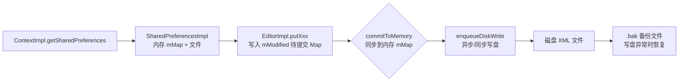

# SharedPreferences 深度剖析

> SharedPreferences（简称 SP）是 Android 最经典的 key-value 轻量级存储方案，用于保存配置参数、用户偏好。它**实现简单、同步读取、性能尚可**，但也存在 ANR 风险、多进程不可靠等天然缺陷。本文从源码角度深度剖析其原理与坑点。

## 一、存储形式与目录

### 1.1 XML 文件

SP 以 **XML 文件**形式保存在 `/data/data/<packageName>/shared_prefs/` 目录：

```xml
<?xml version='1.0' encoding='utf-8' standalone='yes' ?>
<map>
   <string name="blog">https://github.com/JasonWu1111/Android-Review</string>
   <int name="version" value="1" />
   <boolean name="agreed" value="true" />
</map>
```

### 1.2 模式限制

各模式的状态说明如下：

| 模式 | 状态 | 说明 |
|------|------|------|
| `MODE_PRIVATE` | ✓ 唯一推荐 | 仅本应用可读 |
| `MODE_WORLD_READABLE` / `MODE_WORLD_WRITEABLE` | ✗ Android N+ 废弃 | 使用抛 `SecurityException` |
| `MODE_MULTI_PROCESS` | ✗ 不推荐 | 每次 get 检查文件时间戳，性能差且不可靠 |

> **MODE_MULTI_PROCESS 的真相**：它只是每次 `getSharedPreferences` 时比较文件修改时间，变了就**重新从磁盘加载**。它不能保证跨进程读写的**原子性与一致性**，多进程同时写还会丢失数据——官方明确不推荐，后续版本不再支持。

## 二、三种获取方式与单例缓存

三种获取方式的对比说明如下：

| 获取方式 | 文件名 | 说明 |
| --- | --- | --- |
| `Activity.getPreferences(mode)` | `MainActivity.xml` | 以 Activity 类名命名 |
| `PreferenceManager.getDefaultSharedPreferences(ctx)` | `packageName_preferences.xml` | 包名 + `_preferences` |
| `Context.getSharedPreferences(name, mode)` | 自定义 name | **所有方式的最终入口** |

单例缓存的核心实现如下：

::: code-tabs

@tab:active Java

```java
// ContextImpl 中的单例缓存
public SharedPreferences getSharedPreferences(String name, int mode) {
    synchronized (this) {
        SharedPreferences sp = mSharedPrefs.get(name);   // ArrayMap 缓存
        if (sp == null) {
            sp = new SharedPreferencesImpl(file, mode);  // 首次创建
            mSharedPrefs.put(name, sp);
        }
        return sp;
    }
}
```

@tab Kotlin

```kotlin
// ContextImpl 中的单例缓存（Kotlin 等价示意）
@Synchronized
fun getSharedPreferences(name: String, mode: Int): SharedPreferences {
    val sp = mSharedPrefs[name]   // ArrayMap 缓存
    return sp ?: SharedPreferencesImpl(file, mode).also {
        mSharedPrefs[name] = it  // 首次创建
    }
}
```

:::

**核心机制：进程级单例缓存** —— 同一个 name 的 SP 在进程内只加载一次（`ArrayMap` 缓存）。所有线程的 get/put 都操作**同一份内存 mMap**，因此：

- 读操作是**内存读**，很快（首次加载除外）。
- 写操作先改内存，再决定何时刷盘（apply/commit 的区别）。

## 三、整体架构（源码层）

SP 的整体架构链路如下：



- `putXxx()`：数据写入 `EditorImpl.mModified`（待提交 Map），**尚未生效**；
- `apply()/commit()`：先 `commitToMemory()` 把 mModified 合并进 `SharedPreferencesImpl.mMap`（**此时内存已生效**），再 `enqueueDiskWrite()` 写盘；写盘前把原文件复制为 `.bak`，写盘异常时用 `.bak` 恢复；
- `getXxx()`：直接从内存 `mMap` 读取。

## 四、apply vs commit（核心考点）

apply 与 commit 的对比说明如下：

| 对比项 | apply | commit |
| --- | --- | --- |
| 返回值 | 无（void） | 有（boolean 是否成功） |
| 线程 | **主线程调用安全**（写盘在 QueuedWork 单线程池异步执行） | 同步写盘（调用线程阻塞） |
| 内存生效时机 | 立即（同步更新 mMap） | 立即 |
| 磁盘写入 | 异步，QueuedWork 排队 | 同步，写完才返回 |
| 并发 | 后续 apply 覆盖前面（写盘合并） | 阻塞等待前一次完成 |
| ANR 风险 | 低（但 Activity 生命周期收尾时会同步等待） | 高（主线程同步写盘） |

### 4.1 为什么 apply 也会 ANR？（关键）

**`QueuedWork.waitToFinish()`**：在 Activity/Service 的 `onPause`、`onStop`、`onDestroy` 等生命周期收尾时，系统会调用 `QueuedWork.waitToFinish()`，**同步等待所有未完成的 apply 写盘结束**。如果磁盘 I/O 慢或有大量 apply 堆积，主线程就会被阻塞 → ANR。

### 4.2 高频写盘优化

高频与批量写入的对比代码如下：

::: code-tabs

@tab:active Java

```java
// ✗ 高频写：每次 edit 都触发一次磁盘写
for (int i = 0; i < 100; i++) {
    prefs.edit().putInt("key" + i, i).apply();
}

// ✓ 批量写：一次 edit 合并所有修改，只写一次盘
SharedPreferences.Editor editor = prefs.edit();
for (int i = 0; i < 100; i++) {
    editor.putInt("key" + i, i);
}
editor.apply();
```

@tab Kotlin

```kotlin
// ✗ 高频写：每次 edit 都触发一次磁盘写
repeat(100) {
    prefs.edit().putInt("key$it", it).apply()
}

// ✓ 批量写：一次 edit 合并所有修改，只写一次盘
val editor = prefs.edit()
repeat(100) { editor.putInt("key$it", it) }
editor.apply()
```

:::

## 五、常见坑点清单

1. **不要存大 key/value**：SP 整个文件读入内存，文件过大拖慢首次访问与同步写盘；
2. **不要高频 apply**：即使异步，`onPause` 时会同步等待，量大会 ANR；尽量批量提交；
3. **不要用 `MODE_MULTI_PROCESS`**：跨进程不安全，内存缓存不同步；
4. **读写分离**：高频读写的 key 拆到不同文件，减少锁竞争（SP 有全局锁）；
5. **不要多次 edit()**：一次 `edit()` 后连续 `putXxx()`，减少内存分配；
6. **不要存储敏感数据**：SP 文件明文存储（即使 `MODE_PRIVATE`，root 后可见），密码/Token 应使用 `EncryptedSharedPreferences` 或 Keystore；
7. **线程安全性**：`getSharedPreferences` 返回的单例是**线程安全**的（内部有锁），但跨进程不安全；
8. **SP 不会在应用更新后自动迁移**：key 变更需要手动处理兼容。

## 六、替代方案：DataStore

DataStore 替代 SP 的实现代码如下：

::: code-tabs

@tab:active Java

```java
// Preferences DataStore（替代 SP 的首选）
// 顶层扩展属性（Kotlin 特性，Java 中用 DataStoreFactory 创建）
private val Context.dataStore by preferencesDataStore(name = "settings")

val counterFlow: Flow<Integer> = context.getDataStore().getData()
        .map(prefs -> prefs.contains(PreferencesKeys.counter)
                ? prefs.get(PreferencesKeys.counter) : 0);

public void incrementCounter(Scope scope) {
    scope.launch(Dispatchers.IO) {
        context.getDataStore().edit(settings -> {
            int current = settings.contains(PreferencesKeys.counter)
                    ? settings.get(PreferencesKeys.counter) : 0;
            settings.put(PreferencesKeys.counter, current + 1);
        });
    }
}
```

@tab Kotlin

```kotlin
// Preferences DataStore（替代 SP 的首选）
val Context.dataStore by preferencesDataStore(name = "settings")

val counterFlow: Flow<Int> = context.dataStore.data
    .map { it[PreferencesKeys.counter] ?: 0 }

suspend fun incrementCounter() {
    context.dataStore.edit { settings ->
        val current = settings[PreferencesKeys.counter] ?: 0
        settings[PreferencesKeys.counter] = current + 1
    }
}
```

:::

SP 与 DataStore 的对比说明如下：

| 对比 | SharedPreferences | DataStore |
|------|-------------------|-----------|
| 异步 | 读同步、写异步（apply） | **全部异步**（Flow/挂起函数） |
| 主线程安全 | 读快但写盘可能阻塞 | 主线程调用安全 |
| 数据一致性 | 多进程/并发不安全 | 事务性（DataStore 保证） |
| 类型安全 | 手动 getString/int | Preferences 仍需手动，Proto 类型安全 |
| 迁移 | 有 | 内置 `SharedPreferencesMigration` 一键迁移 |

> 对比阅读：[SharedPreferences 与 DataStore 全对比](sp-vs-datastore.md) | [存储方案总览](storage-comparison.md)

## 七、高频面试题（带详解）

**Q1：apply 和 commit 的区别？为什么 apply 更常用？**
A：apply 无返回值、异步写盘（内存立即生效）、主线程安全；commit 同步写盘、返回结果、可能阻塞主线程。应用一般用 apply。注意 apply 在 Activity 生命周期收尾时会被 QueuedWork 同步等待，量大仍会 ANR。

**Q2：SharedPreferences 线程安全吗？**
A：进程内线程安全（SharedPreferencesImpl 内部有锁，getSharedPreferences 返回单例），但跨进程不安全（MODE_MULTI_PROCESS 已废弃且不可靠）。

**Q3：为什么说 SharedPreferences 不适合存大文件？**
A：整个 XML 文件加载进内存 mMap，首次访问和写盘都是整文件操作；文件越大，内存占用、解析耗时、写盘耗时越大。

**Q4：SharedPreferences 的 key 有数量限制吗？**
A：没有硬性限制，但每个 key 存在内存 mMap 和 XML 中；数量/体积过大影响性能和 ANR 风险，建议保持轻量。

**Q5：如何保证 SharedPreferences 数据不丢失？**
A：apply 在进程被杀（kill -9、系统回收）时未刷盘的数据会丢失；需要强一致用 commit（同步）或改用 DataStore（事务性）。另外系统写盘前有 .bak 备份机制防写盘异常损坏。

## 八、小结

- SP = 进程内单例 + 内存 mMap + 异步 XML 写盘，读快写慢。
- apply/commit 区别是核心考点；apply 的 ANR 隐患（QueuedWork）必须知道。
- 多进程不可靠、明文存储、整文件加载是三大天然缺陷。
- 新项目推荐 DataStore（异步 + 事务 + 迁移支持）。

> 进阶阅读：[存储方案总览](storage-comparison.md) | [SharedPreferences 与 DataStore 全对比](sp-vs-datastore.md) | [Room / DataStore](/jetpack/room-datastore/)
