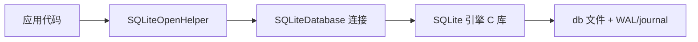

# 原生 SQLite 使用与优化

> 面试高频指数：中 — 不依赖 ORM 直接操作 SQLite 是理解 Room/DataStore 底层的前提，事务、索引、升级策略是数据存储面试的核心。

## 一、SQLite 是什么

**SQLite** 是 Android 内置的轻量级关系型数据库：

| 特性 | 说明 |
|------|------|
| 嵌入式 | 无需独立服务进程，直接以文件形式存储 |
| 零配置 | 系统内置，开箱即用 |
| 单文件 | 数据库就是一个 `.db` 文件（含 journal/WAL 附属文件） |
| SQL 支持 | 支持标准 SQL 子集（无存储过程、部分 JOIN 限制） |
| 事务 | 支持 ACID，默认 autocommit |
| 线程安全 | 单连接串行执行，多连接需处理锁竞争 |

SQLite 的整体调用链路如下：



## 二、SQLiteOpenHelper

### 2.1 基本使用

SQLiteOpenHelper 的标准写法如下：

::: code-tabs

@tab:active Java

```java
class ArticleDbHelper extends SQLiteOpenHelper {

    public static final int DATABASE_VERSION = 2;
    public static final String TABLE_ARTICLE = "article";

    public ArticleDbHelper(Context context) {
        super(context, "wiki.db", null, DATABASE_VERSION);
    }

    @Override
    public void onCreate(SQLiteDatabase db) {
        // 首次创建数据库时执行建表
        db.execSQL(
            "CREATE TABLE " + TABLE_ARTICLE + " (" +
            "id INTEGER PRIMARY KEY AUTOINCREMENT," +
            "title TEXT NOT NULL," +
            "category TEXT," +
            "view_count INTEGER DEFAULT 0," +
            "created_at INTEGER)"
        );
        db.execSQL("CREATE INDEX idx_article_category ON article(category)");
    }

    @Override
    public void onUpgrade(SQLiteDatabase db, int oldVersion, int newVersion) {
        // 版本升级时执行迁移
        if (oldVersion < 2) {
            db.execSQL("ALTER TABLE article ADD COLUMN author TEXT");
        }
    }
}

// 使用
ArticleDbHelper helper = new ArticleDbHelper(context);
SQLiteDatabase db = helper.getReadableDatabase();
```

@tab Kotlin

```kotlin
class ArticleDbHelper(context: Context) :
    SQLiteOpenHelper(context, "wiki.db", null, DATABASE_VERSION) {

    companion object {
        const val DATABASE_VERSION = 2
        const val TABLE_ARTICLE = "article"
    }

    override fun onCreate(db: SQLiteDatabase) {
        // 首次创建数据库时执行建表
        db.execSQL(
            """
            CREATE TABLE $TABLE_ARTICLE (
                id INTEGER PRIMARY KEY AUTOINCREMENT,
                title TEXT NOT NULL,
                category TEXT,
                view_count INTEGER DEFAULT 0,
                created_at INTEGER
            )
            """.trimIndent()
        )
        db.execSQL("CREATE INDEX idx_article_category ON article(category)")
    }

    override fun onUpgrade(db: SQLiteDatabase, oldVersion: Int, newVersion: Int) {
        // 版本升级时执行迁移
        if (oldVersion < 2) {
            db.execSQL("ALTER TABLE article ADD COLUMN author TEXT")
        }
    }
}

// 使用
val helper = ArticleDbHelper(context)
val db = helper.readableDatabase
```

:::

### 2.2 生命周期钩子

各生命周期回调的触发时机如下：

| 回调 | 触发时机 | 典型操作 |
|------|----------|----------|
| `onCreate` | 数据库文件首次创建 | 建表、建索引、初始化数据 |
| `onUpgrade` | 版本号升高 | 增量迁移（ALTER TABLE） |
| `onDowngrade` | 版本号降低（默认抛异常） | 按需处理，谨慎 |
| `onConfigure` | 首次打开连接前 | 设置 WAL、外键约束 |
| `onOpen` | 每次打开连接后 | 开启外键等 |

## 三、CRUD 与查询

### 3.1 增删改查

SQLite 增删改查的标准写法如下：

::: code-tabs

@tab:active Java

```java
// 插入
ContentValues values = new ContentValues();
values.put("title", "SQLite 优化指南");
values.put("category", "storage");
values.put("view_count", 100);
long rowId = db.insert(TABLE_ARTICLE, null, values);

// 查询
Cursor cursor = db.query(
        TABLE_ARTICLE,
        new String[]{"id", "title", "view_count"},
        "category = ? AND view_count > ?",   // 占位符防注入
        new String[]{"storage", "10"},
        null, null,
        "view_count DESC",
        "20"                                  // LIMIT
);
try (Cursor c = cursor) {
    while (c.moveToNext()) {
        long id = c.getLong(c.getColumnIndexOrThrow("id"));
        String title = c.getString(c.getColumnIndexOrThrow("title"));
    }
}

// 更新
int updated = db.update(TABLE_ARTICLE, values, "id = ?", new String[]{"1"});

// 删除
db.delete(TABLE_ARTICLE, "view_count < ?", new String[]{"5"});
```

@tab Kotlin

```kotlin
// 插入
val values = ContentValues().apply {
    put("title", "SQLite 优化指南")
    put("category", "storage")
    put("view_count", 100)
}
val rowId = db.insert(TABLE_ARTICLE, null, values)

// 查询
val cursor = db.query(
    TABLE_ARTICLE,
    arrayOf("id", "title", "view_count"),
    "category = ? AND view_count > ?",   // 占位符防注入
    arrayOf("storage", "10"),
    null, null,
    "view_count DESC",
    "20"                                  // LIMIT
)
cursor.use {
    while (it.moveToNext()) {
        val id = it.getLong(it.getColumnIndexOrThrow("id"))
        val title = it.getString(it.getColumnIndexOrThrow("title"))
    }
}

// 更新
val updated = db.update(TABLE_ARTICLE, values, "id = ?", arrayOf("1"))

// 删除
db.delete(TABLE_ARTICLE, "view_count < ?", arrayOf("5"))
```

:::

### 3.2 参数化查询防注入

参数化查询的正确写法如下：

::: code-tabs

@tab:active Java

```java
// 错误：字符串拼接
Cursor cursor = db.rawQuery(
        "SELECT * FROM article WHERE title = '" + input + "'", null);  // 注入风险

// 正确：占位符绑定
db.rawQuery("SELECT * FROM article WHERE title = ?", new String[]{input});
```

@tab Kotlin

```kotlin
// 错误：字符串拼接
db.rawQuery("SELECT * FROM article WHERE title = '$input'", null)  // 注入风险

// 正确：占位符绑定
db.rawQuery("SELECT * FROM article WHERE title = ?", arrayOf(input))
```

:::

## 四、事务

### 4.1 为什么要用事务

批量写入默认每条 SQL 一个事务（写盘一次），N 条数据 = N 次磁盘 IO。用事务包裹可合并为一次提交，**性能提升数量级**，且保证原子性（要么全成功要么全失败）。

事务包裹的批量写入代码如下：

::: code-tabs

@tab:active Java

```java
// 批量插入：单事务包裹
db.beginTransaction();
try {
    for (int i = 1; i <= 1000; i++) {
        ContentValues values = new ContentValues();
        values.put("title", "文章 " + i);
        db.insert(TABLE_ARTICLE, null, values);
    }
    db.setTransactionSuccessful();   // 标记成功
} finally {
    db.endTransaction();             // 提交或回滚
}
```

@tab Kotlin

```kotlin
// 批量插入：单事务包裹
db.beginTransaction()
try {
    for (i in 1..1000) {
        val values = ContentValues().apply { put("title", "文章 $i") }
        db.insert(TABLE_ARTICLE, null, values)
    }
    db.setTransactionSuccessful()   // 标记成功
} finally {
    db.endTransaction()             // 提交或回滚
}
```

:::

### 4.2 事务特性

各事务特性的说明如下：

| 特性 | 说明 |
|------|------|
| 原子性 | 要么全部执行，要么全部回滚 |
| 一致性 | 事务前后数据约束一致 |
| 隔离性 | 未提交的数据其他事务不可见 |
| 持久性 | 提交后数据落盘 |
| 嵌套事务 | Android 通过 savepoint 支持嵌套 |

> 关键点：`setTransactionSuccessful()` 必须在 `endTransaction()` 之前调用，否则事务回滚；finally 中必须 endTransaction 保证异常时也能回滚释放锁。

## 五、WAL 模式与性能优化

### 5.1 Journal 模式 vs WAL 模式

两种日志模式的对比说明如下：

| 对比项 | 默认（DELETE journal） | WAL |
|--------|----------------------|-----|
| 写原理 | 写前先写 journal 日志 | 写操作追加到 WAL 文件 |
| 读写并发 | 读阻塞写、写阻塞读 | 读写可并行 |
| 性能 | 写放大 | 写更快、读更快 |
| 缺点 | 并发差 | WAL 文件增长需 checkpoint |

开启 WAL 模式的实现代码如下：

::: code-tabs

@tab:active Java

```java
// 开启 WAL（onConfigure 中设置）
@Override
public void onConfigure(SQLiteDatabase db) {
    super.onConfigure(db);
    db.enableWriteAheadLogging();   // WAL 模式
    db.setForeignKeyConstraintsEnabled(true);  // 外键约束
}
```

@tab Kotlin

```kotlin
// 开启 WAL（onConfigure 中设置）
override fun onConfigure(db: SQLiteDatabase) {
    super.onConfigure(db)
    db.enableWriteAheadLogging()   // WAL 模式
    db.setForeignKeyConstraintsEnabled(true)  // 外键约束
}
```

:::

### 5.2 索引优化

索引的建立方式如下：

::: code-tabs

@tab:active Java

```java
// 建立索引
db.execSQL("CREATE INDEX idx_article_category ON article(category)");
db.execSQL("CREATE INDEX idx_article_created ON article(created_at DESC)");

// 复合索引（注意列顺序：等值列在前）
db.execSQL("CREATE INDEX idx_cat_created ON article(category, created_at)");
```

@tab Kotlin

```kotlin
// 建立索引
db.execSQL("CREATE INDEX idx_article_category ON article(category)")
db.execSQL("CREATE INDEX idx_article_created ON article(created_at DESC)")

// 复合索引（注意列顺序：等值列在前）
db.execSQL("CREATE INDEX idx_cat_created ON article(category, created_at)")
```

:::

索引使用建议：

- 查询条件 `WHERE`、排序 `ORDER BY`、连接 `JOIN` 的列优先建索引
- 区分度低的列（性别、状态码）建索引收益低
- 不要过度建索引（写入变慢、文件变大）
- 用 `EXPLAIN QUERY PLAN` 验证是否命中索引

```bash
sqlite3 wiki.db "EXPLAIN QUERY PLAN SELECT * FROM article WHERE category='storage';"
# 输出含 "USING INDEX idx_article_category" 表示命中
```

### 5.3 其他优化手段

其他优化手段的说明如下：

| 手段 | 说明 |
|------|------|
| `setForeignKeyConstraintsEnabled` | 开启外键级联 |
| 预编译语句复用 | 循环插入复用 `compileStatement` |
| 限制游标窗口 | `setQueryThreshold` / 分页查询 |
| `PRAGMA journal_mode=WAL` | 提升读写并发 |
| 避免大字段 | 大文本/BLOB 单独存文件或分表 |

## 六、数据库升级与迁移

### 6.1 增量迁移模式

增量迁移的标准写法如下：

::: code-tabs

@tab:active Java

```java
@Override
public void onUpgrade(SQLiteDatabase db, int oldVersion, int newVersion) {
    // 逐版本增量迁移，保证任意旧版本都能升级
    if (oldVersion < 2) {
        db.execSQL("ALTER TABLE article ADD COLUMN author TEXT");
    }
    if (oldVersion < 3) {
        db.execSQL("CREATE TABLE comment (id INTEGER PRIMARY KEY, article_id INTEGER)");
    }
}
```

@tab Kotlin

```kotlin
override fun onUpgrade(db: SQLiteDatabase, oldVersion: Int, newVersion: Int) {
    // 逐版本增量迁移，保证任意旧版本都能升级
    if (oldVersion < 2) {
        db.execSQL("ALTER TABLE article ADD COLUMN author TEXT")
    }
    if (oldVersion < 3) {
        db.execSQL("CREATE TABLE comment (id INTEGER PRIMARY KEY, article_id INTEGER)")
    }
}
```

:::

### 6.2 破坏性变更：重建表

重建表的迁移代码如下：

::: code-tabs

@tab:active Java

```java
if (oldVersion < 4) {
    // 表结构大改：建新表 → 拷贝数据 → 删旧表 → 改名
    db.execSQL("ALTER TABLE article RENAME TO article_old");
    db.execSQL(
        "CREATE TABLE article (" +
        "id INTEGER PRIMARY KEY AUTOINCREMENT," +
        "title TEXT NOT NULL," +
        "category TEXT," +
        "view_count INTEGER DEFAULT 0," +
        "created_at INTEGER," +
        "author TEXT)"
    );
    db.execSQL("INSERT INTO article (id, title, category, view_count, created_at, author) SELECT id, title, category, view_count, created_at, NULL FROM article_old");
    db.execSQL("DROP TABLE article_old");
}
```

@tab Kotlin

```kotlin
if (oldVersion < 4) {
    // 表结构大改：建新表 → 拷贝数据 → 删旧表 → 改名
    db.execSQL("ALTER TABLE article RENAME TO article_old")
    db.execSQL("""
        CREATE TABLE article (
            id INTEGER PRIMARY KEY AUTOINCREMENT,
            title TEXT NOT NULL,
            category TEXT,
            view_count INTEGER DEFAULT 0,
            created_at INTEGER,
            author TEXT
        )
    """.trimIndent())
    db.execSQL("INSERT INTO article (id, title, category, view_count, created_at, author) SELECT id, title, category, view_count, created_at, NULL FROM article_old")
    db.execSQL("DROP TABLE article_old")
}
```

:::

### 6.3 迁移注意

- 迁移代码必须**幂等**（异常中断后可重试）
- 大数据迁移放后台线程，避免 ANR
- 测试：覆盖旧版本升级路径（`adb install -r` 旧 APK 升级）
- Room 使用 `Migration` 对象做同样的事情，自动管理版本

## 七、高频面试题

### Q1：SQLite 事务为什么能大幅提升批量写入性能？
::: details 查看答案
默认每条 SQL 自动开启一个事务并立即落盘（一次磁盘 IO + fsync）。批量写入 N 条 = N 次磁盘 IO。用 beginTransaction 包裹后，所有写入在内存中暂存，只在 endTransaction 时提交落盘一次，磁盘 IO 从 N 次降到 1 次，性能提升可达数量级。同时保证原子性：任一条失败则整体回滚，不会出现半写状态。
:::

### Q2：SQLiteDatabase 的 beginTransaction 使用注意事项？
::: details 查看答案
① setTransactionSuccessful() 必须在 endTransaction() 之前调用，否则默认回滚；② endTransaction() 必须放在 finally 中，异常时也能正常结束事务释放锁；③ 嵌套事务通过 savepoint 支持，内层提交不会真正落盘；④ 事务期间数据库被独占写锁，长时间事务会阻塞其他写操作，事务内不要做耗时 IO；⑤ 跨线程使用同一连接注意同步。
:::

### Q3：WAL 模式相比默认 journal 模式有什么优缺点？
::: details 查看答案
WAL（Write-Ahead Logging）把写操作追加到 WAL 文件而非直接修改主库文件：优点：① 读写可以完全并行，读不阻塞写；② 写性能更高（顺序追加）；③ 崩溃恢复更简单。缺点：① WAL 文件会增长，需要 checkpoint 合并回主库；② 只读模式下（如从外部复制 db）不能使用 WAL；③ 占用额外磁盘空间。对读写并发要求高的应用（IM、笔记类）建议开启。
:::

### Q4：什么情况下索引不生效？
::: details 查看答案
① WHERE 列上做了函数运算（WHERE strftime('%Y', created_at) = '2026'）导致无法命中索引；② 隐式类型转换（列是 TEXT 却传数字比较）；③ 复合索引列顺序不对（等值列放在范围列之后）；④ 使用了 LIKE '%xxx%' 前导通配符；⑤ 索引列区分度太低优化器放弃索引；⑥ OR 连接多个条件未用 UNION ALL。排查用 EXPLAIN QUERY PLAN 查看执行计划。
:::

### Q5：数据库升级时如何保证旧版本用户平滑迁移？
::: details 查看答案
① 采用逐版本增量迁移（oldVersion < N 的链式判断），保证 1.x 到最新版任意路径都能正确升级；② 破坏性结构变更用"建新表-拷贝-删旧表-改名"五步法，并处理默认值；③ 迁移代码幂等可重试，用事务包裹；④ 大数据迁移放后台线程避免 ANR；⑤ 覆盖测试：安装旧版本 APK 后升级验证数据完整性；⑥ 用 Room 的 Migration 对象 + testing 库做自动化迁移测试。
:::

## 八、小结

原生 SQLite 是 Android 数据存储的地基：

1. `SQLiteOpenHelper` 管理数据库创建与版本升级
2. 参数化查询防注入，`cursor.use` 管理游标
3. 事务批量写性能提升数量级，`finally` 中结束
4. WAL 模式提升读写并发
5. 索引按查询模式设计，用 EXPLAIN 验证
6. 升级迁移逐版本增量、幂等、可测试

相关阅读：[Room 详解](/jetpack/room-datastore/room-guide.md)、[Room 进阶实践](/jetpack/room-datastore/room-advanced.md)、[数据存储方案对比](/android/storage/storage-comparison.md)、[ContentObserver 数据监听](/android/content-provider/contentobserver.md)。
