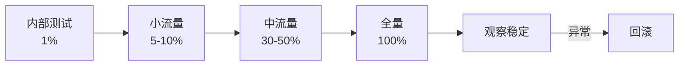
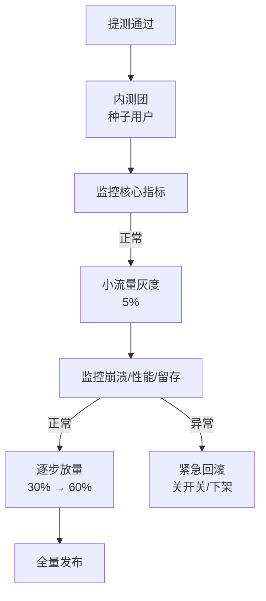
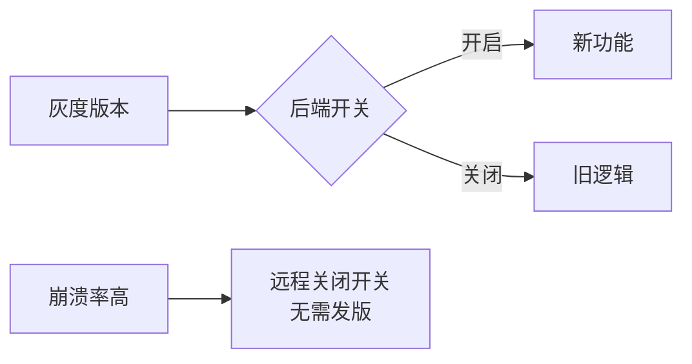

# 🚦 灰度发布与发布策略

> 全量发布风险高:一个 bug 影响所有用户。**灰度发布**让新版本先给小部分用户,验证稳定后再逐步放量,是移动端发布的标准姿势。

## 一、为什么需要灰度发布

| 痛点 | 全量发布 | 灰度发布 |
|------|---------|---------|
| 崩溃影响 | 全部用户 | 小部分用户 |
| 回滚成本 | 高 | 低(快速) |
| 数据验证 | 事后发现 | 过程监控 |
| 用户反馈 | 滞后 | 及时 |



## 二、灰度发布流程

### 2.1 完整流程



| 阶段 | 流量 | 监控重点 |
|------|------|---------|
| 内测 | 种子用户 | 功能可用性 |
| 小流量 | 5-10% | 崩溃率、核心链路 |
| 中流量 | 30-60% | 性能、留存、转化 |
| 全量 | 100% | 全量指标对比 |

### 2.2 用户分组方式

| 方式 | 说明 |
|------|------|
| 按 UID 哈希 | uid % 100 < N 命中灰度 |
| 按版本 | 仅灰度指定版本 |
| 按渠道 | 特定渠道先行 |
| 按标签 | 白名单用户/内测团 |
| 按设备 | 机型/系统版本分层 |

```java
// UID 哈希灰度示例
boolean inGray(String uid, int percent) {
    int hash = (uid + "salt").hashCode() & 0x7fffffff;
    return hash % 100 < percent;   // percent = 5 → 5% 用户
}
```

## 三、灰度发布平台方案

### 3.1 应用商店 vs 自建

| 方案 | 优点 | 缺点 |
|------|------|------|
| 应用商店灰度(华为/小米/OPPO) | 官方、无需自建 | 依赖商店能力 |
| 自建分发(蒲公英/Fir) | 灵活可控 | 需维护 |
| 后端开关灰度 | 实时、可回滚 | 需研发支持 |

### 3.2 版本灰度 + 功能开关双保险

```text
方案一:商店灰度(版本级)——新 APK 只对灰度用户可见
方案二:功能开关(功能级)——新旧版本共存,后端下发开关
组合:版本灰度发现崩溃 → 用功能开关即时关闭问题功能
```



## 四、灰度监控与决策

### 4.1 核心指标

| 指标 | 说明 | 阈值参考 |
|------|------|---------|
| 崩溃率 | 灰度 vs 基线 | 不高于基线 |
| ANR 率 | 卡顿指标 | 对比基线 |
| 核心链路 | 启动/登录/支付 | 成功率 ≥ 99% |
| 性能 | 启动耗时/内存 | 不劣化 |
| 业务指标 | 留存/转化 | 不低于基线 |

### 4.2 放量与回滚决策

```text
放量条件:所有核心指标连续 N 小时稳定
回滚条件:任一关键指标恶化(崩溃率飙升/支付失败)
回滚手段:① 商店下架灰度;② 后端关闭功能开关;③ 强制升级旧版本
```

## 五、功能开关(Future Flag)

```kotlin
// 后端下发的功能开关
data class FeatureFlag(val key: String, val enabled: Boolean)

class FlagManager(private val repo: RemoteConfigRepo) {
    suspend fun isEnabled(key: String): Boolean {
        return repo.getFlag(key).enabled
    }
}

// 使用:新功能代码用开关包裹
if (flagManager.isEnabled("new_home")) {
    showNewHome()      // 新首页
} else {
    showOldHome()      // 旧首页
}
```

| 开关类型 | 说明 |
|---------|------|
| 发布开关 | 新功能是否可见 |
| 实验开关 | A/B 测试分组 |
| 权限开关 | 特定用户可见 |
| 熔断开关 | 出问题时关闭 |

> ⚠️ 功能开关注意事项:① 开关代码要能安全移除(避免技术债);② 开关配置需版本兼容;③ 及时清理过期开关;④ 开关下发要有缓存与降级。

## 六、A/B 测试与灰度区别

| 维度 | 灰度发布 | A/B 测试 |
|------|---------|---------|
| 目的 | 降低发布风险 | 验证方案效果 |
| 分组 | 渐进放量 | 随机对照 |
| 决策 | 稳定 → 全量 | 指标显著 → 采纳 |
| 周期 | 短(小时/天) | 中(天/周) |

## 七、高频面试题

### Q1：什么是灰度发布?为什么要灰度?
::: details 查看答案
灰度发布:新版本先发布给小部分用户(如 5%),监控稳定后逐步放量,最终全量。目的:① 降低风险——bug 只影响少数用户,而不是全网崩溃;② 快速回滚——发现问题可立即下架或关开关,无需等全部用户反馈;③ 数据验证——用真实用户数据验证功能效果;④ 平滑过渡——避免"更新后全部出问题"的灾难。是移动互联网的标配发布策略,尤其适合用户量大、版本迭代快的 App。
:::

### Q2：灰度发布的完整流程?
::: details 查看答案
① 提测通过后先发内测(种子用户/内测团),验证功能;② 小流量灰度(5-10%),监控核心指标(崩溃率/ANR/核心链路成功率);③ 指标正常则逐步放量(30%→60%→100%),每级观察确认;④ 全量发布后持续监控。任一阶段指标恶化:立即回滚(商店下架灰度、后端关功能开关、引导旧版本)。关键:① 用户分组要稳定(同用户始终同一分组);② 监控指标要全面且与基线对比;③ 回滚预案提前准备好。
:::

### Q3：灰度分组怎么实现?为什么用 UID 哈希?
::: details 查看答案
常用方式:按 UID 哈希取模(uid + salt 的 hash % 100 < percent)、按版本、按渠道、按白名单标签、按机型/系统分层。用 UID 哈希的原因:① 稳定——同一用户始终命中同一分组(不能这次灰度下次不灰度);② 均匀——哈希分布近似随机,避免地域/时间偏差;③ 简单——无需维护用户名单,加盐防恶意绕过;④ 可伸缩——percent 可变,放量只改后端配置。也可结合"设备指纹"分组应对多账号场景。
:::

### Q4：功能开关和灰度发布是什么关系?开关要注意什么?
::: details 查看答案
关系:灰度发布是"版本级"策略(新包给谁用),功能开关是"功能级"策略(新功能是否启用),二者组合成双保险:即使灰度版本出了小问题,也能远程关开关止血,不用重新发版。开关注意:① 新功能代码必须包在开关里,开关关闭走旧逻辑;② 开关状态由后端下发(带缓存与降级),不硬编码;③ 定期清理过期开关(避免死代码);④ 开关值要按版本兼容处理;⑤ 关键开关要有监控(开关状态变更告警)。
:::

### Q5：灰度发布如何监控?什么情况要回滚?
::: details 查看答案
监控:崩溃率、ANR 率、核心链路成功率(启动/登录/支付)、性能指标(启动耗时/内存)、业务指标(留存/转化),全部与**上一版本基线**对比。放量条件:核心指标连续稳定(如 24h 无异常)。回滚条件:① 崩溃率明显高于基线(如 2 倍以上);② 核心链路成功率跌破阈值;③ 支付/登录等关键功能故障;④ 用户投诉集中爆发。回滚手段:商店下架灰度包 → 后端关闭功能开关 → 引导用户更新旧版本 → 定位修复后重新灰度。
:::

## 小结

- 灰度发布:小流量 → 逐步放量 → 全量,降低发布风险
- 用户分组:UID 哈希稳定均匀,按渠道/白名单灵活补充
- 版本灰度 + 功能开关双保险,可远程止血
- 监控核心指标与基线对比,异常即回滚
- 灰度发布保稳定,A/B 测试验效果,两者互补
- 回滚预案提前准备:下架 / 关开关 / 引导升级

> 📖 进阶阅读：[Jenkins 流水线实战](/engineering/cicd/jenkins-pipeline.md) | [GitHub Actions CI/CD](/engineering/cicd/github-actions.md) | [APM 监控体系](/advanced/stability/apm-monitoring.md)
