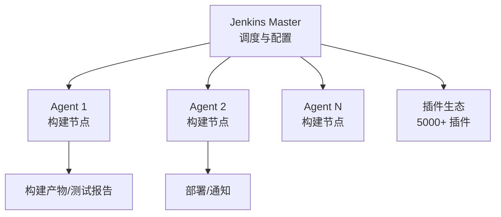

# Jenkins 流水线实战

> Jenkins 是经典的 CI/CD 服务器:自建、可扩展、Pipeline 即代码。虽然云原生 CI(GitHub Actions/GitLab CI)流行,但 Jenkins 在**企业内网、私有化部署**场景仍是主力。

## 一、Jenkins 架构



| 组件 | 职责 |
|------|------|
| Master | 任务调度、配置、Web UI |
| Agent | 实际执行构建的节点 |
| 插件 | 扩展能力(Android/Git/通知) |
| 凭据管理 | 密钥、Token 安全存储 |
| 分布式 | 多 Agent 并行构建 |

## 二、Pipeline 基础

### 2.1 声明式 Pipeline

```groovy
pipeline {
    agent any                     // 任意可用节点
    environment {
        // 环境变量
        GRADLE_USER_HOME = "${WORKSPACE}/.gradle"
    }
    stages {
        stage('Checkout') { steps { checkout scm } }
        stage('Test') {
            steps {
                sh './gradlew testDebugUnitTest'
            }
        }
        stage('Build') {
            steps {
                sh './gradlew assembleRelease'
            }
        }
    }
    post {
        success { archiveArtifacts artifacts: 'app/build/outputs/**/*.apk' }
        always  { junit 'app/build/test-results/**/*.xml' }
    }
}
```

| 语法元素 | 作用 |
|---------|------|
| pipeline | 根节点 |
| agent | 执行节点 |
| stages/stage | 阶段(可并行/条件) |
| steps | 具体步骤 |
| post | 后置处理(success/failure/always) |
| environment | 环境变量 |
| triggers | 触发方式 |

### 2.2 触发方式

```groovy
// 触发:定时 / 轮询 SCM / Webhook / 手动
pipeline {
    triggers {
        cron('H 2 * * *')                       // 每天 2 点
        pollSCM('H/30 * * * *')                 // 每 30 分钟检查变更
        githubPush()                            // GitHub Webhook 推送触发
    }
}
```

## 三、Android 构建流水线


```groovy
stage('签名打包') {
    steps {
        // 凭据注入签名文件与密码(不硬编码)
        withCredentials([file(credentialsId: 'keystore', variable: 'KEYSTORE')]) {
            sh '''
                ./gradlew assembleRelease \
                  -Pkeystore=$KEYSTORE
            '''
        }
    }
}
```

| 环节 | 关键点 |
|------|--------|
| SDK 管理 | sdkmanager 预装 / 缓存 |
| 依赖缓存 | Gradle 缓存持久化,加速构建 |
| 测试 | 单测 + Lint + 静态检查 |
| 签名 | 凭据管理,密钥不进仓库 |
| 产物 | 归档 APK/AAB,生成二维码 |
| 通知 | 企业微信/钉钉/Slack 消息 |

## 四、多分支流水线

```groovy
// Jenkinsfile 配合多分支流水线任务
// 每个分支自动创建流水线
// 分支命名策略:
//   main → 生产构建
//   release/* → 发布候选
//   feature/* → 开发验证
pipeline {
    agent any
    stages {
        stage('Build') { steps { sh './gradlew assemble${BRANCH_NAME == "main" ? "Release" : "Debug"}' } }
    }
}
```

## 五、分布式与性能优化

| 优化手段 | 说明 |
|---------|------|
| 多 Agent | 不同模块并行构建 |
| 依赖缓存 | `--build-cache` + 持久化目录 |
| 增量构建 | 只构建变更模块 |
| 并行 Stage | `parallel` 并行测试 |
| 容器化 Agent | Docker 隔离环境 |
| 定时错峰 | 构建避开高峰 |

## 六、Jenkins vs GitHub Actions

| 维度 | Jenkins | GitHub Actions |
|------|---------|----------------|
| 部署 | 自建服务器 | 云端托管 |
| 配置 | Jenkinsfile(Groovy) | YAML |
| 生态 | 5000+ 插件 | Marketplace |
| 私有化 | 内网友好 | 需自托管 Runner |
| 成本 | 服务器成本 | 免费额度/付费 |
| 适用 | 企业内网/定制 | 开源/云端项目 |

> **选型建议**:代码在 GitHub + 云构建 → GitHub Actions;企业内网、需要私有化、复杂插件生态 → Jenkins(或 GitLab CI)。

## 七、高频面试题

### Q1：Jenkins 的 Master/Agent 架构是什么?为什么要分布式?
::: details 查看答案
Master:管理配置、调度任务、提供 Web UI,自身不执行构建;Agent:真正执行构建的节点(可多台)。分布式的好处:① 并行构建多任务,缩短流水线时间;② 不同 Agent 配置不同环境(Android/iOS/后端);③ 负载均衡,Master 卡顿不影响构建;④ 支持 Docker/云上弹性 Agent。企业大规模 CI 常用"Master + 多 Agent"架构,通过 label 指定任务跑在特定节点(如 android-agent)。
:::

### Q2：声明式 Pipeline 的核心结构有哪些?和脚本式有什么区别?
::: details 查看答案
声明式:结构化的 pipeline/agent/stages/steps/post/environment/triggers,易读、易维护,有语法校验,适合团队规范;脚本式:整个 Jenkinsfile 是 Groovy 脚本(node/stage/sh 自由编程),灵活强大但难维护。区别要点:声明式更"配置化"(限制语法、内置并发/条件/后置),脚本式更"编程化"(任意 Groovy 逻辑)。现代项目推荐声明式,复杂逻辑可用 @Library 封装共享库。
:::

### Q3：Android 构建流水线通常包含哪些阶段?怎么优化构建速度?
::: details 查看答案
典型阶段:Checkout(拉代码)→ 环境准备(JDK/SDK)→ 单元测试 → Lint → 构建(assembleDebug/Release)→ 签名加固 → 上传分发 → 通知。优化:① Gradle 构建缓存(--build-cache)与依赖缓存持久化;② 增量编译,只构建变更模块;③ 并行 stage(测试与静态检查并行);④ 多 Agent 分布式;⑤ 容器化统一环境;⑥ 关闭非必要任务、使用 Configuration Cache;⑦ 缓存 Android SDK 平台与构建工具,避免重复下载。目标是让"代码提交到拿到 APK"从小时级降到 10 分钟以内。
:::

### Q4：签名信息怎么安全地放到 Jenkins?
::: details 查看答案
绝不能把 keystore 和密码写进仓库或 Jenkinsfile。正确做法:① Jenkins 凭据管理(Credentials)存储 keystore 文件与密码;② 流水线中用 withCredentials/credentials() 注入,只存在于构建环境变量,不打印日志;③ 或用环境变量 + 密文文件;④ 密钥文件设置访问权限,仅相关 Agent 可读;⑤ 定期轮换密码,审计访问。同时建议:发布签名与开发签名分离,CI 只掌握发布签名(存储于安全凭据)。
:::

### Q5：如何实现自动触发构建?和 GitHub Actions 相比怎么选?
::: details 查看答案
触发方式:① Webhook——GitHub/GitLab 推送触发(push/PR);② 轮询 SCM——定时检查代码变更;③ 定时任务——固定时间构建;④ 上游任务触发——前一任务成功后执行。选型对比:GitHub Actions 云端托管、YAML 配置、与 GitHub 深度集成,适合代码在 GitHub 的团队;Jenkins 自建、插件生态丰富、内网部署友好,适合企业私有化、复杂自定义流水线。规模小选 Actions,企业内网/定制强选 Jenkins(GitLab CI 是折中方案)。
:::

## 小结

- Jenkins = Master/Agent 架构 + 插件生态 + Pipeline 即代码
- 声明式 Pipeline:stages/steps/post,易维护
- Android 流水线:测试 → Lint → 构建 → 签名 → 分发 → 通知
- 凭据管理保证签名安全,缓存优化构建速度
- 多分支流水线自动适配分支策略
- 企业内网选 Jenkins,云端项目选 GitHub Actions

> 进阶阅读：[GitHub Actions CI/CD](/engineering/cicd/github-actions.md) | [灰度发布方案](/engineering/cicd/gray-release.md) | [Git 工作流实践](/engineering/git/git-workflow.md)
