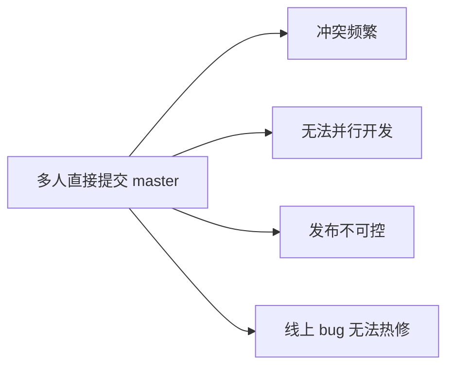
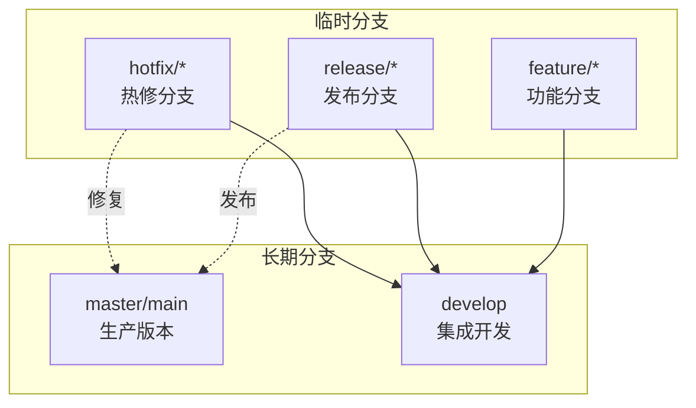
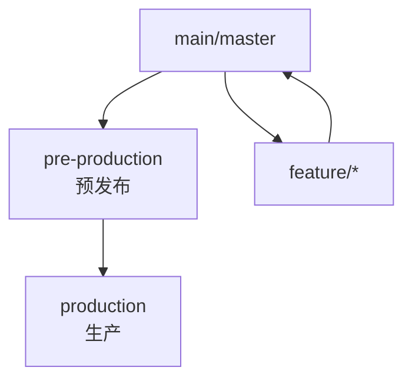
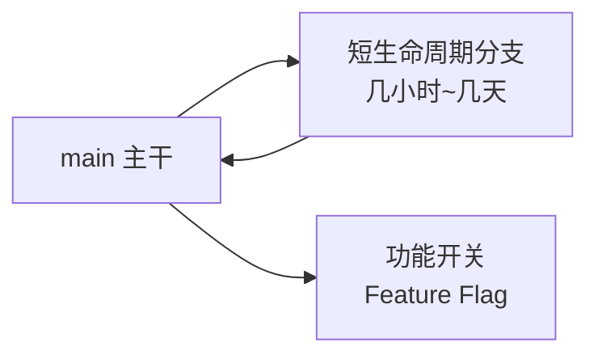
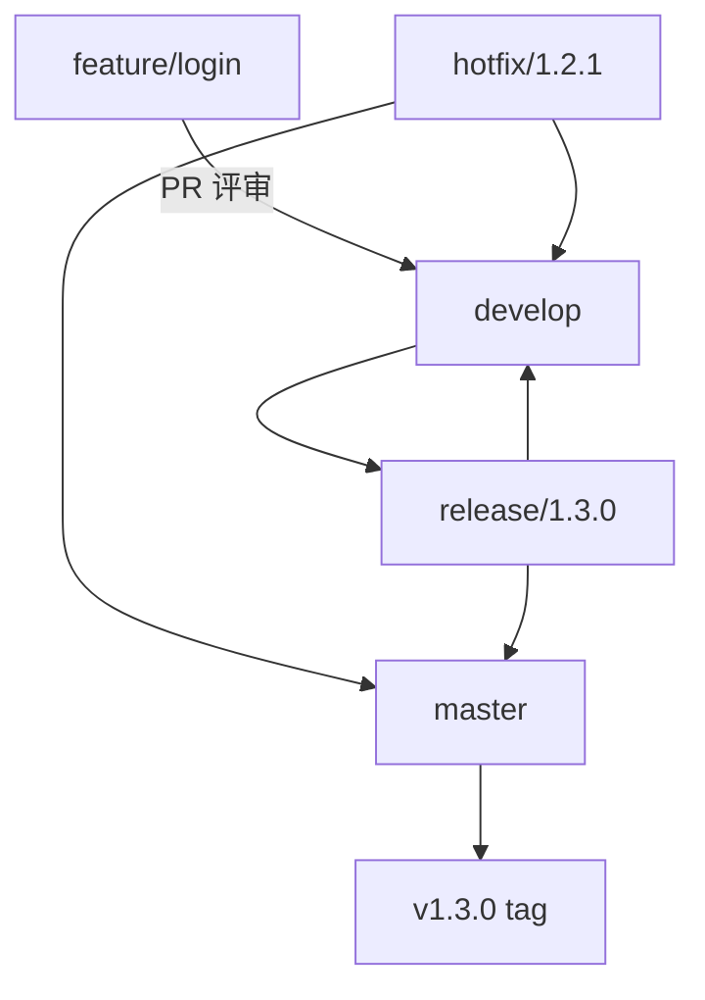

# Git 分支模型与工作流

> 面试高频指数：中 — "你们团队用什么分支模型？Git Flow 和 GitHub Flow 区别？怎么处理发布分支和 hotfix？"是工程化高频考点。

## 一、为什么需要分支模型

### 1.1 单一主干的痛点

单一主干开发存在的痛点如下：



各痛点对应的后果如下：

| 问题 | 后果 |
|------|------|
| 直接提交主干 | 代码互相覆盖、冲突爆炸 |
| 无隔离 | 未完成功能影响发布 |
| 无发布分支 | 版本不可追溯 |
| 无 hotfix 流程 | 线上事故无法快速修复 |

### 1.2 分支模型的目标

- 并行开发互不干扰
- 发布版本可追溯可回滚
- 功能隔离、评审可控
- 线上问题快速热修

## 二、Git Flow（经典）

### 2.1 分支结构

Git Flow 五类分支的构成关系如下：



### 2.2 各分支职责

各分支的生命周期与职责如下：

| 分支 | 生命周期 | 职责 |
|------|----------|------|
| master | 永久 | 只存可发布版本，打 tag |
| develop | 永久 | 日常集成，功能合并目标 |
| feature/* | 临时 | 新功能开发，完成后并回 develop |
| release/* | 临时 | 发布前准备：修 bug、冻结功能 |
| hotfix/* | 临时 | 线上紧急修复，并回 master 与 develop |

### 2.3 典型流程

```bash
# 1. 从 develop 拉功能分支
git checkout develop
git checkout -b feature/login

# 2. 开发完成后合并回 develop
git checkout develop
git merge --no-ff feature/login
git branch -d feature/login

# 3. 发布：拉 release 分支，只修 bug 不新增功能
git checkout -b release/1.2.0
git commit -m "fix: 发布前修复"

# 4. 发布：release 合入 master 并打 tag，同时并回 develop
git checkout master
git merge --no-ff release/1.2.0
git tag -a v1.2.0 -m "v1.2.0"
git checkout develop
git merge --no-ff release/1.2.0

# 5. hotfix：从 master 拉修复分支
git checkout -b hotfix/1.2.1 master
git commit -m "fix: 线上崩溃"
git checkout master
git merge --no-ff hotfix/1.2.1
git tag -a v1.2.1 -m "v1.2.1"
```

### 2.4 优缺点

Git Flow 的优缺点对比如下：

| 优点 | 缺点 |
|------|------|
| 流程清晰、适合版本发布型产品 | 分支多、操作繁琐 |
| 发布隔离、热修规范 | 对持续部署过重 |
| 团队约定统一 | 小团队显得笨重 |

## 三、GitHub Flow（轻量）

### 3.1 核心思想

GitHub Flow 的核心流程如下：


**规则**：

1. master 永远处于可发布状态
2. 所有开发在 feature 分支进行
3. 通过 Pull Request 评审合并
4. 合并后立即部署验证

### 3.2 适用场景

GitHub Flow 的适用场景如下：

| 场景 | 是否适合 |
|------|----------|
| 持续部署的 SaaS | 适合 |
| 小团队/快速迭代 | 适合 |
| 固定版本发布（App 商店） | 需配合 tag/发布分支 |
| 多版本同时维护 | 需扩展 release 分支 |

## 四、GitLab Flow

### 4.1 环境分支

GitLab Flow 环境分支的流转关系如下：



GitLab Flow 各模式的说明如下：

| 模式 | 说明 |
|------|------|
| 环境分支 | main → pre-production → production 逐级推进 |
| 发布分支 | 版本化 release/*，多版本并行维护 |
| 上游优先 | 修复先合上游，再向下游合并 |

### 4.2 适用场景

- 需要环境隔离（测试/预发布/生产）
- 多版本长期维护（老版本仍需补丁）
- 合规要求严格的企业

## 五、主干开发（Trunk-Based）

### 5.1 思想

主干开发的核心思想如下：



主干开发的特点说明如下：

| 特点 | 说明 |
|------|------|
| 短分支 | 分支只存活几小时到几天 |
| 频繁合并 | 每天多次合入主干 |
| 功能开关 | 未完成功能用 Flag 隐藏 |
| 适合 CI/CD | 每次合并即部署 |

### 5.2 适用场景

- 高吞吐的互联网团队（Google/Facebook 风格）
- 微服务独立发布
- 需要极快迭代速度

## 六、Android 团队实践建议

### 6.1 推荐组合

```text
开发流程：develop + feature/*  + PR 评审
发布流程：release/* → master + tag
热修流程：hotfix/* → master + develop
版本标签：v1.2.0 等，与版本号一致
```

Android 团队推荐的组合流程如下：



### 6.2 版本分支管理

各场景对应的分支操作如下：

| 场景 | 操作 |
|------|------|
| 版本号 | 与 tag 一一对应（v1.2.0） |
| 多版本维护 | release/v1.2.x 长期分支 |
| 灰度发布 | release 分支 + 渠道控制 |
| 回滚 | git revert 或切旧 tag |

## 七、高频面试题

### Q1：Git Flow、GitHub Flow、主干开发有什么区别？怎么选？
::: details 查看答案
Git Flow：五类分支（master/develop/feature/release/hotfix），流程完整，适合固定版本发布的产品（App、客户端），但操作繁琐、对持续部署过重；GitHub Flow：只有 master + feature（PR 评审），master 始终可发布，适合持续部署的 Web/SaaS，轻量高效；主干开发（Trunk-Based）：短生命周期分支 + 频繁合入 + 功能开关，适合高迭代速度的团队和微服务。选择原则：有固定版本节奏和多版本维护 → Git Flow 或 GitLab Flow；持续集成持续部署 → GitHub Flow；追求极致迭代速度且团队成熟 → 主干开发。Android 客户端一般用 Git Flow 变体。
:::

### Q2：release 分支和 hotfix 分支有什么区别？合并规则是什么？
::: details 查看答案
release 分支：从 develop 拉出，用于发布前准备（修 bug、冻结功能、更新版本号），完成后合并回 master（打 tag）和 develop，生命周期较长；hotfix 分支：从 master（或生产 tag）拉出，用于线上紧急修复，修复后必须同时合并回 master（打新 tag）和 develop，避免修复丢失。核心区别：release 面向"即将发布的版本"准备，hotfix 面向"线上已发布版本"的紧急修复。合并规则：release 和 hotfix 都要双向合并（master + develop），且用 --no-ff 保留合并记录，保证版本可追溯。
:::

### Q3：功能分支在什么情况下会冲突？怎么减少冲突？
::: details 查看答案
冲突原因：① 多个分支修改同一文件同一区域；② 分支存活时间过长，与主干差异大；③ 频繁改动共享代码（公共类、资源文件、gradle 配置）。减少冲突：① 缩短分支生命周期，及时合并回 develop；② 开发中定期 git pull --rebase 同步主干；③ 拆分细粒度功能，避免大面积共享代码改动；④ 团队约定文件所有权，减少同文件并发；⑤ 接口先行，先定协议再并行实现。冲突解决：git merge --no-ff 出现冲突后逐个文件解决，必要时与相关同事确认，避免错误覆盖。
:::

### Q4：什么是 --no-ff 合并？为什么发布分支建议用它？
::: details 查看答案
--no-ff（no fast-forward）强制创建一个 merge commit，即使可以快进也保留分支历史记录。fast-forward 合并会把分支历史"摊平"到主干，丢失功能分支的完整性；--no-ff 用 merge commit 记录"这个功能/发布合入主干"的节点，好处：① 历史清晰：每个 merge commit 对应一个功能/发布；② 便于回滚：`git revert <merge-commit>` 可整体撤销；③ 便于追溯：`git log --graph` 能看到分支拓扑。发布分支用 --no-ff 尤其重要，因为发布是一个明确里程碑，需要完整保留。
:::

### Q5：线上出了紧急 bug，用 hotfix 流程完整描述一下操作步骤。
::: details 查看答案
① 从当前生产 tag（或 master）拉 hotfix 分支：git checkout -b hotfix/1.2.1 master；② 修复代码并提交：git commit -m "fix: xxx";③ 测试验证（本地 + 灰度）；④ 合并回 master：git checkout master; git merge --no-ff hotfix/1.2.1; git tag -a v1.2.1；⑤ 合并回 develop（防止修复在后续版本丢失）：git checkout develop; git merge --no-ff hotfix/1.2.1；⑥ 删除 hotfix 分支；⑦ 发布新版本并监控。注意：hotfix 从生产状态拉出而非 develop，因为 develop 可能包含未发布功能；修复必须双向合并，这是最常见的遗漏点。
:::

## 八、小结

分支模型要点：

1. Git Flow：master/develop/feature/release/hotfix 五类分支
2. GitHub Flow：master + PR，适合持续部署
3. 主干开发：短分支 + 功能开关，极致迭代
4. release 与 hotfix 都需双向合并 master + develop
5. --no-ff 保留历史，便于回滚与追溯

相关阅读：[Git 常用命令速查](/engineering/git/git-cheatsheet.md)、[Git 协作与 Rebase 工作流](/engineering/git/git-rebase-workflow.md)、[Git 团队协作规范](/engineering/git/git-workflow.md)、[GitHub Actions 持续集成](/engineering/cicd/github-actions.md)。
