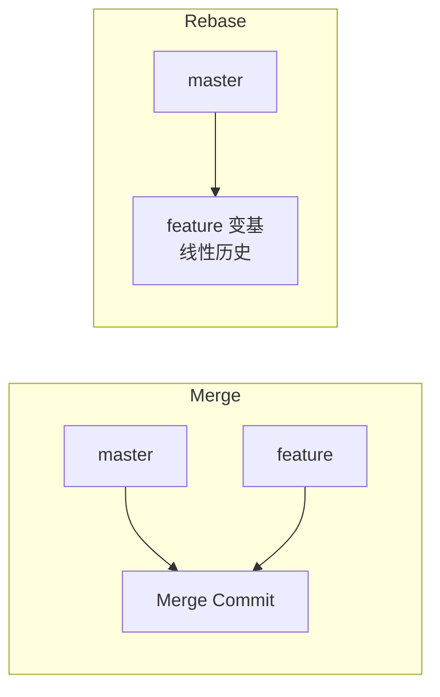
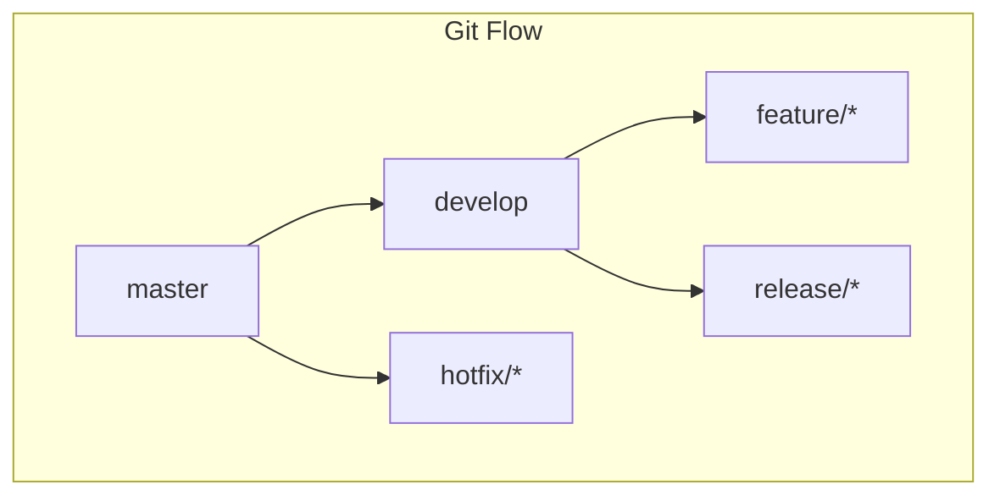

# 🔀 Git 高级操作与工作流

> 学会 commit/push 只是入门。真正的工程能力在于:**优雅地改写历史、解决冲突、设计分支模型**,让协作高效且历史清晰。

## 一、Rebase 深入

### 1.1 Rebase 与 Merge 的区别



| 操作 | 结果 | 适用 |
|------|------|------|
| merge | 保留分支历史 + 合并节点 | 保留真实合并记录 |
| rebase | 线性历史,无合并节点 | 个人分支整理 |
| squash merge | 压缩为单提交 | 合并功能分支 |

```bash
# Rebase:把 feature 变基到 master 最新
git checkout feature
git rebase master        # feature 基于 master 最新重放
# 或用 --onto 变基到指定基点
git rebase --onto new-base old-base feature

# Merge 分支
git checkout master
git merge feature        # 生成合并提交
```

### 1.2 Rebase 的黄金法则

> ⚠️ **不要 rebase 已经推送到共享分支的提交**——会改写历史,导致协作者冲突。只对**自己的、未推送**的分支使用。

## 二、交互式 Rebase:改写历史

```bash
# 交互式变基:整理最近 3 个提交
git rebase -i HEAD~3
```

```
pick a1b2c3  feat: 添加登录
squash d4e5f6  fix: 修复登录空指针     # 合并进上一个
reword 7f8a9b  docs: 更新说明          # 修改提交信息
edit  0c1d2e  feat: 新增设置           # 修改内容
```

| 命令 | 作用 |
|------|------|
| pick | 保留该提交 |
| reword | 修改提交信息 |
| edit | 修改提交内容 |
| squash | 合并到上一个提交 |
| fixup | 合并并丢弃信息 |
| drop | 删除提交 |

```bash
# 实际流程:修改后 force-push 到自己的分支
git push --force-with-lease origin feature
```

> 💡 使用 `--force-with-lease` 而非 `--force`:前者会检查远端是否被他人更新,更安全。

## 三、Cherry-Pick 与 Stash

### 3.1 Cherry-Pick:挑选提交

```bash
# 把其他分支的某个提交复制到当前分支
git cherry-pick a1b2c3
git cherry-pick a1b2c3 d4e5f6    # 多个提交
git cherry-pick --continue        # 解决冲突后继续
git cherry-pick --abort           # 放弃
```

> 适用:线上 hotfix 要同步到多个分支、把某个功能提交从开发分支带入发布分支。

### 3.2 Stash:暂存工作区

```bash
git stash                      # 暂存修改
git stash push -m "wip 登录"    # 带说明
git stash list                 # 查看列表
git stash pop                  # 恢复并删除
git stash apply stash@{1}      # 恢复指定项
git stash drop                 # 删除
git stash branch new-branch    # 从暂存创建分支
```

> 适用:切换分支前保存未完成工作、临时保存调试代码。

## 四、分支模型对比



| 模型 | 分支 | 适用 |
|------|------|------|
| Git Flow | master/develop/feature/release/hotfix | 版本发布节奏强 |
| GitHub Flow | main + feature + PR | 持续部署 |
| Trunk Based | 短生命周期分支直入主干 | 快速迭代团队 |

```text
Git Flow 提交示例
feat/登录 → develop → release/1.2.0 → master(打 tag)
hotfix/崩溃 → master → 合回 develop
```

## 五、冲突解决

```bash
git merge feature      # 冲突后:
git status             # 查看冲突文件
# 编辑冲突标记 <<<<<<< / ======= / >>>>>>>
git add 冲突文件
git commit             # 完成合并

git rebase master      # 冲突后:
git add 冲突文件
git rebase --continue  # 继续变基
```

| 冲突类型 | 原因 | 解决 |
|---------|------|------|
| 内容冲突 | 同文件同位置修改 | 手动合并 |
| 删除/修改冲突 | 一方删除一方修改 | 决定保留 |
| 重命名冲突 | 双方重命名 | 选择目标名 |
| 子模块/锁文件 | 依赖文件冲突 | 重新生成 |

## 六、Git 原理速览

```text
工作区 → git add → 暂存区(索引) → git commit → 对象库
对象:blob(文件内容)/ tree(目录树)/ commit(提交)/ tag(标签)
分支 = 指向 commit 的指针;HEAD = 当前分支指针
rebase 本质:基于新基点重新生成提交(对象)
```

## 七、高频面试题

### Q1：rebase 和 merge 有什么区别?怎么选?
::: details 查看答案
merge:生成一个合并提交,保留分支各自的提交历史,能看到"何时合并"的拓扑结构,但历史有分叉;rebase:把分支提交"重放"到新基点上,历史呈线性,更干净,但会改写提交哈希。选择:① 个人开发分支→ 用 rebase 保持线性(推送到共享前);② 功能分支合回主干→ 常用 squash merge 压缩成单个提交;③ 需要保留真实合并信息/协作分支 → merge。黄金法则:绝不 rebase 已推送到共享分支的提交。
:::

### Q2：什么是交互式 rebase?能做什么?
::: details 查看答案
`git rebase -i <基点>`:打开编辑器列出范围内提交,可对每个提交执行 pick(保留)/reword(改信息)/edit(改内容)/squash(合并)/fixup(合并丢弃信息)/drop(删除)。常见用途:① 合并多次"fix 提交"为一次;② 修改提交信息;③ 重排提交顺序;④ 拆分大提交;⑤ 删除误提交。注意:只用于未推送的提交,改写过历史后需 force push(推荐 --force-with-lease)到自己的分支。
:::

### Q3：cherry-pick 有什么用?与 merge 的区别?
::: details 查看答案
cherry-pick 把**某个具体提交**复制到当前分支(重新生成新提交),适用于:① hotfix 提交需要同步到多个发布分支;② 只想带入某个功能提交而不是整个分支;③ 恢复误删的提交。区别:merge 合并整条分支历史,可能带入无关提交;cherry-pick 精确挑选单个提交,但会复制提交(哈希不同),相同内容可能冲突,且不保留"来自哪个分支"的关联。大规模使用要维护好提交粒度。
:::

### Q4：Git Flow、GitHub Flow、Trunk Based 有什么区别?
::: details 查看答案
① Git Flow:master + develop 双主分支 + feature/release/hotfix,版本节奏清晰,适合定期发版产品,但流程重、分支多;② GitHub Flow:只有 main + 短生命周期 feature 分支,合入即部署(PR + CI),适合持续交付、快速迭代;③ Trunk Based:所有人频繁合入主干,分支生命周期极短(小时级),配合特性开关,适合大规模协同(Google/Facebook 风格)。选型:看发布节奏(定期版本→Git Flow,持续部署→GitHub/Trunk Flow)。
:::

### Q5：解决冲突的一般流程?如何减少冲突?
::: details 查看答案
流程:① 执行 merge/rebase 产生冲突 → git status 看冲突文件;② 编辑冲突标记(<<<<<<< 我的 / ======= / >>>>>>> 别人的),手工合并逻辑;③ git add 标记已解决;④ merge 用 git commit 完成,rebase 用 git rebase --continue;⑤ 测试验证。减少冲突:① 小步提交、频繁同步主干;② 避免同文件并行修改(模块边界清晰);③ 锁文件/生成文件不入库或按规范处理;④ rebase 前先 fetch 最新;⑤ 大改动提前通知团队拆分。
:::

## 小结

- merge 保历史、rebase 线性化、squash 压缩
- 交互式 rebase 改写历史:pick/reword/squash/drop
- cherry-pick 精准复制提交,stash 暂存工作区
- 分支模型按发布节奏选:Git Flow / GitHub Flow / Trunk
- 冲突是常态,小步提交 + 频繁同步减少冲突
- 黄金法则:共享分支不可 rebase,force push 用 --force-with-lease

> 📖 进阶阅读：[Git 工作流实践](/engineering/git/git-workflow.md) | [Git 常用命令速查](/engineering/git/git-cheatsheet.md) | [GitHub Actions CI/CD](/engineering/cicd/github-actions.md)
