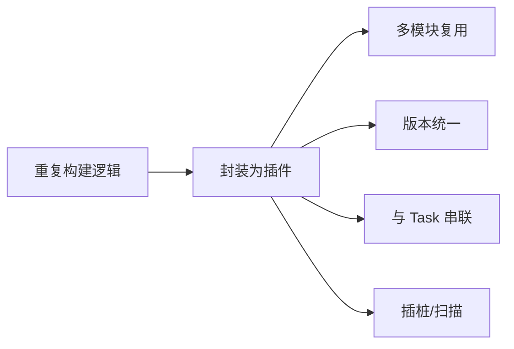

# 🔧 自定义 Gradle 插件

> 当构建逻辑开始重复(多渠道、埋点、资源注入、字节码插桩),就该把逻辑封装成 **Gradle 插件**。本文从三类插件写法到字节码插桩实战全覆盖。

## 一、为什么要写插件

| 场景 | 手工做法 | 插件化 |
|------|---------|--------|
| 多渠道包名注入 | 每个模块复制脚本 | 统一插件 |
| 埋点字节码插桩 | 难以实现 | ASM Transform |
| 构建产物检查 | 人肉检查 | 自动化 Task |
| 版本统一 | 多处维护 | 插件统一注入 |



## 二、三种插件形式

| 形式 | 写法 | 适用 |
|------|------|------|
| 构建脚本插件 | `build.gradle.kts` 内定义 | 单模块小逻辑 |
| buildSrc | 模块内源码编译 | 项目内共享 |
| 独立插件工程 | 单独发布到仓库 | 跨项目/团队复用 |

```kotlin
// 形式一:构建脚本内定义
class HelloPlugin : Plugin<Project> {
    override fun apply(project: Project) {
        project.tasks.register("hello") {
            doLast { println("Hello from plugin!") }
        }
    }
}
apply<HelloPlugin>()
```

```kotlin
// 形式二:buildSrc 模块(src/main/kotlin)
// buildSrc 自动编译,项目内可直接 apply
class BuildSrcPlugin : Plugin<Project> {
    override fun apply(project: Project) { ... }
}
```

## 三、独立插件工程结构

```text
my-plugin/
├── build.gradle.kts        # java-gradle-plugin 插件
├── src/main/kotlin/
│   └── com/example/plugin/
│       ├── MyPlugin.kt     # 插件入口
│       ├── MyExtension.kt  # 扩展配置
│       └── MyTask.kt       # 任务实现
└── src/main/resources/
    └── META-INF/gradle-plugins/
        └── com.example.plugin.properties  # 插件标识 → 实现类
```

```kotlin
// build.gradle.kts:应用 java-gradle-plugin
plugins {
    `java-gradle-plugin`
    kotlin("jvm")
}
gradlePlugin {
    plugins {
        create("myPlugin") {
            id = "com.example.plugin"          // 插件 ID
            implementationClass = "com.example.plugin.MyPlugin"
        }
    }
}
```

```properties
# META-INF/gradle-plugins/com.example.plugin.properties
implementation-class=com.example.plugin.MyPlugin
```

## 四、Extension 扩展配置

```kotlin
// 扩展:让使用者可以配置
open class MyExtension {
    var version = "1.0.0"
    var enableInject = true
    var tasks: MutableList<String> = mutableListOf()
}

class MyPlugin : Plugin<Project> {
    override fun apply(project: Project) {
        // 注册扩展:使用方 build.gradle 中 myPlugin { ... }
        val ext = project.extensions.create("myPlugin", MyExtension::class.java)
        project.tasks.register("printConfig") {
            doLast {
                println("version=${ext.version}, inject=${ext.enableInject}")
            }
        }
    }
}
```

```kotlin
// 使用方
plugins { id("com.example.plugin") }
myPlugin {
    version = "2.0.0"
    enableInject = true
}
```

## 五、Task 与依赖编排

```kotlin
// 挂接到构建生命周期
project.afterEvaluate {
    project.tasks.named("assembleRelease").configure { releaseTask ->
        releaseTask.dependsOn("injectCode")   // 打包前先插桩
    }
}
// 或使用 TaskProvider API 延迟配置(推荐)
```

| 常用挂接点 | 时机 |
|-----------|------|
| preBuild | 构建前 |
| processResources | 资源处理 |
| dexBuilder / transformClasses | 字节码阶段 |
| packageRelease | 打包前 |
| lint / test | 质量检查 |

## 六、Transform 与字节码插桩

> 经典场景:埋点、无埋点统计、方法耗时统计、隐私合规检测。

```kotlin
// AGP 7+ 使用 Transform API 已被标记废弃
// 新方案:Transform Action / ASM + AGP API
// 核心流程:
// 1. 注册 Transform/TransformAction
// 2. 遍历 class 文件
// 3. ASM 修改字节码(注入方法调用)
// 4. 输出修改后的 class
```


```kotlin
// ASM 插桩示例:在方法开头注入日志
// ClassVisitor → MethodVisitor.visitCode 时注入
// 用 AdviceAdapter:onMethodEnter 中插入
// visitMethodInsn(INVOKESTATIC, "Log", "d", "(String;String;)V", false)
```

## 七、调试与发布

| 步骤 | 说明 |
|------|------|
| 本地调试 | `./gradlew :app:printConfig --stacktrace` |
| 断点调试 | 插件模块 Debug 运行 Gradle 任务 |
| 发布 | `publish` 到 Maven Local / 私有仓库 |
| 版本管理 | pluginManagement + version catalog |

```bash
# 调试插件
./gradlew :app:myTask --stacktrace --info
# 发布到本地 Maven
./gradlew publishToMavenLocal
# 使用方引入
# settings.gradle.kts: pluginManagement { repositories { mavenLocal() } }
```

## 八、高频面试题

### Q1：自定义 Gradle 插件有哪些形式?有什么区别?
::: details 查看答案
三种:① 构建脚本内定义——写在 build.gradle 里,只适用于当前模块,逻辑一多就难维护;② buildSrc 模块——源码放 buildSrc 目录,构建时自动编译,项目内所有模块可用,但不能跨项目共享(也不会缓存发布);③ 独立插件工程——单独工程 + java-gradle-plugin 发布到 Maven 仓库,可跨项目复用、支持版本管理,是生产环境推荐方式。选择依据:复用范围(单模块/单项目/多项目)与维护成本。
:::

### Q2：插件的 apply 阶段和 Task 执行阶段有什么区别?为什么要注意?
::: details 查看答案
apply 发生在**配置阶段**:Gradle 解析 build.gradle 时执行,此时应只注册扩展、创建任务,不做实际工作(耗时操作放 doLast/doFirst);Task 在**执行阶段**运行,才是真正干活。注意:配置阶段每个项目都要执行,若在其中做 IO/编译会显著拖慢构建(尤其多模块);且配置阶段执行多次(如 lint 变体)。最佳实践:延迟配置(TaskProvider)、afterEvaluate 谨慎使用、耗时逻辑放执行阶段。
:::

### Q3：怎么给插件添加配置?Extension 和 Convention 有什么区别?
::: details 查看答案
用扩展(Extension)提供配置:插件中 `project.extensions.create("myPlugin", MyExtension::class)`,使用方在 build.gradle 中 `myPlugin { version = "2.0" }` 配置,插件在执行阶段读取扩展值。Extension 是公开配置 API;Convention(已废弃)是旧版约定式配置,可被扩展覆盖,AGP 用 ConventionPlugin 模式。要点:扩展注册在 apply 早期,读取延迟到执行阶段,避免配置未完成就取值。
:::

### Q4：Transform 是什么?新版本为什么废弃了?
::: details 查看答案
Transform 是 AGP 提供的**字节码转换 API**:让插件在 class 编译后、dex 打包前拦截并修改 class 文件(经典场景:ASM 插桩做埋点、方法耗时统计、隐私合规)。缺点:① 与 AGP 内部实现耦合,升级易碎;② 无法访问增量编译中间产物,性能差;③ 不能感知 variant 之外的上下文。AGP 7+ 标记废弃,新方案:① Instrumentation API(ASM 官方);② AGP 新 API(TransformAction / Artifacts API);③ 或在编译前用注解处理器生成代码。老项目仍可用但新项目应避开。
:::

### Q5：字节码插桩怎么做?有什么注意事项?
::: details 查看答案
做法:① 引入 ASM(访问者模式遍历字节码);② 实现 ClassVisitor/MethodVisitor(AdviceAdapter);③ 在 onMethodEnter/onMethodExit 注入字节码(如埋点调用);④ 通过 Transform/TransformAction 集成到构建。注意事项:① 兼容性——不同 AGP/AGP 版本 class 结构差异;② 只处理自己的包,避免误改第三方类;③ 方法引用签名要精确(描述符);④ 热更新/协程类要特殊处理;⑤ 插桩要幂等(重复执行不叠加);⑥ 性能开销控制。用 instrument 测试验证产物正确性。
:::

## 小结

- 插件封装重复构建逻辑,支持多模块复用
- 三种形式:脚本内 / buildSrc / 独立工程(推荐)
- Extension 提供配置,Task 延迟注册、执行阶段干活
- 挂接生命周期节点,串联构建流程
- Transform + ASM 实现字节码插桩(埋点/统计)
- 发布到 Maven 仓库,pluginManagement 统一管理

> 📖 进阶阅读：[Gradle 基础与构建优化](/engineering/gradle/gradle-basics.md) | [Version Catalog 依赖管理](/engineering/gradle/version-catalog.md) | [AGP 与构建流程](/engineering/gradle/gradle-basics.md)
