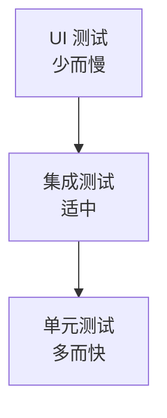
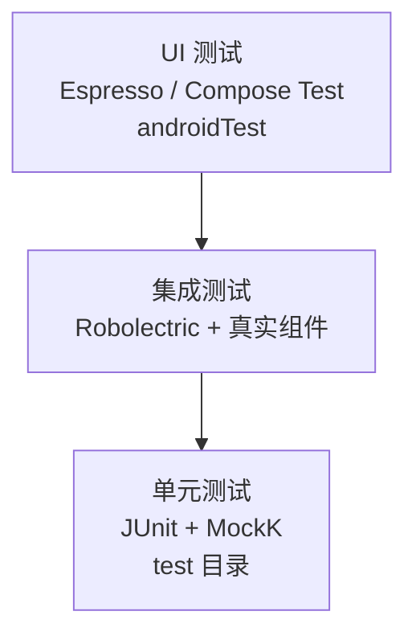
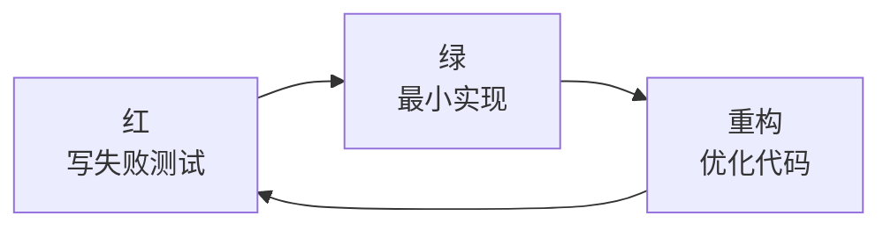

# 🏔️ 测试金字塔与测试策略

> 测试不是越多越好,而是**分层合理**:底层大量快速单测、中层适量集成测试、顶层少量 UI 测试。理解测试金字塔才能设计出"快、稳、省"的测试体系。

## 一、测试金字塔



| 层级 | 数量 | 速度 | 成本 | 稳定性 |
|------|------|------|------|--------|
| UI 测试 | 少 | 慢(秒级+) | 高 | 低(易碎) |
| 集成测试 | 中 | 中 | 中 | 中 |
| 单元测试 | 多 | 快(毫秒级) | 低 | 高 |

> 🏗️ **核心思想**:测试成本自下而上递增。把大量逻辑验证放在最快最稳的单测层,UI 只验证关键用户流程——这就是"金字塔"形状的由来。

## 二、为什么是金字塔而不是冰淇淋

```text
反模式:冰淇淋筒(上层多下层少)
  ╱ UI 测试过多 ╲   ← 慢、脆、难维护
  ╲ 单测过少 ╱
  
正确的金字塔:底大顶小
  少 UI 测试
 中 集成测试
 多 单元测试
```

| 反模式 | 问题 |
|--------|------|
| UI 测试过多 | 运行慢、环境依赖、频繁失败 |
| 缺少单测 | bug 发现晚、回归成本高 |
| 全集成测试 | 环境搭建复杂、反馈慢 |

## 三、Android 测试分层

### 3.1 三层结构



| 层级 | 位置 | 技术 | 验证内容 |
|------|------|------|---------|
| 单元测试 | app/src/test/ | JUnit + MockK | ViewModel、UseCase、工具类 |
| 集成测试 | test/ + Robolectric | Robolectric | 组件协作、数据库 |
| UI 测试 | app/src/androidTest/ | Espresso/Compose | 关键用户流程 |

### 3.2 测试内容规划

```text
单元测试(占比最高):
  ✓ ViewModel 状态流转(加载/成功/失败)
  ✓ UseCase/Repository 业务逻辑
  ✓ 工具类、数据解析、状态机

集成测试(适中):
  ✓ Room 数据库操作
  ✓ 网络层(Retrofit + MockWebServer)
  ✓ 组件间协作(多模块)

UI 测试(少量关键路径):
  ✓ 登录、首页、支付等核心流程
  ✓ 不测每个页面每个按钮
```

## 四、覆盖率与质量门禁

### 4.1 覆盖率指标

| 指标 | 说明 | 目标 |
|------|------|------|
| 行覆盖率 | 代码行执行比例 | 核心模块 70%+ |
| 分支覆盖率 | 条件分支覆盖 | 核心逻辑 80%+ |
| 方法覆盖率 | 方法被调用比例 | 参考 |
| 类覆盖率 | 类被测试 | 参考 |

### 4.2 JaCoCo 配置

```kotlin
// build.gradle.kts:JaCoCo 覆盖率统计
plugins { id("jacoco") }

android {
    testOptions {
        unitTests.isIncludeAndroidResources = true
    }
}
// 生成报告:./gradlew jacocoTestReport
```

### 4.3 质量门禁

```text
CI 质量门禁:
  1. 单测全部通过
  2. 覆盖率达标(核心模块阈值)
  3. Lint 无 Error
  4. 静态分析(Detekt/Ktlint)通过
  5. 不达标 → 构建失败,阻止合入
```

## 五、测试驱动开发(TDD)



| 步骤 | 说明 |
|------|------|
| Red | 先写一个失败的测试(定义行为) |
| Green | 写最小代码让测试通过 |
| Refactor | 重构代码保持测试通过 |

> 💡 TDD 的价值:测试即设计文档;强制从"使用者视角"思考 API;保障回归安全。

## 六、高频面试题

### Q1：什么是测试金字塔?为什么要这样分层?
::: details 查看答案
测试金字塔:底层是大量快速、廉价的**单元测试**,中层是适量的**集成测试**,顶层是少量慢速的**UI 测试**。分层原因:① 成本差异——单测毫秒级、无需环境,UI 测试秒级+、依赖设备/环境且易碎;② 反馈速度——底层测试多能快速发现问题,顶层测试作为最后把关;③ 维护成本——UI 测试改动频繁,过多会让团队疲于维护。所以:逻辑验证下沉到单测,UI 只保留关键用户流程测试。反模式"冰淇淋筒"(UI 测试过多)会导致测试又慢又脆。
:::

### Q2：Android 项目怎么规划测试?三层各测什么?
::: details 查看答案
规划:① 单元测试(app/src/test/,JUnit + MockK):ViewModel 状态流转、UseCase/Repository 业务逻辑、工具类与数据解析——数量最多;② 集成测试(Robolectric + 真实组件):Room 数据库、网络层(MockWebServer)、多模块协作——数量适中;③ UI 测试(app/src/androidTest/,Espresso/Compose Test):登录、支付、首页等核心用户流程——只保留关键路径。原则:底层快测全覆盖,顶层只测核心;测试金字塔形状决定投入比例(约 70/20/10)。
:::

### Q3：什么是覆盖率?多少算够?怎么统计?
::: details 查看答案
覆盖率:被测试代码执行的比例,常见行覆盖率、分支覆盖率、方法覆盖率。多少算够:没有绝对标准——核心模块(支付、账号、业务逻辑)应 70%-80%+ 分支覆盖,工具类/模板代码可低些;追求 100% 覆盖低价值分支收益低。统计:JaCoCo(Java/Kotlin 通用)配置在 Gradle,生成 HTML/XML 报告,CI 中作为质量门禁(低于阈值构建失败)。注意:覆盖率只是"执行了",不等于"验证了",质量靠断言与场景设计,而非单纯数字。
:::

### Q4：TDD 是什么?开发中怎么落地?
::: details 查看答案
TDD(测试驱动开发):红绿循环——先写失败测试(Red)定义期望行为 → 写最小实现让测试通过(Green)→ 重构优化(Refactor)。落地要点:① 从核心业务逻辑开始,边写测试边设计接口(测试即使用文档);② 测试粒度要小、反馈快;③ 结合覆盖率门禁与 CI;④ 不滥用——UI/环境耦合场景用测试先行会痛苦,更适合纯逻辑(状态机、算法、业务规则)。收益:bug 前置、回归安全、代码可测性提升。
:::

### Q5：如何保证测试不拖慢迭代?有什么团队实践?
::: details 查看答案
实践:① **分层控制规模**——单测为主,UI 测试只保关键路径;② **测试与 CI 集成**——提交自动跑,反馈即时报,本地先跑增量测试;③ **分层测试速度**——快测试本地跑,慢测试(UI)放 CI 或夜间;④ **代码评审要求测试**——新逻辑必须带测试,质量门禁强制;⑤ **维护测试**——重构同步更新,避免测试腐化;⑥ 用 MockWebServer/数据库替换保证测试确定性;⑦ 合理用录制/生成工具减少 UI 测试维护成本。核心:测试是资产不是负担,分层 + 门禁 + 自动化让它可持续。
:::

## 小结

- 金字塔:多单测 / 中集成 / 少 UI,成本自下而上递增
- 反模式:冰淇淋筒(UI 过多)导致慢与脆
- Android 三层:test 单测、Robolectric 集成、androidTest UI
- 覆盖率核心模块达标,JaCoCo + CI 门禁
- TDD:红绿循环,测试即设计
- 团队实践:分层规模、CI 集成、评审要求、定期维护

> 📖 进阶阅读：[MockK 单元测试实战](/engineering/testing/mockk-testing.md) | [UI 测试与 Espresso](/engineering/testing/ui-testing.md) | [单元测试实践](/engineering/testing/unit-testing.md)
