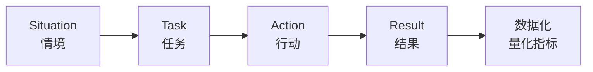
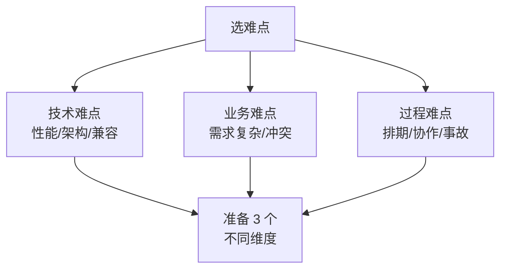

# 行为面试题与回答套路

> 面试高频指数：中 — 技术面之后的人力/总监面必考，"自我介绍、项目难点、离职原因、职业规划"是行为面试四大件。

## 一、行为面试的本质

### 1.1 考察什么

| 维度 | 考察点 |
|------|--------|
| 沟通表达 | 能否清晰有逻辑地表达 |
| 学习能力 | 面对新技术的态度与方法 |
| 协作能力 | 团队冲突、跨部门沟通 |
| 抗压能力 | 项目压力、线上事故 |
| 价值观 | 与团队/公司是否匹配 |
| 潜力 | 成长性、职业规划 |

### 1.2 与技术面的区别

```mermaid
flowchart LR
    A[技术面] --> B[考"会什么"<br>知识+经验]
    C[行为面] --> D[考"怎么做事"<br>场景+方法+反思]
```

> 关键点：行为面试没有标准答案，考察的是你的**行为模式**是否可复制、可预期、符合岗位要求。

## 二、STAR 法则

### 2.1 四要素

| 要素 | 含义 | 示例 |
|------|------|------|
| S（Situation） | 背景情境 | 项目上线前 2 周 |
| T（Task） | 任务目标 | 修复线上崩溃并保证按时发布 |
| A（Action） | 采取的行动 | 定位问题、灰度、回滚预案 |
| R（Result） | 结果 | 崩溃率降为 0，如期发布 |



### 2.2 回答模板

```text
"当时的情况是……（S）
我的目标是……（T）
我做了三步：……（A：思考过程 + 具体动作）
最终结果是……（R：量化数据 + 复盘反思）"
```

### 2.3 常见错误

| 错误 | 表现 |
|------|------|
| 无情境 | 直接说"我做了 XX" |
| 抢功劳 | "我们团队做了"含糊其辞 |
| 无行动细节 | "我负责协调"一笔带过 |
| 无结果 | 没提数据、没提反思 |

## 三、高频问题与回答思路

### 3.1 自我介绍（开场必问）

**套路**：学历背景（简短）+ 工作经历（重点）+ 技术亮点（匹配岗位）+ 求职意向。

```text
"面试官你好，我 X 年 Android 经验，做过 X 个完整项目。
最近在 X 公司负责 XX 模块，期间主导了 XX 优化（性能/架构），
把启动时间从 X 降到 X。
技术栈上熟悉 Jetpack、协程、Compose（贴合岗位 JD）。
这次应聘贵司 Android 岗位，希望……（表达意愿）"
```

| 要点 | 说明 |
|------|------|
| 控制时长 | 1~2 分钟 |
| 突出匹配 | 讲与岗位 JD 相关的内容 |
| 有数据 | 项目规模、性能指标 |
| 埋钩子 | 留出追问空间 |

### 3.2 项目介绍（必问）

**套路**：项目背景 → 我的角色 → 技术难点（2~3 个）→ 我负责的亮点 → 数据结果。

```text
"项目是 XX（用户量/业务），我负责 XX 模块。
三个技术点：一是 XX（架构/性能），二是 XX（难点），三是 XX（创新）。
以 XX 为例：……（STAR 展开）"
```

### 3.3 项目难点（核心必问）

**选择标准**：复杂度高、有思考深度、有数据支撑、能体现方法论。



### 3.4 离职原因（敏感必问）

| 正确方向 | 错误方向 |
|----------|----------|
| 职业发展（技术成长受限） | 抱怨前公司/领导 |
| 业务方向（转型/赛道选择） | 钱少事多 |
| 城市/家庭原因 | 与同事冲突 |

**回答原则**：客观、积极、聚焦未来，不贬低过去。

### 3.5 职业规划

```text
"短期（1 年）：在 Android 深度方向（性能/架构）做精，
沉淀一套可复用的方法论。
中期（2~3 年）：成长为技术骨干，能独立负责核心模块，
并提升架构设计能力。
长期：在 XX 方向成为专家，或向技术管理发展。"
```

**原则**：与岗位匹配、具体可执行、体现稳定性。

### 3.6 其他常见问题

| 问题 | 思路 |
|------|------|
| 你的优缺点？ | 优点 2~3 个（匹配岗位），缺点 1 个（真实+在改进） |
| 期望薪资？ | 先了解范围，报区间，强调匹配价值 |
| 为什么选我们？ | 业务/技术栈/成长空间，做功课 |
| 什么时候到岗？ | 坦诚说明交接时间 |
| 你还有什么问题？ | 问业务、团队、成长，不问福利 |

## 四、回答技巧

### 4.1 数据化表达

```text
反例 "我优化了启动速度"
正例 "启动时间从 3.2s 优化到 1.1s（-65%），
    通过异步初始化 + 懒加载 + 启动器框架实现"
```

### 4.2 结构化表达

```text
"这个问题我从三个层面看：
第一……第二……第三……
综上，我认为……"
```

### 4.3 展示方法论

```text
"遇到 XX 问题，我的排查思路是：
① 复现（日志/监控）→ ② 定位（分层排查）→ ③ 验证（数据对比）→ ④ 复盘（预防方案）"
```

| 技巧 | 作用 |
|------|------|
| 数字量化 | 让结果可信 |
| 总分结构 | 让逻辑清晰 |
| 方法论 | 体现可复用性 |
| 复盘反思 | 体现成长性 |

## 五、高频面试题

### Q1：请用 STAR 法则讲一个你解决的最有挑战的技术问题。
::: details 查看答案
按 STAR 组织：S（情境）——"某 App 启动后列表加载卡顿，用户反馈掉帧，线上崩溃率上升 30%"；T（任务）——"需要定位根因并在两周内解决，保证下个版本发布"；A（行动）——"第一步，用 Traceview/Perfetto 抓启动与滑动过程，定位到主线程有大量耗时操作；第二步，分析发现图片解码在主线程 + 列表复用了复杂布局，引入图片加载框架（Glide 异步解码）+ 布局扁平化 + ViewHolder 复用优化；第三步，用 Systrace 验证并灰度观察"；R（结果）——"卡顿率从 3.2% 降到 0.4%，崩溃率归零，如期发布"。再加复盘："事后沉淀了性能监控体系，新增卡顿采集，提前发现问题"。要点：过程有思考、动作具体、结果有数据。
:::

### Q2：和同事/产品经理发生意见冲突，你怎么处理？
::: details 查看答案
回答框架：① 先对齐目标——"我们的共同目标是做好产品/保证质量"；② 摆事实讲数据——"用数据说话，例如方案 A 性能更好/成本更低"；③ 换位理解——"站在对方角度，理解他为什么坚持，可能是业务压力或历史原因"；④ 寻求折中——"如果时间允许先做小范围验证，用结果说话；或者分阶段实现，先满足紧急需求再补技术优化"；⑤ 升级机制——"如果影响重大且无法达成一致，客观地向领导说明利弊，由上级决策"。核心：不情绪化、以结果为导向、保持专业。最后可补一句实际案例体现你的处理方式。
:::

### Q3：说说你的优点和缺点？
::: details 查看答案
优点（匹配岗位）：选 2~3 个具体可信的，如"① 技术钻研——业余时间源码分析（可以举例 OKHttp/协程源码）；② 结果导向——上家项目通过 XX 优化把指标从 X 提升到 Y；③ 协作沟通——主导过跨团队方案评审"。缺点（真实+在改进）：选 1 个不影响核心胜任力的，如"① 有时追求完美导致节奏偏慢，现在通过拆解任务和设定 deadline 改进；② 之前不太擅长向上汇报，后来主动定期同步进度"。避免："我没什么缺点"（虚假）或说致命缺点（如"我情绪不稳定"）。
:::

### Q4：为什么从上家公司离职？
::: details 查看答案
原则：客观、积极、聚焦未来。可参考："① 上家公司业务增长放缓，Android 技术投入减少，个人成长遇到瓶颈，希望去技术氛围更好、业务发展快的平台；② 个人规划想往 XX 方向（性能/架构/新业务）深耕，现岗位与规划不太匹配；③ 公司组织调整，岗位职责变化与个人规划不符"。避免：抱怨前领导/同事、说薪资低（显得只看钱）、说工作累（显得抗压差）。补充："在上家公司我完成了 XX 项目，离职是职业规划考虑，非常感激之前的成长"，体现职业素养。
:::

### Q5：未来三年的职业规划是什么？
::: details 查看答案
框架：短期（1 年）——"快速融入团队，熟悉业务与代码，在 Android 深度方向（如性能优化/架构）做出实际成果，形成自己的方法论"；中期（2~3 年）——"成为团队技术骨干，能独立负责核心模块的技术选型与架构设计，沉淀可复用的组件/工具，同时提升跨端或后端能力拓宽视野"；长期——"在垂直方向成为领域专家，或向技术管理/架构师方向发展，能为团队带来技术影响力"。关键：① 与应聘岗位匹配（体现诚意）；② 具体可执行（有时间节点）；③ 表达稳定性（让 HR 放心你会长期投入）。
:::

## 六、小结

行为面试要点：

1. 本质是考行为模式：沟通、协作、抗压、潜力
2. STAR 法则：情境-任务-行动-结果，数据化表达
3. 四大件：自我介绍、项目难点、离职原因、职业规划
4. 优点缺点、冲突处理、薪资期望都要提前准备
5. 结构化表达 + 方法论展示 + 复盘反思加分

相关阅读：[面试准备计划](/interview/interview-plan.md)、[简历撰写指南](/interview/resume-guide.md)、[面试高频技术题（基础）](/interview/basics.md)、[面试高频技术题（进阶）](/interview/advanced.md)。
